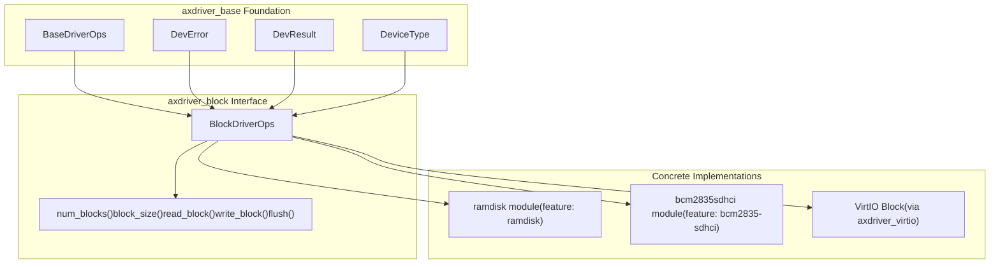
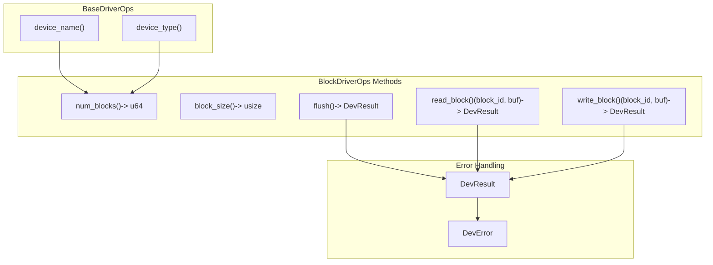
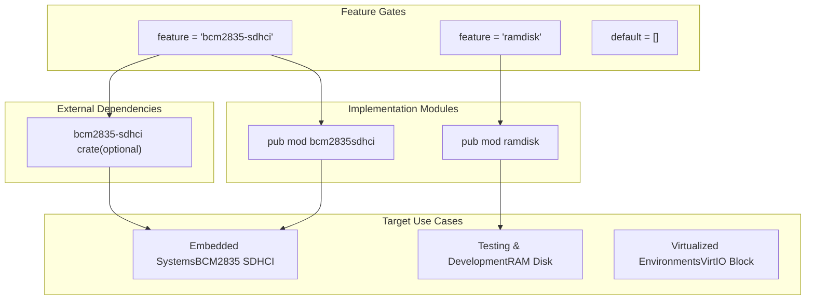
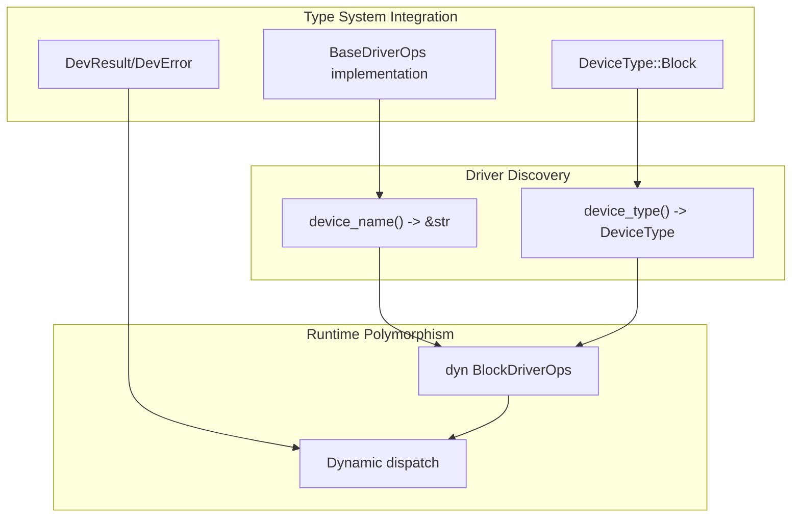

# Block Storage Drivers

> **Relevant source files**
> * [axdriver_block/Cargo.toml](https://github.com/arceos-org/axdriver_crates/blob/84eb2170/axdriver_block/Cargo.toml)
> * [axdriver_block/src/lib.rs](https://github.com/arceos-org/axdriver_crates/blob/84eb2170/axdriver_block/src/lib.rs)

## Purpose and Scope

The block storage driver subsystem provides a unified interface for accessing block-oriented storage devices such as disks, flash storage, and RAM disks within the ArceOS driver framework. This subsystem defines common traits and types that allow different storage hardware implementations to be used interchangeably through a consistent API.

For information about the foundation layer that all drivers build upon, see [Foundation Layer (axdriver_base)](/arceos-org/axdriver_crates/3-foundation-layer-(axdriver_base)). For detailed documentation of network drivers, see [Network Drivers](/arceos-org/axdriver_crates/4-network-drivers). For VirtIO block device integration, see [VirtIO Integration](/arceos-org/axdriver_crates/7-virtio-integration).

## Block Storage Architecture Overview

The block storage subsystem follows the same architectural patterns as other driver types in the axdriver_crates ecosystem, building upon the foundation provided by `axdriver_base` while defining storage-specific operations.

**Block Storage Component Architecture**

Sources: [axdriver_block/src/lib.rs(L1 - L39)&emsp;](https://github.com/arceos-org/axdriver_crates/blob/84eb2170/axdriver_block/src/lib.rs#L1-L39) [axdriver_block/Cargo.toml(L1 - L23)&emsp;](https://github.com/arceos-org/axdriver_crates/blob/84eb2170/axdriver_block/Cargo.toml#L1-L23)

## Core Block Storage Interface

The `BlockDriverOps` trait defines the essential operations that all block storage devices must support. This trait extends `BaseDriverOps` to inherit common driver functionality while adding storage-specific methods.

**BlockDriverOps Trait Structure**

### Block Operations

The trait provides five core operations for block-level storage access:

|Method|Purpose|Parameters|Return Type|
| --- | --- | --- | --- |
|num_blocks()|Get total number of blocks|None|u64|
|block_size()|Get size of each block in bytes|None|usize|
|read_block()|Read data from storage blocks|block_id: u64, buf: &mut [u8]|DevResult|
|write_block()|Write data to storage blocks|block_id: u64, buf: &[u8]|DevResult|
|flush()|Ensure all pending writes are committed|None|DevResult|

The read and write operations support multi-block transfers when the buffer size exceeds a single block size, allowing for efficient bulk data operations.

Sources: [axdriver_block/src/lib.rs(L16 - L38)&emsp;](https://github.com/arceos-org/axdriver_crates/blob/84eb2170/axdriver_block/src/lib.rs#L16-L38)

## Available Block Storage Implementations

The block storage subsystem supports multiple implementation types through conditional compilation features, allowing systems to include only the drivers they need.

**Implementation Feature Matrix**

### Implementation Types

1. **RAM Disk** (`ramdisk` feature)

* In-memory block storage for testing and temporary storage
* No external dependencies
* Useful for development and system testing
2. **BCM2835 SDHCI** (`bcm2835-sdhci` feature)

* Hardware driver for BCM2835 (Raspberry Pi) SD card interface
* Depends on external `bcm2835-sdhci` crate
* Targets embedded ARM systems
3. **VirtIO Block** (via `axdriver_virtio`)

* Virtual block devices in virtualized environments
* Integrated through the VirtIO subsystem
* Supports both MMIO and PCI transport layers

Sources: [axdriver_block/Cargo.toml(L14 - L22)&emsp;](https://github.com/arceos-org/axdriver_crates/blob/84eb2170/axdriver_block/Cargo.toml#L14-L22) [axdriver_block/src/lib.rs(L6 - L10)&emsp;](https://github.com/arceos-org/axdriver_crates/blob/84eb2170/axdriver_block/src/lib.rs#L6-L10)

## Integration with Driver Framework

The block storage subsystem integrates seamlessly with the broader axdriver framework through consistent use of foundation types and patterns.

**Framework Integration Points**

### Framework Consistency

* **Type Safety**: All operations return `DevResult` for consistent error handling
* **Device Identification**: Drivers report `DeviceType::Block` for proper categorization
* **Polymorphism**: All implementations can be used through `dyn BlockDriverOps` trait objects
* **Feature Gating**: Optional implementations keep the framework lightweight

The block storage subsystem exemplifies the modular design principles of the axdriver framework, providing a clean separation between interface definition and hardware-specific implementations while maintaining type safety and performance.

Sources: [axdriver_block/src/lib.rs(L13 - L38)&emsp;](https://github.com/arceos-org/axdriver_crates/blob/84eb2170/axdriver_block/src/lib.rs#L13-L38)