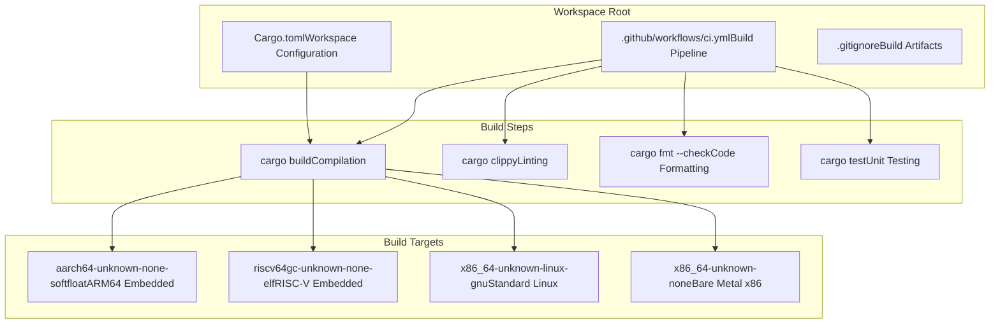
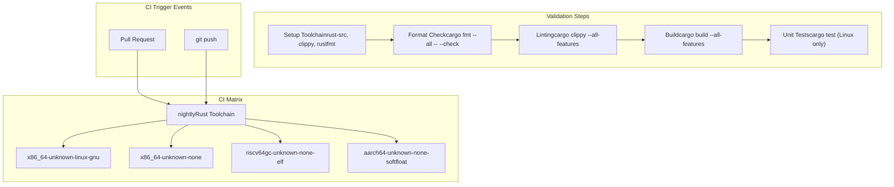
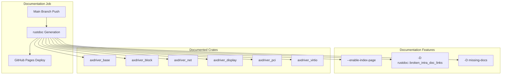
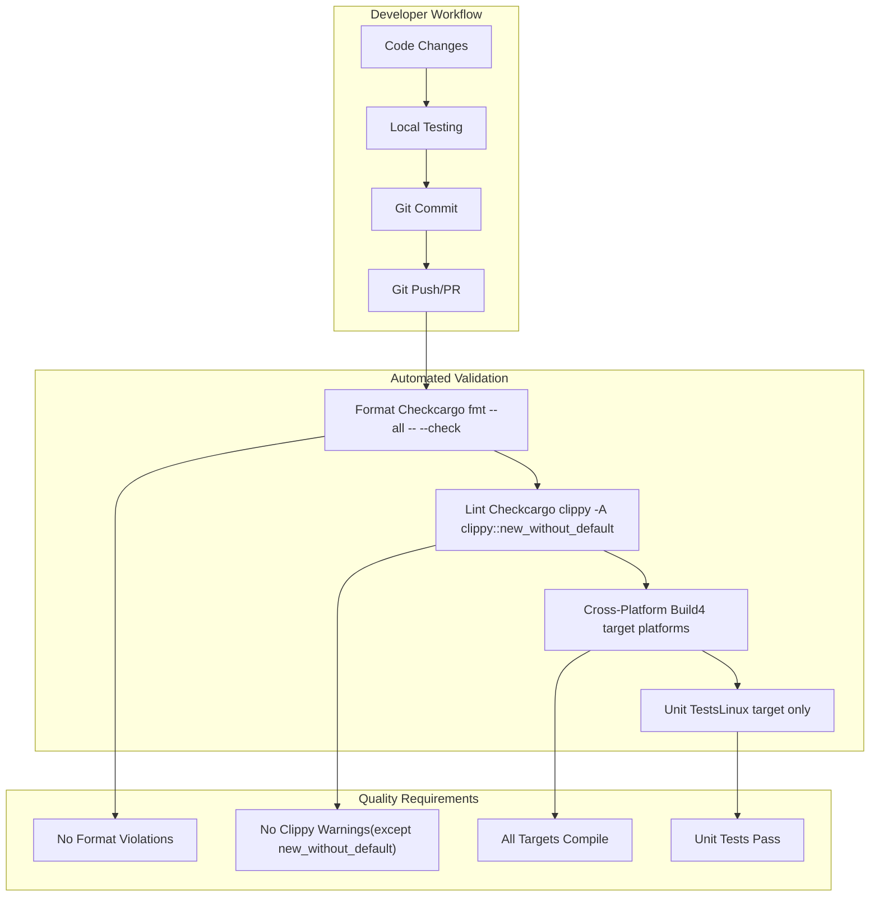

# Development and Build Configuration

> **Relevant source files**
> * [.github/workflows/ci.yml](https://github.com/arceos-org/axdriver_crates/blob/84eb2170/.github/workflows/ci.yml)
> * [.gitignore](https://github.com/arceos-org/axdriver_crates/blob/84eb2170/.gitignore)

This document explains the build system, continuous integration pipeline, and development workflow for the axdriver_crates repository. It covers the automated testing and validation processes, multi-target compilation support, and documentation generation that ensure code quality and maintain the driver framework across different hardware platforms.

For information about the overall architecture and design patterns, see [Architecture and Design](/arceos-org/axdriver_crates/2-architecture-and-design). For details about specific driver implementations and their usage, see the respective subsystem documentation ([Network Drivers](/arceos-org/axdriver_crates/4-network-drivers), [Block Storage Drivers](/arceos-org/axdriver_crates/5-block-storage-drivers), etc.).

## Build System Overview

The axdriver_crates workspace uses Cargo's workspace functionality to manage multiple related crates with unified build configuration. The build system supports compilation for embedded targets without standard library support, requiring careful dependency management and feature gating.

### Workspace Structure



The build system validates code across multiple architectures to ensure compatibility with various embedded and desktop platforms that ArceOS supports.

**Sources:** [.github/workflows/ci.yml(L1 - L58)&emsp;](https://github.com/arceos-org/axdriver_crates/blob/84eb2170/.github/workflows/ci.yml#L1-L58) [.gitignore(L1 - L5)&emsp;](https://github.com/arceos-org/axdriver_crates/blob/84eb2170/.gitignore#L1-L5)

## Continuous Integration Pipeline

The CI pipeline implements a comprehensive validation strategy using GitHub Actions, ensuring code quality and cross-platform compatibility for all commits and pull requests.

### CI Job Matrix Configuration



The pipeline uses the `fail-fast: false` strategy to ensure all target platforms are tested even if one fails, providing comprehensive feedback for cross-platform issues.

**Sources:** [.github/workflows/ci.yml(L6 - L30)&emsp;](https://github.com/arceos-org/axdriver_crates/blob/84eb2170/.github/workflows/ci.yml#L6-L30)

### Documentation Pipeline

The documentation build process generates and deploys API documentation automatically for the main branch:



The documentation pipeline enforces strict documentation requirements with `-D missing-docs` and validates all internal links to maintain high-quality API documentation.

**Sources:** [.github/workflows/ci.yml(L32 - L58)&emsp;](https://github.com/arceos-org/axdriver_crates/blob/84eb2170/.github/workflows/ci.yml#L32-L58)

## Target Platform Support

The framework supports multiple target platforms with different characteristics and constraints:

|Target Platform|Purpose|Standard Library|Use Case|
| --- | --- | --- | --- |
|x86_64-unknown-linux-gnu|Development/Testing|Full|Unit tests, development|
|x86_64-unknown-none|Bare Metal x86|No-std|PC-based embedded systems|
|riscv64gc-unknown-none-elf|RISC-V Embedded|No-std|RISC-V microcontrollers|
|aarch64-unknown-none-softfloat|ARM64 Embedded|No-std|ARM-based embedded systems|

### Compilation Configuration

The build system uses `--all-features` to ensure maximum compatibility testing across all optional features. Target-specific compilation is managed through:

* **Toolchain Requirements**: Nightly Rust with `rust-src` component for no-std targets
* **Component Dependencies**: `clippy` and `rustfmt` for code quality validation
* **Feature Testing**: All features enabled during compilation to catch integration issues

**Sources:** [.github/workflows/ci.yml(L11 - L12)&emsp;](https://github.com/arceos-org/axdriver_crates/blob/84eb2170/.github/workflows/ci.yml#L11-L12) [.github/workflows/ci.yml(L17 - L19)&emsp;](https://github.com/arceos-org/axdriver_crates/blob/84eb2170/.github/workflows/ci.yml#L17-L19) [.github/workflows/ci.yml(L25 - L27)&emsp;](https://github.com/arceos-org/axdriver_crates/blob/84eb2170/.github/workflows/ci.yml#L25-L27)

## Development Workflow

### Code Quality Gates

The development workflow enforces strict quality standards through automated checks:



### Clippy Configuration

The CI pipeline uses a relaxed clippy configuration with `-A clippy::new_without_default` to accommodate embedded development patterns where implementing `Default` may not be appropriate for hardware drivers.

**Sources:** [.github/workflows/ci.yml(L22 - L30)&emsp;](https://github.com/arceos-org/axdriver_crates/blob/84eb2170/.github/workflows/ci.yml#L22-L30)

## Build Artifacts and Caching

### Ignored Files and Directories

The repository maintains a minimal `.gitignore` configuration focusing on essential build artifacts:

```markdown
/target         # Cargo build output
/.vscode        # VSCode workspace files  
.DS_Store       # macOS system files
Cargo.lock      # Lock file (workspace)
```

The `Cargo.lock` exclusion is intentional for library crates, allowing consumers to use their preferred dependency versions while maintaining reproducible builds during development.

**Sources:** [.gitignore(L1 - L5)&emsp;](https://github.com/arceos-org/axdriver_crates/blob/84eb2170/.gitignore#L1-L5)

### Documentation Deployment

Documentation deployment uses a single-commit strategy to GitHub Pages, minimizing repository size while maintaining complete API documentation history through the `gh-pages` branch.

**Sources:** [.github/workflows/ci.yml(L51 - L57)&emsp;](https://github.com/arceos-org/axdriver_crates/blob/84eb2170/.github/workflows/ci.yml#L51-L57)

## Feature Configuration Strategy

The build system uses `--all-features` compilation to ensure comprehensive testing of all optional functionality. This approach validates:

* **Feature Compatibility**: All feature combinations compile successfully
* **Cross-Platform Features**: Features work across all supported target platforms
* **Integration Testing**: Optional components integrate properly with core functionality

This strategy supports the modular architecture where different embedded systems can selectively enable only required driver components while maintaining compatibility guarantees.

**Sources:** [.github/workflows/ci.yml(L25)&emsp;](https://github.com/arceos-org/axdriver_crates/blob/84eb2170/.github/workflows/ci.yml#L25-L25) [.github/workflows/ci.yml(L27)&emsp;](https://github.com/arceos-org/axdriver_crates/blob/84eb2170/.github/workflows/ci.yml#L27-L27) [.github/workflows/ci.yml(L47 - L50)&emsp;](https://github.com/arceos-org/axdriver_crates/blob/84eb2170/.github/workflows/ci.yml#L47-L50)