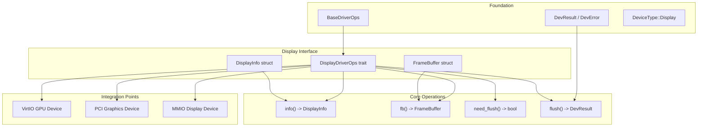
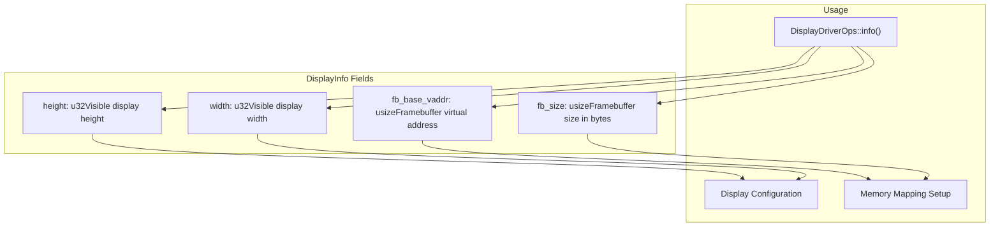
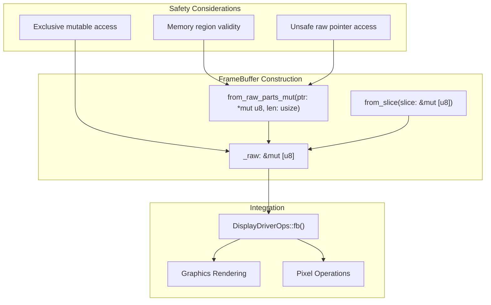
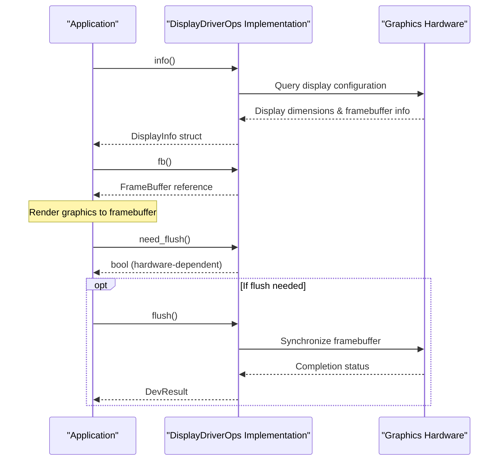
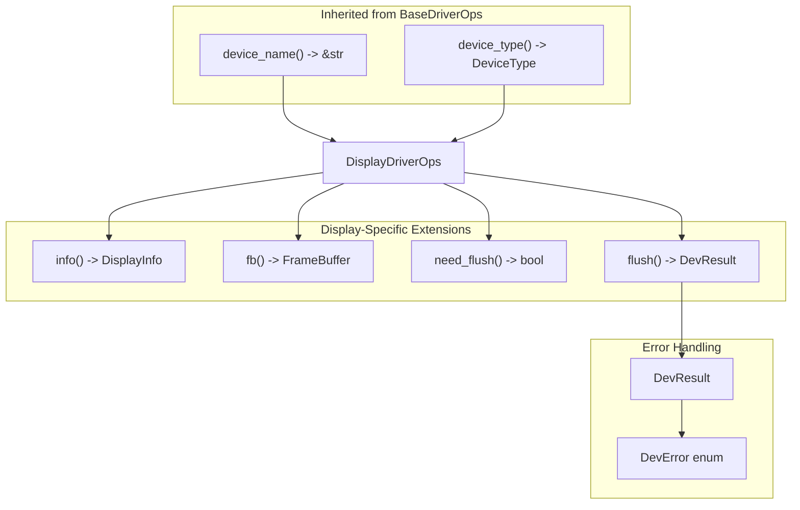

# Display Drivers

> **Relevant source files**
> * [axdriver_display/Cargo.toml](https://github.com/arceos-org/axdriver_crates/blob/84eb2170/axdriver_display/Cargo.toml)
> * [axdriver_display/src/lib.rs](https://github.com/arceos-org/axdriver_crates/blob/84eb2170/axdriver_display/src/lib.rs)

This document covers the display driver subsystem within the axdriver_crates framework. The display drivers provide a unified interface for graphics devices and framebuffer management in ArceOS. This subsystem handles graphics device initialization, framebuffer access, and display output operations.

For network device drivers, see [Network Drivers](/arceos-org/axdriver_crates/4-network-drivers). For block storage drivers, see [Block Storage Drivers](/arceos-org/axdriver_crates/5-block-storage-drivers). For VirtIO display device integration, see [VirtIO Integration](/arceos-org/axdriver_crates/7-virtio-integration).

## Display Driver Architecture

The display driver subsystem follows the same architectural pattern as other device types in the framework, extending the base driver operations with display-specific functionality.

### Display Driver Interface Overview



Sources: [axdriver_display/src/lib.rs(L1 - L60)&emsp;](https://github.com/arceos-org/axdriver_crates/blob/84eb2170/axdriver_display/src/lib.rs#L1-L60)

The `DisplayDriverOps` trait extends `BaseDriverOps` and defines the core interface that all display drivers must implement. This trait provides four essential operations for display management.

### Core Data Structures

The display subsystem defines two primary data structures for managing graphics device state and framebuffer access.

#### DisplayInfo Structure



Sources: [axdriver_display/src/lib.rs(L8 - L19)&emsp;](https://github.com/arceos-org/axdriver_crates/blob/84eb2170/axdriver_display/src/lib.rs#L8-L19)

The `DisplayInfo` struct contains essential metadata about the graphics device, including display dimensions and framebuffer memory layout. This information is used by higher-level graphics systems to configure rendering operations.

#### FrameBuffer Management



Sources: [axdriver_display/src/lib.rs(L21 - L44)&emsp;](https://github.com/arceos-org/axdriver_crates/blob/84eb2170/axdriver_display/src/lib.rs#L21-L44)

The `FrameBuffer` struct provides safe access to the device framebuffer memory. It offers both safe construction from existing slices and unsafe construction from raw pointers for device driver implementations.

## DisplayDriverOps Trait Implementation

### Required Methods

|Method|Return Type|Purpose|
| --- | --- | --- |
|info()|DisplayInfo|Retrieve display configuration and framebuffer metadata|
|fb()|FrameBuffer|Get access to the framebuffer for rendering operations|
|need_flush()|bool|Determine if explicit flush operations are required|
|flush()|DevResult|Synchronize framebuffer contents to the display|

Sources: [axdriver_display/src/lib.rs(L46 - L59)&emsp;](https://github.com/arceos-org/axdriver_crates/blob/84eb2170/axdriver_display/src/lib.rs#L46-L59)

### Display Driver Operation Flow



Sources: [axdriver_display/src/lib.rs(L46 - L59)&emsp;](https://github.com/arceos-org/axdriver_crates/blob/84eb2170/axdriver_display/src/lib.rs#L46-L59)

The `need_flush()` method allows drivers to indicate whether they require explicit flush operations. Some hardware configurations automatically update the display when framebuffer memory is modified, while others require explicit synchronization commands.

## Integration with Driver Framework

### Base Driver Integration

The display driver system inherits core functionality from the axdriver_base foundation layer:



Sources: [axdriver_display/src/lib.rs(L5 - L6)&emsp;](https://github.com/arceos-org/axdriver_crates/blob/84eb2170/axdriver_display/src/lib.rs#L5-L6) [axdriver_display/src/lib.rs(L46 - L59)&emsp;](https://github.com/arceos-org/axdriver_crates/blob/84eb2170/axdriver_display/src/lib.rs#L46-L59)

### Device Type Classification

Display drivers return `DeviceType::Display` from their `device_type()` method, enabling the driver framework to properly categorize and route display devices during system initialization.

## Hardware Implementation Considerations

### Memory Safety

The `FrameBuffer` implementation provides both safe and unsafe construction methods to accommodate different hardware access patterns:

* `from_slice()` for pre-validated memory regions
* `from_raw_parts_mut()` for direct hardware memory mapping with explicit safety requirements

### Flush Requirements

The `need_flush()` method accommodates different hardware architectures:

* **Immediate update hardware**: Returns `false`, display updates automatically
* **Buffered hardware**: Returns `true`, requires explicit `flush()` calls
* **Memory-mapped displays**: May return `false` for direct framebuffer access

Sources: [axdriver_display/src/lib.rs(L54 - L58)&emsp;](https://github.com/arceos-org/axdriver_crates/blob/84eb2170/axdriver_display/src/lib.rs#L54-L58)

## Dependencies and Build Configuration

The display driver crate has minimal dependencies, relying only on `axdriver_base` for core driver infrastructure:

```
[dependencies]
axdriver_base = { workspace = true }
```

This lightweight dependency structure ensures that display drivers can be compiled efficiently and integrated into embedded systems with minimal overhead.

Sources: [axdriver_display/Cargo.toml(L14 - L15)&emsp;](https://github.com/arceos-org/axdriver_crates/blob/84eb2170/axdriver_display/Cargo.toml#L14-L15)