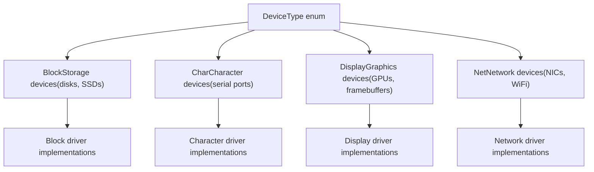
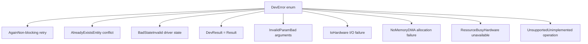
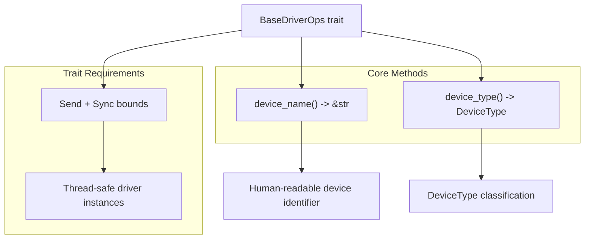
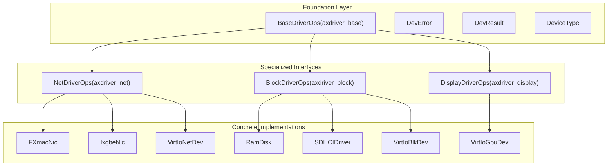

# Foundation Layer (axdriver_base)

> **Relevant source files**
> * [axdriver_base/Cargo.toml](https://github.com/arceos-org/axdriver_crates/blob/84eb2170/axdriver_base/Cargo.toml)
> * [axdriver_base/src/lib.rs](https://github.com/arceos-org/axdriver_crates/blob/84eb2170/axdriver_base/src/lib.rs)

## Purpose and Scope

The `axdriver_base` crate provides the foundational traits, types, and error handling mechanisms that underpin all device drivers in the ArceOS driver ecosystem. This crate defines the minimal common interface that every device driver must implement, regardless of device type or specific functionality.

This document covers the core abstractions and interfaces defined in `axdriver_base`. For device-specific driver interfaces that extend these foundations, see [Network Drivers](/arceos-org/axdriver_crates/4-network-drivers), [Block Storage Drivers](/arceos-org/axdriver_crates/5-block-storage-drivers), and [Display Drivers](/arceos-org/axdriver_crates/6-display-drivers). For information about how these foundations integrate with virtualized environments, see [VirtIO Integration](/arceos-org/axdriver_crates/7-virtio-integration).

## Core Device Type Classification

The foundation layer establishes a clear taxonomy of supported device types through the `DeviceType` enumeration. This classification system enables type-safe device management and routing throughout the driver framework.

### Device Type Enumeration

The `DeviceType` enum provides a standardized way to categorize hardware devices, enabling the driver framework to route operations to appropriate specialized driver interfaces.

**Sources:** [axdriver_base/src/lib.rs(L18 - L29)&emsp;](https://github.com/arceos-org/axdriver_crates/blob/84eb2170/axdriver_base/src/lib.rs#L18-L29)

## Error Handling System

The foundation layer establishes a unified error handling approach across all drivers through the `DevError` enumeration and `DevResult` type alias. This system provides consistent error semantics regardless of the underlying hardware or driver implementation.

### Error Type Hierarchy

### Error Categories

|Error Type|Use Case|Typical Scenarios|
| --- | --- | --- |
|AlreadyExists|Resource conflicts|Device already registered, buffer already allocated|
|Again|Non-blocking operations|Queue full, temporary unavailability|
|BadState|Driver state issues|Uninitialized device, invalid configuration|
|InvalidParam|Parameter validation|Invalid buffer size, out-of-range values|
|Io|Hardware failures|Device timeout, communication errors|
|NoMemory|Memory allocation|DMA buffer allocation failure|
|ResourceBusy|Concurrent access|Device locked by another process|
|Unsupported|Feature availability|Optional hardware features not present|

**Sources:** [axdriver_base/src/lib.rs(L31 - L53)&emsp;](https://github.com/arceos-org/axdriver_crates/blob/84eb2170/axdriver_base/src/lib.rs#L31-L53)

## Base Driver Interface

All device drivers in the framework must implement the `BaseDriverOps` trait, which provides the minimal set of operations required for device identification and type classification.

### BaseDriverOps Trait Structure

### Implementation Requirements

The `BaseDriverOps` trait enforces two critical requirements:

1. **Thread Safety**: All drivers must implement `Send + Sync`, enabling safe concurrent access across threads
2. **Device Identification**: Every driver must provide both a human-readable name and a type classification

These requirements ensure that the driver framework can safely manage device instances in multi-threaded environments while maintaining clear device identification.

**Sources:** [axdriver_base/src/lib.rs(L55 - L62)&emsp;](https://github.com/arceos-org/axdriver_crates/blob/84eb2170/axdriver_base/src/lib.rs#L55-L62)

## Integration with Specialized Driver Types

The foundation layer serves as the building block for all specialized device driver interfaces. Each device-specific crate extends these core abstractions with domain-specific functionality.

### Driver Trait Hierarchy

### Extension Pattern

Each specialized driver interface follows a consistent extension pattern:

1. **Inherit** from `BaseDriverOps` for basic device identification
2. **Extend** with device-specific operations (e.g., `transmit()` for network devices)
3. **Utilize** the common `DevResult<T>` error handling system
4. **Classify** using the appropriate `DeviceType` variant

This pattern ensures consistency across all driver types while allowing for domain-specific optimizations and functionality.

**Sources:** [axdriver_base/src/lib.rs(L1 - L15)&emsp;](https://github.com/arceos-org/axdriver_crates/blob/84eb2170/axdriver_base/src/lib.rs#L1-L15)

## No-std Compatibility

The foundation layer is designed for embedded and systems programming environments, maintaining `#![no_std]` compatibility throughout. This design choice enables the driver framework to operate in resource-constrained environments and kernel contexts where the standard library is not available.

The `no_std` constraint influences several design decisions:

* Error types use `Debug` trait instead of `std::error::Error`
* No heap allocations in core types
* Compatible with embedded target architectures

**Sources:** [axdriver_base/src/lib.rs(L16)&emsp;](https://github.com/arceos-org/axdriver_crates/blob/84eb2170/axdriver_base/src/lib.rs#L16-L16)