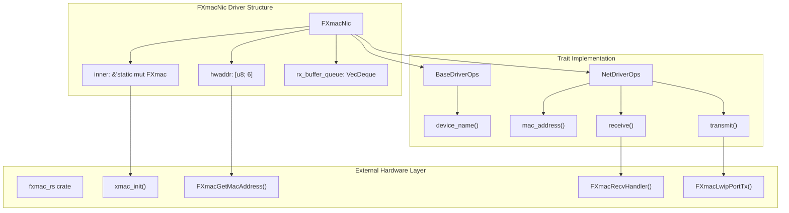
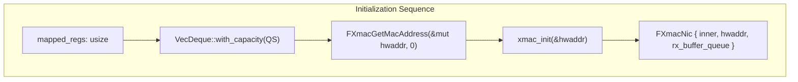
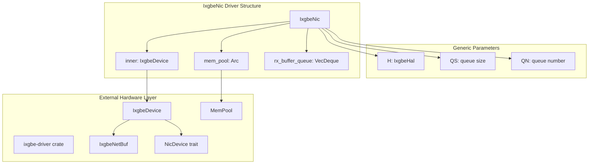
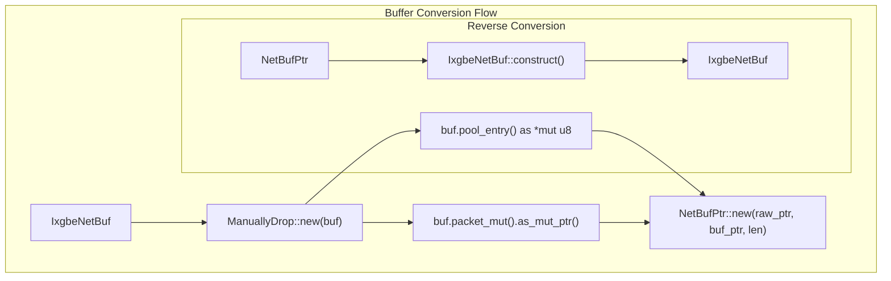
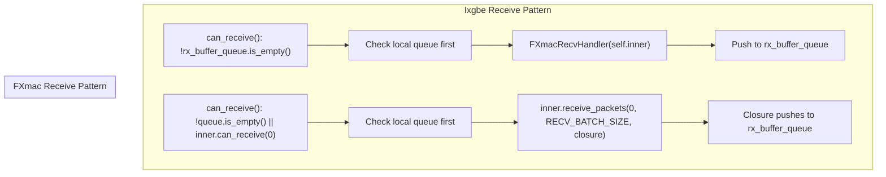
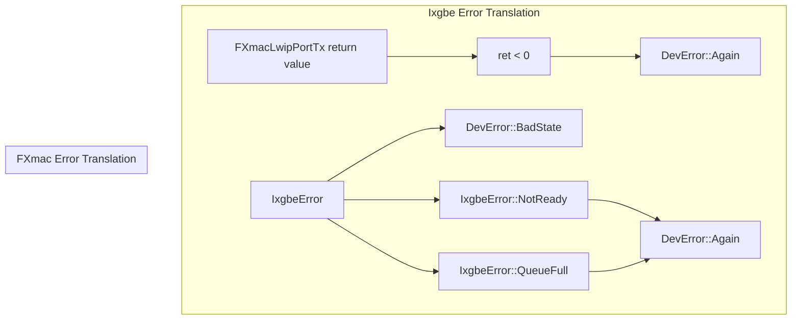

# Hardware Implementations

> **Relevant source files**
> * [axdriver_net/src/fxmac.rs](https://github.com/arceos-org/axdriver_crates/blob/84eb2170/axdriver_net/src/fxmac.rs)
> * [axdriver_net/src/ixgbe.rs](https://github.com/arceos-org/axdriver_crates/blob/84eb2170/axdriver_net/src/ixgbe.rs)

This document covers the concrete network hardware driver implementations that provide device-specific functionality within the axdriver network subsystem. These implementations demonstrate how the abstract `NetDriverOps` trait is realized for specific network controllers, including buffer management strategies and hardware abstraction layer integration.

For information about the network driver interface abstractions, see [Network Driver Interface](/arceos-org/axdriver_crates/4.1-network-driver-interface). For details about buffer management patterns, see [Network Buffer Management](/arceos-org/axdriver_crates/4.2-network-buffer-management).

## Overview

The axdriver network subsystem includes two primary hardware implementations that showcase different architectural approaches:

|Driver|Hardware Target|Buffer Strategy|External Dependencies|
| --- | --- | --- | --- |
|FXmacNic|PhytiumPi Ethernet Controller|Queue-based RX buffering|fxmac_rscrate|
|IxgbeNic|Intel 10GbE Controller|Memory pool allocation|ixgbe-drivercrate|

Both implementations provide the same `NetDriverOps` interface while handling hardware-specific details internally.

## FXmac Network Controller Implementation

### Architecture and Integration

The `FXmacNic` struct provides an implementation for PhytiumPi Ethernet controllers using a queue-based approach for receive buffer management.

Sources: [axdriver_net/src/fxmac.rs(L1 - L145)&emsp;](https://github.com/arceos-org/axdriver_crates/blob/84eb2170/axdriver_net/src/fxmac.rs#L1-L145)

### Initialization and Hardware Integration

The `FXmacNic::init()` function demonstrates the initialization pattern for hardware-dependent drivers:

The driver uses a fixed queue size of 64 (`QS = 64`) for both receive and transmit operations, defined as a constant.

Sources: [axdriver_net/src/fxmac.rs(L16)&emsp;](https://github.com/arceos-org/axdriver_crates/blob/84eb2170/axdriver_net/src/fxmac.rs#L16-L16) [axdriver_net/src/fxmac.rs(L30 - L45)&emsp;](https://github.com/arceos-org/axdriver_crates/blob/84eb2170/axdriver_net/src/fxmac.rs#L30-L45)

### Buffer Management Strategy

The FXmac implementation uses a simple queue-based approach for managing received packets:

* **Receive Path**: Uses `VecDeque<NetBufPtr>` to queue incoming packets from `FXmacRecvHandler()`
* **Transmit Path**: Allocates `Box<Vec<u8>>` for each transmission
* **Buffer Recycling**: Drops allocated boxes directly using `Box::from_raw()`

The `receive()` method demonstrates this pattern by first checking the local queue, then polling the hardware.

Sources: [axdriver_net/src/fxmac.rs(L92 - L118)&emsp;](https://github.com/arceos-org/axdriver_crates/blob/84eb2170/axdriver_net/src/fxmac.rs#L92-L118) [axdriver_net/src/fxmac.rs(L134 - L144)&emsp;](https://github.com/arceos-org/axdriver_crates/blob/84eb2170/axdriver_net/src/fxmac.rs#L134-L144)

## Intel ixgbe Network Controller Implementation

### Architecture and Memory Pool Integration

The `IxgbeNic` struct implements a more sophisticated memory management approach using pre-allocated memory pools:

Sources: [axdriver_net/src/ixgbe.rs(L18 - L28)&emsp;](https://github.com/arceos-org/axdriver_crates/blob/84eb2170/axdriver_net/src/ixgbe.rs#L18-L28)

### Memory Pool Configuration

The ixgbe driver uses predefined memory pool parameters for efficient buffer allocation:

|Parameter|Value|Purpose|
| --- | --- | --- |
|MEM_POOL|4096|Total memory pool entries|
|MEM_POOL_ENTRY_SIZE|2048|Size per pool entry in bytes|
|RX_BUFFER_SIZE|1024|Receive buffer queue capacity|
|RECV_BATCH_SIZE|64|Batch size for receive operations|

These constants ensure optimal performance for high-throughput network operations.

Sources: [axdriver_net/src/ixgbe.rs(L13 - L16)&emsp;](https://github.com/arceos-org/axdriver_crates/blob/84eb2170/axdriver_net/src/ixgbe.rs#L13-L16)

### NetBufPtr Conversion Pattern

The ixgbe implementation demonstrates a sophisticated buffer conversion pattern between `IxgbeNetBuf` and `NetBufPtr`:

The `From<IxgbeNetBuf>` implementation uses `ManuallyDrop` to avoid premature deallocation while transferring ownership to the `NetBufPtr` abstraction.

Sources: [axdriver_net/src/ixgbe.rs(L143 - L162)&emsp;](https://github.com/arceos-org/axdriver_crates/blob/84eb2170/axdriver_net/src/ixgbe.rs#L143-L162)

## Trait Implementation Patterns

### BaseDriverOps Implementation

Both drivers implement `BaseDriverOps` with device-specific identification:

|Driver|device_name()Return Value|Source|
| --- | --- | --- |
|FXmacNic|"cdns,phytium-gem-1.0"|Hardware device tree compatible string|
|IxgbeNic|self.inner.get_driver_name()|Delegated to underlying driver|

Sources: [axdriver_net/src/fxmac.rs(L48 - L56)&emsp;](https://github.com/arceos-org/axdriver_crates/blob/84eb2170/axdriver_net/src/fxmac.rs#L48-L56) [axdriver_net/src/ixgbe.rs(L50 - L58)&emsp;](https://github.com/arceos-org/axdriver_crates/blob/84eb2170/axdriver_net/src/ixgbe.rs#L50-L58)

### NetDriverOps Core Methods

The receive and transmit implementations showcase different architectural approaches:

Sources: [axdriver_net/src/fxmac.rs(L71 - L118)&emsp;](https://github.com/arceos-org/axdriver_crates/blob/84eb2170/axdriver_net/src/fxmac.rs#L71-L118) [axdriver_net/src/ixgbe.rs(L73 - L124)&emsp;](https://github.com/arceos-org/axdriver_crates/blob/84eb2170/axdriver_net/src/ixgbe.rs#L73-L124)

## Hardware Abstraction Layer Integration

### External Crate Dependencies

Both implementations demonstrate integration with external hardware abstraction crates:

|Driver|External Crate|Key Functions Used|
| --- | --- | --- |
|FXmacNic|fxmac_rs|xmac_init,FXmacGetMacAddress,FXmacRecvHandler,FXmacLwipPortTx|
|IxgbeNic|ixgbe-driver|IxgbeDevice::init,MemPool::allocate,receive_packets,send|

This pattern allows the axdriver framework to leverage existing hardware-specific implementations while providing a unified interface.

Sources: [axdriver_net/src/fxmac.rs(L7)&emsp;](https://github.com/arceos-org/axdriver_crates/blob/84eb2170/axdriver_net/src/fxmac.rs#L7-L7) [axdriver_net/src/ixgbe.rs(L6 - L7)&emsp;](https://github.com/arceos-org/axdriver_crates/blob/84eb2170/axdriver_net/src/ixgbe.rs#L6-L7)

### Error Handling Translation

Both drivers translate hardware-specific errors to the common `DevError` type:

Sources: [axdriver_net/src/fxmac.rs(L127 - L131)&emsp;](https://github.com/arceos-org/axdriver_crates/blob/84eb2170/axdriver_net/src/fxmac.rs#L127-L131) [axdriver_net/src/ixgbe.rs(L118 - L122)&emsp;](https://github.com/arceos-org/axdriver_crates/blob/84eb2170/axdriver_net/src/ixgbe.rs#L118-L122) [axdriver_net/src/ixgbe.rs(L130 - L134)&emsp;](https://github.com/arceos-org/axdriver_crates/blob/84eb2170/axdriver_net/src/ixgbe.rs#L130-L134)