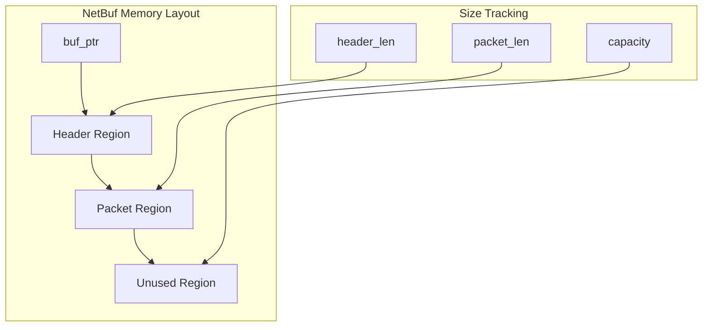
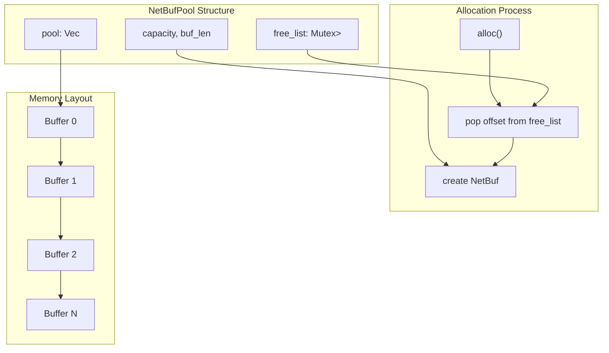
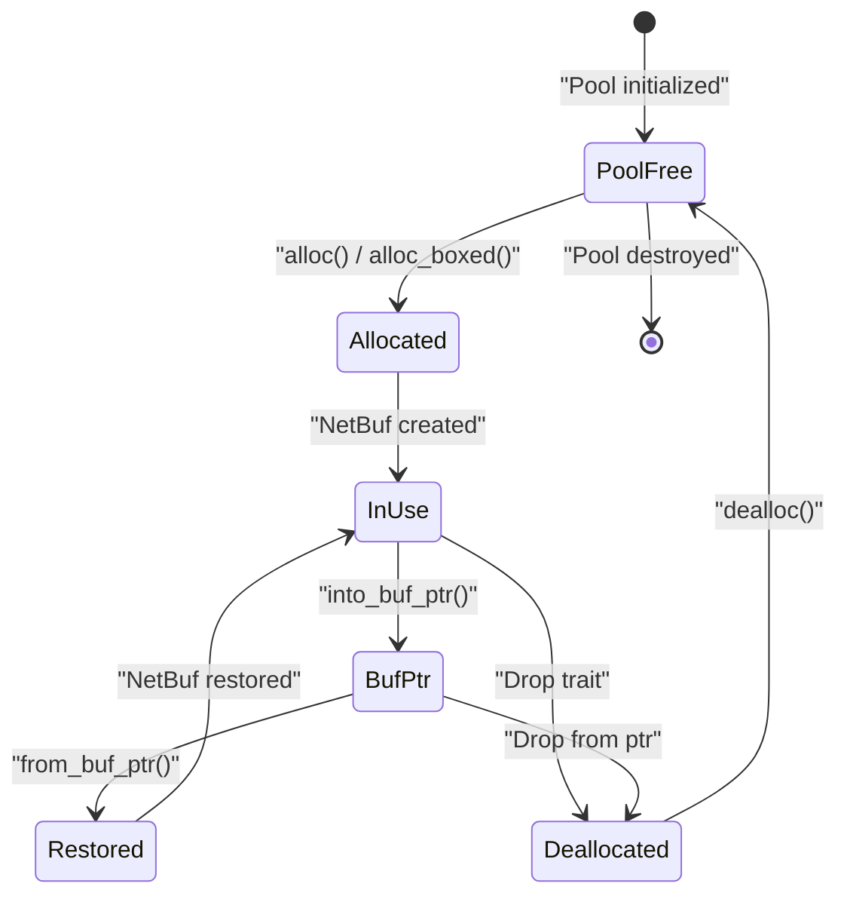
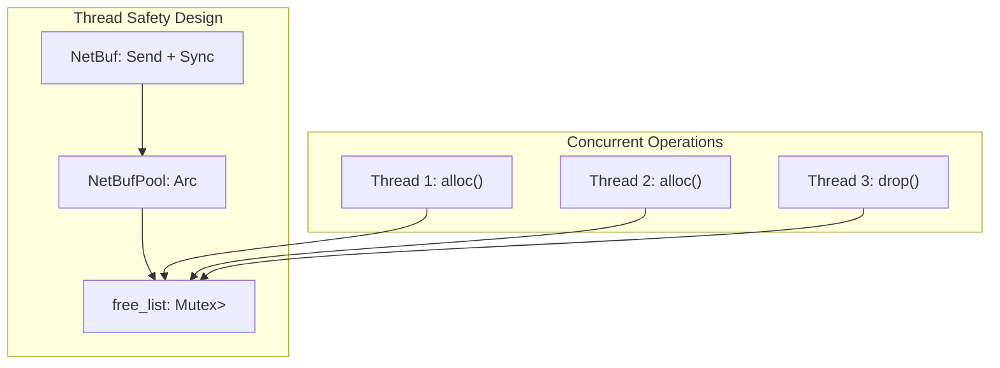
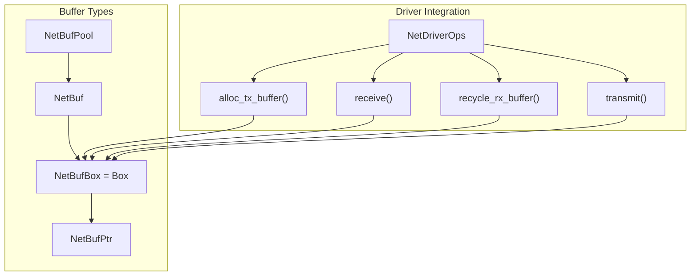

# Network Buffer Management

> **Relevant source files**
> * [axdriver_net/src/net_buf.rs](https://github.com/arceos-org/axdriver_crates/blob/84eb2170/axdriver_net/src/net_buf.rs)

This document covers the sophisticated buffer allocation and management system used for high-performance network operations in the axdriver framework. The network buffer management provides efficient memory allocation, automatic resource cleanup, and optimized buffer layouts for packet processing.

For information about the network driver interface that uses these buffers, see [Network Driver Interface](/arceos-org/axdriver_crates/4.1-network-driver-interface). For details on how specific hardware implementations utilize this buffer system, see [Hardware Implementations](/arceos-org/axdriver_crates/4.3-hardware-implementations).

## Buffer Structure and Layout

The core of the network buffer system is the `NetBuf` structure, which provides a flexible buffer layout optimized for network packet processing with separate header and packet regions.

### NetBuf Memory Layout

The `NetBuf` structure implements a three-region memory layout where the header region stores protocol headers, the packet region contains the actual data payload, and unused space allows for future expansion without reallocation.

**Sources:** [axdriver_net/src/net_buf.rs(L19 - L38)&emsp;](https://github.com/arceos-org/axdriver_crates/blob/84eb2170/axdriver_net/src/net_buf.rs#L19-L38)

### Core Buffer Operations

|Operation|Method|Purpose|
| --- | --- | --- |
|Header Access|header()|Read-only access to header region|
|Packet Access|packet()/packet_mut()|Access to packet data|
|Combined Access|packet_with_header()|Contiguous header + packet view|
|Raw Buffer|raw_buf()/raw_buf_mut()|Access to entire buffer|
|Size Management|set_header_len()/set_packet_len()|Adjust region boundaries|

The buffer provides const methods for efficient access patterns and maintains safety through debug assertions that prevent region overlap.

**Sources:** [axdriver_net/src/net_buf.rs(L43 - L103)&emsp;](https://github.com/arceos-org/axdriver_crates/blob/84eb2170/axdriver_net/src/net_buf.rs#L43-L103)

## Memory Pool Architecture

The `NetBufPool` provides high-performance buffer allocation through pre-allocated memory pools, eliminating the overhead of individual allocations during packet processing.

### Pool Allocation Strategy

The pool divides a large contiguous memory allocation into fixed-size buffers, maintaining a free list of available buffer offsets for O(1) allocation and deallocation operations.

**Sources:** [axdriver_net/src/net_buf.rs(L133 - L165)&emsp;](https://github.com/arceos-org/axdriver_crates/blob/84eb2170/axdriver_net/src/net_buf.rs#L133-L165)

### Pool Configuration and Constraints

|Parameter|Range|Purpose|
| --- | --- | --- |
|MIN_BUFFER_LEN|1526 bytes|Minimum Ethernet frame size|
|MAX_BUFFER_LEN|65535 bytes|Maximum buffer allocation|
|capacity|> 0|Number of buffers in pool|

The pool validates buffer sizes against network protocol requirements and prevents invalid configurations through compile-time constants and runtime checks.

**Sources:** [axdriver_net/src/net_buf.rs(L8 - L152)&emsp;](https://github.com/arceos-org/axdriver_crates/blob/84eb2170/axdriver_net/src/net_buf.rs#L8-L152)

## Buffer Lifecycle Management

The network buffer system implements RAII (Resource Acquisition Is Initialization) patterns for automatic memory management and integration with raw pointer operations for hardware drivers.

### Allocation and Deallocation Flow

The lifecycle supports both high-level RAII management through `Drop` implementation and low-level pointer conversion for hardware driver integration.

**Sources:** [axdriver_net/src/net_buf.rs(L105 - L131)&emsp;](https://github.com/arceos-org/axdriver_crates/blob/84eb2170/axdriver_net/src/net_buf.rs#L105-L131)

### Raw Pointer Integration

The buffer system provides conversion to and from `NetBufPtr` for integration with hardware drivers that require raw memory pointers:

|Operation|Method|Safety Requirements|
| --- | --- | --- |
|To Pointer|into_buf_ptr()|Consumes NetBuf, transfers ownership|
|From Pointer|from_buf_ptr()|Unsafe, requires priorinto_buf_ptr()call|
|Pointer Creation|NetBufPtr::new()|Hardware driver responsibility|

This dual-mode operation allows the same buffer to be used efficiently in both safe Rust code and unsafe hardware interaction contexts.

**Sources:** [axdriver_net/src/net_buf.rs(L104 - L123)&emsp;](https://github.com/arceos-org/axdriver_crates/blob/84eb2170/axdriver_net/src/net_buf.rs#L104-L123)

## Thread Safety and Concurrency

The buffer management system provides thread-safe operations through careful synchronization design:

The `NetBufPool` uses `Arc` for shared ownership and `Mutex` protection of the free list, enabling concurrent allocation and deallocation from multiple threads while maintaining memory safety.

**Sources:** [axdriver_net/src/net_buf.rs(L40 - L207)&emsp;](https://github.com/arceos-org/axdriver_crates/blob/84eb2170/axdriver_net/src/net_buf.rs#L40-L207)

## Integration with Network Drivers

The buffer management system integrates with the broader network driver ecosystem through standardized interfaces and efficient memory patterns designed for high-throughput network operations.

### Buffer Type Relationships

Network drivers utilize the buffer system through the `NetDriverOps` trait methods, providing standardized buffer allocation and recycling operations that maintain pool efficiency across different hardware implementations.

**Sources:** [axdriver_net/src/net_buf.rs(L1 - L208)&emsp;](https://github.com/arceos-org/axdriver_crates/blob/84eb2170/axdriver_net/src/net_buf.rs#L1-L208)