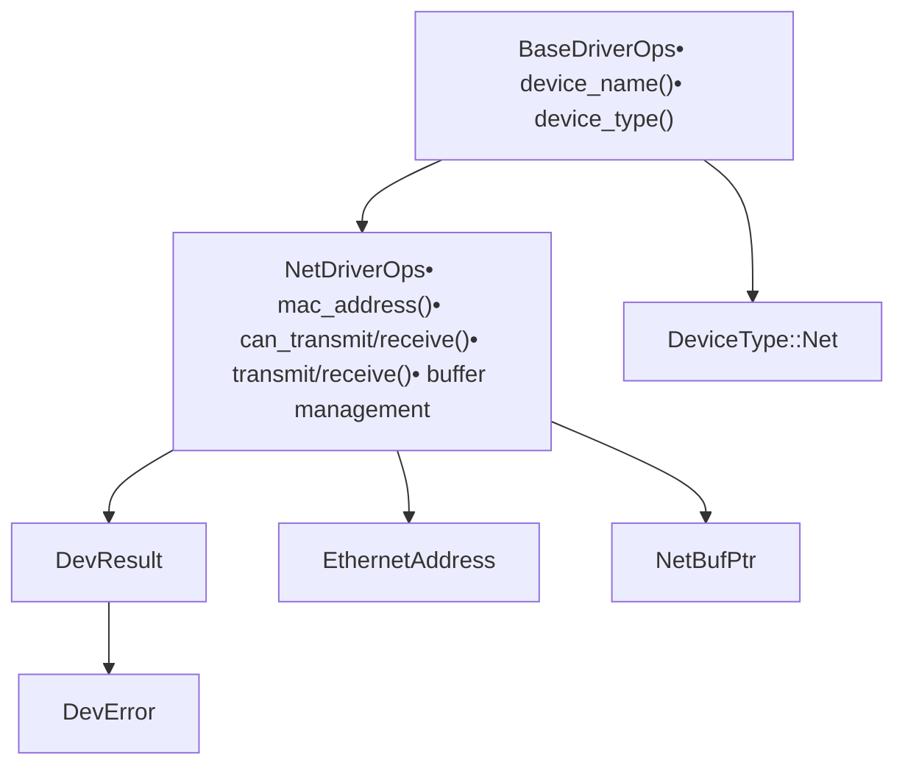
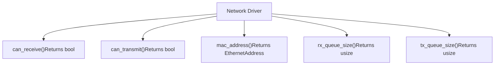
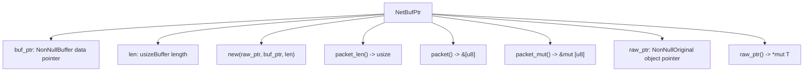
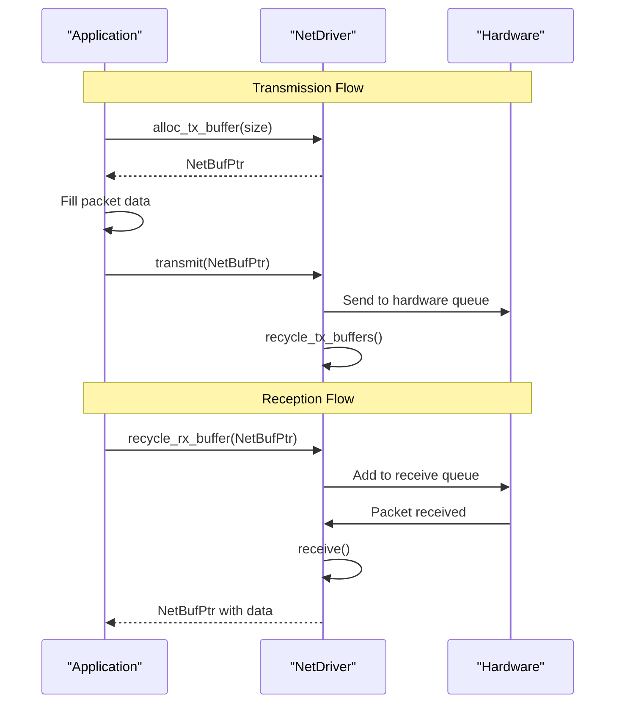
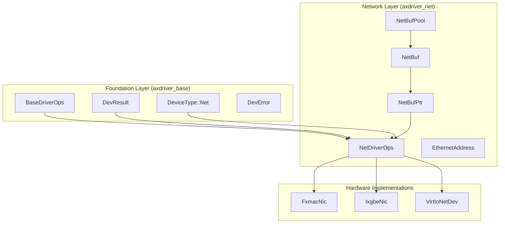

# Network Driver Interface

> **Relevant source files**
> * [axdriver_net/src/lib.rs](https://github.com/arceos-org/axdriver_crates/blob/84eb2170/axdriver_net/src/lib.rs)

## Purpose and Scope

This document covers the core network driver interface defined by the `NetDriverOps` trait and related types in the `axdriver_net` crate. This interface provides the foundational abstraction layer for all network device drivers in the ArceOS driver framework.

For detailed information about the underlying foundation traits and error handling, see [Foundation Layer](/arceos-org/axdriver_crates/3-foundation-layer-(axdriver_base)). For specific buffer management implementations and memory pool strategies, see [Network Buffer Management](/arceos-org/axdriver_crates/4.2-network-buffer-management). For concrete hardware driver implementations that use this interface, see [Hardware Implementations](/arceos-org/axdriver_crates/4.3-hardware-implementations).

## Network Driver Trait Architecture

The network driver interface builds upon the foundation layer through a clear trait hierarchy that extends `BaseDriverOps` with network-specific functionality.

### Trait Inheritance Structure

**Sources:** [axdriver_net/src/lib.rs(L16 - L17)&emsp;](https://github.com/arceos-org/axdriver_crates/blob/84eb2170/axdriver_net/src/lib.rs#L16-L17) [axdriver_net/src/lib.rs(L25 - L68)&emsp;](https://github.com/arceos-org/axdriver_crates/blob/84eb2170/axdriver_net/src/lib.rs#L25-L68)

The `NetDriverOps` trait extends `BaseDriverOps` to provide network-specific operations while maintaining compatibility with the unified driver framework. All network drivers must implement both trait interfaces to ensure consistent device management and network functionality.

### Core Type Definitions

|Type|Purpose|Definition Location|
| --- | --- | --- |
|EthernetAddress|MAC address representation|axdriver_net/src/lib.rs22|
|NetBufPtr|Raw network buffer pointer|axdriver_net/src/lib.rs71-108|
|NetDriverOps|Primary network driver trait|axdriver_net/src/lib.rs25-68|

**Sources:** [axdriver_net/src/lib.rs(L19 - L22)&emsp;](https://github.com/arceos-org/axdriver_crates/blob/84eb2170/axdriver_net/src/lib.rs#L19-L22) [axdriver_net/src/lib.rs(L71)&emsp;](https://github.com/arceos-org/axdriver_crates/blob/84eb2170/axdriver_net/src/lib.rs#L71-L71)

## Core Network Operations

The `NetDriverOps` trait defines the essential operations that all network drivers must implement, organized into device information, queue management, and packet processing categories.

### Device Information and Capabilities

**Sources:** [axdriver_net/src/lib.rs(L26 - L39)&emsp;](https://github.com/arceos-org/axdriver_crates/blob/84eb2170/axdriver_net/src/lib.rs#L26-L39)

These methods provide essential device characteristics:

* `mac_address()` returns the hardware ethernet address as an `EthernetAddress` struct
* `can_transmit()` and `can_receive()` indicate current device capability status
* `tx_queue_size()` and `rx_queue_size()` return the capacity of transmit and receive queues

### Packet Processing Operations

The trait defines a complete packet processing lifecycle with explicit buffer management:

|Method|Purpose|Parameters|Return Type|
| --- | --- | --- | --- |
|transmit()|Send packet to network|tx_buf: NetBufPtr|DevResult|
|receive()|Receive packet from network|None|DevResult<NetBufPtr>|
|alloc_tx_buffer()|Allocate transmission buffer|size: usize|DevResult<NetBufPtr>|
|recycle_rx_buffer()|Return buffer to receive queue|rx_buf: NetBufPtr|DevResult|
|recycle_tx_buffers()|Reclaim transmitted buffers|None|DevResult|

**Sources:** [axdriver_net/src/lib.rs(L41 - L68)&emsp;](https://github.com/arceos-org/axdriver_crates/blob/84eb2170/axdriver_net/src/lib.rs#L41-L68)

## Buffer Management Interface

The network interface uses `NetBufPtr` as the primary buffer abstraction, providing a safe wrapper around raw memory pointers for network packet data.

### NetBufPtr Structure and Operations

**Sources:** [axdriver_net/src/lib.rs(L71 - L108)&emsp;](https://github.com/arceos-org/axdriver_crates/blob/84eb2170/axdriver_net/src/lib.rs#L71-L108)

The `NetBufPtr` design separates the original object pointer from the buffer data pointer, enabling:

* Safe reference counting of the underlying buffer object
* Direct access to packet data without additional indirection
* Flexible buffer layout for different hardware requirements

### Buffer Lifecycle Management

**Sources:** [axdriver_net/src/lib.rs(L41 - L68)&emsp;](https://github.com/arceos-org/axdriver_crates/blob/84eb2170/axdriver_net/src/lib.rs#L41-L68)

The buffer lifecycle ensures efficient memory management:

1. **Allocation**: `alloc_tx_buffer()` provides buffers for transmission
2. **Population**: Applications fill buffers with packet data via `packet_mut()`
3. **Transmission**: `transmit()` queues buffers to hardware
4. **Recycling**: `recycle_tx_buffers()` reclaims completed transmissions
5. **Reception**: `receive()` returns buffers with incoming packets
6. **Return**: `recycle_rx_buffer()` returns buffers to the receive queue

## Data Flow and Network Driver Integration

The network driver interface integrates with the broader ArceOS driver framework through standardized error handling and device type classification.

### Integration with Foundation Layer

**Sources:** [axdriver_net/src/lib.rs(L16 - L19)&emsp;](https://github.com/arceos-org/axdriver_crates/blob/84eb2170/axdriver_net/src/lib.rs#L16-L19) [axdriver_net/src/lib.rs(L25)&emsp;](https://github.com/arceos-org/axdriver_crates/blob/84eb2170/axdriver_net/src/lib.rs#L25-L25)

The network driver interface serves as the bridge between the generic driver framework and specific hardware implementations, providing:

* Consistent error handling through `DevResult` and `DevError` types
* Device type classification through `DeviceType::Net`
* Standardized buffer management abstractions
* Hardware-agnostic network operations

This design enables multiple network hardware implementations to coexist while maintaining a unified programming interface for upper-layer network protocols and applications.