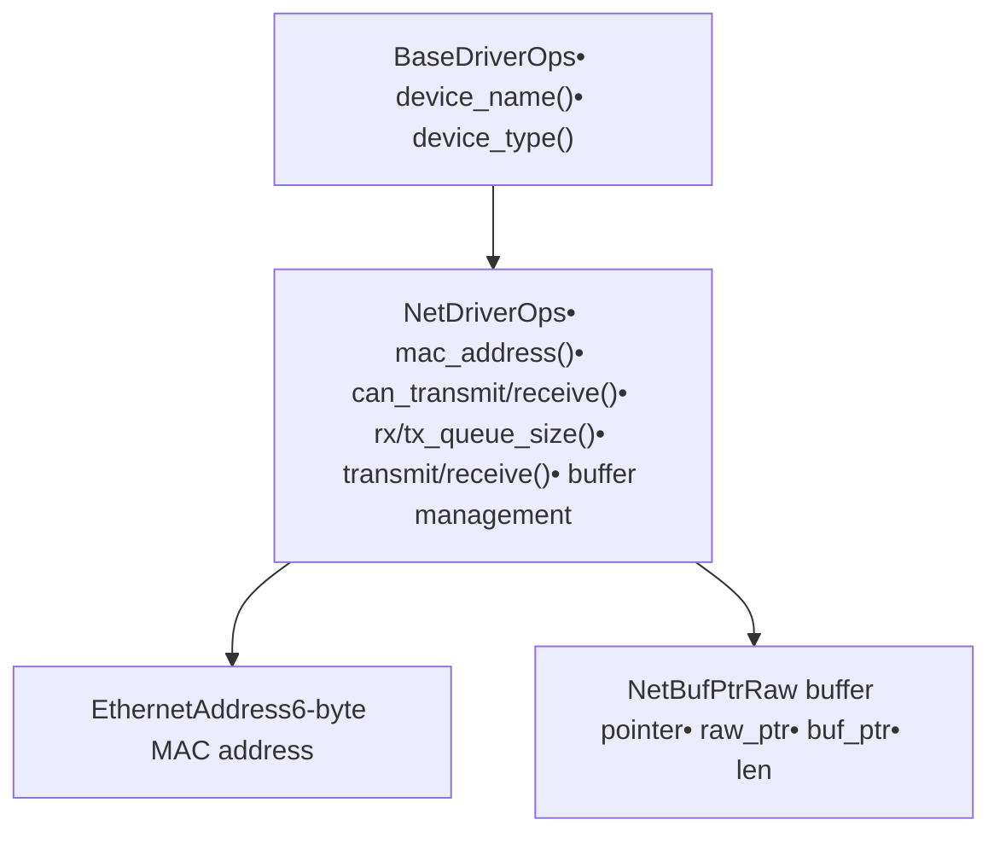
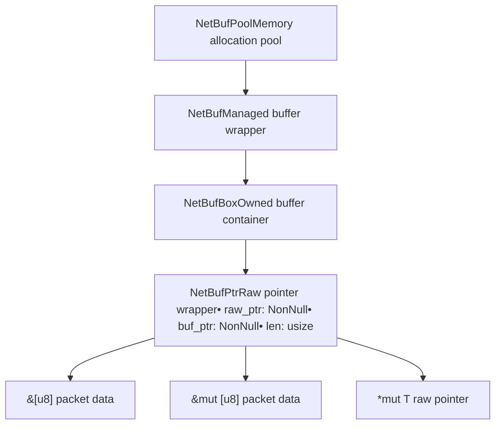
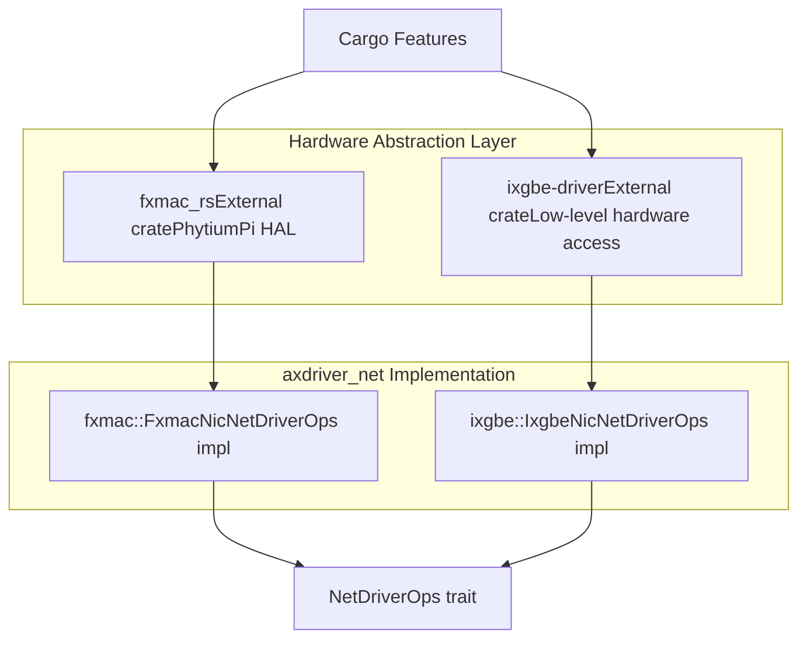

# Network Drivers

> **Relevant source files**
> * [axdriver_net/Cargo.toml](https://github.com/arceos-org/axdriver_crates/blob/84eb2170/axdriver_net/Cargo.toml)
> * [axdriver_net/src/lib.rs](https://github.com/arceos-org/axdriver_crates/blob/84eb2170/axdriver_net/src/lib.rs)

## Purpose and Scope

This document covers the network driver subsystem within the axdriver_crates framework, which provides traits, types, and implementations for Network Interface Card (NIC) drivers. The network subsystem is the most sophisticated component in the driver framework, featuring advanced buffer management, multiple hardware implementations, and support for both physical and virtualized network devices.

For information about the foundational driver traits that network drivers extend, see [Foundation Layer (axdriver_base)](/arceos-org/axdriver_crates/3-foundation-layer-(axdriver_base)). For VirtIO network device integration, see [VirtIO Integration](/arceos-org/axdriver_crates/7-virtio-integration).

## Network Driver Architecture

The network driver subsystem follows a layered architecture where hardware-specific implementations conform to standardized traits while maintaining optimized performance paths for different types of network hardware.

### Core Network Driver Interface

The `NetDriverOps` trait defined in [axdriver_net/src/lib.rs(L25 - L68)&emsp;](https://github.com/arceos-org/axdriver_crates/blob/84eb2170/axdriver_net/src/lib.rs#L25-L68) serves as the primary interface that all network drivers must implement. This trait extends `BaseDriverOps` and provides network-specific operations:

**Title: Network Driver Interface Hierarchy**

The interface provides both synchronous and asynchronous patterns through methods like `can_transmit()` and `can_receive()` for non-blocking operations, while `receive()` returns `DevError::Again` when no packets are available.

**Sources:** [axdriver_net/src/lib.rs(L25 - L68)&emsp;](https://github.com/arceos-org/axdriver_crates/blob/84eb2170/axdriver_net/src/lib.rs#L25-L68)

### Buffer Management System

Network drivers use a sophisticated buffer management system centered around `NetBufPtr` and related types. The `NetBufPtr` structure provides zero-copy buffer operations for high-performance networking:

|Field|Type|Purpose|
| --- | --- | --- |
|raw_ptr|NonNull<u8>|Pointer to original object for deallocation|
|buf_ptr|NonNull<u8>|Pointer to actual network data|
|len|usize|Length of network packet data|

**Title: Network Buffer Management Architecture**

The buffer system supports both pre-allocated buffer pools for high-performance drivers and dynamic allocation for simpler implementations. The separation between `raw_ptr` and `buf_ptr` enables complex memory layouts where the network data is embedded within larger structures.

**Sources:** [axdriver_net/src/lib.rs(L19)&emsp;](https://github.com/arceos-org/axdriver_crates/blob/84eb2170/axdriver_net/src/lib.rs#L19-L19) [axdriver_net/src/lib.rs(L70 - L108)&emsp;](https://github.com/arceos-org/axdriver_crates/blob/84eb2170/axdriver_net/src/lib.rs#L70-L108)

## Hardware Driver Implementations

The network subsystem includes two primary hardware implementations with different architectural approaches:

### Feature-Based Driver Selection

Network drivers are compiled conditionally based on Cargo features, enabling targeted builds for specific hardware platforms:

|Feature|Driver|Hardware Target|External Dependency|
| --- | --- | --- | --- |
|ixgbe|Intel ixgbe|10 Gigabit Ethernet|ixgbe-drivercrate|
|fxmac|FXmac|PhytiumPi Ethernet|fxmac_rscrate|

**Title: Hardware Driver Integration Pattern**

Each hardware implementation wraps an external hardware abstraction layer (HAL) crate and adapts it to the `NetDriverOps` interface, providing a consistent API while preserving hardware-specific optimizations.

**Sources:** [axdriver_net/Cargo.toml(L14 - L24)&emsp;](https://github.com/arceos-org/axdriver_crates/blob/84eb2170/axdriver_net/Cargo.toml#L14-L24) [axdriver_net/src/lib.rs(L6 - L11)&emsp;](https://github.com/arceos-org/axdriver_crates/blob/84eb2170/axdriver_net/src/lib.rs#L6-L11)

### Driver-Specific Patterns

Different network drivers employ distinct patterns based on their hardware characteristics:

* **Intel ixgbe Driver**: Uses memory pool allocation with `NetBufPool` for efficient buffer management in high-throughput scenarios
* **FXmac Driver**: Implements queue-based receive/transmit operations optimized for embedded ARM platforms

The drivers abstract these differences behind the uniform `NetDriverOps` interface while maintaining their performance characteristics through the flexible buffer management system.

## Error Handling and Device States

Network drivers use the standardized error handling from `axdriver_base` through `DevResult` and `DevError` types. Network-specific error conditions include:

* `DevError::Again`: Returned by `receive()` when no packets are available
* Standard device errors for hardware failures and invalid operations
* Buffer allocation failures through the `alloc_tx_buffer()` method

The state management pattern allows drivers to report their current capabilities through `can_transmit()` and `can_receive()` methods, enabling efficient polling-based network stacks.

**Sources:** [axdriver_net/src/lib.rs(L17)&emsp;](https://github.com/arceos-org/axdriver_crates/blob/84eb2170/axdriver_net/src/lib.rs#L17-L17) [axdriver_net/src/lib.rs(L29 - L33)&emsp;](https://github.com/arceos-org/axdriver_crates/blob/84eb2170/axdriver_net/src/lib.rs#L29-L33) [axdriver_net/src/lib.rs(L61 - L63)&emsp;](https://github.com/arceos-org/axdriver_crates/blob/84eb2170/axdriver_net/src/lib.rs#L61-L63)

## Integration Points

The network driver subsystem integrates with several other components in the axdriver ecosystem:

1. **Foundation Layer**: All network drivers implement `BaseDriverOps` for consistent device identification
2. **VirtIO Integration**: VirtIO network devices are wrapped to implement `NetDriverOps`
3. **PCI Bus Operations**: Physical network cards are discovered and initialized through PCI enumeration
4. **Build System**: Conditional compilation enables platform-specific driver selection

This modular design allows the same network driver interface to support both bare-metal hardware and virtualized environments while maintaining optimal performance for each use case.

**Sources:** [axdriver_net/src/lib.rs(L17)&emsp;](https://github.com/arceos-org/axdriver_crates/blob/84eb2170/axdriver_net/src/lib.rs#L17-L17) [axdriver_net/Cargo.toml(L22)&emsp;](https://github.com/arceos-org/axdriver_crates/blob/84eb2170/axdriver_net/Cargo.toml#L22-L22)