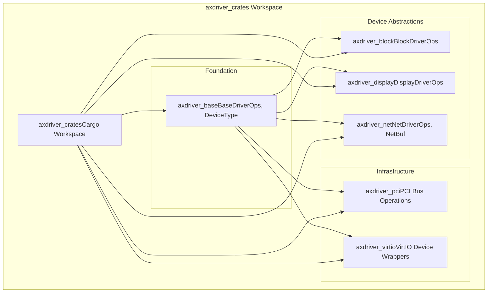
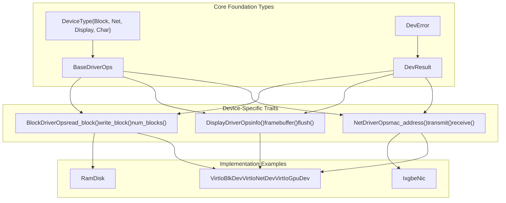
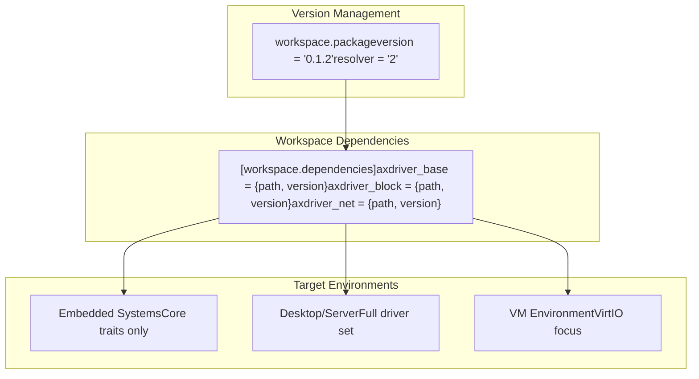

# Overview

> **Relevant source files**
> * [Cargo.toml](https://github.com/arceos-org/axdriver_crates/blob/84eb2170/Cargo.toml)
> * [README.md](https://github.com/arceos-org/axdriver_crates/blob/84eb2170/README.md)

## Purpose and Scope

The `axdriver_crates` repository provides a comprehensive device driver framework designed specifically for the ArceOS operating system in `no_std` environments. This workspace contains modular driver abstractions, concrete hardware implementations, and infrastructure components that enable unified device management across block storage, networking, graphics, and virtualized devices.

This document covers the overall workspace structure, architectural patterns, and relationships between the driver crates. For detailed information about specific driver interfaces, see [Foundation Layer (axdriver_base)](/arceos-org/axdriver_crates/3-foundation-layer-(axdriver_base)), [Network Drivers](/arceos-org/axdriver_crates/4-network-drivers), [Block Storage Drivers](/arceos-org/axdriver_crates/5-block-storage-drivers), [Display Drivers](/arceos-org/axdriver_crates/6-display-drivers), and [VirtIO Integration](/arceos-org/axdriver_crates/7-virtio-integration).

Sources: [Cargo.toml(L1 - L29)&emsp;](https://github.com/arceos-org/axdriver_crates/blob/84eb2170/Cargo.toml#L1-L29) [README.md(L1 - L11)&emsp;](https://github.com/arceos-org/axdriver_crates/blob/84eb2170/README.md#L1-L11)

## Workspace Architecture

The `axdriver_crates` workspace is organized as a hierarchical collection of six core crates, each serving distinct roles in the driver ecosystem:

### Workspace Crate Structure

Sources: [Cargo.toml(L4 - L11)&emsp;](https://github.com/arceos-org/axdriver_crates/blob/84eb2170/Cargo.toml#L4-L11) [README.md(L5 - L10)&emsp;](https://github.com/arceos-org/axdriver_crates/blob/84eb2170/README.md#L5-L10)

### Crate Dependencies and Responsibilities

|Crate|Primary Traits/Types|Purpose|
| --- | --- | --- |
|axdriver_base|BaseDriverOps,DeviceType,DevResult|Foundation interfaces and error handling|
|axdriver_block|BlockDriverOps|Block storage device abstractions|
|axdriver_net|NetDriverOps,NetBuf,EthernetAddress|Network device interfaces and buffer management|
|axdriver_display|DisplayDriverOps|Graphics and display device abstractions|
|axdriver_pci|PCI device enumeration|PCI bus operations and device discovery|
|axdriver_virtio|VirtIoBlkDev,VirtIoNetDev,VirtIoGpuDev|VirtIO device wrapper implementations|

Sources: [Cargo.toml(L22 - L28)&emsp;](https://github.com/arceos-org/axdriver_crates/blob/84eb2170/Cargo.toml#L22-L28) [README.md(L5 - L10)&emsp;](https://github.com/arceos-org/axdriver_crates/blob/84eb2170/README.md#L5-L10)

## Driver Framework Architecture

The framework implements a trait-based architecture where all drivers extend common base functionality while implementing device-specific operations:

### Trait Hierarchy and Implementation Pattern

Sources: [Cargo.toml(L22 - L28)&emsp;](https://github.com/arceos-org/axdriver_crates/blob/84eb2170/Cargo.toml#L22-L28) [README.md(L5 - L10)&emsp;](https://github.com/arceos-org/axdriver_crates/blob/84eb2170/README.md#L5-L10)

## Compilation and Feature Management

The workspace is designed for selective compilation through Cargo features, enabling minimal deployments for resource-constrained environments:

### Build Configuration Structure

The workspace uses Cargo resolver version 2 and maintains consistent versioning across all member crates at version `0.1.2`. Each crate can be compiled independently or as part of larger driver collections based on deployment requirements.

Sources: [Cargo.toml(L2)&emsp;](https://github.com/arceos-org/axdriver_crates/blob/84eb2170/Cargo.toml#L2-L2) [Cargo.toml(L13 - L14)&emsp;](https://github.com/arceos-org/axdriver_crates/blob/84eb2170/Cargo.toml#L13-L14) [Cargo.toml(L22 - L28)&emsp;](https://github.com/arceos-org/axdriver_crates/blob/84eb2170/Cargo.toml#L22-L28)

## Project Metadata and Licensing

The repository supports multiple licensing options (GPL-3.0-or-later, Apache-2.0, MulanPSL-2.0) and targets the categories `["os", "no-std", "hardware-support"]`, indicating its focus on operating system development in embedded and systems programming contexts.

Sources: [Cargo.toml(L13 - L21)&emsp;](https://github.com/arceos-org/axdriver_crates/blob/84eb2170/Cargo.toml#L13-L21)