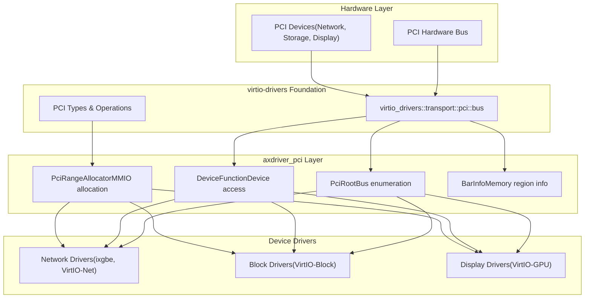
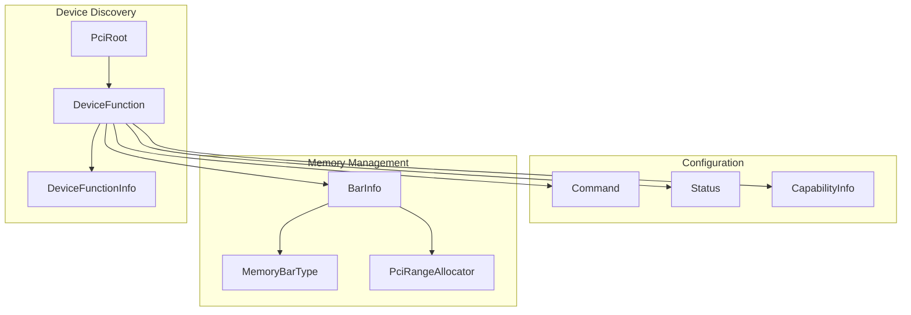
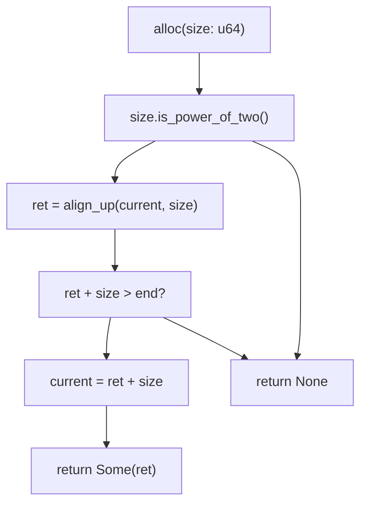
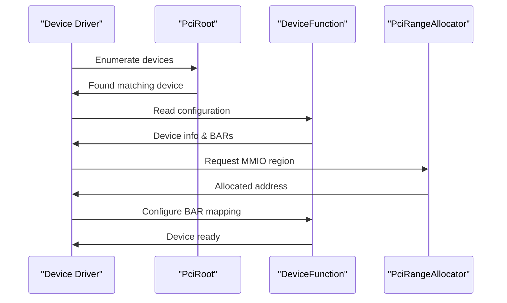

# PCI Bus Operations

> **Relevant source files**
> * [axdriver_pci/Cargo.toml](https://github.com/arceos-org/axdriver_crates/blob/84eb2170/axdriver_pci/Cargo.toml)
> * [axdriver_pci/src/lib.rs](https://github.com/arceos-org/axdriver_crates/blob/84eb2170/axdriver_pci/src/lib.rs)

This document covers the PCI (Peripheral Component Interconnect) bus operations provided by the `axdriver_pci` crate. This crate serves as a bridge between the ArceOS driver framework and PCI device discovery and management functionality. It provides the foundational infrastructure for PCI device enumeration, configuration space access, and memory-mapped I/O (MMIO) region allocation needed by hardware device drivers.

For information about specific device driver implementations that use PCI operations, see [Network Drivers](/arceos-org/axdriver_crates/4-network-drivers) and [Block Storage Drivers](/arceos-org/axdriver_crates/5-block-storage-drivers). For VirtIO device integration over PCI transport, see [VirtIO Integration](/arceos-org/axdriver_crates/7-virtio-integration).

## Architecture Overview

The PCI bus operations layer sits between the hardware abstraction and device-specific drivers, providing standardized access to PCI configuration and memory management.

**PCI Integration Architecture**



Sources: [axdriver_pci/src/lib.rs(L1 - L14)&emsp;](https://github.com/arceos-org/axdriver_crates/blob/84eb2170/axdriver_pci/src/lib.rs#L1-L14) [axdriver_pci/Cargo.toml(L14 - L15)&emsp;](https://github.com/arceos-org/axdriver_crates/blob/84eb2170/axdriver_pci/Cargo.toml#L14-L15)

## Core PCI Types and Operations

The `axdriver_pci` crate primarily re-exports essential PCI types from the `virtio-drivers` crate, providing a consistent interface for PCI device management across the ArceOS ecosystem.

### Device Discovery and Access

|Type|Purpose|Key Operations|
| --- | --- | --- |
|PciRoot|Root PCI bus controller|Device enumeration and scanning|
|DeviceFunction|Individual PCI device/function|Configuration space access|
|DeviceFunctionInfo|Device metadata|Vendor ID, device ID, class codes|
|CapabilityInfo|PCI capabilities|Extended feature discovery|

### Memory and I/O Management

|Type|Purpose|Usage|
| --- | --- | --- |
|BarInfo|Base Address Register info|Memory region mapping|
|MemoryBarType|Memory BAR classification|32-bit vs 64-bit addressing|
|Command|PCI command register|Bus mastering, memory enable|
|Status|PCI status register|Capability support, error status|

**PCI Type Relationships**



Sources: [axdriver_pci/src/lib.rs(L11 - L14)&emsp;](https://github.com/arceos-org/axdriver_crates/blob/84eb2170/axdriver_pci/src/lib.rs#L11-L14)

## MMIO Range Allocation

The `PciRangeAllocator` provides a custom memory allocation system specifically designed for PCI Base Address Register (BAR) allocation. This allocator ensures proper alignment and prevents memory region conflicts.

### Allocator Structure

The `PciRangeAllocator` maintains a simple linear allocation strategy:

```css
pub struct PciRangeAllocator {
    _start: u64,    // Base address of allocatable region
    end: u64,       // End boundary of allocatable region  
    current: u64,   // Current allocation pointer
}
```

### Allocation Algorithm

The allocator implements power-of-2 aligned allocation with the following constraints:

|Property|Requirement|Rationale|
| --- | --- | --- |
|Size alignment|Must be power of 2|PCI BAR size requirements|
|Address alignment|Multiple of size|Hardware addressing constraints|
|Boundary checking|Within allocated range|Memory safety|

**MMIO Allocation Flow**



### Usage Example

The typical allocation pattern for PCI BARs:

1. Create allocator with memory range: `PciRangeAllocator::new(base, size)`
2. Request aligned memory: `allocator.alloc(bar_size)`
3. Map returned address to device BAR

Sources: [axdriver_pci/src/lib.rs(L17 - L53)&emsp;](https://github.com/arceos-org/axdriver_crates/blob/84eb2170/axdriver_pci/src/lib.rs#L17-L53)

## Integration with Device Drivers

The PCI operations integrate with device drivers through standardized patterns for device discovery, configuration, and memory mapping.

### Typical Driver Integration Pattern



### Error Handling

PCI operations use the `PciError` type for consistent error reporting across device initialization and configuration operations.

Sources: [axdriver_pci/src/lib.rs(L11)&emsp;](https://github.com/arceos-org/axdriver_crates/blob/84eb2170/axdriver_pci/src/lib.rs#L11-L11)

## Dependencies and External Integration

The `axdriver_pci` crate builds upon the `virtio-drivers` crate version 0.7.4, specifically leveraging its PCI transport layer. This dependency provides:

* Low-level PCI configuration space access
* Standard PCI type definitions
* Cross-platform PCI hardware abstraction

The integration allows ArceOS drivers to benefit from the mature PCI implementation in `virtio-drivers` while maintaining the consistent ArceOS driver interface patterns.

Sources: [axdriver_pci/Cargo.toml(L15)&emsp;](https://github.com/arceos-org/axdriver_crates/blob/84eb2170/axdriver_pci/Cargo.toml#L15-L15) [axdriver_pci/src/lib.rs(L3 - L7)&emsp;](https://github.com/arceos-org/axdriver_crates/blob/84eb2170/axdriver_pci/src/lib.rs#L3-L7)