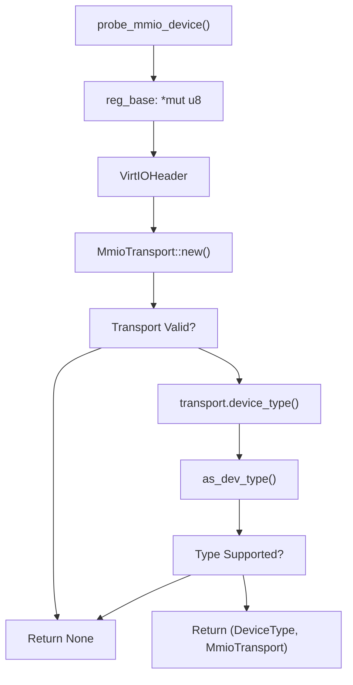
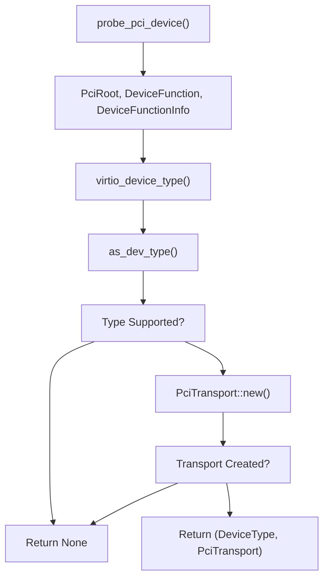
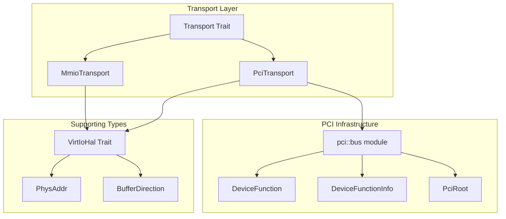
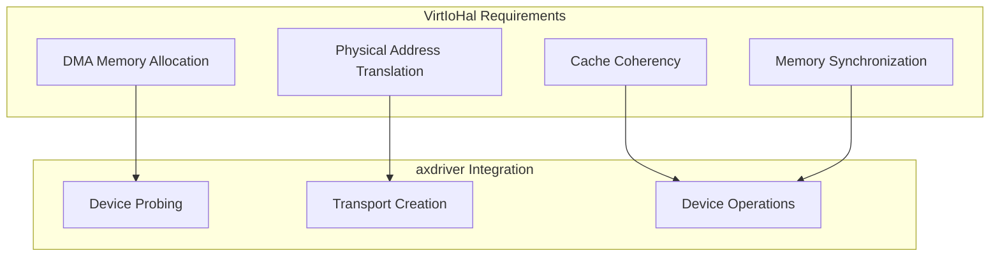

# VirtIO Core Abstraction

> **Relevant source files**
> * [axdriver_virtio/src/lib.rs](https://github.com/arceos-org/axdriver_crates/blob/84eb2170/axdriver_virtio/src/lib.rs)

This document covers the core abstraction layer that bridges the external `virtio-drivers` crate with the axdriver ecosystem. It focuses on device probing mechanisms, type conversion, error handling, and the fundamental infrastructure that enables VirtIO device integration. For information about specific VirtIO device implementations (block, network, GPU), see [VirtIO Device Implementations](/arceos-org/axdriver_crates/7.2-virtio-device-implementations).

## Overview

The VirtIO core abstraction in `axdriver_virtio` serves as an adapter layer that translates between the `virtio-drivers` crate's interfaces and the standardized axdriver trait system. This layer handles device discovery, type mapping, and error conversion while maintaining compatibility with both MMIO and PCI transport mechanisms.

**Sources:** [axdriver_virtio/src/lib.rs(L1 - L98)&emsp;](https://github.com/arceos-org/axdriver_crates/blob/84eb2170/axdriver_virtio/src/lib.rs#L1-L98)

## Device Probing Architecture

The VirtIO subsystem provides two primary device probing mechanisms that support different hardware configurations and virtualization environments.

### MMIO Device Probing



The `probe_mmio_device` function creates a VirtIO MMIO transport from a memory-mapped region and identifies the device type. It validates the VirtIO header structure and extracts device type information for compatibility checking.

**Sources:** [axdriver_virtio/src/lib.rs(L38 - L53)&emsp;](https://github.com/arceos-org/axdriver_crates/blob/84eb2170/axdriver_virtio/src/lib.rs#L38-L53)

### PCI Device Probing



The `probe_pci_device` function handles PCI-based VirtIO devices using the PCI bus infrastructure. It requires a HAL implementation for DMA operations and device access.

**Sources:** [axdriver_virtio/src/lib.rs(L55 - L69)&emsp;](https://github.com/arceos-org/axdriver_crates/blob/84eb2170/axdriver_virtio/src/lib.rs#L55-L69)

## Type Conversion System

The core abstraction implements bidirectional type mapping between the `virtio-drivers` crate and the axdriver ecosystem.

### Device Type Mapping

|VirtIO Device Type|axdriver Device Type|Support Status|
| --- | --- | --- |
|VirtIoDevType::Block|DeviceType::Block|✓ Supported|
|VirtIoDevType::Network|DeviceType::Net|✓ Supported|
|VirtIoDevType::GPU|DeviceType::Display|✓ Supported|
|Other types|None|Not supported|

```mermaid
flowchart TD
subgraph axdriver_base["axdriver_base"]
    AB["DeviceType::Block"]
    AN["DeviceType::Net"]
    AD["DeviceType::Display"]
    NONE["None"]
end
subgraph as_dev_type()["as_dev_type()"]
    CONV["Type Conversion"]
end
subgraph virtio_drivers["virtio_drivers"]
    VB["VirtIoDevType::Block"]
    VN["VirtIoDevType::Network"]
    VG["VirtIoDevType::GPU"]
    VO["Other Types"]
end

CONV --> AB
CONV --> AD
CONV --> AN
CONV --> NONE
VB --> CONV
VG --> CONV
VN --> CONV
VO --> CONV
```

The `as_dev_type` function provides compile-time type conversion that filters supported VirtIO device types and maps them to corresponding axdriver types.

**Sources:** [axdriver_virtio/src/lib.rs(L71 - L79)&emsp;](https://github.com/arceos-org/axdriver_crates/blob/84eb2170/axdriver_virtio/src/lib.rs#L71-L79)

## Error Handling Bridge

The abstraction layer provides comprehensive error conversion between VirtIO-specific errors and the standardized axdriver error types.

### Error Mapping Table

|VirtIO Error|axdriver DevError|Description|
| --- | --- | --- |
|QueueFull|BadState|Device queue at capacity|
|NotReady|Again|Device not ready, retry later|
|WrongToken|BadState|Invalid operation token|
|AlreadyUsed|AlreadyExists|Resource already in use|
|InvalidParam|InvalidParam|Invalid parameter provided|
|DmaError|NoMemory|DMA allocation failure|
|IoError|Io|I/O operation failure|
|Unsupported|Unsupported|Unsupported operation|
|ConfigSpaceTooSmall|BadState|Insufficient config space|
|ConfigSpaceMissing|BadState|Missing config space|
|Default|BadState|Generic error state|

```mermaid
flowchart TD
subgraph axdriver_base::DevError["axdriver_base::DevError"]
    DE1["BadState"]
    DE2["Again"]
    DE3["NoMemory"]
    DE4["Io"]
    DE5["Unsupported"]
end
subgraph as_dev_err()["as_dev_err()"]
    ECONVERT["Error Conversion"]
end
subgraph virtio_drivers::Error["virtio_drivers::Error"]
    VE1["QueueFull"]
    VE2["NotReady"]
    VE3["DmaError"]
    VE4["IoError"]
    VE5["Unsupported"]
    VEX["Others..."]
end

ECONVERT --> DE1
ECONVERT --> DE2
ECONVERT --> DE3
ECONVERT --> DE4
ECONVERT --> DE5
VE1 --> ECONVERT
VE2 --> ECONVERT
VE3 --> ECONVERT
VE4 --> ECONVERT
VE5 --> ECONVERT
VEX --> ECONVERT
```

The `as_dev_err` function provides semantic mapping of VirtIO errors to axdriver error categories, enabling consistent error handling across the driver ecosystem.

**Sources:** [axdriver_virtio/src/lib.rs(L81 - L97)&emsp;](https://github.com/arceos-org/axdriver_crates/blob/84eb2170/axdriver_virtio/src/lib.rs#L81-L97)

## Transport Abstraction Layer

The VirtIO core abstraction re-exports key transport components from the `virtio-drivers` crate, providing a unified interface for different VirtIO transport mechanisms.

### Core Transport Types



The transport abstraction provides:

* **Transport Trait**: Common interface for device communication
* **MmioTransport**: Memory-mapped I/O transport for embedded systems
* **PciTransport**: PCI bus transport for conventional systems
* **VirtIoHal**: Hardware abstraction layer for memory management
* **PCI Infrastructure**: Bus enumeration and device management

**Sources:** [axdriver_virtio/src/lib.rs(L30 - L36)&emsp;](https://github.com/arceos-org/axdriver_crates/blob/84eb2170/axdriver_virtio/src/lib.rs#L30-L36)

## HAL Requirements

The VirtIO integration requires implementation of the `VirtIoHal` trait for hardware-specific operations:



The HAL implementation must provide memory management capabilities that bridge between the host system's memory management and VirtIO device requirements.

**Sources:** [axdriver_virtio/src/lib.rs(L4 - L7)&emsp;](https://github.com/arceos-org/axdriver_crates/blob/84eb2170/axdriver_virtio/src/lib.rs#L4-L7)

## Conditional Compilation Support

The VirtIO core abstraction supports selective compilation through feature flags:

|Feature|Purpose|
| --- | --- |
|block|Enable VirtIO block device support|
|net|Enable VirtIO network device support|
|gpu|Enable VirtIO GPU device support|

This design allows minimal binary size by including only required device types while maintaining the same core probing and abstraction infrastructure.

**Sources:** [axdriver_virtio/src/lib.rs(L16 - L28)&emsp;](https://github.com/arceos-org/axdriver_crates/blob/84eb2170/axdriver_virtio/src/lib.rs#L16-L28)