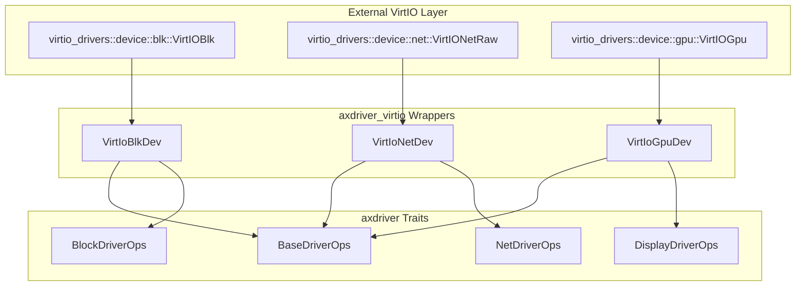
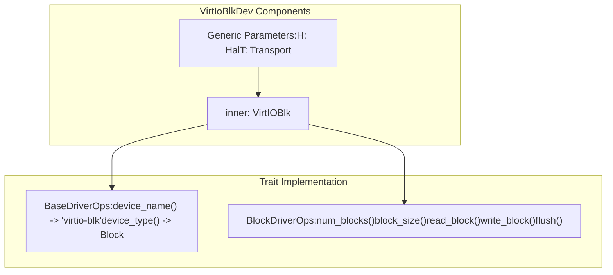
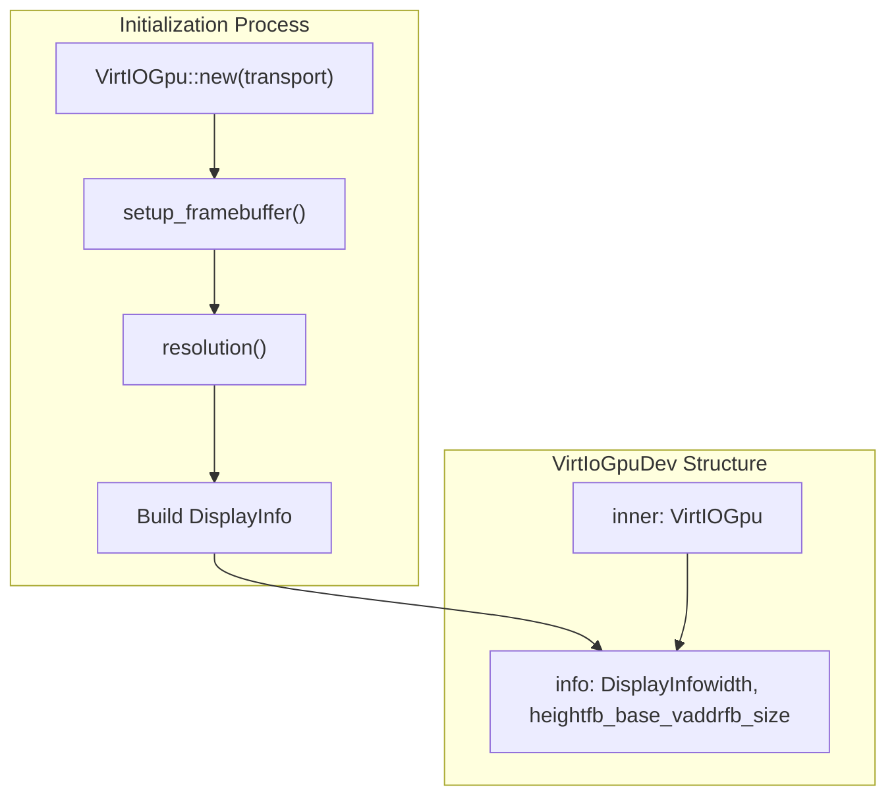
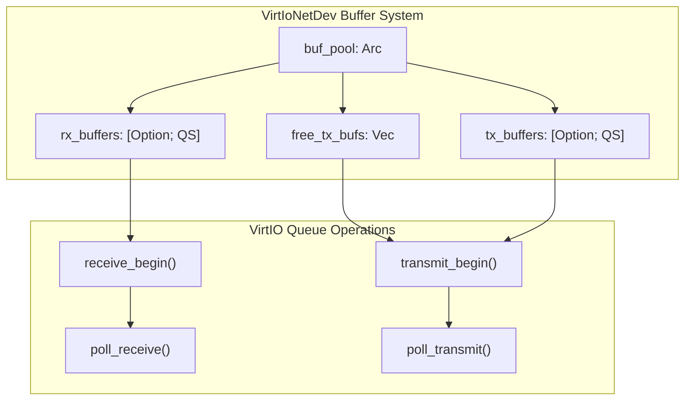
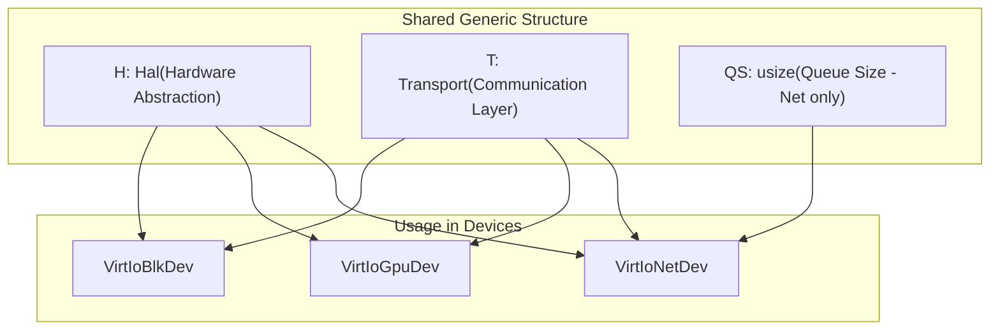

# VirtIO Device Implementations

> **Relevant source files**
> * [axdriver_virtio/src/blk.rs](https://github.com/arceos-org/axdriver_crates/blob/84eb2170/axdriver_virtio/src/blk.rs)
> * [axdriver_virtio/src/gpu.rs](https://github.com/arceos-org/axdriver_crates/blob/84eb2170/axdriver_virtio/src/gpu.rs)
> * [axdriver_virtio/src/net.rs](https://github.com/arceos-org/axdriver_crates/blob/84eb2170/axdriver_virtio/src/net.rs)

This page documents the specific VirtIO device wrapper implementations that provide ArceOS-compatible drivers for virtualized hardware. These implementations bridge the external `virtio_drivers` crate with the axdriver trait system, enabling VirtIO devices to be used seamlessly alongside native hardware drivers.

For information about the core VirtIO abstraction layer and device probing mechanisms, see [VirtIO Core Abstraction](/arceos-org/axdriver_crates/7.1-virtio-core-abstraction). For details about the underlying device traits these implementations fulfill, see [Foundation Layer](/arceos-org/axdriver_crates/3-foundation-layer-(axdriver_base)), [Network Driver Interface](/arceos-org/axdriver_crates/4.1-network-driver-interface), [Block Driver Interface](/arceos-org/axdriver_crates/5.1-block-driver-interface), and [Display Drivers](/arceos-org/axdriver_crates/6-display-drivers).

## VirtIO Device Architecture Overview

The axdriver_virtio crate provides three main device wrapper implementations that adapt VirtIO devices to the axdriver trait system:



**Sources:** [axdriver_virtio/src/blk.rs(L1 - L61)&emsp;](https://github.com/arceos-org/axdriver_crates/blob/84eb2170/axdriver_virtio/src/blk.rs#L1-L61) [axdriver_virtio/src/net.rs(L1 - L194)&emsp;](https://github.com/arceos-org/axdriver_crates/blob/84eb2170/axdriver_virtio/src/net.rs#L1-L194) [axdriver_virtio/src/gpu.rs(L1 - L71)&emsp;](https://github.com/arceos-org/axdriver_crates/blob/84eb2170/axdriver_virtio/src/gpu.rs#L1-L71)

## VirtIO Block Device Implementation

The `VirtIoBlkDev` provides block storage functionality through VirtIO's block device interface.

### Structure and Initialization



The block device implementation is straightforward, directly delegating most operations to the underlying VirtIO block device:

|Method|Implementation|Purpose|
| --- | --- | --- |
|try_new()|CreatesVirtIOBlk::new(transport)|Device initialization|
|num_blocks()|Returnsinner.capacity()|Total device capacity|
|block_size()|ReturnsSECTOR_SIZEconstant|Fixed 512-byte sectors|
|read_block()|Callsinner.read_blocks()|Synchronous block reads|
|write_block()|Callsinner.write_blocks()|Synchronous block writes|
|flush()|No-op returningOk(())|VirtIO handles consistency|

**Sources:** [axdriver_virtio/src/blk.rs(L7 - L22)&emsp;](https://github.com/arceos-org/axdriver_crates/blob/84eb2170/axdriver_virtio/src/blk.rs#L7-L22) [axdriver_virtio/src/blk.rs(L34 - L60)&emsp;](https://github.com/arceos-org/axdriver_crates/blob/84eb2170/axdriver_virtio/src/blk.rs#L34-L60)

## VirtIO GPU Device Implementation

The `VirtIoGpuDev` provides display and graphics functionality with framebuffer management.

### Structure and Framebuffer Setup



The GPU device performs complex initialization to establish the framebuffer:

1. **Device Creation**: Initialize the underlying VirtIO GPU device
2. **Framebuffer Setup**: Call `setup_framebuffer()` to allocate GPU memory
3. **Resolution Query**: Get device capabilities for width and height
4. **Info Structure**: Build `DisplayInfo` with framebuffer details

The `DisplayInfo` structure contains:

* `width`, `height`: Display resolution
* `fb_base_vaddr`: Virtual address of framebuffer memory
* `fb_size`: Total framebuffer size in bytes

**Sources:** [axdriver_virtio/src/gpu.rs(L17 - L40)&emsp;](https://github.com/arceos-org/axdriver_crates/blob/84eb2170/axdriver_virtio/src/gpu.rs#L17-L40) [axdriver_virtio/src/gpu.rs(L52 - L70)&emsp;](https://github.com/arceos-org/axdriver_crates/blob/84eb2170/axdriver_virtio/src/gpu.rs#L52-L70)

## VirtIO Network Device Implementation

The `VirtIoNetDev` is the most complex VirtIO implementation, featuring sophisticated buffer management for high-performance networking.

### Buffer Management Architecture



### Network Device Initialization Process

The network device initialization involves three main phases:

1. **RX Buffer Pre-allocation**: Fill all `QS` receive buffer slots

```python
- Allocate NetBufBox from pool
- Call receive_begin() with buffer
- Store buffer in rx_buffers[token]
```
2. **TX Buffer Preparation**: Pre-allocate transmit buffers with headers

```python
- Allocate NetBufBox from pool  
- Fill VirtIO header using fill_buffer_header()
- Store in free_tx_bufs for later use
```
3. **Pool Management**: Initialize `NetBufPool` with `2 * QS` total buffers

### Network Operations Flow

|Operation|Buffer Flow|Queue Interaction|
| --- | --- | --- |
|Transmit|free_tx_bufs.pop()→tx_buffers[token]|transmit_begin()returns token|
|Receive|rx_buffers[token].take()→ return to caller|poll_receive()returns token|
|TX Recycle|tx_buffers[token].take()→free_tx_bufs.push()|poll_transmit()+transmit_complete()|
|RX Recycle|Caller returns →rx_buffers[token]|receive_begin()with recycled buffer|

**Sources:** [axdriver_virtio/src/net.rs(L14 - L73)&emsp;](https://github.com/arceos-org/axdriver_crates/blob/84eb2170/axdriver_virtio/src/net.rs#L14-L73) [axdriver_virtio/src/net.rs(L85 - L193)&emsp;](https://github.com/arceos-org/axdriver_crates/blob/84eb2170/axdriver_virtio/src/net.rs#L85-L193)

## Common Implementation Patterns

All VirtIO device implementations follow consistent architectural patterns:

### Generic Type Parameters



### Trait Implementation Pattern

Each device implements the same trait hierarchy:

|Trait|Block Device|GPU Device|Network Device|
| --- | --- | --- | --- |
|BaseDriverOps|✓ "virtio-blk"|✓ "virtio-gpu"|✓ "virtio-net"|
|Device-specific|BlockDriverOps|DisplayDriverOps|NetDriverOps|
|Thread Safety|Send + Sync|Send + Sync|Send + Sync|

### Error Handling Convention

All implementations use the `as_dev_err` function to convert VirtIO-specific errors to `DevError` types, providing consistent error handling across the driver framework.

**Sources:** [axdriver_virtio/src/blk.rs(L24 - L32)&emsp;](https://github.com/arceos-org/axdriver_crates/blob/84eb2170/axdriver_virtio/src/blk.rs#L24-L32) [axdriver_virtio/src/gpu.rs(L42 - L50)&emsp;](https://github.com/arceos-org/axdriver_crates/blob/84eb2170/axdriver_virtio/src/gpu.rs#L42-L50) [axdriver_virtio/src/net.rs(L75 - L83)&emsp;](https://github.com/arceos-org/axdriver_crates/blob/84eb2170/axdriver_virtio/src/net.rs#L75-L83)