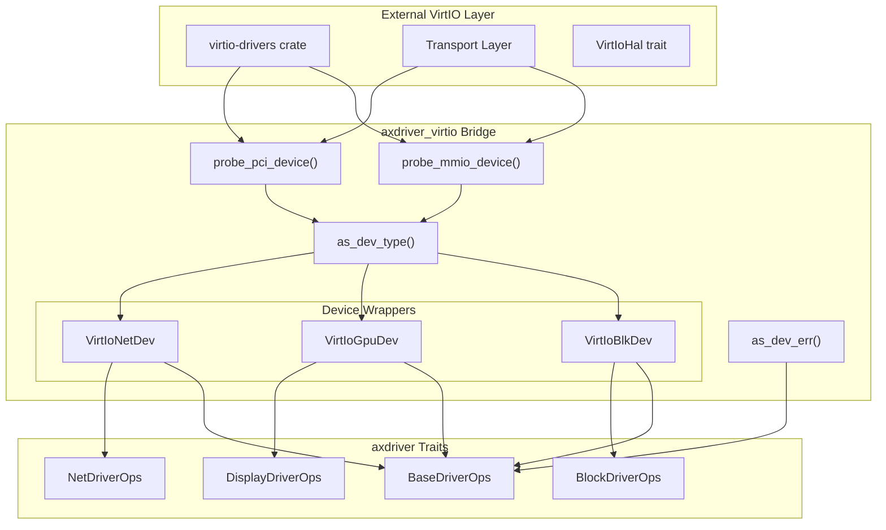
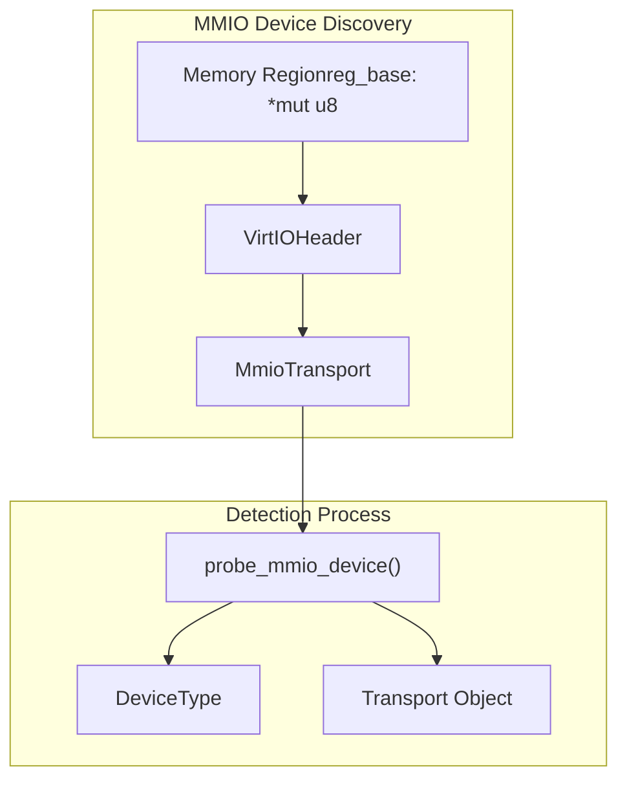
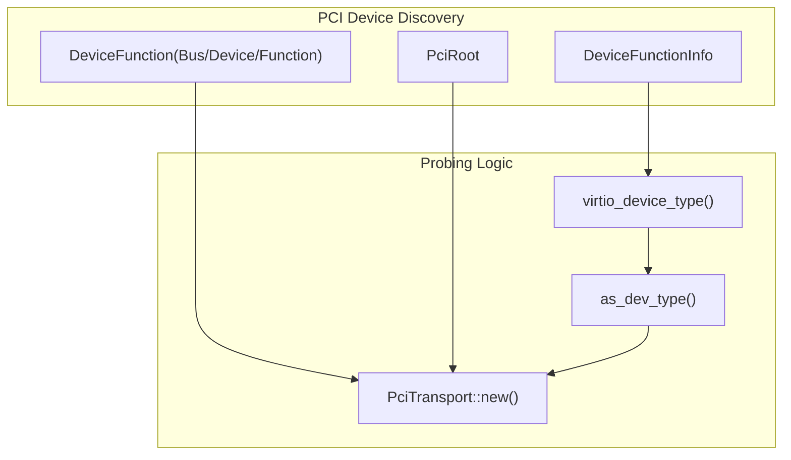
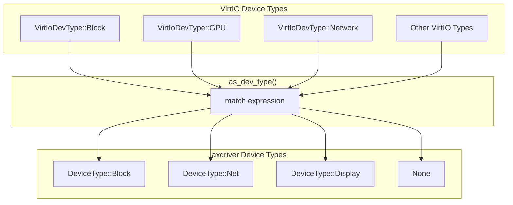
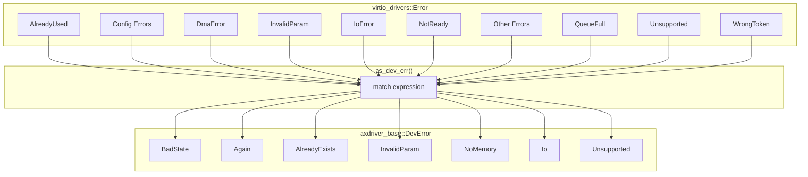
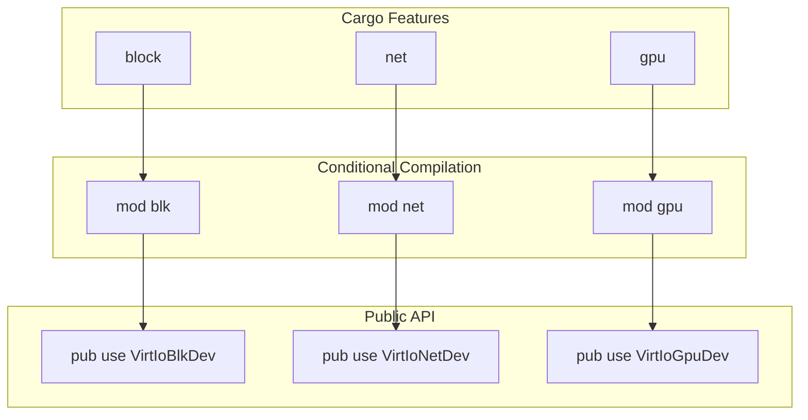

# VirtIO Integration

> **Relevant source files**
> * [axdriver_virtio/Cargo.toml](https://github.com/arceos-org/axdriver_crates/blob/84eb2170/axdriver_virtio/Cargo.toml)
> * [axdriver_virtio/src/lib.rs](https://github.com/arceos-org/axdriver_crates/blob/84eb2170/axdriver_virtio/src/lib.rs)

The VirtIO integration layer provides a bridge between the external `virtio-drivers` crate and the axdriver framework, enabling virtualized hardware devices to be accessed through the same standardized interfaces as physical hardware. This integration allows ArceOS to run efficiently in virtualized environments while maintaining consistent driver APIs.

For information about the underlying driver traits that VirtIO devices implement, see [Foundation Layer (axdriver_base)](/arceos-org/axdriver_crates/3-foundation-layer-(axdriver_base)). For details on specific device type implementations, see [Network Drivers](/arceos-org/axdriver_crates/4-network-drivers), [Block Storage Drivers](/arceos-org/axdriver_crates/5-block-storage-drivers), and [Display Drivers](/arceos-org/axdriver_crates/6-display-drivers).

## Architecture Overview

The VirtIO integration follows an adapter pattern that wraps `virtio-drivers` device implementations to conform to the axdriver trait system. This design allows the same application code to work with both physical and virtualized hardware.

**Sources:** [axdriver_virtio/src/lib.rs(L1 - L98)&emsp;](https://github.com/arceos-org/axdriver_crates/blob/84eb2170/axdriver_virtio/src/lib.rs#L1-L98)

## Transport Layer Support

The VirtIO integration supports both MMIO and PCI transport mechanisms, providing flexibility for different virtualization platforms and hardware configurations.

### MMIO Transport

The `probe_mmio_device` function discovers VirtIO devices mapped into memory regions, commonly used in embedded virtualization scenarios.

The function performs device validation and type identification:

|Step|Operation|Result|
| --- | --- | --- |
|1|CreateNonNull<VirtIOHeader>from memory base|Header pointer validation|
|2|InitializeMmioTransport|Transport layer setup|
|3|Callas_dev_type()on device type|Convert toDeviceType|
|4|Return tuple|(DeviceType, MmioTransport)|

**Sources:** [axdriver_virtio/src/lib.rs(L38 - L53)&emsp;](https://github.com/arceos-org/axdriver_crates/blob/84eb2170/axdriver_virtio/src/lib.rs#L38-L53)

### PCI Transport

The `probe_pci_device` function discovers VirtIO devices on the PCI bus, typical for desktop and server virtualization environments.

**Sources:** [axdriver_virtio/src/lib.rs(L55 - L69)&emsp;](https://github.com/arceos-org/axdriver_crates/blob/84eb2170/axdriver_virtio/src/lib.rs#L55-L69)

## Device Type Mapping

The integration includes a comprehensive type conversion system that maps VirtIO device types to axdriver device categories.

### Type Conversion Function

The `as_dev_type` function provides the core mapping between VirtIO and axdriver type systems:

|VirtIO Type|axdriver Type|Purpose|
| --- | --- | --- |
|Block|DeviceType::Block|Storage devices|
|Network|DeviceType::Net|Network interfaces|
|GPU|DeviceType::Display|Graphics and display|
|Other|None|Unsupported device types|

**Sources:** [axdriver_virtio/src/lib.rs(L71 - L79)&emsp;](https://github.com/arceos-org/axdriver_crates/blob/84eb2170/axdriver_virtio/src/lib.rs#L71-L79)

## Error Handling Integration

The VirtIO integration includes comprehensive error mapping to ensure consistent error handling across the driver framework.

### Error Conversion System

The `as_dev_err` function maps `virtio_drivers::Error` variants to `axdriver_base::DevError` types:

**Sources:** [axdriver_virtio/src/lib.rs(L81 - L97)&emsp;](https://github.com/arceos-org/axdriver_crates/blob/84eb2170/axdriver_virtio/src/lib.rs#L81-L97)

## Feature-Based Compilation

The VirtIO integration uses feature flags to enable selective compilation of device types, allowing minimal builds for specific deployment scenarios.

### Feature Configuration

|Feature|Dependencies|Enabled Components|
| --- | --- | --- |
|block|axdriver_block|VirtIoBlkDevwrapper|
|net|axdriver_net|VirtIoNetDevwrapper|
|gpu|axdriver_display|VirtIoGpuDevwrapper|

**Sources:** [axdriver_virtio/Cargo.toml(L14 - L24)&emsp;](https://github.com/arceos-org/axdriver_crates/blob/84eb2170/axdriver_virtio/Cargo.toml#L14-L24) [axdriver_virtio/src/lib.rs(L16 - L28)&emsp;](https://github.com/arceos-org/axdriver_crates/blob/84eb2170/axdriver_virtio/src/lib.rs#L16-L28)

## Public API Surface

The crate re-exports essential VirtIO components to provide a complete integration interface:

### Core Re-exports

|Export|Source|Purpose|
| --- | --- | --- |
|pci|virtio_drivers::transport::pci::bus|PCI bus operations|
|MmioTransport|virtio_drivers::transport::mmio|MMIO transport|
|PciTransport|virtio_drivers::transport::pci|PCI transport|
|VirtIoHal|virtio_drivers::Hal|Hardware abstraction trait|
|PhysAddr|virtio_drivers::PhysAddr|Physical address type|
|BufferDirection|virtio_drivers::BufferDirection|DMA buffer direction|

**Sources:** [axdriver_virtio/src/lib.rs(L30 - L36)&emsp;](https://github.com/arceos-org/axdriver_crates/blob/84eb2170/axdriver_virtio/src/lib.rs#L30-L36)