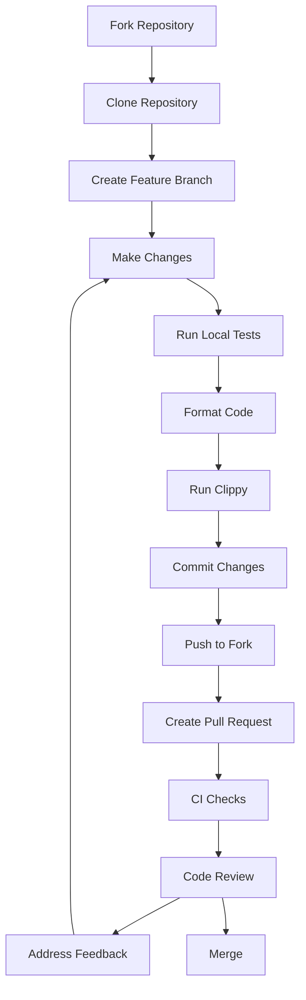
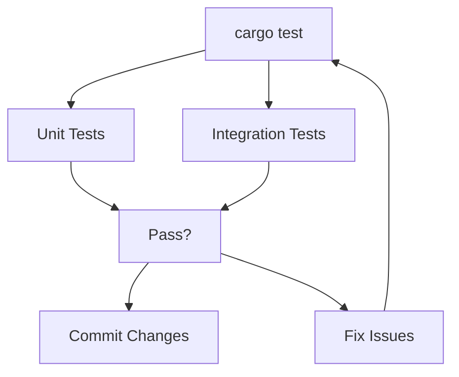
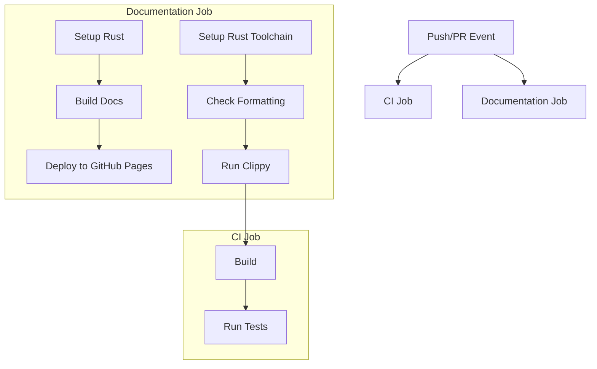

# Development and Contribution

> **Relevant source files**
> * [.github/workflows/ci.yml](https://github.com/arceos-org/axfs_crates/blob/0b21a163/.github/workflows/ci.yml)
> * [.gitignore](https://github.com/arceos-org/axfs_crates/blob/0b21a163/.gitignore)

This document outlines the development workflow, testing processes, and continuous integration setup for the AxFS crates project. It provides guidance for contributors on how to set up their development environment, run tests, and ensure their contributions meet the project's quality standards. For information about the repository structure, see [Repository Structure](/arceos-org/axfs_crates/1.1-repository-structure).

## Development Environment Setup

To begin contributing to the AxFS crates project, you'll need to set up your development environment with the following prerequisites:

* Rust toolchain (nightly version required)
* Rust source components, Clippy, and rustfmt
* Git for version control

### Installing Prerequisites

1. **Install Rust (nightly)** - The project requires the nightly toolchain:

```
curl --proto '=https' --tlsv1.2 -sSf https://sh.rustup.rs | sh
rustup default nightly
rustup component add rust-src clippy rustfmt
```
2. **Add target platforms** - The project supports multiple targets:

```
rustup target add x86_64-unknown-linux-gnu
rustup target add x86_64-unknown-none
rustup target add riscv64gc-unknown-none-elf
rustup target add aarch64-unknown-none-softfloat
```
3. **Clone the repository**:

```
git clone https://github.com/arceos-org/axfs_crates.git
cd axfs_crates
```

Sources: [.github/workflows/ci.yml(L14 - L19)&emsp;](https://github.com/arceos-org/axfs_crates/blob/0b21a163/.github/workflows/ci.yml#L14-L19)

## Development Workflow

The typical development workflow for contributing to AxFS crates follows these steps:



**Diagram: AxFS Crates Development Workflow**

Sources: [.github/workflows/ci.yml(L3 - L30)&emsp;](https://github.com/arceos-org/axfs_crates/blob/0b21a163/.github/workflows/ci.yml#L3-L30)

### Coding Standards

When contributing to the project, ensure you follow these coding standards:

1. All code must be formatted with `rustfmt`
2. Code must pass Clippy linting with no warnings (with the exception of `clippy::new_without_default`)
3. All code must compile for all supported targets
4. New functionality should include appropriate tests

You can check your code against these standards with:

```
cargo fmt --all
cargo clippy --all-features -- -A clippy::new_without_default
```

Sources: [.github/workflows/ci.yml(L22 - L25)&emsp;](https://github.com/arceos-org/axfs_crates/blob/0b21a163/.github/workflows/ci.yml#L22-L25)

## Testing

The project uses Rust's built-in testing framework. Testing processes include:

1. **Unit Tests**: Tests for individual components
2. **Integration Tests**: Tests that verify the interaction between different parts

### Running Tests

To run all tests locally:

```
cargo test --all-features -- --nocapture
```

Note that comprehensive tests only run on the `x86_64-unknown-linux-gnu` target in the CI pipeline, but you should verify functionality on other targets as appropriate for your changes.



**Diagram: AxFS Testing Process**

Sources: [.github/workflows/ci.yml(L28 - L30)&emsp;](https://github.com/arceos-org/axfs_crates/blob/0b21a163/.github/workflows/ci.yml#L28-L30)

## Continuous Integration

The project uses GitHub Actions for continuous integration. The CI pipeline is triggered on both push and pull request events and consists of two main jobs: code validation and documentation building.

### CI Pipeline Architecture



**Diagram: AxFS Continuous Integration Architecture**

Sources: [.github/workflows/ci.yml(L5 - L53)&emsp;](https://github.com/arceos-org/axfs_crates/blob/0b21a163/.github/workflows/ci.yml#L5-L53)

### CI Environments and Targets

The CI pipeline tests across multiple Rust targets to ensure cross-platform compatibility:

|Target|Description|
| --- | --- |
|x86_64-unknown-linux-gnu|Standard Linux target|
|x86_64-unknown-none|Bare-metal x86_64|
|riscv64gc-unknown-none-elf|RISC-V 64-bit|
|aarch64-unknown-none-softfloat|ARM 64-bit without floating point|

Sources: [.github/workflows/ci.yml(L12)&emsp;](https://github.com/arceos-org/axfs_crates/blob/0b21a163/.github/workflows/ci.yml#L12-L12)

## Documentation

### Documentation Standards

The project enforces strict documentation standards:

1. All public items must be documented
2. Documentation must not contain broken intra-doc links
3. The documentation is generated with a unified index page

These standards are enforced by the `RUSTDOCFLAGS` environment variable set in the CI workflow:

```
-Zunstable-options --enable-index-page -D rustdoc::broken_intra_doc_links -D missing-docs
```

Sources: [.github/workflows/ci.yml(L40)&emsp;](https://github.com/arceos-org/axfs_crates/blob/0b21a163/.github/workflows/ci.yml#L40-L40)

### Generating Documentation

To generate documentation locally:

```
RUSTDOCFLAGS="-Zunstable-options --enable-index-page -D rustdoc::broken_intra_doc_links -D missing-docs" cargo doc --no-deps --all-features
```

The documentation is automatically built and deployed to GitHub Pages when changes are pushed to the default branch.

Sources: [.github/workflows/ci.yml(L42 - L53)&emsp;](https://github.com/arceos-org/axfs_crates/blob/0b21a163/.github/workflows/ci.yml#L42-L53)

## Contribution Guidelines

### Pull Request Process

1. Fork the repository and create your branch from the default branch
2. Ensure your code follows the project's coding standards
3. Make sure all tests pass locally
4. Update documentation as needed
5. Submit a pull request
6. Address any feedback from reviewers

### Code Review

All contributions undergo code review before being merged. The review process checks:

1. Code quality and adherence to project standards
2. Test coverage
3. Documentation completeness
4. Design consistency

Once a pull request passes CI checks and receives approval from maintainers, it can be merged into the main codebase.

Sources: [.github/workflows/ci.yml(L3 - L30)&emsp;](https://github.com/arceos-org/axfs_crates/blob/0b21a163/.github/workflows/ci.yml#L3-L30)

## Project Structure Reference

To understand how your contributions fit into the overall project structure, refer to the repository structure and codebase architecture information in the [Overview](/arceos-org/axfs_crates/1-overview) and [Repository Structure](/arceos-org/axfs_crates/1.1-repository-structure) pages.