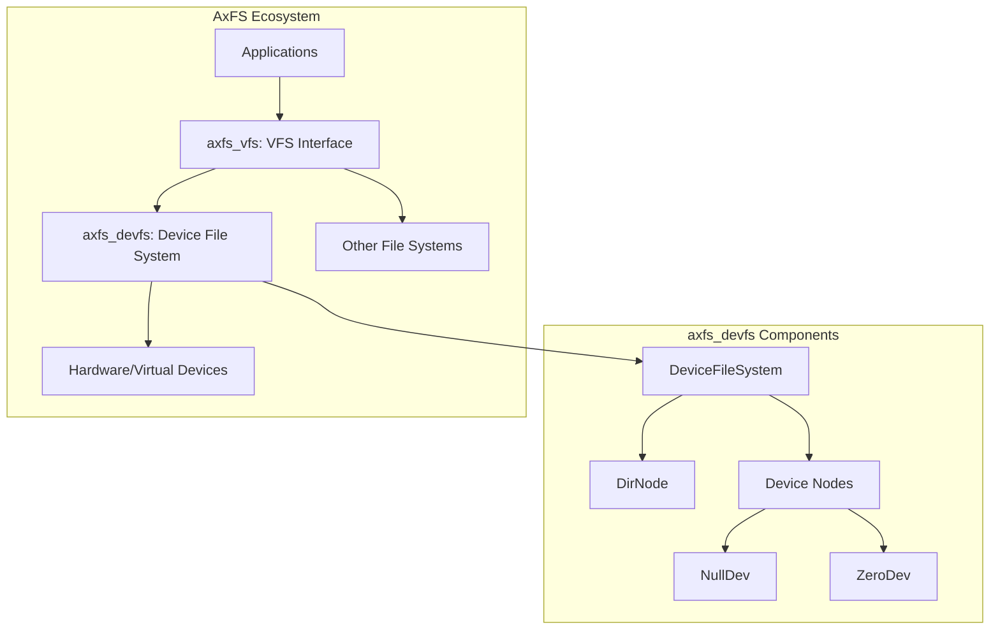
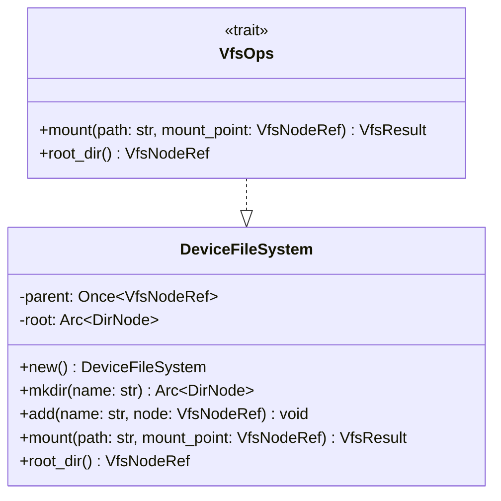
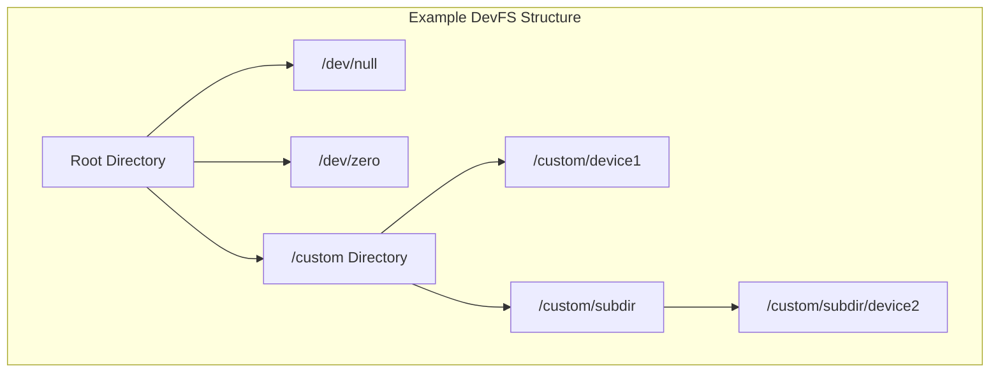
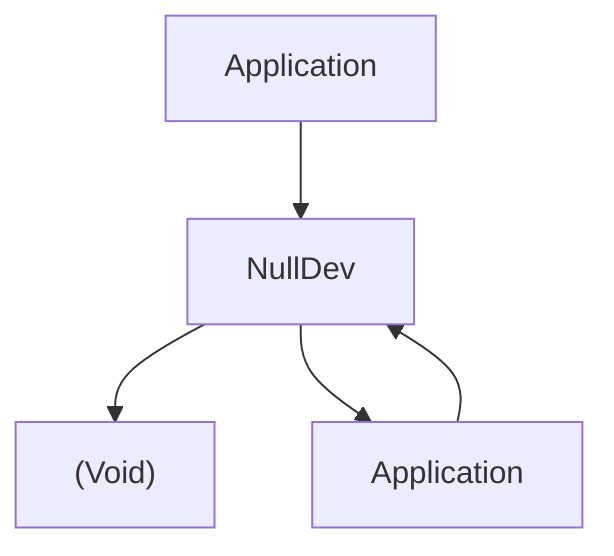
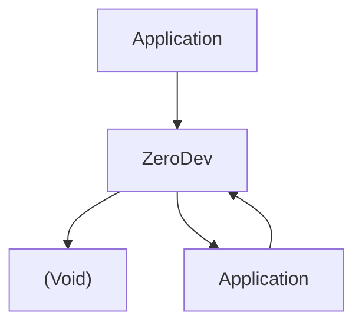
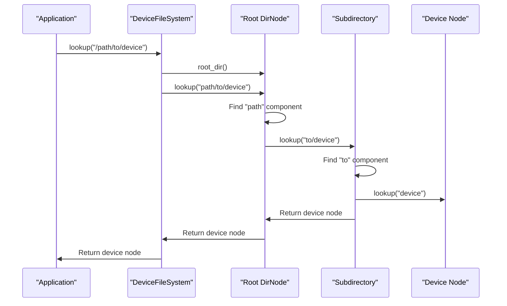
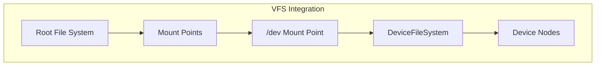

# Device File System (axfs_devfs)

> **Relevant source files**
> * [axfs_devfs/Cargo.toml](https://github.com/arceos-org/axfs_crates/blob/0b21a163/axfs_devfs/Cargo.toml)
> * [axfs_devfs/README.md](https://github.com/arceos-org/axfs_crates/blob/0b21a163/axfs_devfs/README.md)
> * [axfs_devfs/src/lib.rs](https://github.com/arceos-org/axfs_crates/blob/0b21a163/axfs_devfs/src/lib.rs)

## Purpose and Scope

The Device File System (axfs_devfs) is a specialized file system implementation for managing access to device files within the ArceOS operating system. It provides a hierarchical structure for organizing and accessing device files, similar to the `/dev` directory in Unix-like systems. This document covers the architecture, components, and usage of axfs_devfs.

For information about the underlying virtual file system interface that axfs_devfs implements, see [Virtual File System Interface (axfs_vfs)](/arceos-org/axfs_crates/2.1-virtual-file-system-interface-(axfs_vfs)).

Sources: [axfs_devfs/Cargo.toml(L1 - L18)&emsp;](https://github.com/arceos-org/axfs_crates/blob/0b21a163/axfs_devfs/Cargo.toml#L1-L18) [axfs_devfs/README.md(L1 - L10)&emsp;](https://github.com/arceos-org/axfs_crates/blob/0b21a163/axfs_devfs/README.md#L1-L10) [axfs_devfs/src/lib.rs(L1 - L4)&emsp;](https://github.com/arceos-org/axfs_crates/blob/0b21a163/axfs_devfs/src/lib.rs#L1-L4)

## System Overview

The Device File System is built on the Virtual File System (VFS) abstraction layer provided by axfs_vfs. It implements the core VFS interfaces and provides a directory structure for organizing device nodes. The primary purpose is to expose hardware and virtual devices through a file-like interface.



Sources: [axfs_devfs/src/lib.rs(L1 - L71)&emsp;](https://github.com/arceos-org/axfs_crates/blob/0b21a163/axfs_devfs/src/lib.rs#L1-L71)

## Core Components

### DeviceFileSystem

The `DeviceFileSystem` is the main entry point for the device file system. It implements the `VfsOps` trait from axfs_vfs, which provides the core file system operations.



Key features of the `DeviceFileSystem`:

* Maintains a root directory node
* Provides methods for creating directories and adding device nodes
* Implements the `VfsOps` trait for mounting and root directory access

Sources: [axfs_devfs/src/lib.rs(L24 - L71)&emsp;](https://github.com/arceos-org/axfs_crates/blob/0b21a163/axfs_devfs/src/lib.rs#L24-L71)

### Directory Structure

The device file system organizes its contents in a hierarchical structure, with directories containing other directories or device nodes.



The root directory is created when initializing the `DeviceFileSystem`, and subdirectories and device nodes can be added using the provided methods:

```javascript
// Create a new device file system
let devfs = DeviceFileSystem::new();

// Create a subdirectory
let custom_dir = devfs.mkdir("custom");

// Add a device node to the root
devfs.add("null", Arc::new(NullDev::new()));

// Add a device node to a subdirectory
custom_dir.add("device1", Arc::new(ZeroDev::new()));
```

Sources: [axfs_devfs/src/lib.rs(L31 - L49)&emsp;](https://github.com/arceos-org/axfs_crates/blob/0b21a163/axfs_devfs/src/lib.rs#L31-L49)

## Device Types

### Null Device

The `NullDev` implementation represents a `/dev/null`-like device that:

* Discards all data written to it
* Returns EOF (end-of-file) when read from
* Takes no storage space



Sources: [axfs_devfs/src/lib.rs(L10 - L17)&emsp;](https://github.com/arceos-org/axfs_crates/blob/0b21a163/axfs_devfs/src/lib.rs#L10-L17)

### Zero Device

The `ZeroDev` implementation represents a `/dev/zero`-like device that:

* Discards all data written to it
* Returns an infinite stream of zero bytes when read from
* Takes no storage space



Sources: [axfs_devfs/src/lib.rs(L11 - L17)&emsp;](https://github.com/arceos-org/axfs_crates/blob/0b21a163/axfs_devfs/src/lib.rs#L11-L17)

## Path Resolution

When accessing files in the device file system, paths are resolved by traversing the directory structure:



The path resolution process:

1. Starts at the root directory
2. Splits the path into components
3. Processes each component sequentially
4. Returns the target node or an error if not found

Sources: [axfs_devfs/src/lib.rs(L52 - L65)&emsp;](https://github.com/arceos-org/axfs_crates/blob/0b21a163/axfs_devfs/src/lib.rs#L52-L65)

## Integration with VFS

The `DeviceFileSystem` implements the `VfsOps` trait from axfs_vfs, which allows it to be mounted as part of a larger file system hierarchy:



When mounted, the device file system:

1. Sets the parent of its root directory to the mount point
2. Exposes its root directory and all children through the mount point
3. Handles file operations through the VFS interfaces

Sources: [axfs_devfs/src/lib.rs(L52 - L65)&emsp;](https://github.com/arceos-org/axfs_crates/blob/0b21a163/axfs_devfs/src/lib.rs#L52-L65)

## Usage Example

Below is a typical usage example for creating and using a device file system:

```javascript
// Create a new device file system
let devfs = DeviceFileSystem::new();

// Add standard device nodes
devfs.add("null", Arc::new(NullDev::new()));
devfs.add("zero", Arc::new(ZeroDev::new()));

// Create custom subdirectories and devices
let custom_dir = devfs.mkdir("custom");
custom_dir.add("special_device", Arc::new(MyCustomDevice::new()));

// Mount the device file system (assuming a root file system exists)
root_fs.mount("/dev", devfs.root_dir()).expect("Failed to mount devfs");

// Now accessible via paths like "/dev/null", "/dev/custom/special_device"
```

Sources: [axfs_devfs/src/lib.rs(L31 - L49)&emsp;](https://github.com/arceos-org/axfs_crates/blob/0b21a163/axfs_devfs/src/lib.rs#L31-L49) [axfs_devfs/src/lib.rs(L52 - L65)&emsp;](https://github.com/arceos-org/axfs_crates/blob/0b21a163/axfs_devfs/src/lib.rs#L52-L65)

## Summary

The Device File System (axfs_devfs) provides a hierarchical structure for organizing and accessing device files within the ArceOS operating system. It implements the VFS interfaces defined by axfs_vfs and includes implementations for common device types such as null and zero devices. Its modular design allows for easy extension with custom device implementations.

Sources: [axfs_devfs/src/lib.rs(L1 - L71)&emsp;](https://github.com/arceos-org/axfs_crates/blob/0b21a163/axfs_devfs/src/lib.rs#L1-L71)