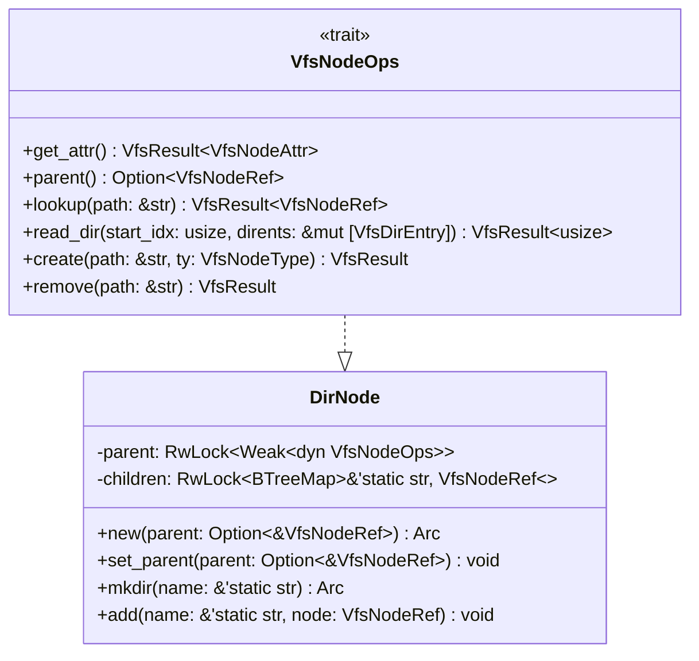
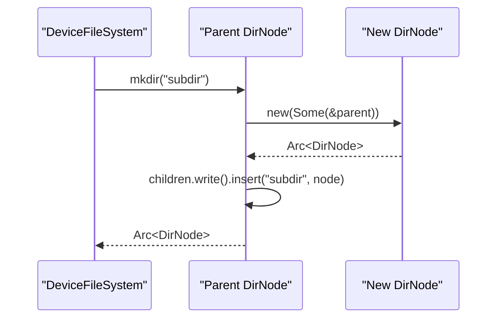
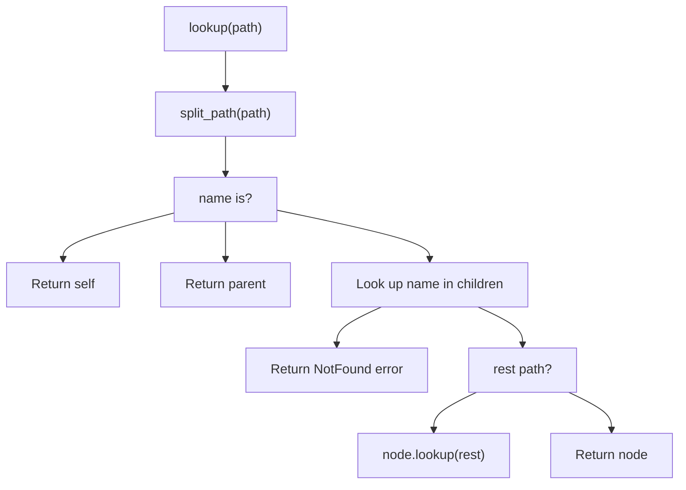
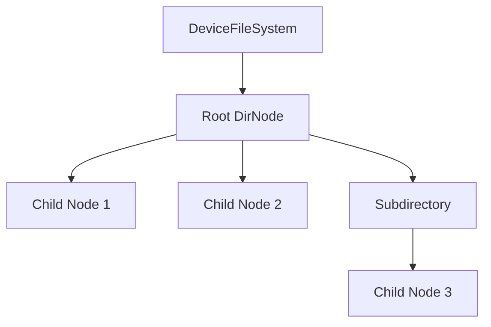
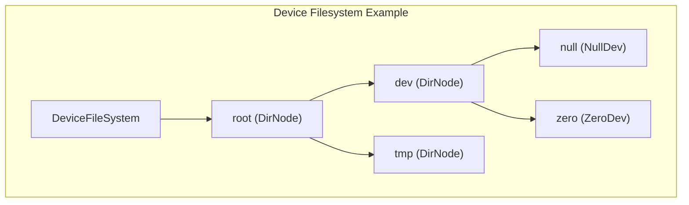

# Directory Structure

> **Relevant source files**
> * [axfs_devfs/src/dir.rs](https://github.com/arceos-org/axfs_crates/blob/0b21a163/axfs_devfs/src/dir.rs)
> * [axfs_devfs/src/lib.rs](https://github.com/arceos-org/axfs_crates/blob/0b21a163/axfs_devfs/src/lib.rs)

This document details the directory structure implementation in the axfs_devfs filesystem. It focuses on how directories are represented, managed, and traversed within the device filesystem. For information about the overall device filesystem architecture, see [Device File System (axfs_devfs)](/arceos-org/axfs_crates/3-device-file-system-(axfs_devfs)).

## Directory Node Implementation

The directory structure in axfs_devfs is built around the `DirNode` struct, which represents directory nodes in the filesystem hierarchy. Each directory can contain other directories or device nodes, forming a tree-like structure similar to traditional filesystems.

Sources: [axfs_devfs/src/dir.rs(L7 - L40)&emsp;](https://github.com/arceos-org/axfs_crates/blob/0b21a163/axfs_devfs/src/dir.rs#L7-L40) [axfs_devfs/src/dir.rs(L42 - L131)&emsp;](https://github.com/arceos-org/axfs_crates/blob/0b21a163/axfs_devfs/src/dir.rs#L42-L131)

### Key Components

The `DirNode` struct consists of two primary fields:

1. **parent**: A read-write lock containing a weak reference to the parent directory
2. **children**: A read-write lock containing a BTree map of child nodes indexed by name

This structure allows for efficient directory traversal and lookup operations while preventing strong reference cycles between parent and child nodes.

Sources: [axfs_devfs/src/dir.rs(L10 - L13)&emsp;](https://github.com/arceos-org/axfs_crates/blob/0b21a163/axfs_devfs/src/dir.rs#L10-L13)

## Directory Operations

The `DirNode` implementation provides several key operations for directory management:

### Directory Creation

Sources: [axfs_devfs/src/dir.rs(L29 - L34)&emsp;](https://github.com/arceos-org/axfs_crates/blob/0b21a163/axfs_devfs/src/dir.rs#L29-L34) [axfs_devfs/src/lib.rs(L39 - L42)&emsp;](https://github.com/arceos-org/axfs_crates/blob/0b21a163/axfs_devfs/src/lib.rs#L39-L42)

### Node Addition

Directories can contain various types of nodes including other directories and device nodes. The `add` method allows adding any node that implements the `VfsNodeOps` trait to a directory.

Sources: [axfs_devfs/src/dir.rs(L36 - L39)&emsp;](https://github.com/arceos-org/axfs_crates/blob/0b21a163/axfs_devfs/src/dir.rs#L36-L39) [axfs_devfs/src/lib.rs(L44 - L49)&emsp;](https://github.com/arceos-org/axfs_crates/blob/0b21a163/axfs_devfs/src/lib.rs#L44-L49)

### Path Lookup

The `lookup` method is a crucial operation that navigates the directory structure to find nodes by path. It implements path traversal using a recursive approach:

1. Split the path into the current component and the rest
2. Look up the current component in the children map
3. If there's a remaining path and the found node exists, recursively call `lookup` on that node
4. Otherwise, return the found node

Sources: [axfs_devfs/src/dir.rs(L51 - L69)&emsp;](https://github.com/arceos-org/axfs_crates/blob/0b21a163/axfs_devfs/src/dir.rs#L51-L69) [axfs_devfs/src/dir.rs(L133 - L138)&emsp;](https://github.com/arceos-org/axfs_crates/blob/0b21a163/axfs_devfs/src/dir.rs#L133-L138)

### Directory Listing

The `read_dir` method returns directory entries for the current directory, including the special "." and ".." entries.

Sources: [axfs_devfs/src/dir.rs(L71 - L88)&emsp;](https://github.com/arceos-org/axfs_crates/blob/0b21a163/axfs_devfs/src/dir.rs#L71-L88)

## Path Resolution Process

Path resolution is a fundamental operation in the directory structure. The `split_path` helper function separates a path into its first component and the remainder, enabling recursive traversal.

Sources: [axfs_devfs/src/dir.rs(L51 - L69)&emsp;](https://github.com/arceos-org/axfs_crates/blob/0b21a163/axfs_devfs/src/dir.rs#L51-L69) [axfs_devfs/src/dir.rs(L133 - L138)&emsp;](https://github.com/arceos-org/axfs_crates/blob/0b21a163/axfs_devfs/src/dir.rs#L133-L138)

### Special Path Components

The directory implementation handles special path components:

* `"."` - Refers to the current directory
* `".."` - Refers to the parent directory
* `""` (empty component) - Treated as the current directory

Sources: [axfs_devfs/src/dir.rs(L53 - L55)&emsp;](https://github.com/arceos-org/axfs_crates/blob/0b21a163/axfs_devfs/src/dir.rs#L53-L55)

## Directory Hierarchy in DeviceFileSystem

The `DeviceFileSystem` struct maintains the root directory of the filesystem. It provides methods to manipulate the root directory and implements the `VfsOps` trait required by the VFS layer.

Sources: [axfs_devfs/src/lib.rs(L25 - L28)&emsp;](https://github.com/arceos-org/axfs_crates/blob/0b21a163/axfs_devfs/src/lib.rs#L25-L28) [axfs_devfs/src/lib.rs(L30 - L49)&emsp;](https://github.com/arceos-org/axfs_crates/blob/0b21a163/axfs_devfs/src/lib.rs#L30-L49)

### Mount Behavior

When the DeviceFileSystem is mounted, it sets the parent of its root directory to the specified mount point. This establishes the connection between the device filesystem and the broader filesystem hierarchy.

Sources: [axfs_devfs/src/lib.rs(L53 - L60)&emsp;](https://github.com/arceos-org/axfs_crates/blob/0b21a163/axfs_devfs/src/lib.rs#L53-L60)

## Concurrency and Memory Management

The directory implementation includes several key design aspects to handle concurrency and memory management:

1. **Reader-Writer Locks**: Both the parent reference and children map are protected by `RwLock` to allow concurrent read access while ensuring exclusive write access.
2. **Weak References**: Parent references are stored as weak references (`Weak<dyn VfsNodeOps>`) to prevent reference cycles and memory leaks.
3. **Arc for Shared Ownership**: Nodes are wrapped in `Arc` (Atomic Reference Counting) to allow shared ownership across the filesystem.

Sources: [axfs_devfs/src/dir.rs(L10 - L13)&emsp;](https://github.com/arceos-org/axfs_crates/blob/0b21a163/axfs_devfs/src/dir.rs#L10-L13) [axfs_devfs/src/dir.rs(L16 - L22)&emsp;](https://github.com/arceos-org/axfs_crates/blob/0b21a163/axfs_devfs/src/dir.rs#L16-L22)

## Limitations

The device filesystem has some intentional limitations in its directory structure:

1. **Static Names**: Node names must be `&'static str`, implying they must be string literals or have a 'static lifetime.
2. **No Dynamic Node Creation/Removal**: The `create` and `remove` methods are implemented to reject runtime addition or removal of nodes through the VFS interface.

Sources: [axfs_devfs/src/dir.rs(L90 - L109)&emsp;](https://github.com/arceos-org/axfs_crates/blob/0b21a163/axfs_devfs/src/dir.rs#L90-L109) [axfs_devfs/src/dir.rs(L111 - L128)&emsp;](https://github.com/arceos-org/axfs_crates/blob/0b21a163/axfs_devfs/src/dir.rs#L111-L128)

## Usage Example

The following example shows how to build a directory structure in the device filesystem:

This creates a structure with paths:

* `/dev/null`
* `/dev/zero`
* `/tmp`

Sources: [axfs_devfs/src/lib.rs(L30 - L49)&emsp;](https://github.com/arceos-org/axfs_crates/blob/0b21a163/axfs_devfs/src/lib.rs#L30-L49)