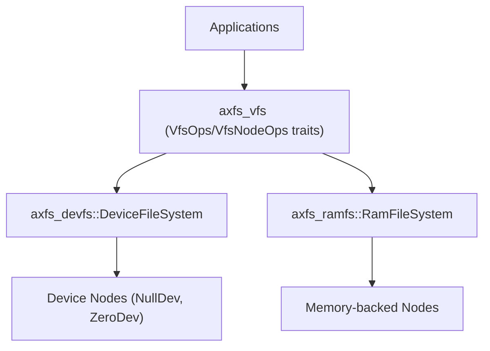
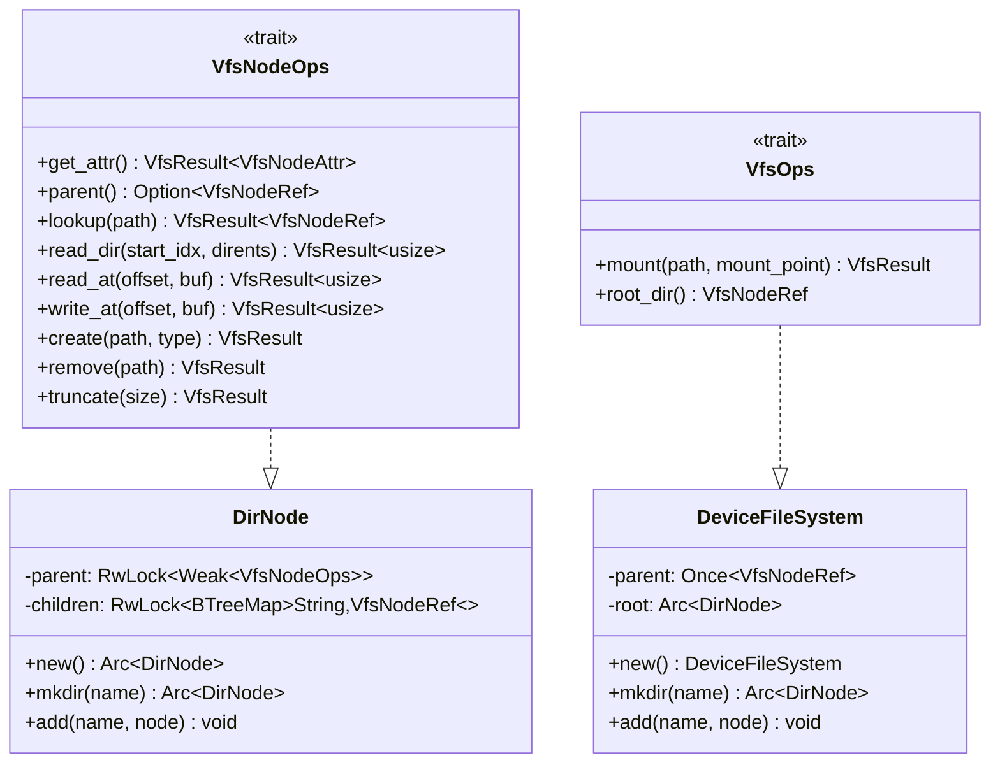
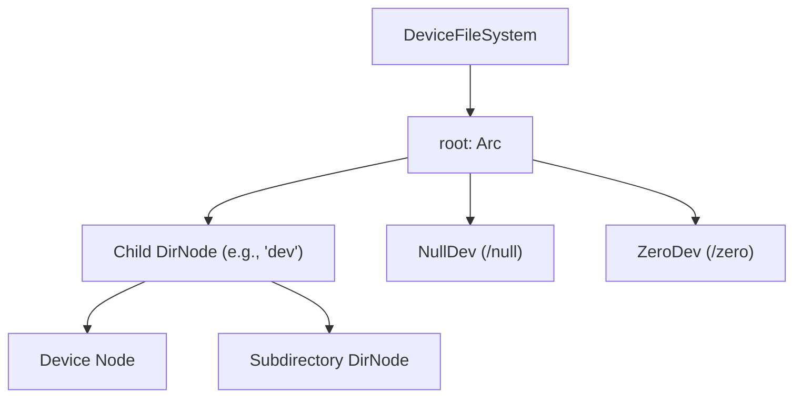
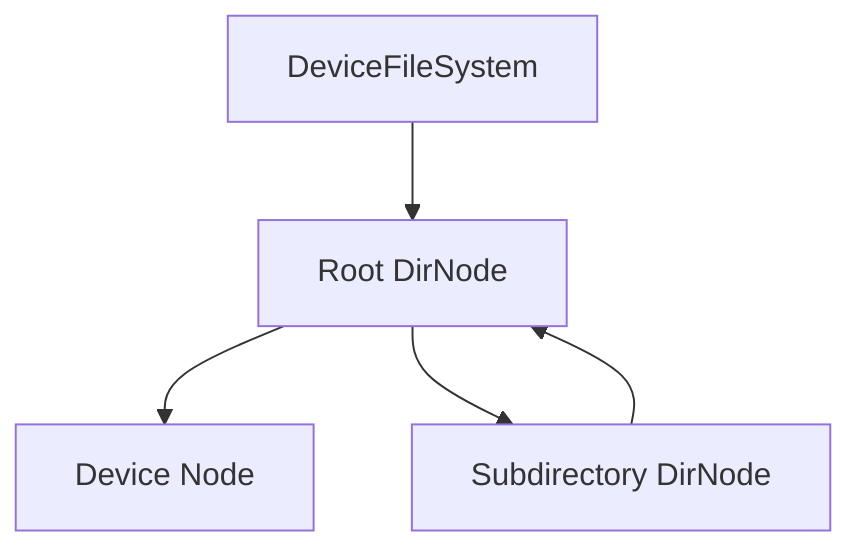
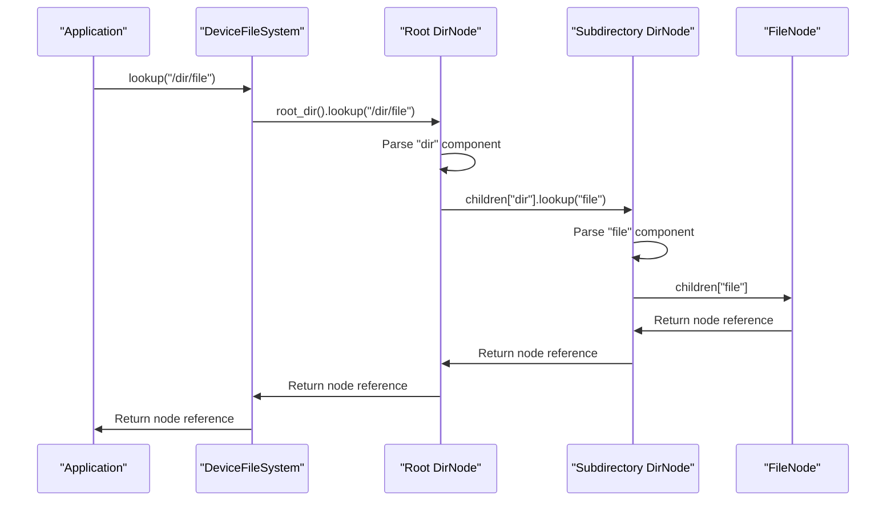
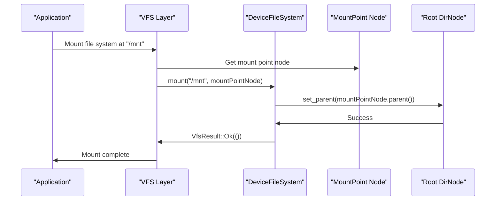
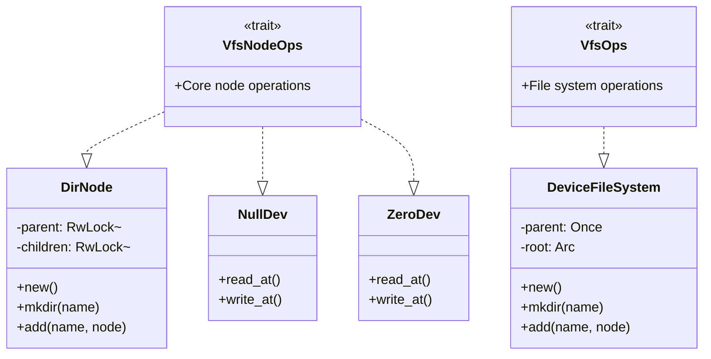

# File System Architecture

> **Relevant source files**
> * [README.md](https://github.com/arceos-org/axfs_crates/blob/0b21a163/README.md)
> * [axfs_devfs/README.md](https://github.com/arceos-org/axfs_crates/blob/0b21a163/axfs_devfs/README.md)
> * [axfs_devfs/src/lib.rs](https://github.com/arceos-org/axfs_crates/blob/0b21a163/axfs_devfs/src/lib.rs)

This document provides an overview of the architectural design of the file system implementation in axfs_crates. It covers the foundational components, their relationships, and the core design patterns that enable the flexible and extensible file system abstraction.

For detailed information about the Virtual File System Interface implementation, see [Virtual File System Interface (axfs_vfs)](/arceos-org/axfs_crates/2.1-virtual-file-system-interface-(axfs_vfs)). For specific implementations, see [Device File System (axfs_devfs)](/arceos-org/axfs_crates/3-device-file-system-(axfs_devfs)) and [RAM File System (axfs_ramfs)](/arceos-org/axfs_crates/4-ram-file-system-(axfs_ramfs)).

## Core Components

The axfs_crates file system architecture consists of three main crates that work together to provide a complete file system abstraction:

**Core Components:**

1. **axfs_vfs**: Defines the virtual file system interface through traits that other file systems implement
2. **axfs_devfs**: Implements a device file system following the VFS interface
3. **axfs_ramfs**: Provides a RAM-based file system implementation

Sources: [README.md(L5 - L9)&emsp;](https://github.com/arceos-org/axfs_crates/blob/0b21a163/README.md#L5-L9) [axfs_devfs/src/lib.rs(L1 - L4)&emsp;](https://github.com/arceos-org/axfs_crates/blob/0b21a163/axfs_devfs/src/lib.rs#L1-L4)

## Layered Architecture Design

The file system architecture follows a layered design pattern, separating abstract interfaces from concrete implementations:

The diagram shows the core traits and their implementations:

* `VfsNodeOps`: Defines operations on individual file system nodes
* `VfsOps`: Defines operations on the file system as a whole
* `DeviceFileSystem`: Implements `VfsOps` for device files
* `DirNode`: Implements `VfsNodeOps` for directory operations

Sources: [axfs_devfs/src/lib.rs(L25 - L71)&emsp;](https://github.com/arceos-org/axfs_crates/blob/0b21a163/axfs_devfs/src/lib.rs#L25-L71)

## File System Implementation Structure

The actual file system implementation forms a hierarchical tree structure:

The `DeviceFileSystem` structure contains:

* A root directory node (`root: Arc<DirNode>`)
* An optional parent node for mounting (`parent: Once<VfsNodeRef>`)

The tree structure supports:

1. Creating subdirectories using `mkdir(name)` method
2. Adding device nodes with `add(name, node)` method
3. Standard file system path traversal

Sources: [axfs_devfs/src/lib.rs(L25 - L49)&emsp;](https://github.com/arceos-org/axfs_crates/blob/0b21a163/axfs_devfs/src/lib.rs#L25-L49)

## Memory Management and Reference Counting

The architecture uses Rust's reference counting mechanisms for memory safety and object lifetime management:

Key memory management features:

* `Arc<T>` (Atomic Reference Counting) for shared ownership of nodes
* `Weak<T>` references for parent pointers to avoid reference cycles
* `RwLock<T>` for thread-safe concurrent access to shared data
* `Once<T>` for one-time initialization of parent references during mounting

This approach guarantees memory safety while allowing flexible node relationships:

1. Strong references (Arc) from parent to children
2. Weak references from children to parents
3. Thread-safe access through RwLock

Sources: [axfs_devfs/src/lib.rs(L20 - L21)&emsp;](https://github.com/arceos-org/axfs_crates/blob/0b21a163/axfs_devfs/src/lib.rs#L20-L21)

## Path Resolution Process

When accessing a file or directory, the file system employs a recursive path resolution process:

This multi-step resolution process navigates the file system hierarchy to locate requested resources. Path resolution is managed through:

1. The `lookup` method in `VfsNodeOps` trait
2. Path component parsing (directory names)
3. Recursively traversing the file system tree until reaching the target node

Sources: [axfs_devfs/src/lib.rs(L52 - L65)&emsp;](https://github.com/arceos-org/axfs_crates/blob/0b21a163/axfs_devfs/src/lib.rs#L52-L65)

## Mount Operation Flow

The following sequence diagram illustrates the mounting process:

The mount operation connects a file system's root directory to a specified mount point in another file system, enabling seamless path traversal across multiple file systems.

The key steps in the mounting process are:

1. Setting the parent of the file system's root node
2. Establishing the connection between mount point and file system

Sources: [axfs_devfs/src/lib.rs(L53 - L60)&emsp;](https://github.com/arceos-org/axfs_crates/blob/0b21a163/axfs_devfs/src/lib.rs#L53-L60)

## Implementation Inheritance Hierarchy

The complete inheritance hierarchy shows how concrete implementations relate to the core traits:

This diagram shows the complete implementation hierarchy, illustrating how different components inherit from and implement the core VFS traits.

Sources: [axfs_devfs/src/lib.rs(L16 - L18)&emsp;](https://github.com/arceos-org/axfs_crates/blob/0b21a163/axfs_devfs/src/lib.rs#L16-L18) [axfs_devfs/src/lib.rs(L25 - L71)&emsp;](https://github.com/arceos-org/axfs_crates/blob/0b21a163/axfs_devfs/src/lib.rs#L25-L71)

## Summary

The axfs_crates file system architecture employs:

1. **Trait-Based Design**: Defines behavior through traits like `VfsNodeOps` and `VfsOps`
2. **Layered Architecture**: Separates interface (axfs_vfs) from implementations (axfs_devfs, axfs_ramfs)
3. **Memory Safety**: Uses reference counting and thread-safe primitives
4. **Hierarchical Structure**: Organizes nodes in a tree-like structure
5. **Polymorphism**: Allows different implementations to be used interchangeably

This design provides a flexible, extensible foundation for building various file system implementations while maintaining a consistent interface for applications.

Sources: [README.md(L5 - L9)&emsp;](https://github.com/arceos-org/axfs_crates/blob/0b21a163/README.md#L5-L9) [axfs_devfs/src/lib.rs(L1 - L71)&emsp;](https://github.com/arceos-org/axfs_crates/blob/0b21a163/axfs_devfs/src/lib.rs#L1-L71)