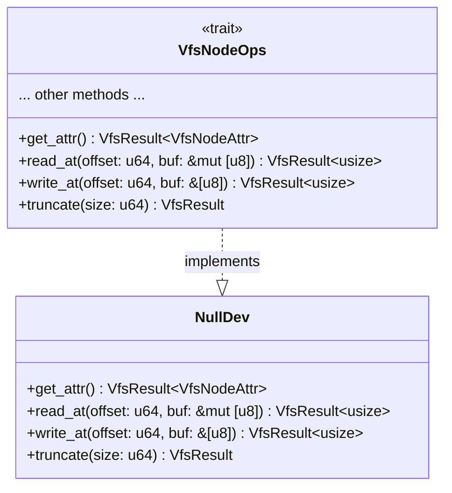
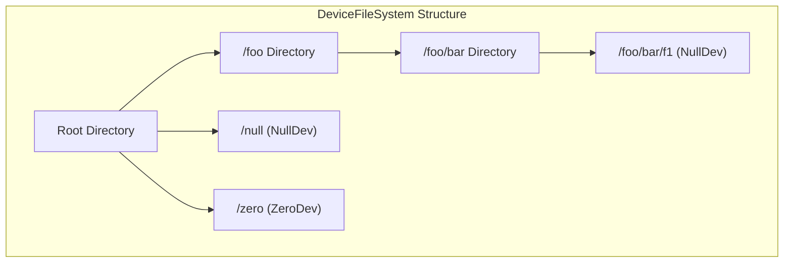

# Null Device

> **Relevant source files**
> * [axfs_devfs/src/null.rs](https://github.com/arceos-org/axfs_crates/blob/0b21a163/axfs_devfs/src/null.rs)
> * [axfs_devfs/src/tests.rs](https://github.com/arceos-org/axfs_crates/blob/0b21a163/axfs_devfs/src/tests.rs)

## Purpose and Overview

The Null Device in axfs_devfs implements a virtual device that behaves like the traditional `/dev/null` found in Unix-like operating systems. It serves as a "bit bucket" or "black hole" for data - all writes to this device are discarded, and reads yield no data. This component is useful for discarding unwanted output, testing I/O operations, or as a sink for data that doesn't need to be stored.

For information about other special devices, see [Zero Device](/arceos-org/axfs_crates/3.3-zero-device) and for a broader context of the device filesystem architecture, see [Device File System (axfs_devfs)](/arceos-org/axfs_crates/3-device-file-system-(axfs_devfs)).

## Implementation Details

The Null Device is implemented as the `NullDev` struct in the axfs_devfs crate. It implements the `VfsNodeOps` trait from axfs_vfs, which defines the interface for all file system nodes.



The `NullDev` struct is notably minimal - it contains no data members and implements only the necessary trait methods to provide null device behavior.

Sources: [axfs_devfs/src/null.rs(L6 - L7)&emsp;](https://github.com/arceos-org/axfs_crates/blob/0b21a163/axfs_devfs/src/null.rs#L6-L7)

### Key Method Implementations

The `NullDev` struct implements the following key methods from the `VfsNodeOps` trait:

1. **get_attr()**: Reports the node as a character device with default file permissions and zero size.
2. **read_at()**: Always returns 0 bytes read, regardless of the requested buffer or offset.
3. **write_at()**: Returns the full buffer length as if all bytes were successfully written, but actually discards the data.
4. **truncate()**: Does nothing and reports success.

Other methods required by the `VfsNodeOps` trait are provided through the `impl_vfs_non_dir_default!` macro.

Sources: [axfs_devfs/src/null.rs(L8 - L30)&emsp;](https://github.com/arceos-org/axfs_crates/blob/0b21a163/axfs_devfs/src/null.rs#L8-L30)

## Behavioral Characteristics

The Null Device exhibits the following behaviors when interacted with:

```mermaid
sequenceDiagram
    participant Client as Client
    participant NullDev as NullDev

    Client ->> NullDev: read_at(offset, buf)
    Note over ,NullDev: Ignores offset and buffer
    NullDev -->> Client: 0 (no bytes read)
    Client ->> NullDev: write_at(offset, buf)
    Note over ,NullDev: Discards all data<br>Reports success
    NullDev -->> Client: buf.len() (all bytes "written")
    Client ->> NullDev: get_attr()
    NullDev -->> Client: CharDevice type, 0 size
    Client ->> NullDev: truncate(size)
    NullDev -->> Client: Success (no action)
```

Sources: [axfs_devfs/src/null.rs(L8 - L30)&emsp;](https://github.com/arceos-org/axfs_crates/blob/0b21a163/axfs_devfs/src/null.rs#L8-L30)

### Read Operation

When reading from the null device, it always returns 0, indicating no data was read. The provided buffer remains unchanged.

```rust
fn read_at(&self, _offset: u64, _buf: &mut [u8]) -> VfsResult<usize> {
    Ok(0)
}
```

This behavior can be verified in the tests, where reading from a null device doesn't alter the buffer's content:

```javascript
let mut buf = [1; N];
assert_eq!(node.read_at(0, &mut buf)?, 0);  // Returns 0 bytes read
assert_eq!(buf, [1; N]);  // Buffer still contains all 1s
```

Sources: [axfs_devfs/src/null.rs(L18 - L20)&emsp;](https://github.com/arceos-org/axfs_crates/blob/0b21a163/axfs_devfs/src/null.rs#L18-L20) [axfs_devfs/src/tests.rs(L27 - L28)&emsp;](https://github.com/arceos-org/axfs_crates/blob/0b21a163/axfs_devfs/src/tests.rs#L27-L28)

### Write Operation

When writing to the null device, all data is discarded, but the operation reports success by returning the full length of the input buffer.

```rust
fn write_at(&self, _offset: u64, buf: &[u8]) -> VfsResult<usize> {
    Ok(buf.len())
}
```

In the test code, we can see this behavior verified:

```
assert_eq!(node.write_at(N as _, &buf)?, N);  // Reports all bytes as written
```

Sources: [axfs_devfs/src/null.rs(L22 - L24)&emsp;](https://github.com/arceos-org/axfs_crates/blob/0b21a163/axfs_devfs/src/null.rs#L22-L24) [axfs_devfs/src/tests.rs(L29)&emsp;](https://github.com/arceos-org/axfs_crates/blob/0b21a163/axfs_devfs/src/tests.rs#L29-L29)

### Node Attributes

The null device reports itself as a character device with default file permissions and zero size:

```rust
fn get_attr(&self) -> VfsResult<VfsNodeAttr> {
    Ok(VfsNodeAttr::new(
        VfsNodePerm::default_file(),
        VfsNodeType::CharDevice,
        0,
        0,
    ))
}
```

Sources: [axfs_devfs/src/null.rs(L9 - L16)&emsp;](https://github.com/arceos-org/axfs_crates/blob/0b21a163/axfs_devfs/src/null.rs#L9-L16)

## Integration with Device File System

The Null Device can be added to the Device File System at any location, typically at `/dev/null`. Here's how it fits into the overall device file system architecture:



Sources: [axfs_devfs/src/tests.rs(L96 - L102)&emsp;](https://github.com/arceos-org/axfs_crates/blob/0b21a163/axfs_devfs/src/tests.rs#L96-L102)

A `NullDev` instance can be added to the DeviceFileSystem using the `add` method:

```javascript
let devfs = DeviceFileSystem::new();
devfs.add("null", Arc::new(NullDev));
```

This makes the null device accessible through path resolution from the root of the device file system.

Sources: [axfs_devfs/src/tests.rs(L104 - L106)&emsp;](https://github.com/arceos-org/axfs_crates/blob/0b21a163/axfs_devfs/src/tests.rs#L104-L106)

## Usage Examples

The tests in the axfs_devfs crate provide practical examples of how to use the null device:

### Creating and Accessing a Null Device

```javascript
// Create device file system with a null device
let devfs = DeviceFileSystem::new();
devfs.add("null", Arc::new(NullDev));

// Access the null device (supports various path formats)
let node = root.lookup("////null")?;

// Verify it's a character device
assert_eq!(node.get_attr()?.file_type(), VfsNodeType::CharDevice);
```

Sources: [axfs_devfs/src/tests.rs(L104 - L106)&emsp;](https://github.com/arceos-org/axfs_crates/blob/0b21a163/axfs_devfs/src/tests.rs#L104-L106) [axfs_devfs/src/tests.rs(L23 - L25)&emsp;](https://github.com/arceos-org/axfs_crates/blob/0b21a163/axfs_devfs/src/tests.rs#L23-L25)

### Adding a Null Device to Subdirectories

The null device can also be added to subdirectories:

```javascript
let devfs = DeviceFileSystem::new();

// Create directory structure
let dir_foo = devfs.mkdir("foo");
let dir_bar = dir_foo.mkdir("bar");

// Add null device in a subdirectory
dir_bar.add("f1", Arc::new(NullDev));  // Creates /foo/bar/f1 as a null device
```

Sources: [axfs_devfs/src/tests.rs(L108 - L111)&emsp;](https://github.com/arceos-org/axfs_crates/blob/0b21a163/axfs_devfs/src/tests.rs#L108-L111)

## Technical Specifications

|Property|Value|
| --- | --- |
|Node Type|Character Device|
|Size|0 bytes|
|Permissions|Default file permissions|
|Read Behavior|Always returns 0 bytes, buffer unchanged|
|Write Behavior|Discards data, reports full buffer length as written|
|Truncate Behavior|No-op, reports success|
|Directory Operations|Not supported (reportsNotADirectoryerror)|

Sources: [axfs_devfs/src/null.rs(L8 - L30)&emsp;](https://github.com/arceos-org/axfs_crates/blob/0b21a163/axfs_devfs/src/null.rs#L8-L30) [axfs_devfs/src/tests.rs(L23 - L30)&emsp;](https://github.com/arceos-org/axfs_crates/blob/0b21a163/axfs_devfs/src/tests.rs#L23-L30)

## Summary

The Null Device (`NullDev`) is a simple yet essential virtual device that adheres to the standard semantics of `/dev/null` in Unix-like systems. It discards all written data and provides no data when read, making it useful for scenarios where data needs to be ignored or when a non-functional sink or source is required. It can be integrated anywhere in the device file system hierarchy and behaves consistently with its traditional counterpart.

See also:

* [Virtual File System Interface (axfs_vfs)](/arceos-org/axfs_crates/2.1-virtual-file-system-interface-(axfs_vfs))
* [Device File System overview](/arceos-org/axfs_crates/3-device-file-system-(axfs_devfs))
* [Zero Device](/arceos-org/axfs_crates/3.3-zero-device)