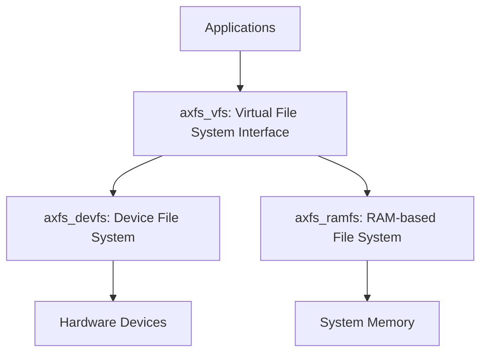
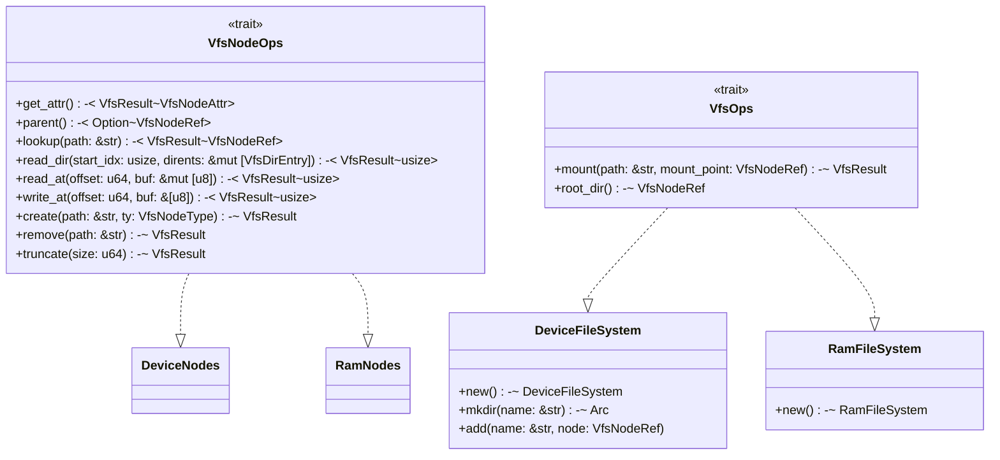
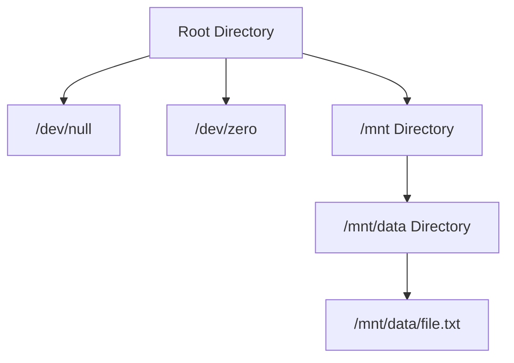

# Overview

> **Relevant source files**
> * [Cargo.toml](https://github.com/arceos-org/axfs_crates/blob/0b21a163/Cargo.toml)
> * [README.md](https://github.com/arceos-org/axfs_crates/blob/0b21a163/README.md)

This document introduces the axfs_crates repository, a collection of Rust crates designed to provide filesystem abstractions for embedded and OS development environments. The repository focuses on providing lightweight, modular filesystem components that can be used in both standard and no_std environments.

For detailed information about specific components, see [File System Architecture](/arceos-org/axfs_crates/2-file-system-architecture), [Virtual File System Interface](/arceos-org/axfs_crates/2.1-virtual-file-system-interface-(axfs_vfs)), [Device File System](/arceos-org/axfs_crates/3-device-file-system-(axfs_devfs)), or [RAM File System](/arceos-org/axfs_crates/4-ram-file-system-(axfs_ramfs)).

## Purpose and Scope

The axfs_crates repository implements a virtual filesystem framework with concrete implementations designed for operating systems and embedded environments. Its key goals are:

1. Provide a clean, trait-based filesystem abstraction layer
2. Offer concrete filesystem implementations for common use cases
3. Support no_std environments for embedded systems development
4. Maintain a modular design that allows picking only needed components

The framework follows Unix-like filesystem semantics while leveraging Rust's type system and memory safety features.

Sources: [README.md(L1 - L10)&emsp;](https://github.com/arceos-org/axfs_crates/blob/0b21a163/README.md#L1-L10) [Cargo.toml(L1 - L21)&emsp;](https://github.com/arceos-org/axfs_crates/blob/0b21a163/Cargo.toml#L1-L21)

## Repository Structure

The repository consists of three primary crates:

|Crate|Description|
| --- | --- |
|axfs_vfs|Defines the virtual filesystem interfaces and traits that other filesystem implementations must implement|
|axfs_devfs|Implements a device filesystem for managing device files (similar to /dev in Unix systems)|
|axfs_ramfs|Implements a RAM-based filesystem that stores all data in memory|

These crates can be used independently or together depending on the needs of the application.

Sources: [README.md(L5 - L9)&emsp;](https://github.com/arceos-org/axfs_crates/blob/0b21a163/README.md#L5-L9) [Cargo.toml(L4 - L8)&emsp;](https://github.com/arceos-org/axfs_crates/blob/0b21a163/Cargo.toml#L4-L8)

## High-Level Architecture

### Component Relationships

The diagram above illustrates the layered architecture of axfs_crates. Applications interact with filesystems through the VFS interface provided by `axfs_vfs`. The concrete implementations (`axfs_devfs` and `axfs_ramfs`) implement this interface and interact with their respective resources.

Sources: [README.md(L5 - L9)&emsp;](https://github.com/arceos-org/axfs_crates/blob/0b21a163/README.md#L5-L9)

### Core Interface Implementation

This diagram shows the key traits defined in `axfs_vfs` and how they are implemented by the filesystem implementations. The `VfsNodeOps` trait defines operations that can be performed on filesystem nodes (files, directories, devices), while the `VfsOps` trait defines filesystem-level operations.

Sources: [README.md(L7 - L9)&emsp;](https://github.com/arceos-org/axfs_crates/blob/0b21a163/README.md#L7-L9)

## Key Design Characteristics

The axfs_crates architecture embodies several key design characteristics:

1. **Trait-Based Design**: Uses Rust traits (`VfsNodeOps`, `VfsOps`) to define interfaces, allowing polymorphic behavior and clean separation of concerns.
2. **Reference-Counted Memory Management**: Employs `Arc` (Atomic Reference Counting) and `Weak` references to manage object lifetimes and prevent circular references.
3. **Hierarchical Structure**: Filesystems are organized in a tree-like structure similar to traditional Unix filesystems, with directories containing other directories and files.
4. **Concurrent Access Support**: Utilizes synchronization primitives to ensure thread safety in multithreaded environments.
5. **No-std Compatibility**: Designed to work in environments without the standard library, making it suitable for embedded systems and operating system development.

## Example Filesystem Structure

The axfs_crates framework allows for creating filesystem hierarchies like the following:

This structure shows a typical filesystem arrangement with special device files (`/dev/null`, `/dev/zero`) and a mounted filesystem with directories and regular files.

## Common Usage Pattern

The typical usage flow for using axfs_crates components looks like:

1. Create a filesystem instance (DeviceFileSystem, RamFileSystem, etc.)
2. Obtain the root directory node
3. Create the desired hierarchy (directories, files)
4. Perform operations on nodes (read, write, etc.)
5. Mount other filesystems at specific mount points if needed

For specific implementation details and examples, see the dedicated pages for each component: [Virtual File System Interface](/arceos-org/axfs_crates/2.1-virtual-file-system-interface-(axfs_vfs)), [Device File System](/arceos-org/axfs_crates/3-device-file-system-(axfs_devfs)), or [RAM File System](/arceos-org/axfs_crates/4-ram-file-system-(axfs_ramfs)).