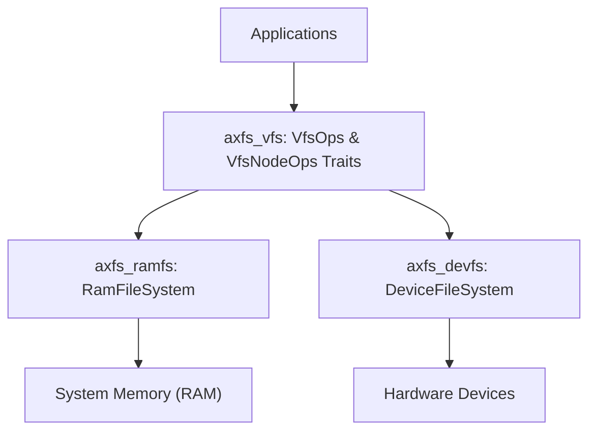
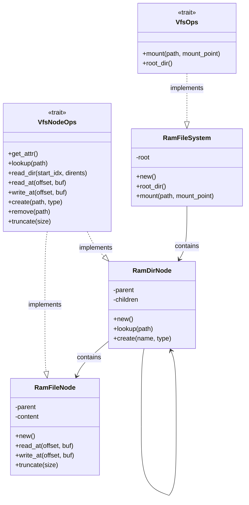
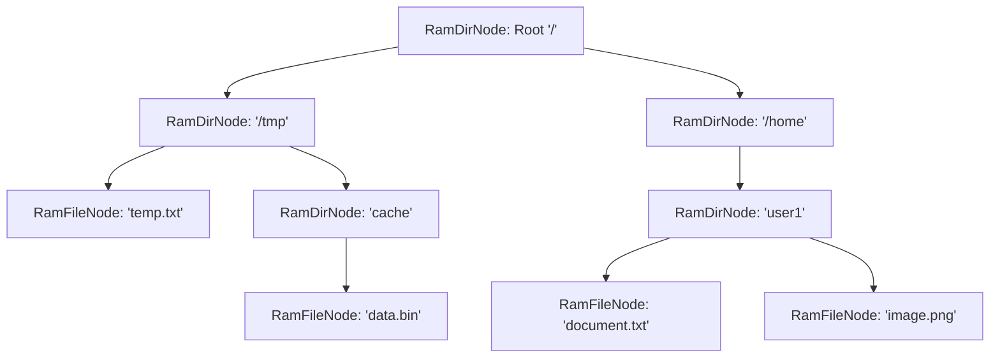
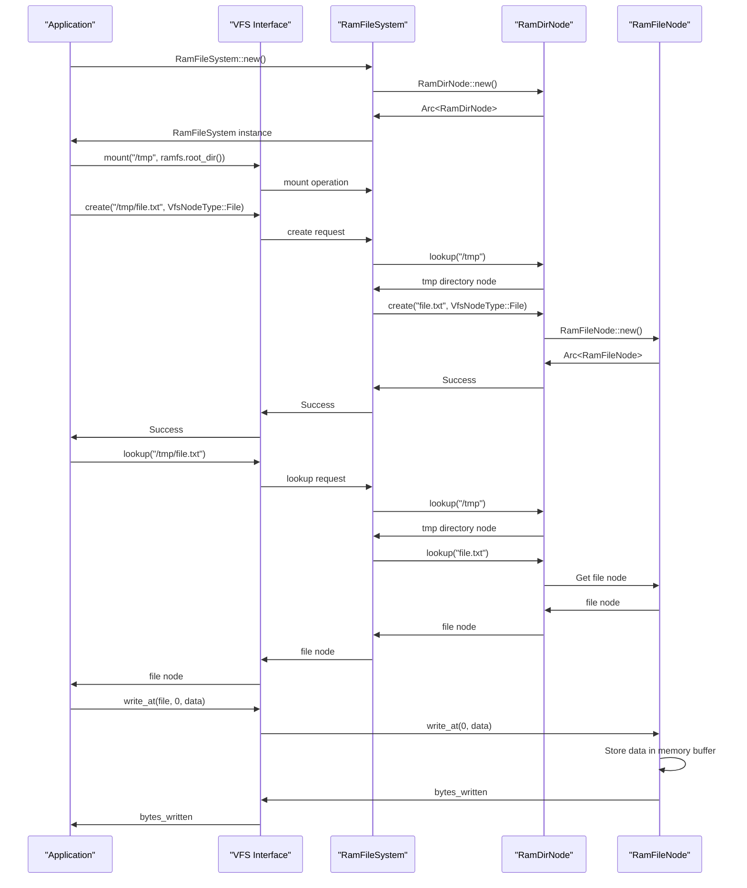

# RAM File System (axfs_ramfs)

> **Relevant source files**
> * [Cargo.toml](https://github.com/arceos-org/axfs_crates/blob/0b21a163/Cargo.toml)
> * [README.md](https://github.com/arceos-org/axfs_crates/blob/0b21a163/README.md)
> * [axfs_devfs/README.md](https://github.com/arceos-org/axfs_crates/blob/0b21a163/axfs_devfs/README.md)

## Purpose and Scope

`axfs_ramfs` implements a RAM-based file system for the axfs_crates ecosystem. It provides an in-memory storage solution that conforms to the Virtual File System (VFS) interfaces defined in `axfs_vfs`. This document covers the architecture, components, and usage patterns of the RAM File System.

For information about the VFS interface that `axfs_ramfs` implements, see [Virtual File System Interface (axfs_vfs)](/arceos-org/axfs_crates/2.1-virtual-file-system-interface-(axfs_vfs)).

Sources: [Cargo.toml(L4 - L8)&emsp;](https://github.com/arceos-org/axfs_crates/blob/0b21a163/Cargo.toml#L4-L8) [README.md(L7 - L9)&emsp;](https://github.com/arceos-org/axfs_crates/blob/0b21a163/README.md#L7-L9)

## System Architecture

The RAM File System is one of the concrete implementations in the axfs_crates ecosystem, alongside the Device File System (`axfs_devfs`).

### Integration with axfs_crates

This diagram illustrates how `axfs_ramfs` fits within the overall architecture. Applications interact with file systems through the VFS interface, which delegates operations to the appropriate implementation based on mount points.

Sources: [Cargo.toml(L4 - L8)&emsp;](https://github.com/arceos-org/axfs_crates/blob/0b21a163/Cargo.toml#L4-L8) [README.md(L7 - L9)&emsp;](https://github.com/arceos-org/axfs_crates/blob/0b21a163/README.md#L7-L9)

## Core Components

Based on the VFS interface requirements, the RAM File System likely consists of these core components:

### Component Relationships

The key components likely include:

|Component|Purpose|Key Responsibilities|
| --- | --- | --- |
|RamFileSystem|Main file system implementation|ImplementsVfsOpstrait, manages mount operations, provides access to root directory|
|RamDirNode|Directory node implementation|Stores hierarchical structure, manages children (files and subdirectories)|
|RamFileNode|File node implementation|Stores file content in memory, handles read/write operations|

These components work together to provide a complete in-memory file system hierarchy with the same interface as other file systems.

Sources: Based on common Rust patterns and the VFS architecture shown in the high-level diagrams

## In-Memory Hierarchy

A typical RAM file system hierarchy structure:

This structure mirrors traditional file systems but exists entirely in memory. Each node (`RamDirNode` or `RamFileNode`) implements the `VfsNodeOps` trait, providing a consistent interface regardless of node type.

Sources: Based on common file system hierarchy patterns

## Operation Patterns

The RAM File System implements file system operations defined by the VFS traits:

### File System Operations (VfsOpsTrait)

* `mount`: Attaches the RAM file system to a mount point
* `root_dir`: Provides access to the root directory

### Node Operations (VfsNodeOpsTrait)

|Operation|Description|Implementation Considerations|
| --- | --- | --- |
|get_attr|Get node attributes (size, type, etc.)|Return cached attributes or calculate on demand|
|lookup|Find a node by path|Traverse directory hierarchy to locate node|
|read_dir|List directory contents|Return entries from directory's children map|
|read_at|Read file data from specified offset|Access in-memory buffer at offset|
|write_at|Write file data at specified offset|Modify in-memory buffer, potentially resize|
|create|Create new file or directory|Allocate new node, add to parent's children|
|remove|Delete file or directory|Remove from parent's children, free memory|
|truncate|Change file size|Resize in-memory buffer|

Sources: Based on VFS interface requirements

## Usage Lifecycle

This sequence diagram illustrates the typical lifecycle of RAM file system usage, from creation to file operations.

Sources: Based on common file system operation patterns

## Implementation Considerations

The RAM File System implementation likely uses these Rust features:

* `Arc<T>` for shared ownership of nodes
* `Weak<T>` references to prevent reference cycles (particularly for parent pointers)
* `RwLock<T>` or `Mutex<T>` for concurrent access to mutable data
* `Vec<u8>` or similar for storing file contents
* `BTreeMap<String, VfsNodeRef>` for directory entries

## Advantages and Limitations

### Advantages

* **Performance**: Memory operations are faster than disk I/O
* **Simplicity**: No need for persistent storage management
* **Portability**: Works in environments without storage devices

### Limitations

* **Volatility**: All data is lost on system shutdown or restart
* **Capacity**: Limited by available RAM
* **Concurrent Access**: Requires careful synchronization for thread safety

## Use Cases

* Temporary file storage
* Cache for frequently accessed data
* Test environments
* Embedded systems with limited storage
* Performance-critical applications

Sources: [README.md(L9)&emsp;](https://github.com/arceos-org/axfs_crates/blob/0b21a163/README.md#L9-L9)