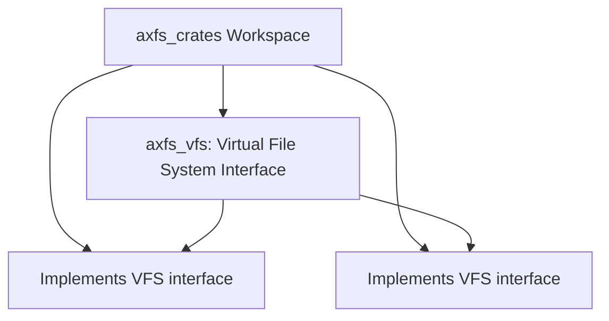
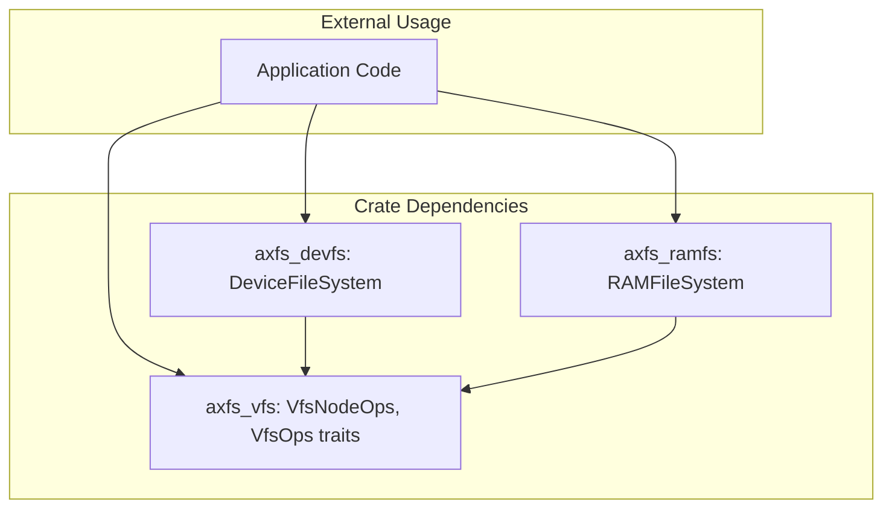
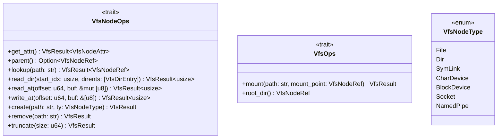
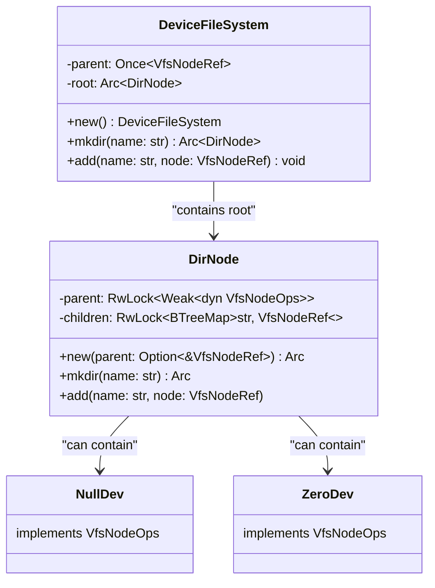
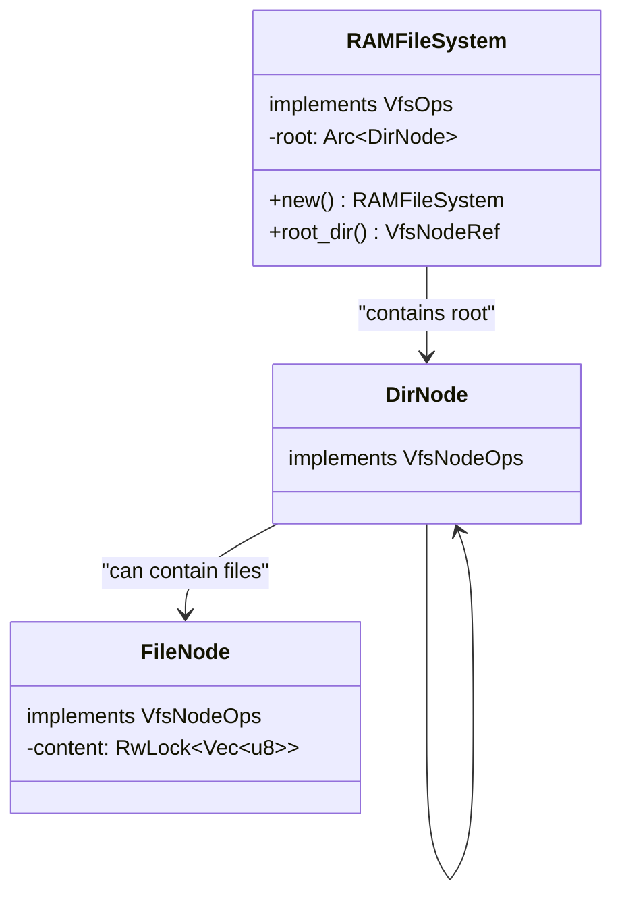

# Repository Structure

> **Relevant source files**
> * [.gitignore](https://github.com/arceos-org/axfs_crates/blob/0b21a163/.gitignore)
> * [Cargo.toml](https://github.com/arceos-org/axfs_crates/blob/0b21a163/Cargo.toml)
> * [README.md](https://github.com/arceos-org/axfs_crates/blob/0b21a163/README.md)

This page provides an overview of the organization of the axfs_crates repository, including its workspace setup, available crates, and the relationships between these components. For information about the overall filesystem architecture, see [File System Architecture](/arceos-org/axfs_crates/2-file-system-architecture).

## Workspace Organization

The axfs_crates repository is structured as a Rust workspace containing three primary crates, each implementing a distinct aspect of the filesystem infrastructure:

Title: Repository Workspace Structure

Sources: [Cargo.toml(L1 - L8)&emsp;](https://github.com/arceos-org/axfs_crates/blob/0b21a163/Cargo.toml#L1-L8) [README.md(L5 - L9)&emsp;](https://github.com/arceos-org/axfs_crates/blob/0b21a163/README.md#L5-L9)

The workspace configuration is defined in the root Cargo.toml file, which specifies the member crates and shared metadata, including version information, author details, and licensing.

## Crate Overview

The repository consists of the following crates:

|Crate|Description|Role in the System|
| --- | --- | --- |
|axfs_vfs|Virtual Filesystem Interface|Defines traits and interfaces that filesystem implementations must implement|
|axfs_devfs|Device Filesystem|Provides access to system devices through the VFS interface|
|axfs_ramfs|RAM Filesystem|Implements an in-memory filesystem using the VFS interface|

Sources: [README.md(L5 - L9)&emsp;](https://github.com/arceos-org/axfs_crates/blob/0b21a163/README.md#L5-L9) [Cargo.toml(L4 - L8)&emsp;](https://github.com/arceos-org/axfs_crates/blob/0b21a163/Cargo.toml#L4-L8)

## Dependency Relationships

The crates follow a clear hierarchical relationship, with `axfs_vfs` serving as the foundation that other filesystems build upon:

Title: Dependency Structure Between Crates

Sources: [Cargo.toml(L19 - L20)&emsp;](https://github.com/arceos-org/axfs_crates/blob/0b21a163/Cargo.toml#L19-L20)

Key aspects of this dependency structure:

* `axfs_vfs` has no dependencies on other filesystem crates in the workspace
* Both `axfs_devfs` and `axfs_ramfs` depend on `axfs_vfs` to implement its interfaces
* Application code can use any or all of these crates, typically interacting through the `axfs_vfs` abstractions

## Internal Structure of the Crates

### axfs_vfs

The Virtual File System (VFS) crate defines the core interfaces that filesystem implementations must adhere to:

Title: Core Traits in axfs_vfs

Sources: Based on the system architecture diagrams

### axfs_devfs

The Device Filesystem provides a hierarchical structure for accessing system devices:

Title: DeviceFileSystem Implementation Structure

Sources: Based on the system architecture diagrams

### axfs_ramfs

The RAM Filesystem provides an in-memory implementation of the filesystem interface:

Title: RAMFileSystem Implementation Structure

Sources: Based on the system architecture diagrams

## Repository Configuration

The repository follows standard Rust project conventions and includes the following key configuration files:

|File|Purpose|
| --- | --- |
|Cargo.toml|Defines the workspace and its members, shared dependencies, and package metadata|
|.gitignore|Specifies files to be excluded from version control (build artifacts, IDE files, etc.)|
|README.md|Provides a brief overview of the repository and its components|

Sources: [Cargo.toml(L1 - L21)&emsp;](https://github.com/arceos-org/axfs_crates/blob/0b21a163/Cargo.toml#L1-L21) [.gitignore(L1 - L4)&emsp;](https://github.com/arceos-org/axfs_crates/blob/0b21a163/.gitignore#L1-L4) [README.md(L1 - L10)&emsp;](https://github.com/arceos-org/axfs_crates/blob/0b21a163/README.md#L1-L10)

## Publishing Information

The crates in this repository are published on crates.io and have the following shared metadata:

|Metadata|Value|
| --- | --- |
|Version|0.1.1|
|License|GPL-3.0-or-later OR Apache-2.0 OR MulanPSL-2.0|
|Documentation|https://arceos-org.github.io/axfs_crates|
|Repository|https://github.com/arceos-org/axfs_crates|
|Categories|os, no-std, filesystem|

Sources: [Cargo.toml(L10 - L17)&emsp;](https://github.com/arceos-org/axfs_crates/blob/0b21a163/Cargo.toml#L10-L17)

This repository structure enables the development of modular filesystem components that can be used independently or together to provide filesystem functionality for the ArceOS operating system or other embedded systems projects.