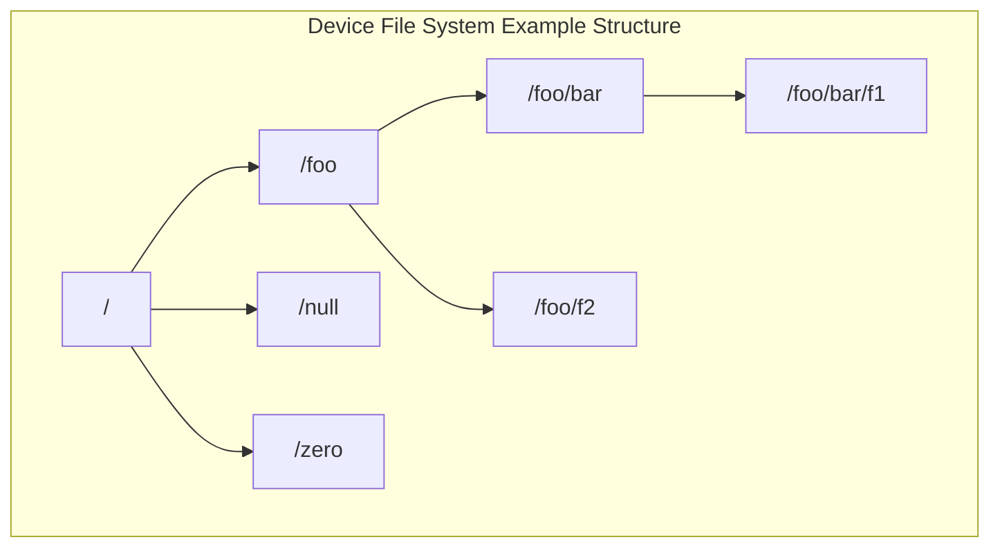
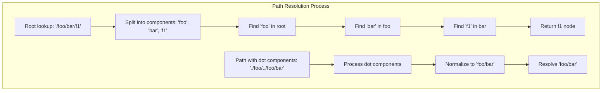
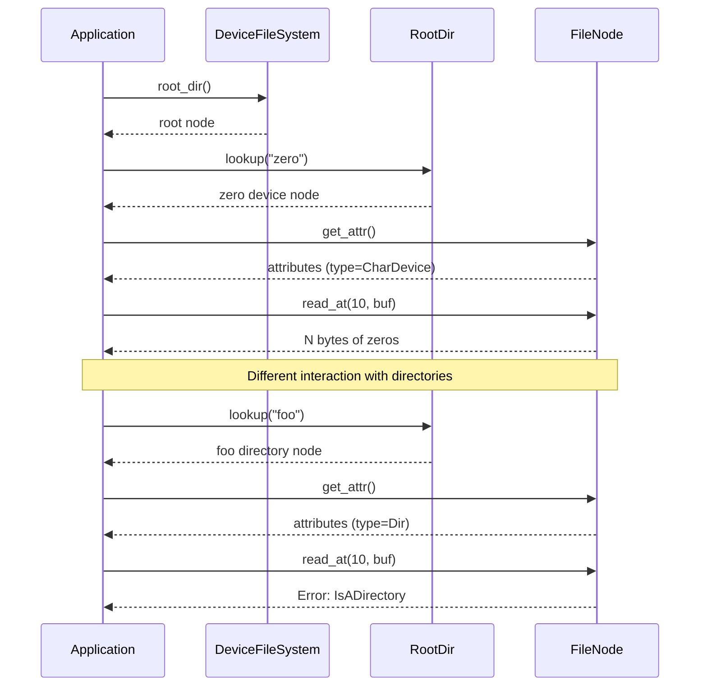
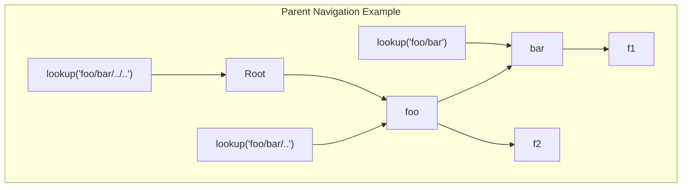
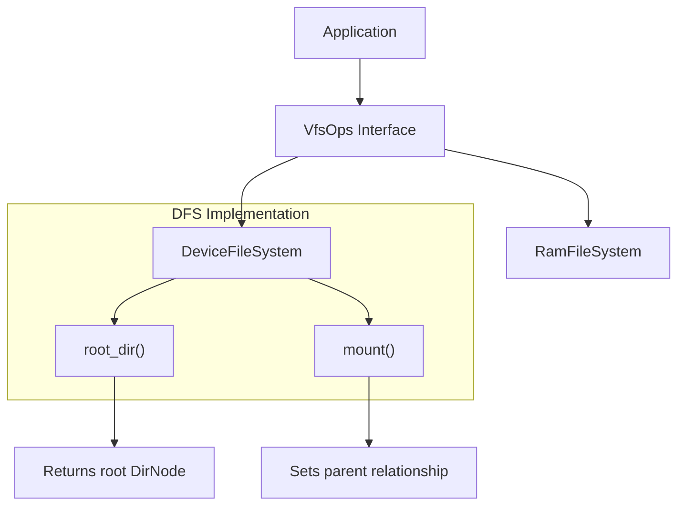

# Usage Examples

> **Relevant source files**
> * [axfs_devfs/src/lib.rs](https://github.com/arceos-org/axfs_crates/blob/0b21a163/axfs_devfs/src/lib.rs)
> * [axfs_devfs/src/tests.rs](https://github.com/arceos-org/axfs_crates/blob/0b21a163/axfs_devfs/src/tests.rs)

This page provides practical examples of how to use the Device File System (axfs_devfs) in your applications. It demonstrates the creation, configuration, and interaction with a device filesystem, focusing on real-world usage patterns. For details about the core DevFS implementation, see [Device File System (axfs_devfs)](/arceos-org/axfs_crates/3-device-file-system-(axfs_devfs)) and for specific device implementations, refer to [Null Device](/arceos-org/axfs_crates/3.2-null-device) and [Zero Device](/arceos-org/axfs_crates/3.3-zero-device).

## Creating and Configuring a Device File System

The most basic usage of the Device File System involves creating an instance and adding various devices and directories to it. The following example demonstrates how to create a complete filesystem structure:



Sources: [axfs_devfs/src/tests.rs(L94 - L112)&emsp;](https://github.com/arceos-org/axfs_crates/blob/0b21a163/axfs_devfs/src/tests.rs#L94-L112)

The code to create this structure:

1. First, create a new `DeviceFileSystem` instance
2. Add device nodes (null and zero) to the root
3. Create directories and add more devices to them

```javascript
let devfs = DeviceFileSystem::new();
devfs.add("null", Arc::new(NullDev));
devfs.add("zero", Arc::new(ZeroDev));

let dir_foo = devfs.mkdir("foo");
dir_foo.add("f2", Arc::new(ZeroDev));
let dir_bar = dir_foo.mkdir("bar");
dir_bar.add("f1", Arc::new(NullDev));
```

Sources: [axfs_devfs/src/tests.rs(L104 - L111)&emsp;](https://github.com/arceos-org/axfs_crates/blob/0b21a163/axfs_devfs/src/tests.rs#L104-L111)

## Path Resolution Examples

The Device File System supports flexible path resolution with various path formats, including absolute paths, relative paths, and paths with special components like `.` and `..`. The following diagram illustrates how path resolution works:



Sources: [axfs_devfs/src/tests.rs(L22 - L41)&emsp;](https://github.com/arceos-org/axfs_crates/blob/0b21a163/axfs_devfs/src/tests.rs#L22-L41) [axfs_devfs/src/tests.rs(L75 - L89)&emsp;](https://github.com/arceos-org/axfs_crates/blob/0b21a163/axfs_devfs/src/tests.rs#L75-L89)

### Examples of Valid Path Formats

The following table shows examples of path formats that resolve to the same nodes:

|Path Format|Resolves To|Notes|
| --- | --- | --- |
|"null"|Null device at root|Simple node name|
|"////null"|Null device at root|Multiple slashes are ignored|
|".///.//././/.////zero"|Zero device at root|Dot directories are processed|
|"/foo/.."|Root directory|Parent directory reference|
|"foo/.//f2"|f2 node in foo|Mixed formats|
|"./foo/././bar/../.."|Root directory|Complex path with various components|
|"/.//foo/"|foo directory|Mixed absolute path|

Sources: [axfs_devfs/src/tests.rs(L23 - L41)&emsp;](https://github.com/arceos-org/axfs_crates/blob/0b21a163/axfs_devfs/src/tests.rs#L23-L41) [axfs_devfs/src/tests.rs(L76 - L89)&emsp;](https://github.com/arceos-org/axfs_crates/blob/0b21a163/axfs_devfs/src/tests.rs#L76-L89)

## Interacting with Devices and Directories

Once you have a reference to a file system node, you can interact with it according to its type:



Sources: [axfs_devfs/src/tests.rs(L7 - L60)&emsp;](https://github.com/arceos-org/axfs_crates/blob/0b21a163/axfs_devfs/src/tests.rs#L7-L60)

### Reading and Writing to Device Nodes

The example below shows how to read from and write to device nodes:

1. **Null Device**:

* Reading returns 0 bytes and doesn't modify the buffer
* Writing accepts any number of bytes (discards them) and returns the number of bytes written
2. **Zero Device**:

* Reading fills the buffer with zeros and returns the buffer size
* Writing accepts any number of bytes (discards them) and returns the number of bytes written

```javascript
// For null device:
let node = root.lookup("null")?;
assert_eq!(node.read_at(0, &mut buf)?, 0);  // Returns 0 bytes
assert_eq!(buf, [1; N]);                    // Buffer unchanged
assert_eq!(node.write_at(N as _, &buf)?, N); // Returns N bytes written

// For zero device:
let node = root.lookup("zero")?;
assert_eq!(node.read_at(10, &mut buf)?, N); // Returns N bytes
assert_eq!(buf, [0; N]);                    // Buffer filled with zeros
assert_eq!(node.write_at(0, &buf)?, N);     // Returns N bytes written
```

Sources: [axfs_devfs/src/tests.rs(L22 - L39)&emsp;](https://github.com/arceos-org/axfs_crates/blob/0b21a163/axfs_devfs/src/tests.rs#L22-L39)

## Directory Navigation and Parent References

The Device File System allows navigation through the directory structure using parent references. This is particularly useful for implementing commands like `cd ..` in a shell or navigating relative paths.



Sources: [axfs_devfs/src/tests.rs(L69 - L73)&emsp;](https://github.com/arceos-org/axfs_crates/blob/0b21a163/axfs_devfs/src/tests.rs#L69-L73) [axfs_devfs/src/tests.rs(L75 - L89)&emsp;](https://github.com/arceos-org/axfs_crates/blob/0b21a163/axfs_devfs/src/tests.rs#L75-L89)

You can navigate the file system using parent references:

```javascript
// Get a reference to the 'bar' directory
let node = root.lookup(".//foo/bar")?;

// Get its parent (which should be 'foo')
let parent = node.parent().unwrap();

// Verify it's the same as directly looking up 'foo'
assert!(Arc::ptr_eq(&parent, &root.lookup("foo")?));

// Various ways to navigate up the tree
assert!(Arc::ptr_eq(&root.lookup("/foo/..")?, &root.lookup(".")?));
```

Sources: [axfs_devfs/src/tests.rs(L69 - L77)&emsp;](https://github.com/arceos-org/axfs_crates/blob/0b21a163/axfs_devfs/src/tests.rs#L69-L77)

## Common Use Patterns

Here are some typical usage patterns for the Device File System:

### Pattern 1: Creating a Standard /dev Directory

A common pattern is to create a `/dev` directory with standard Unix-like device nodes:

```javascript
let devfs = DeviceFileSystem::new();
devfs.add("null", Arc::new(NullDev));
devfs.add("zero", Arc::new(ZeroDev));
// Add other standard devices as needed
```

Sources: [axfs_devfs/src/tests.rs(L104 - L106)&emsp;](https://github.com/arceos-org/axfs_crates/blob/0b21a163/axfs_devfs/src/tests.rs#L104-L106)

### Pattern 2: Testing File System Structure

When implementing file system-related functionality, you can use this pattern to verify correct path resolution:

```
// Test complex path resolution
assert!(Arc::ptr_eq(
    &root.lookup("///foo//bar///..//././")?,
    &devfs.root_dir().lookup(".//./foo/")?,
));
```

Sources: [axfs_devfs/src/tests.rs(L82 - L85)&emsp;](https://github.com/arceos-org/axfs_crates/blob/0b21a163/axfs_devfs/src/tests.rs#L82-L85)

### Pattern 3: Testing Device Characteristics

This pattern is useful for verifying that device nodes behave as expected:

```javascript
let node = root.lookup("zero")?;
assert_eq!(node.get_attr()?.file_type(), VfsNodeType::CharDevice);
assert!(!node.get_attr()?.is_dir());
assert_eq!(node.get_attr()?.size(), 0);

// Test zero device behavior
let mut buf = [1; 32];
assert_eq!(node.read_at(10, &mut buf)?, 32);
assert_eq!(buf, [0; 32]);
```

Sources: [axfs_devfs/src/tests.rs(L32 - L38)&emsp;](https://github.com/arceos-org/axfs_crates/blob/0b21a163/axfs_devfs/src/tests.rs#L32-L38)

## Error Handling

When using the Device File System, various errors can occur. Here's how to handle common error cases:

```css
// Handle "not found" errors
match root.lookup("urandom") {
    Ok(node) => { /* use node */ },
    Err(VfsError::NotFound) => { /* handle not found */ },
    Err(e) => { /* handle other errors */ },
}

// Handle "not a directory" errors
match root.lookup("zero/") {
    Ok(node) => { /* use node */ },
    Err(VfsError::NotADirectory) => { /* handle not a directory */ },
    Err(e) => { /* handle other errors */ },
}

// Handle "is a directory" errors when trying to read/write
match foo.read_at(10, &mut buf) {
    Ok(bytes_read) => { /* use bytes_read */ },
    Err(VfsError::IsADirectory) => { /* handle is a directory */ },
    Err(e) => { /* handle other errors */ },
}
```

Sources: [axfs_devfs/src/tests.rs(L14 - L21)&emsp;](https://github.com/arceos-org/axfs_crates/blob/0b21a163/axfs_devfs/src/tests.rs#L14-L21) [axfs_devfs/src/tests.rs(L42 - L45)&emsp;](https://github.com/arceos-org/axfs_crates/blob/0b21a163/axfs_devfs/src/tests.rs#L42-L45)

## Integration with VFS

The Device File System is designed to integrate with the Virtual File System interface. This lets you use it alongside other file systems in a unified hierarchy.



Sources: [axfs_devfs/src/lib.rs(L52 - L65)&emsp;](https://github.com/arceos-org/axfs_crates/blob/0b21a163/axfs_devfs/src/lib.rs#L52-L65)

For more information on VFS integration, see [Virtual File System Interface (axfs_vfs)](/arceos-org/axfs_crates/2.1-virtual-file-system-interface-(axfs_vfs)).