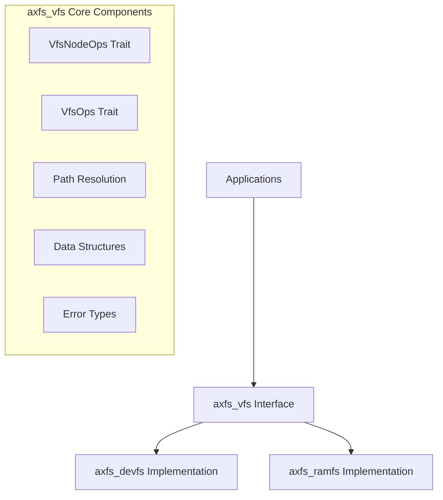
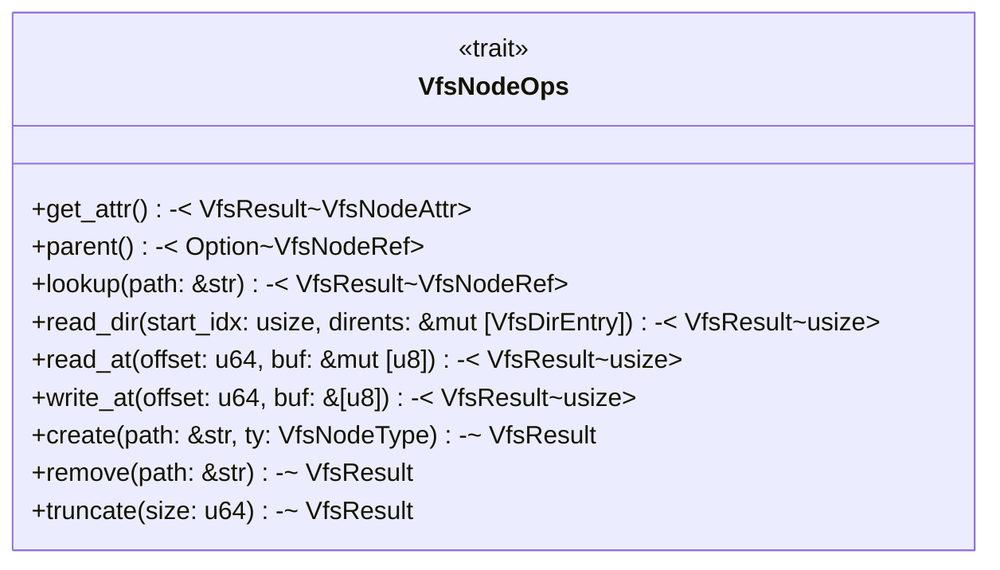
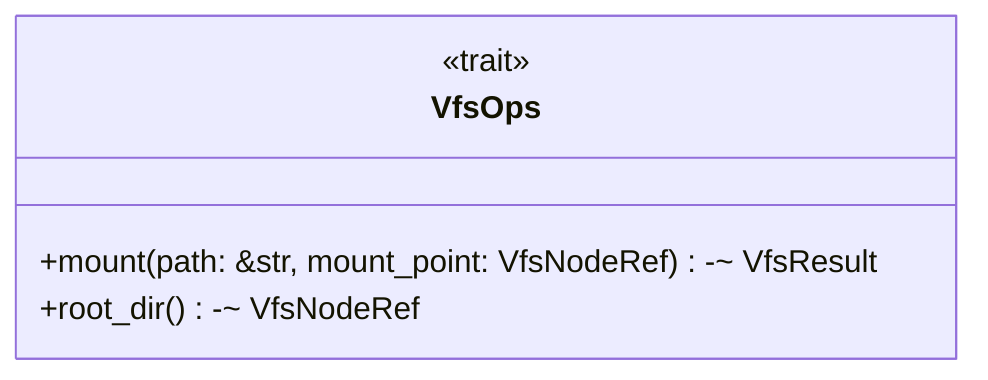
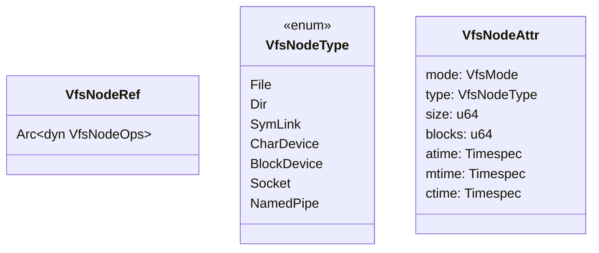
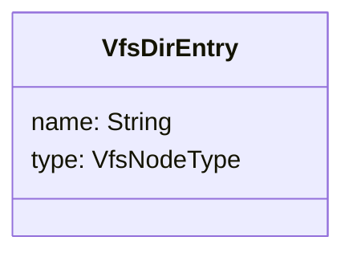
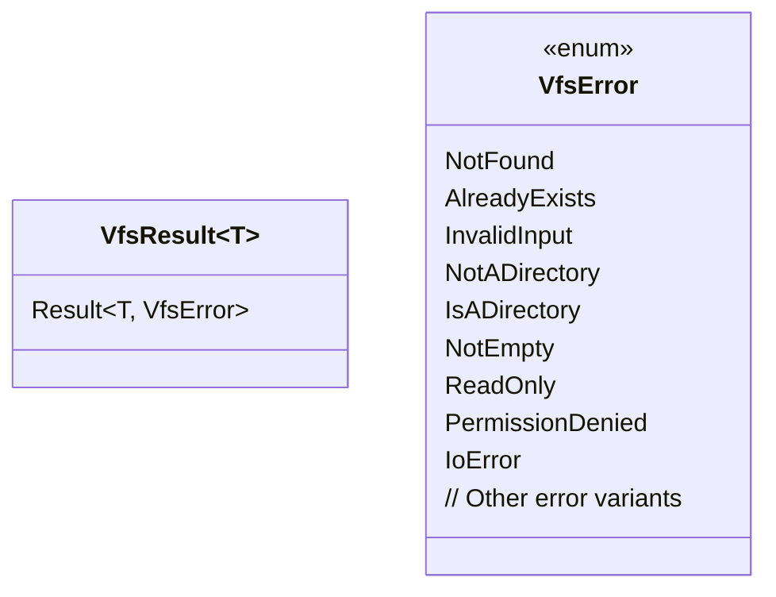
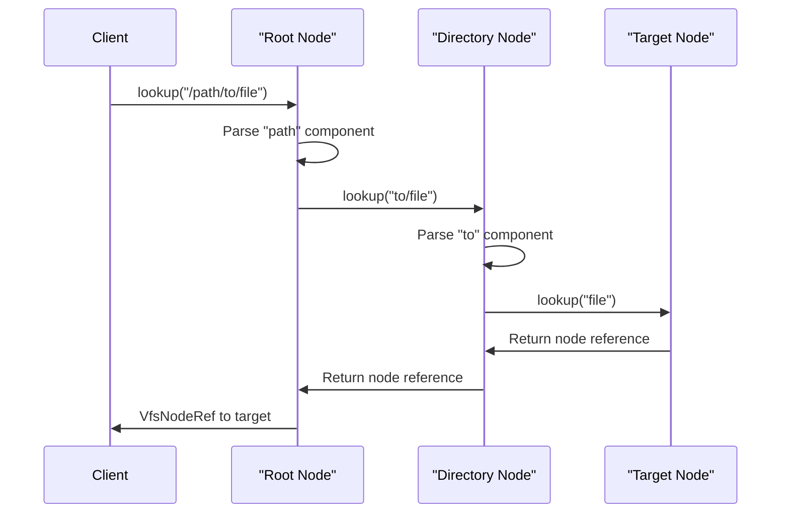
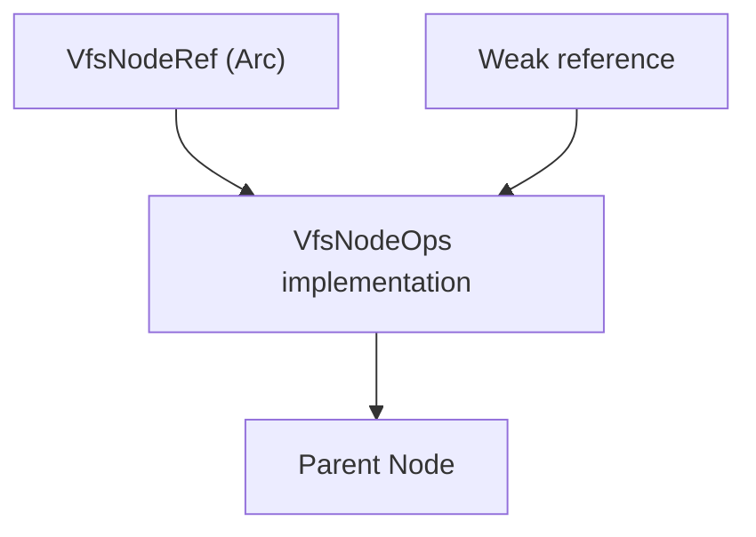
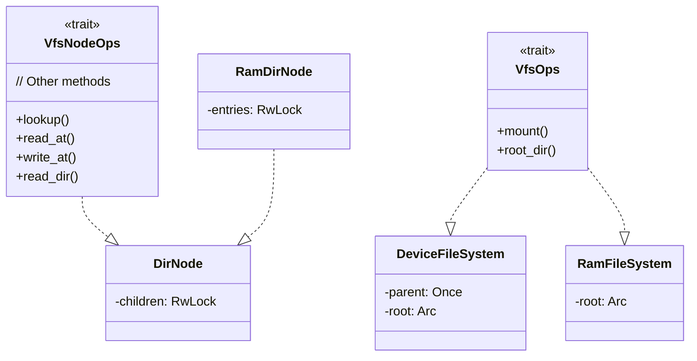

# Virtual File System Interface (axfs_vfs)

> **Relevant source files**
> * [Cargo.toml](https://github.com/arceos-org/axfs_crates/blob/0b21a163/Cargo.toml)
> * [README.md](https://github.com/arceos-org/axfs_crates/blob/0b21a163/README.md)
> * [axfs_devfs/README.md](https://github.com/arceos-org/axfs_crates/blob/0b21a163/axfs_devfs/README.md)

## Purpose and Scope

The `axfs_vfs` crate provides a virtual file system (VFS) abstraction layer for the axfs_crates ecosystem. It defines the fundamental interfaces and data structures that concrete file system implementations must adhere to. This abstraction allows applications to interact with different file system types through a unified interface without needing to understand their specific implementations.

This document covers the core traits, data structures, and interfaces defined in the `axfs_vfs` crate. For specific implementations, see [Device File System (axfs_devfs)](/arceos-org/axfs_crates/3-device-file-system-(axfs_devfs)) or [RAM File System (axfs_ramfs)](/arceos-org/axfs_crates/4-ram-file-system-(axfs_ramfs)).

## Architecture Overview

The Virtual File System Interface serves as the foundational abstraction layer in the axfs_crates architecture. It defines contracts that concrete file systems implement to provide specific functionality.

Sources: README.md

## Core Traits

The VFS interface is built around two primary traits that define the contract for file system implementations:

### VfsNodeOps Trait

The `VfsNodeOps` trait represents file system nodes (files, directories, devices) and defines operations that can be performed on these nodes.

* `get_attr()`: Retrieves attributes of the node (size, permissions, type, etc.)
* `parent()`: Returns a reference to the parent node if it exists
* `lookup()`: Resolves a path relative to this node
* `read_dir()`: Lists directory entries, returning the number of entries read
* `read_at()/write_at()`: Read/write operations at specified offsets
* `create()`: Creates a new file/directory under this node
* `remove()`: Removes a file/directory
* `truncate()`: Changes file size

### VfsOps Trait

The `VfsOps` trait represents operations at the file system level rather than individual nodes.

* `mount()`: Mounts a file system at the specified mount point
* `root_dir()`: Returns a reference to the root directory of the file system

Sources: High-Level System Architecture diagrams

## Data Structures

The `axfs_vfs` crate defines several key data structures used throughout the file system interface:

### Node Types and References

* `VfsNodeRef`: A reference-counted pointer to a trait object implementing `VfsNodeOps`
* `VfsNodeType`: Enumerates the possible types of file system nodes
* `VfsNodeAttr`: Contains metadata about a file system node

### Directory Entries

The `VfsDirEntry` structure represents entries in a directory, containing the name and type of each entry.

Sources: High-Level System Architecture diagrams

## Error Handling

The VFS interface uses the `VfsResult` type alias for error handling:

This approach provides a consistent error handling mechanism across all file system implementations.

Sources: High-Level System Architecture diagrams

## Path Resolution

Path resolution is a key functionality of the VFS interface, allowing for traversal of the file system hierarchy:

The path resolution algorithm:

1. Splits the path into components
2. Traverses the file system hierarchy recursively
3. At each step, calls the `lookup()` method on the current node
4. Returns a reference to the target node if found, or an error

Sources: High-Level System Architecture diagrams

## Memory Management

The VFS interface uses Rust's memory management features to ensure safety and prevent memory leaks:

* Uses `Arc` (Atomic Reference Counting) for shared ownership of nodes
* Employs weak references to prevent reference cycles (e.g., between parent and child nodes)
* Ensures thread safety for concurrent access through synchronization primitives

Sources: High-Level System Architecture diagrams

## Integration with File System Implementations

The `axfs_vfs` interfaces are implemented by concrete file systems to provide specific functionality:

* `axfs_devfs` implements the VFS interface to provide device files (/dev/null, /dev/zero, etc.)
* `axfs_ramfs` implements the VFS interface to provide a RAM-based file system
* Both implementations create their own node types that implement the `VfsNodeOps` trait

Sources: High-Level System Architecture diagrams

## Summary

The `axfs_vfs` crate provides a flexible, trait-based abstraction layer for file systems in the axfs_crates ecosystem. By defining common interfaces and data structures, it enables the development of different file system implementations that can be used interchangeably. The architecture follows Rust's ownership model and makes extensive use of trait objects and reference counting for safe and efficient memory management.