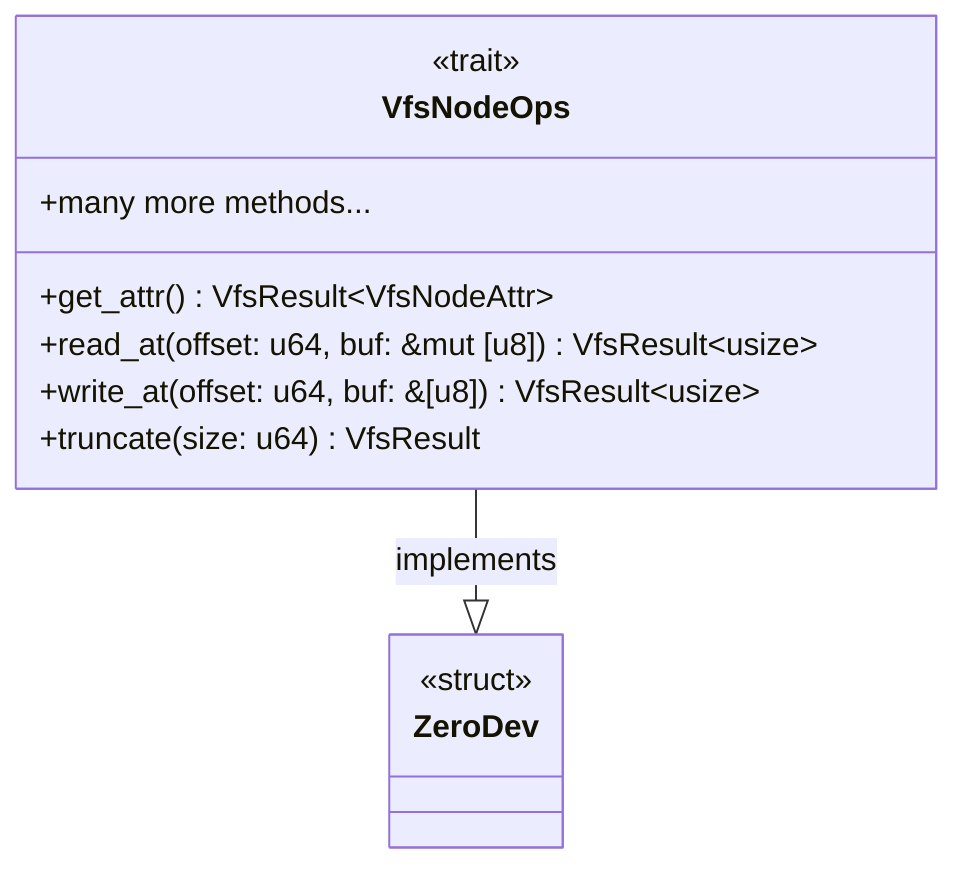
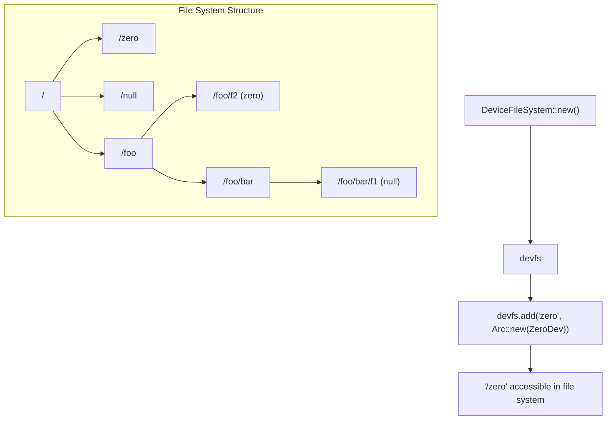

# Zero Device

> **Relevant source files**
> * [axfs_devfs/src/tests.rs](https://github.com/arceos-org/axfs_crates/blob/0b21a163/axfs_devfs/src/tests.rs)
> * [axfs_devfs/src/zero.rs](https://github.com/arceos-org/axfs_crates/blob/0b21a163/axfs_devfs/src/zero.rs)

The Zero Device (`ZeroDev`) is a special character device in the AxFS Device File System that mimics the behavior of the `/dev/zero` device in Unix-like operating systems. It provides an infinite stream of null bytes (`\0`) when read and silently discards any data written to it. This page documents the implementation, behavior, and usage of the Zero Device in the axfs_crates repository.

For information about the Null Device, which behaves differently, see [Null Device](/arceos-org/axfs_crates/3.2-null-device).

## Implementation

The Zero Device is implemented as a simple Rust struct that implements the `VfsNodeOps` trait defined in the Virtual File System interface.



The `ZeroDev` struct itself is extremely simple, containing no fields:

```
pub struct ZeroDev;
```

It implements the `VfsNodeOps` trait to provide the behavior expected of a zero device.

Sources: [axfs_devfs/src/zero.rs(L1 - L32)&emsp;](https://github.com/arceos-org/axfs_crates/blob/0b21a163/axfs_devfs/src/zero.rs#L1-L32)

## Behavior

### Read Operations

When any read operation is performed on the Zero Device, it fills the provided buffer completely with null bytes (`\0`) and returns the length of the buffer as the number of bytes read. This gives the appearance of an infinite stream of zeros.

```mermaid
sequenceDiagram
    participant Client as Client
    participant ZeroDev as ZeroDev

    Client ->> ZeroDev: read_at(offset, buffer)
    Note over ,ZeroDev: Fill buffer with zeros<br>(buffer.fill(0))
    ZeroDev ->> Client: Return buffer.len()
```

The implementation is straightforward:

```rust
fn read_at(&self, _offset: u64, buf: &mut [u8]) -> VfsResult<usize> {
    buf.fill(0);
    Ok(buf.len())
}
```

Sources: [axfs_devfs/src/zero.rs(L18 - L21)&emsp;](https://github.com/arceos-org/axfs_crates/blob/0b21a163/axfs_devfs/src/zero.rs#L18-L21)

### Write Operations

The Zero Device silently discards any data written to it, but it reports success as if the write operation completed successfully. The device always reports that all bytes were written, returning the length of the buffer.

```mermaid
sequenceDiagram
    participant Client as Client
    participant ZeroDev as ZeroDev

    Client ->> ZeroDev: write_at(offset, buffer)
    Note over ,ZeroDev: Discard all data<br>(do nothing)
    ZeroDev ->> Client: Return buffer.len()
```

The implementation is extremely minimal:

```rust
fn write_at(&self, _offset: u64, buf: &[u8]) -> VfsResult<usize> {
    Ok(buf.len())
}
```

Sources: [axfs_devfs/src/zero.rs(L23 - L25)&emsp;](https://github.com/arceos-org/axfs_crates/blob/0b21a163/axfs_devfs/src/zero.rs#L23-L25)

### Truncate Operation

The `truncate` method is implemented but effectively does nothing, as the Zero Device has no actual storage:

```rust
fn truncate(&self, _size: u64) -> VfsResult {
    Ok(())
}
```

Sources: [axfs_devfs/src/zero.rs(L27 - L29)&emsp;](https://github.com/arceos-org/axfs_crates/blob/0b21a163/axfs_devfs/src/zero.rs#L27-L29)

### Attributes

The Zero Device reports itself as a character device with size 0 and default file permissions:

```rust
fn get_attr(&self) -> VfsResult<VfsNodeAttr> {
    Ok(VfsNodeAttr::new(
        VfsNodePerm::default_file(),
        VfsNodeType::CharDevice,
        0,
        0,
    ))
}
```

Sources: [axfs_devfs/src/zero.rs(L9 - L16)&emsp;](https://github.com/arceos-org/axfs_crates/blob/0b21a163/axfs_devfs/src/zero.rs#L9-L16)

## Integration with Device File System

The Zero Device is typically mounted in a Device File System (DevFS) structure. The creation and mounting process is simple:



Sources: [axfs_devfs/src/tests.rs(L96 - L106)&emsp;](https://github.com/arceos-org/axfs_crates/blob/0b21a163/axfs_devfs/src/tests.rs#L96-L106)

## Usage Examples

### Creating a Zero Device

To create a Zero Device and add it to a Device File System, you need to:

1. Create a new `ZeroDev` instance
2. Wrap it in an `Arc` (Atomic Reference Count)
3. Add it to the Device File System with a name

```javascript
let devfs = DeviceFileSystem::new();
devfs.add("zero", Arc::new(ZeroDev));
```

You can also create Zero Devices in subdirectories:

```javascript
let dir_foo = devfs.mkdir("foo");
dir_foo.add("f2", Arc::new(ZeroDev));
```

Sources: [axfs_devfs/src/tests.rs(L104 - L109)&emsp;](https://github.com/arceos-org/axfs_crates/blob/0b21a163/axfs_devfs/src/tests.rs#L104-L109)

### Reading from a Zero Device

When reading from a Zero Device, the buffer will be filled with zeros regardless of the read position:

```javascript
let node = devfs.root_dir().lookup("zero")?;
let mut buf = [1; 32];  // Buffer filled with 1s
assert_eq!(node.read_at(10, &mut buf)?, 32);
assert_eq!(buf, [0; 32]);  // Buffer now filled with 0s
```

This demonstrates that regardless of the initial buffer content and the offset parameter, the Zero Device will always fill the buffer with zeros and return the full buffer length.

Sources: [axfs_devfs/src/tests.rs(L32 - L37)&emsp;](https://github.com/arceos-org/axfs_crates/blob/0b21a163/axfs_devfs/src/tests.rs#L32-L37)

### Writing to a Zero Device

Writing to a Zero Device always succeeds, even though the data is discarded:

```javascript
let node = devfs.root_dir().lookup("zero")?;
let buf = [1; 32];
assert_eq!(node.write_at(0, &buf)?, 32);  // Returns success with the buffer length
```

Sources: [axfs_devfs/src/tests.rs(L38)&emsp;](https://github.com/arceos-org/axfs_crates/blob/0b21a163/axfs_devfs/src/tests.rs#L38-L38)

## Summary

The Zero Device (`ZeroDev`) is a simple but useful virtual device in the AxFS Device File System that:

1. Provides an infinite stream of zero bytes (`\0`) when read
2. Silently discards all data written to it
3. Reports itself as a character device
4. Can be mounted at any location in the device file system

This implementation matches the behavior of the `/dev/zero` device in Unix-like systems, providing a consistent interface for applications expecting such a device.

Sources: [axfs_devfs/src/zero.rs(L1 - L32)&emsp;](https://github.com/arceos-org/axfs_crates/blob/0b21a163/axfs_devfs/src/zero.rs#L1-L32) [axfs_devfs/src/tests.rs(L32 - L38)&emsp;](https://github.com/arceos-org/axfs_crates/blob/0b21a163/axfs_devfs/src/tests.rs#L32-L38)