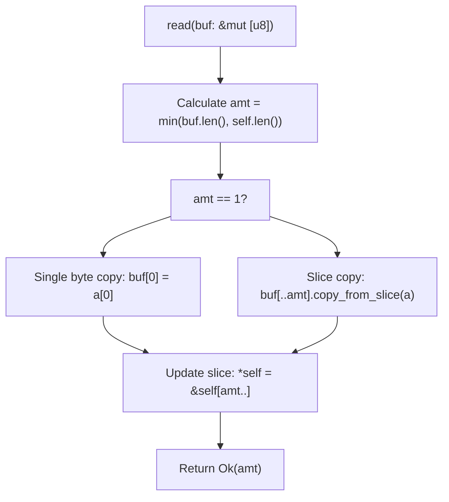
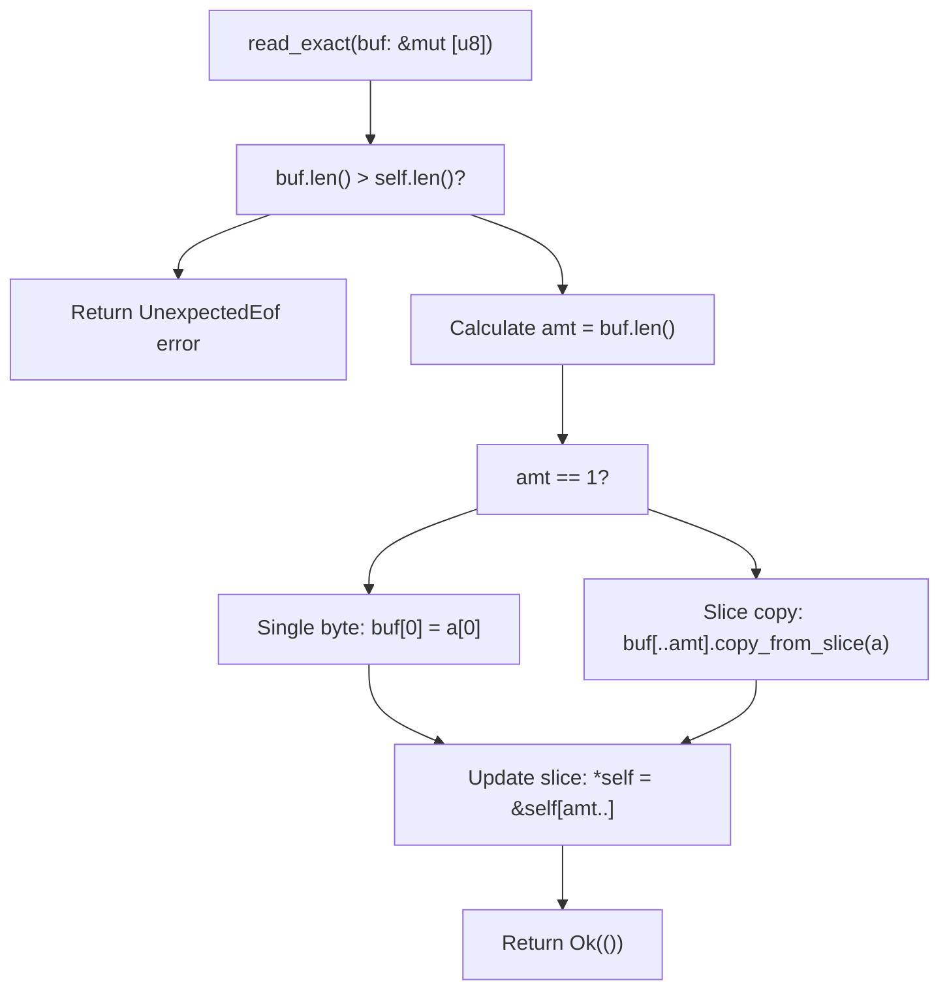
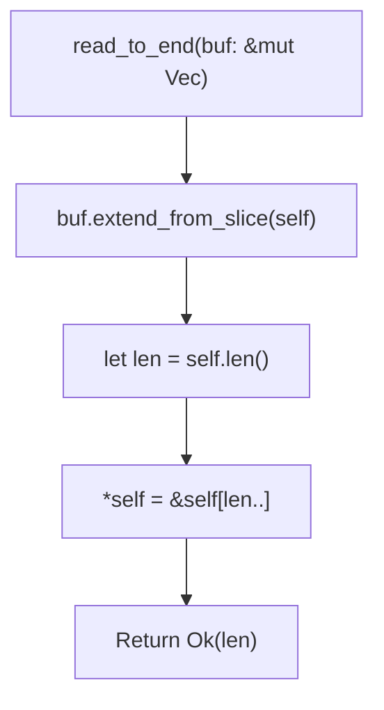
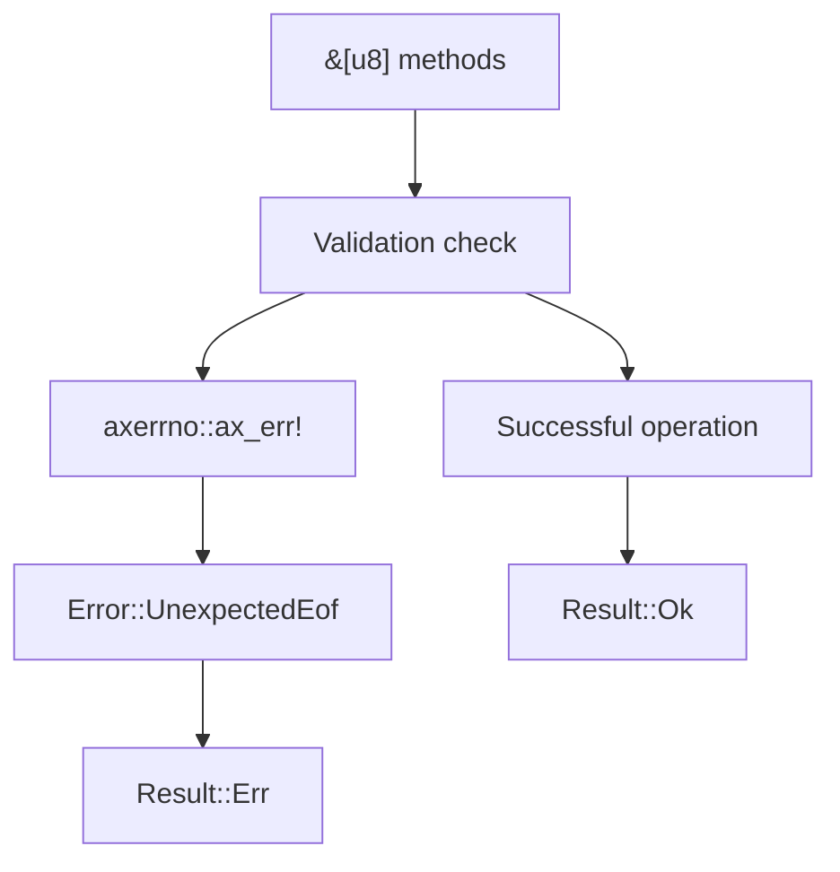

# Basic Type Implementations

> **Relevant source files**
> * [src/impls.rs](https://github.com/arceos-org/axio/blob/a675e6d5/src/impls.rs)
> * [src/lib.rs](https://github.com/arceos-org/axio/blob/a675e6d5/src/lib.rs)

This section documents the concrete implementations of I/O traits for basic Rust types provided by the axio crate. These implementations enable fundamental data types to participate in the I/O trait ecosystem without requiring additional wrapper types.

The primary focus is on implementations for byte slices (`&[u8]`), which provide efficient read operations directly from memory. For buffered I/O implementations like `BufReader`, see [Buffered I/O](/arceos-org/axio/4.1-buffered-io). For error handling across all implementations, see [Error Handling](/arceos-org/axio/5.1-error-handling).

## Byte Slice Read Implementation

The axio crate provides a comprehensive `Read` trait implementation for byte slices (`&[u8]`), enabling direct reading from memory buffers. This implementation is found in [src/impls.rs(L4 - L54)&emsp;](https://github.com/arceos-org/axio/blob/a675e6d5/src/impls.rs#L4-L54) and provides all core `Read` trait methods with performance optimizations.

### Implementation Overview

The `&[u8]` implementation supports three key methods from the `Read` trait:

|Method|Purpose|Feature Gate|
| --- | --- | --- |
|read()|Pull bytes into a buffer|Always available|
|read_exact()|Read exact number of bytes|Always available|
|read_to_end()|Read all remaining bytes|allocfeature|

Sources: [src/impls.rs(L4 - L54)&emsp;](https://github.com/arceos-org/axio/blob/a675e6d5/src/impls.rs#L4-L54)

### Core Read Method

The fundamental `read()` method implementation uses an optimized approach for copying data from the byte slice to the destination buffer:



**Byte Slice Read Operation Flow**

The implementation includes a performance optimization that avoids the overhead of `copy_from_slice` for single-byte reads, directly assigning `buf[0] = a[0]` instead.

Sources: [src/impls.rs(L6 - L22)&emsp;](https://github.com/arceos-org/axio/blob/a675e6d5/src/impls.rs#L6-L22)

### Exact Read Implementation

The `read_exact()` method provides guaranteed completion semantics, either reading the exact requested amount or returning an error:



**Exact Read Operation Flow**

This method differs from `read()` by guaranteeing that either all requested bytes are read or an `UnexpectedEof` error is returned.

Sources: [src/impls.rs(L25 - L44)&emsp;](https://github.com/arceos-org/axio/blob/a675e6d5/src/impls.rs#L25-L44)

### Allocation-Dependent Methods

When the `alloc` feature is enabled, the byte slice implementation provides `read_to_end()`, which efficiently transfers all remaining data:



**Read to End Operation Flow**

This implementation leverages `Vec::extend_from_slice()` for optimal performance when copying all remaining data from the byte slice.

Sources: [src/impls.rs(L47 - L53)&emsp;](https://github.com/arceos-org/axio/blob/a675e6d5/src/impls.rs#L47-L53)

## Trait Method Mapping

The following diagram shows how the generic `Read` trait methods map to specific implementations for byte slices:

```mermaid
classDiagram
note for Read "Optimized for memory efficiencySingle-byte copy optimizationDirect slice manipulation"
note for ByteSliceImpl "Optimized for memory efficiencySingle-byte copy optimizationDirect slice manipulation"
note for Read "Unsupported markdown: list"
class Read {
    <<trait>>
    
    +read(buf: &mut [u8]) Result~usize~
    +read_exact(buf: &mut [u8]) Result~() ~
    +read_to_end(buf: &mut Vec~u8~) Result~usize~
}

class ByteSliceImpl {
    
    +read(buf: &mut [u8]) Result~usize~
    +read_exact(buf: &mut [u8]) Result~() ~
    +read_to_end(buf: &mut Vec~u8~) Result~usize~
}

class &[u8] {
    -data: bytes
    -position: usize
    
}

Read  ..|>  ByteSliceImpl : implements
ByteSliceImpl  -->  ByteSliceImpl : operates on
```

**Trait Implementation Relationship**

Sources: [src/lib.rs(L152 - L188)&emsp;](https://github.com/arceos-org/axio/blob/a675e6d5/src/lib.rs#L152-L188) [src/impls.rs(L4 - L54)&emsp;](https://github.com/arceos-org/axio/blob/a675e6d5/src/impls.rs#L4-L54)

## Performance Characteristics

The byte slice implementation includes several performance optimizations:

### Memory Copy Optimization

The implementation uses conditional logic to optimize memory operations based on the amount of data being copied:

|Scenario|Implementation|Rationale|
| --- | --- | --- |
|Single byte (amt == 1)|Direct assignment:buf[0] = a[0]|Avoidsmemcpyoverhead|
|Multiple bytes (amt > 1)|Slice copy:copy_from_slice(a)|Leverages optimizedmemcpy|

### Slice Management

All methods update the source slice pointer (`*self = b`) to reflect consumed data, maintaining zero-copy semantics where the slice reference advances through the underlying data without additional allocations.

Sources: [src/impls.rs(L14 - L18)&emsp;](https://github.com/arceos-org/axio/blob/a675e6d5/src/impls.rs#L14-L18) [src/impls.rs(L36 - L40)&emsp;](https://github.com/arceos-org/axio/blob/a675e6d5/src/impls.rs#L36-L40)

## Error Handling Integration

The byte slice implementations integrate with the axio error system through the `axerrno` crate:



**Error Flow in Byte Slice Operations**

The primary error condition for byte slice operations is `UnexpectedEof`, which occurs when `read_exact()` is called with a buffer larger than the remaining slice data.

Sources: [src/impls.rs(L27)&emsp;](https://github.com/arceos-org/axio/blob/a675e6d5/src/impls.rs#L27-L27) [src/error.rs](https://github.com/arceos-org/axio/blob/a675e6d5/src/error.rs)