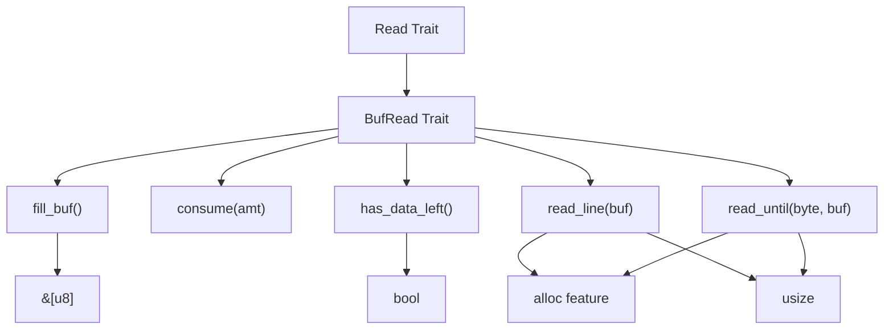
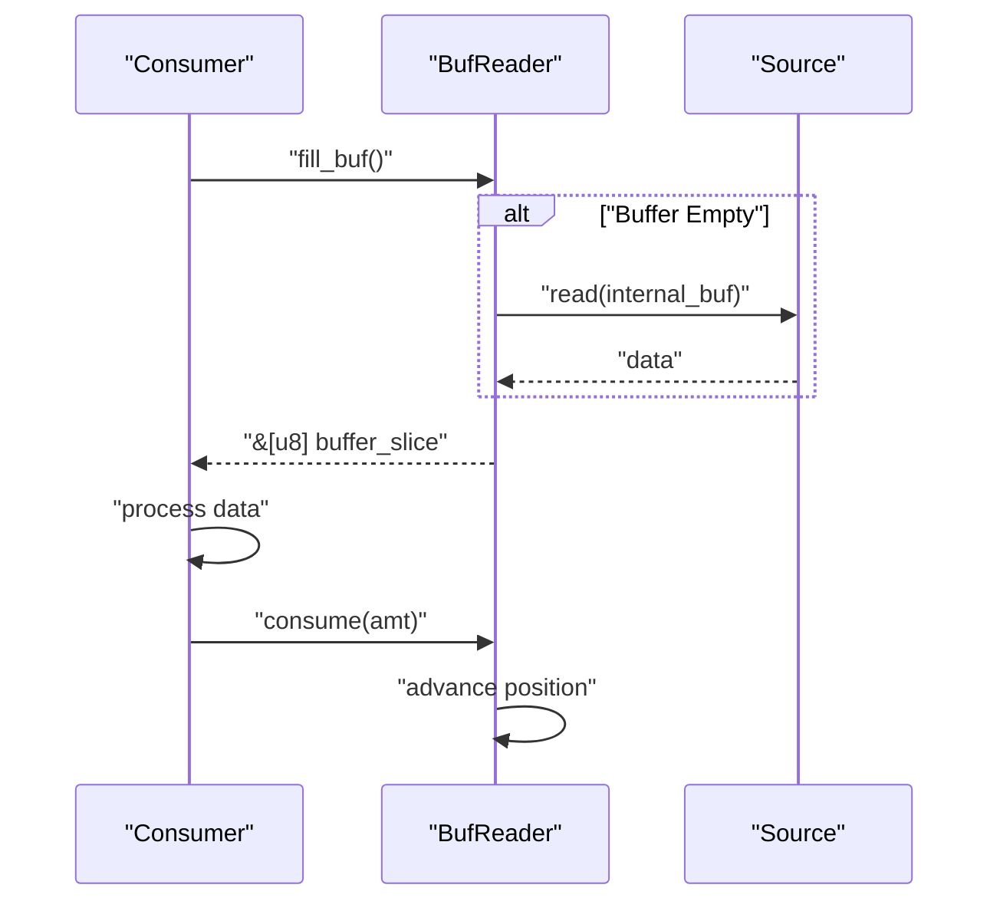
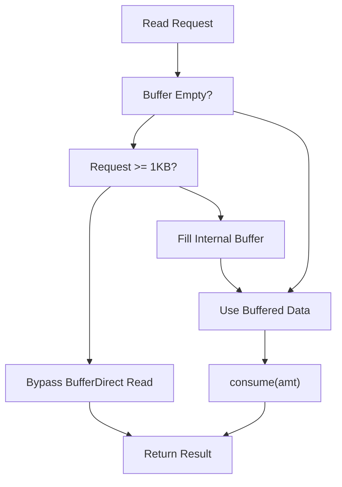
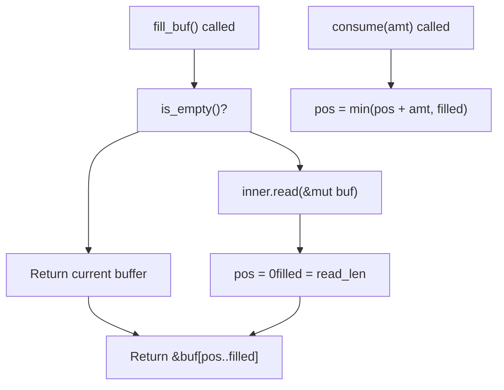
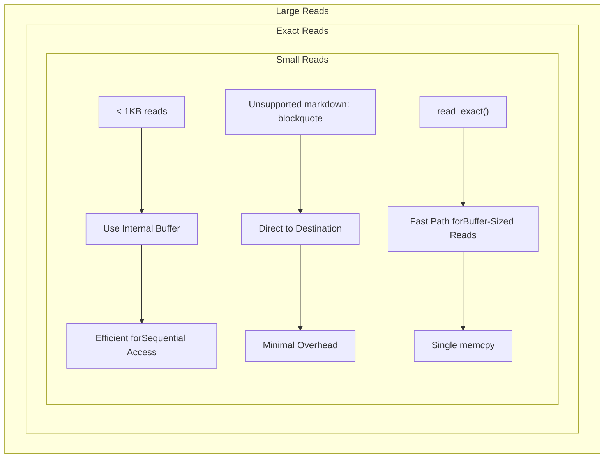

# Buffered I/O

> **Relevant source files**
> * [src/buffered/bufreader.rs](https://github.com/arceos-org/axio/blob/a675e6d5/src/buffered/bufreader.rs)
> * [src/buffered/mod.rs](https://github.com/arceos-org/axio/blob/a675e6d5/src/buffered/mod.rs)
> * [src/lib.rs](https://github.com/arceos-org/axio/blob/a675e6d5/src/lib.rs)

This document covers the buffered I/O functionality provided by the axio crate, specifically focusing on the `BufRead` trait and its concrete implementation `BufReader<R>`. Buffered I/O enables efficient reading from sources by maintaining an internal buffer, reducing the number of system calls and improving performance for sequential read operations.

For information about basic I/O trait implementations for primitive types, see [Basic Type Implementations](/arceos-org/axio/4.2-basic-type-implementations). For details about the core I/O traits that form the foundation of this buffered system, see [Core I/O Traits](/arceos-org/axio/2-core-io-traits).

## BufRead Trait

The `BufRead` trait extends the basic `Read` trait to provide buffered reading capabilities. It defines the interface for readers that maintain an internal buffer, allowing for more efficient reading patterns and specialized operations like reading until a delimiter.

### Core Methods

The trait defines several key methods for buffer management and specialized reading:

|Method|Purpose|Availability|
| --- | --- | --- |
|fill_buf()|Returns buffered data, filling from source if empty|Always|
|consume(amt)|Marks bytes as consumed from buffer|Always|
|has_data_left()|Checks if more data is available|Always|
|read_until(byte, buf)|Reads until delimiter or EOF|allocfeature|
|read_line(buf)|Reads until newline|allocfeature|



**Sources:** [src/lib.rs(L305 - L355)&emsp;](https://github.com/arceos-org/axio/blob/a675e6d5/src/lib.rs#L305-L355)

### Buffer Management Protocol

The `BufRead` trait establishes a protocol for buffer management through the interaction between `fill_buf()` and `consume()`:

1. `fill_buf()` returns a reference to the internal buffer, filling it from the underlying source if necessary
2. Consumer reads from the returned buffer slice
3. `consume(amt)` notifies the buffer that `amt` bytes have been processed and can be discarded



**Sources:** [src/lib.rs(L308 - L312)&emsp;](https://github.com/arceos-org/axio/blob/a675e6d5/src/lib.rs#L308-L312) [src/buffered/bufreader.rs(L146 - L158)&emsp;](https://github.com/arceos-org/axio/blob/a675e6d5/src/buffered/bufreader.rs#L146-L158)

## BufReader Implementation

The `BufReader<R>` struct provides a concrete implementation of buffered reading for any type that implements `Read`. It maintains a fixed-size internal buffer and implements both `Read` and `BufRead` traits.

### Internal Structure

```mermaid
flowchart TD
subgraph subGraph1["Buffer State"]
    consumed["Consumed Data[0..pos)"]
    available["Available Data[pos..filled)"]
    empty["Empty Space[filled..1024)"]
end
subgraph BufReader<R>["BufReader"]
    inner["inner: R"]
    pos["pos: usize"]
    filled["filled: usize"]
    buf["buf: [u8; 1024]"]
end
source["Underlying Reader"]

filled --> available
filled --> empty
inner --> source
pos --> available
pos --> consumed
```

**Sources:** [src/buffered/bufreader.rs(L8 - L26)&emsp;](https://github.com/arceos-org/axio/blob/a675e6d5/src/buffered/bufreader.rs#L8-L26)

The `BufReader` maintains state through three key fields:

* `inner`: The wrapped reader of type `R`
* `pos`: Current read position within the buffer
* `filled`: Number of valid bytes in the buffer
* `buf`: Fixed 1KB buffer array

### Buffer Management Implementation

The `BufReader` implements sophisticated buffer management to optimize different reading patterns:



**Sources:** [src/buffered/bufreader.rs(L68 - L83)&emsp;](https://github.com/arceos-org/axio/blob/a675e6d5/src/buffered/bufreader.rs#L68-L83)

### Read Trait Implementation

The `Read` implementation for `BufReader` includes several optimizations:

#### Large Read Bypass

When the buffer is empty and the requested read size is at least 1KB (the buffer capacity), `BufReader` bypasses its internal buffer entirely and reads directly into the destination buffer.

#### Optimized read_exact

For small exact reads that fit within the current buffer, `BufReader` provides an optimized path that avoids the loop in the default `read_exact` implementation.

#### Delegation for read_to_end

The `read_to_end` method drains the current buffer first, then delegates to the inner reader's potentially optimized implementation.

**Sources:** [src/buffered/bufreader.rs(L89 - L108)&emsp;](https://github.com/arceos-org/axio/blob/a675e6d5/src/buffered/bufreader.rs#L89-L108)

### BufRead Trait Implementation

The `BufRead` implementation manages the internal buffer state:



**Sources:** [src/buffered/bufreader.rs(L146 - L158)&emsp;](https://github.com/arceos-org/axio/blob/a675e6d5/src/buffered/bufreader.rs#L146-L158)

## Buffer Allocation Strategies

The `BufReader` uses a fixed-size buffer allocation strategy that balances memory usage with performance:

|Aspect|Implementation|Rationale|
| --- | --- | --- |
|Buffer Size|1024 bytes (1KB)|Balances memory usage with read efficiency|
|Allocation|Stack-allocated array|Avoids heap allocation, suitable forno_std|
|Reuse|Buffer is reused across reads|Minimizes allocation overhead|

The buffer size constant is defined as `DEFAULT_BUF_SIZE: usize = 1024` and cannot be configured at runtime, ensuring predictable memory usage in constrained environments.

**Sources:** [src/buffered/bufreader.rs(L6)&emsp;](https://github.com/arceos-org/axio/blob/a675e6d5/src/buffered/bufreader.rs#L6-L6) [src/buffered/bufreader.rs(L13)&emsp;](https://github.com/arceos-org/axio/blob/a675e6d5/src/buffered/bufreader.rs#L13-L13)

## Performance Optimizations

### Read Pattern Optimization



**Sources:** [src/buffered/bufreader.rs(L73 - L76)&emsp;](https://github.com/arceos-org/axio/blob/a675e6d5/src/buffered/bufreader.rs#L73-L76) [src/buffered/bufreader.rs(L89 - L97)&emsp;](https://github.com/arceos-org/axio/blob/a675e6d5/src/buffered/bufreader.rs#L89-L97)

### String Reading Optimization

For `read_to_string()` operations, `BufReader` implements an optimization that avoids unnecessary memory copies when the target string is empty, allowing direct reading into the string's internal buffer.

**Sources:** [src/buffered/bufreader.rs(L113 - L142)&emsp;](https://github.com/arceos-org/axio/blob/a675e6d5/src/buffered/bufreader.rs#L113-L142)

## Feature Dependencies

The buffered I/O implementation has conditional compilation based on the `alloc` feature:

|Feature State|Available Methods|Limitations|
| --- | --- | --- |
|Withoutalloc|Core buffering, basic reads|No dynamic allocation methods|
|Withalloc|All methods includingread_until,read_line|Full functionality|

Methods requiring dynamic allocation are conditionally compiled and only available when the `alloc` feature is enabled.

**Sources:** [src/buffered/bufreader.rs(L3 - L4)&emsp;](https://github.com/arceos-org/axio/blob/a675e6d5/src/buffered/bufreader.rs#L3-L4) [src/buffered/bufreader.rs(L101)&emsp;](https://github.com/arceos-org/axio/blob/a675e6d5/src/buffered/bufreader.rs#L101-L101) [src/buffered/bufreader.rs(L112)&emsp;](https://github.com/arceos-org/axio/blob/a675e6d5/src/buffered/bufreader.rs#L112-L112)