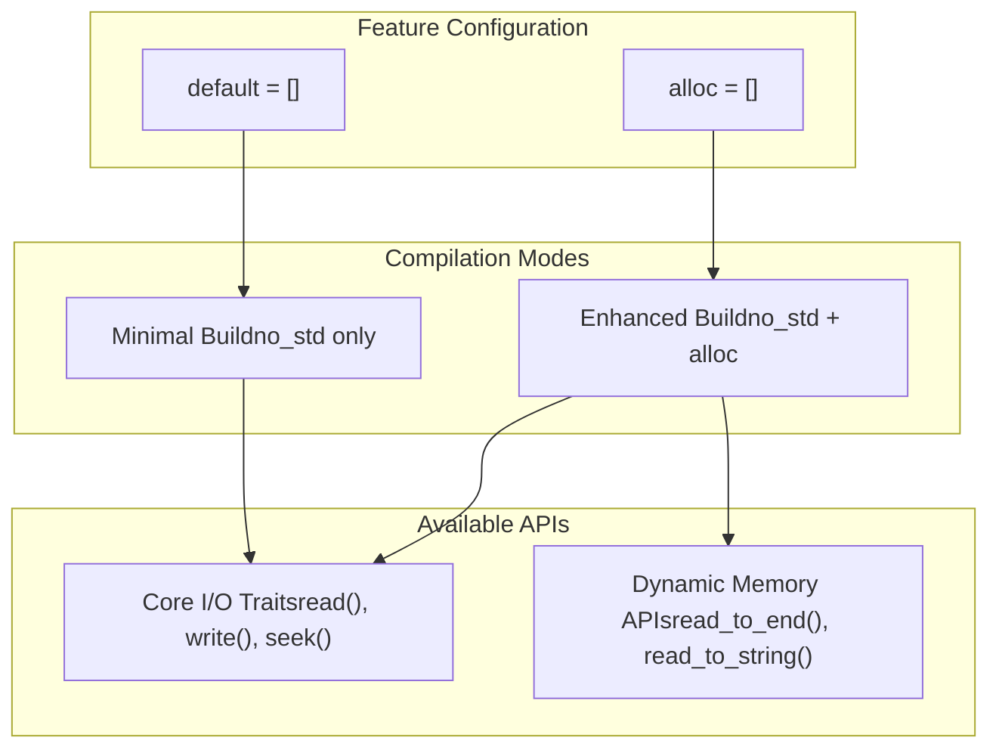
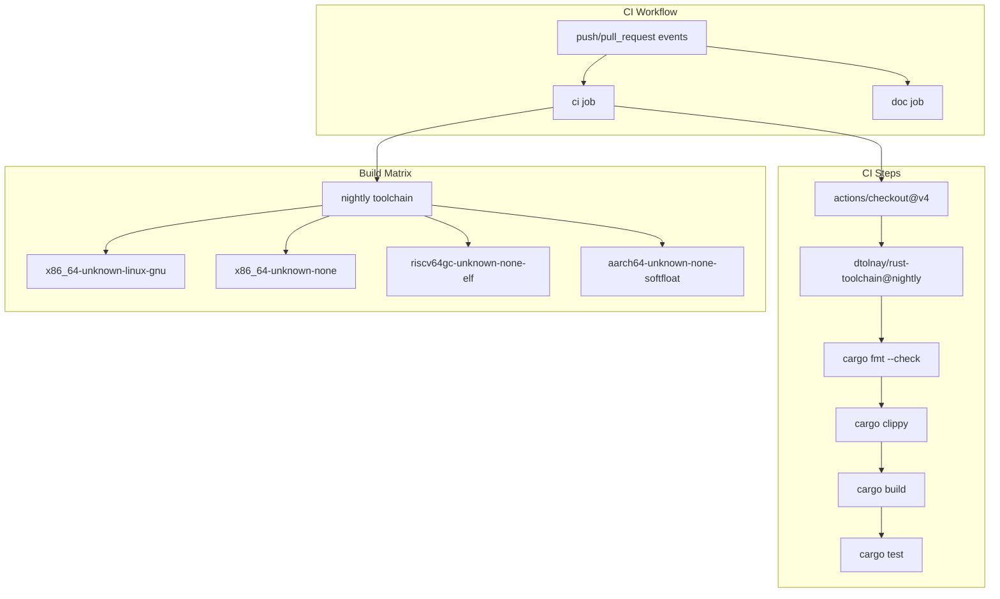
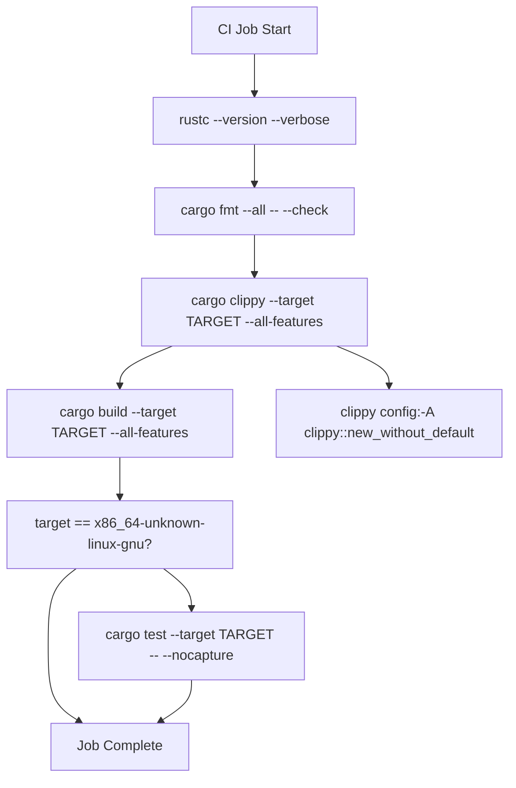
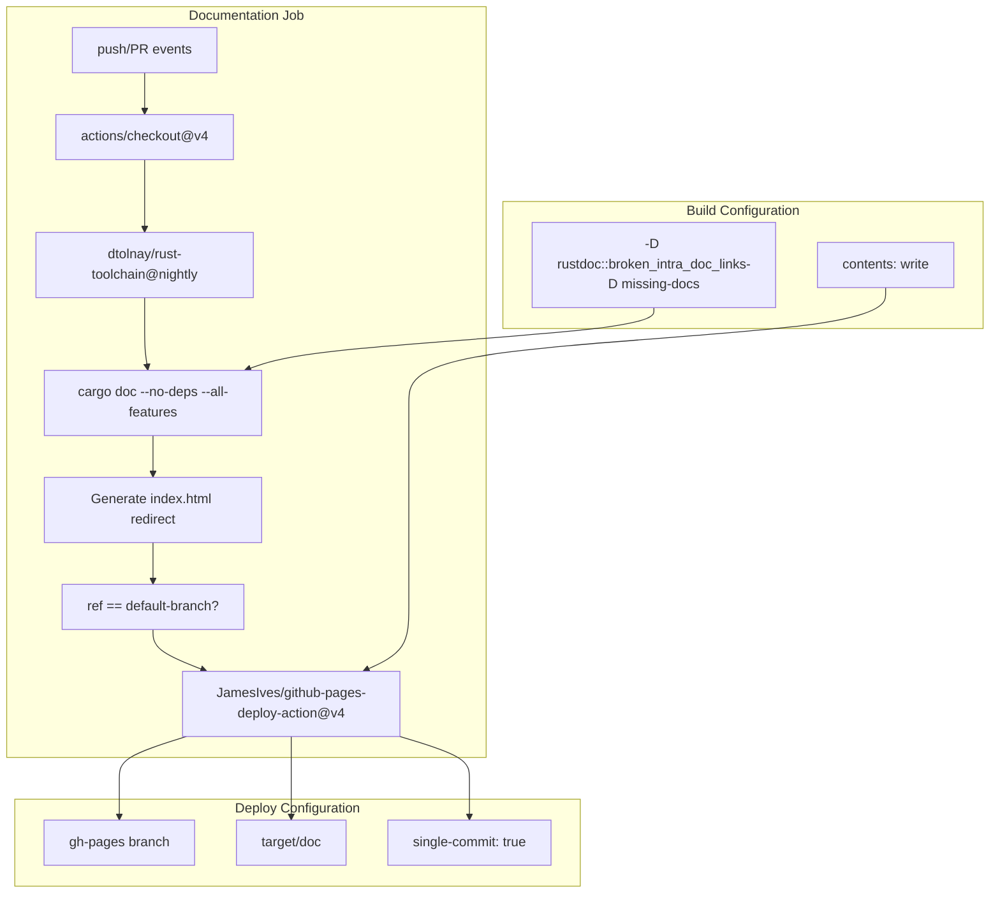

# Build System and CI

> **Relevant source files**
> * [.github/workflows/ci.yml](https://github.com/arceos-org/axio/blob/a675e6d5/.github/workflows/ci.yml)
> * [Cargo.toml](https://github.com/arceos-org/axio/blob/a675e6d5/Cargo.toml)

This document covers the build system configuration and continuous integration pipeline for the axio crate. It explains how the project is structured for compilation across multiple target platforms, the automated testing strategy, and the documentation deployment process. For information about the crate's feature configuration and dependencies, see [Crate Configuration and Features](/arceos-org/axio/3-crate-configuration-and-features).

## Build Configuration

The axio crate uses a minimal build configuration designed for `no_std` compatibility across diverse target platforms. The build system is defined primarily through `Cargo.toml` and supports conditional compilation based on feature flags.

### Package Metadata and Dependencies

The crate is configured as a library package with specific metadata targeting the embedded and OS kernel development ecosystem:

|Configuration|Value|
| --- | --- |
|Package Name|axio|
|Version|0.1.1|
|Edition|2021|
|License|Dual/Triple licensed (GPL-3.0-or-later OR Apache-2.0 OR MulanPSL-2.0)|

The dependency structure is intentionally minimal, with only one required dependency:

* `axerrno = "0.1"` - Provides error handling types compatible with `no_std` environments

### Feature Gate Configuration

The build system supports feature-based conditional compilation through two defined features:

Sources: [Cargo.toml(L14 - L16)&emsp;](https://github.com/arceos-org/axio/blob/a675e6d5/Cargo.toml#L14-L16)

## CI Pipeline Architecture

The continuous integration system uses GitHub Actions to validate code quality, build compatibility, and documentation generation across multiple target platforms. The pipeline is defined in a single workflow file that orchestrates multiple jobs.

### Workflow Trigger Configuration

The CI pipeline activates on two primary events:

* Push events to any branch
* Pull request events

### Multi-Target Build Matrix

The CI system employs a matrix strategy to test compilation across diverse target platforms:

Sources: [.github/workflows/ci.yml(L1 - L31)&emsp;](https://github.com/arceos-org/axio/blob/a675e6d5/.github/workflows/ci.yml#L1-L31)

### Target Platform Categories

The build matrix validates compatibility across three categories of target platforms:

|Target|Architecture|Environment|Purpose|
| --- | --- | --- | --- |
|x86_64-unknown-linux-gnu|x86_64|Linux with std|Testing and validation|
|x86_64-unknown-none|x86_64|Bare metal|OS kernel development|
|riscv64gc-unknown-none-elf|RISC-V|Bare metal|Embedded systems|
|aarch64-unknown-none-softfloat|ARM64|Bare metal|ARM-based embedded|

Sources: [.github/workflows/ci.yml(L12)&emsp;](https://github.com/arceos-org/axio/blob/a675e6d5/.github/workflows/ci.yml#L12-L12)

## Quality Assurance Pipeline

The CI system implements a comprehensive quality assurance strategy that validates code formatting, linting, compilation, and functional correctness.

### Code Quality Checks

The quality assurance pipeline executes the following checks in sequence:

Sources: [.github/workflows/ci.yml(L20 - L30)&emsp;](https://github.com/arceos-org/axio/blob/a675e6d5/.github/workflows/ci.yml#L20-L30)

### Testing Strategy

Unit tests are executed only on the `x86_64-unknown-linux-gnu` target, which provides a standard library environment suitable for test execution. The testing configuration includes:

* **Test Command**: `cargo test --target x86_64-unknown-linux-gnu -- --nocapture`
* **Output Mode**: No capture mode for detailed test output
* **Conditional Execution**: Only runs on Linux GNU target to avoid `no_std` test environment complications

Sources: [.github/workflows/ci.yml(L28 - L30)&emsp;](https://github.com/arceos-org/axio/blob/a675e6d5/.github/workflows/ci.yml#L28-L30)

## Documentation Generation and Deployment

The CI pipeline includes a separate job dedicated to documentation generation and automated deployment to GitHub Pages.

### Documentation Build Process

### Documentation Quality Enforcement

The documentation build process enforces strict quality standards through `RUSTDOCFLAGS`:

* **Broken Link Detection**: `-D rustdoc::broken_intra_doc_links` treats broken documentation links as errors
* **Missing Documentation**: `-D missing-docs` requires documentation for all public APIs

The index generation creates a redirect page using the crate name extracted from `cargo tree` output, providing seamless navigation to the main documentation.

Sources: [.github/workflows/ci.yml(L32 - L55)&emsp;](https://github.com/arceos-org/axio/blob/a675e6d5/.github/workflows/ci.yml#L32-L55)

### Deployment Strategy

Documentation deployment follows a conditional strategy:

* **Automatic Deployment**: Occurs only on pushes to the default branch
* **Target Branch**: `gh-pages` branch for GitHub Pages hosting
* **Deployment Mode**: Single commit to maintain clean history
* **Content Source**: `target/doc` directory containing generated documentation

Sources: [.github/workflows/ci.yml(L49 - L55)&emsp;](https://github.com/arceos-org/axio/blob/a675e6d5/.github/workflows/ci.yml#L49-L55)