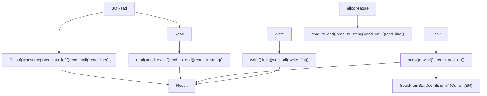
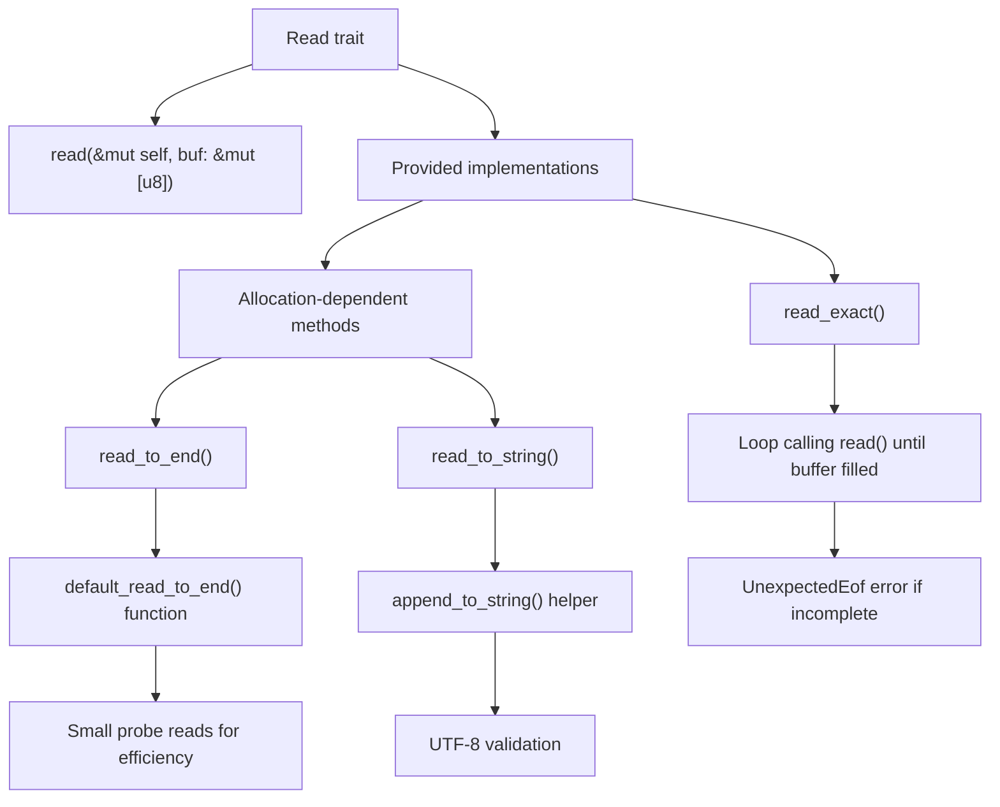
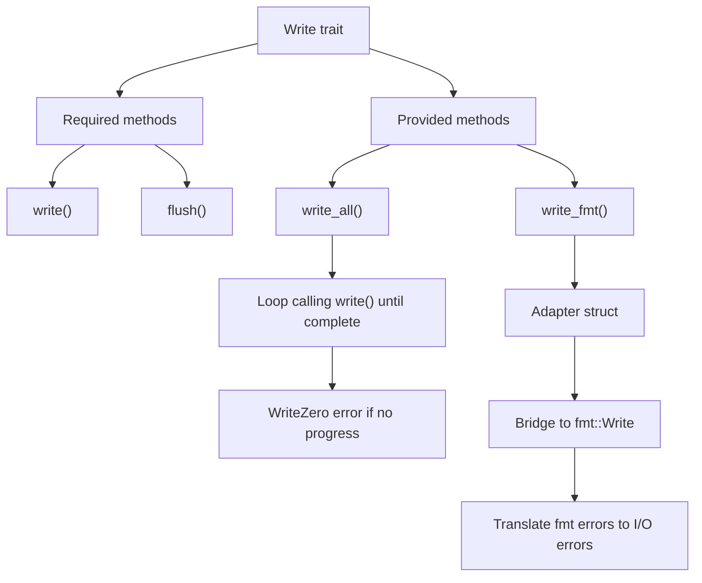
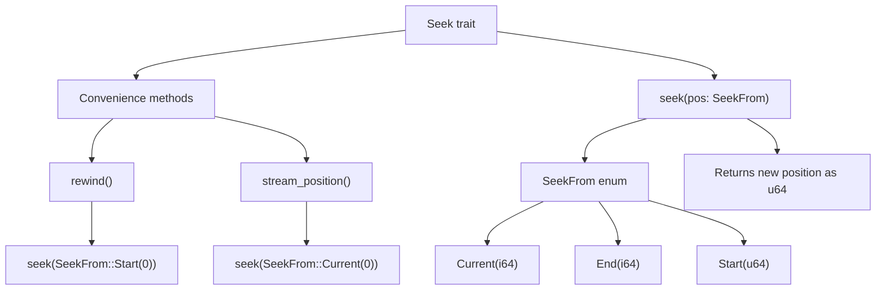
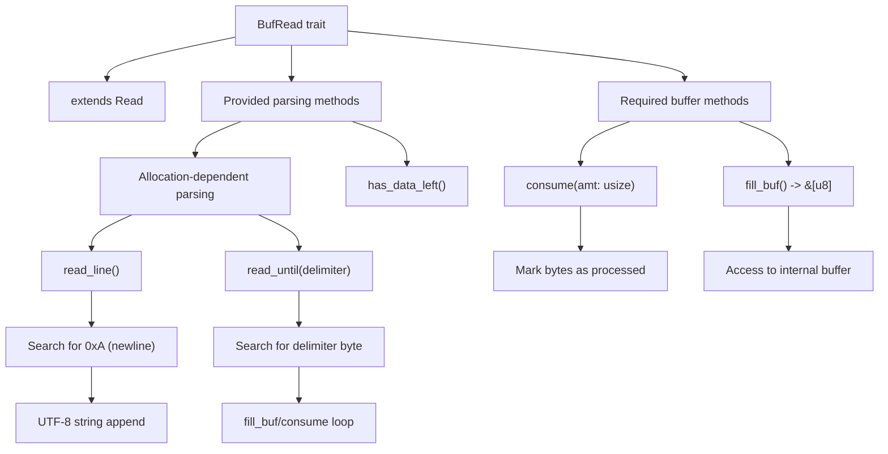
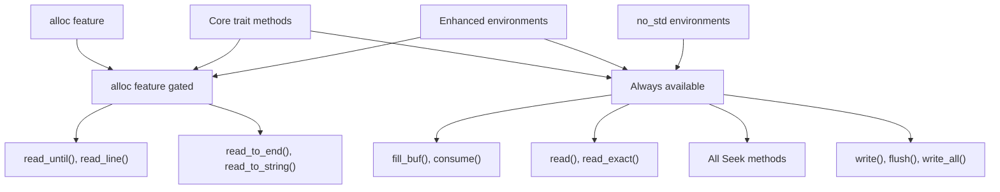

# Core I/O Traits

> **Relevant source files**
> * [src/lib.rs](https://github.com/arceos-org/axio/blob/a675e6d5/src/lib.rs)

This page documents the four fundamental I/O traits that form the foundation of the `axio` library: `Read`, `Write`, `Seek`, and `BufRead`. These traits provide a `std::io`-compatible interface for performing I/O operations in `no_std` environments.

The traits are designed to mirror Rust's standard library I/O traits while supporting resource-constrained environments through optional allocation-dependent features. For information about concrete implementations of these traits, see [Implementations](/arceos-org/axio/4-implementations). For details about the crate's feature configuration and dependency management, see [Crate Configuration and Features](/arceos-org/axio/3-crate-configuration-and-features).

## Trait Hierarchy and Relationships

The core I/O traits in `axio` form a well-structured hierarchy where `BufRead` extends `Read`, while `Write` and `Seek` operate independently. The following diagram shows the relationships between traits and their key methods:



Sources: [src/lib.rs(L152 - L355)&emsp;](https://github.com/arceos-org/axio/blob/a675e6d5/src/lib.rs#L152-L355)

## The Read Trait

The `Read` trait provides the fundamental interface for reading bytes from a source. It defines both required and optional methods, with some methods only available when the `alloc` feature is enabled.

### Core Methods

|Method|Signature|Description|Feature Requirement|
| --- | --- | --- | --- |
|read|fn read(&mut self, buf: &mut [u8]) -> Result<usize>|Required method to read bytes into buffer|None|
|read_exact|fn read_exact(&mut self, buf: &mut [u8]) -> Result<()>|Read exact number of bytes to fill buffer|None|
|read_to_end|fn read_to_end(&mut self, buf: &mut Vec<u8>) -> Result<usize>|Read all bytes until EOF|alloc|
|read_to_string|fn read_to_string(&mut self, buf: &mut String) -> Result<usize>|Read all bytes as UTF-8 string|alloc|

The `read` method is the only required implementation. The `read_exact` method provides a default implementation that repeatedly calls `read` until the buffer is filled or EOF is reached. When EOF is encountered before the buffer is filled, it returns an `UnexpectedEof` error.



Sources: [src/lib.rs(L152 - L188)&emsp;](https://github.com/arceos-org/axio/blob/a675e6d5/src/lib.rs#L152-L188)

### Memory-Efficient Reading Strategy

The `default_read_to_end` function implements an optimized reading strategy that balances performance with memory usage. It uses several techniques:

* **Small probe reads**: Initial 32-byte reads to avoid unnecessary capacity expansion
* **Adaptive buffer sizing**: Dynamically adjusts read buffer size based on reader behavior
* **Capacity management**: Uses `try_reserve` to handle allocation failures gracefully
* **Short read detection**: Tracks consecutive short reads to optimize buffer sizes

Sources: [src/lib.rs(L26 - L150)&emsp;](https://github.com/arceos-org/axio/blob/a675e6d5/src/lib.rs#L26-L150)

## The Write Trait

The `Write` trait provides the interface for writing bytes to a destination. Like `Read`, it has one required method with several provided implementations.

### Core Methods

|Method|Signature|Description|
| --- | --- | --- |
|write|fn write(&mut self, buf: &[u8]) -> Result<usize>|Required method to write bytes from buffer|
|flush|fn flush(&mut self) -> Result<()>|Required method to flush buffered data|
|write_all|fn write_all(&mut self, buf: &[u8]) -> Result<()>|Write entire buffer or return error|
|write_fmt|fn write_fmt(&mut self, fmt: fmt::Arguments<'_>) -> Result<()>|Write formatted output|

The `write_all` method ensures that the entire buffer is written by repeatedly calling `write` until completion. If `write` returns 0 (indicating no progress), it returns a `WriteZero` error.

The `write_fmt` method enables formatted output support by implementing a bridge between `fmt::Write` and the I/O `Write` trait through an internal `Adapter` struct.



Sources: [src/lib.rs(L190 - L249)&emsp;](https://github.com/arceos-org/axio/blob/a675e6d5/src/lib.rs#L190-L249)

## The Seek Trait

The `Seek` trait provides cursor positioning within streams that support random access. It works with the `SeekFrom` enum to specify different seeking strategies.

### Methods and SeekFrom Enum

|Method|Signature|Description|
| --- | --- | --- |
|seek|fn seek(&mut self, pos: SeekFrom) -> Result<u64>|Required method to seek to specified position|
|rewind|fn rewind(&mut self) -> Result<()>|Convenience method to seek to beginning|
|stream_position|fn stream_position(&mut self) -> Result<u64>|Get current position in stream|

The `SeekFrom` enum defines three positioning strategies:

* `Start(u64)`: Absolute position from beginning
* `End(i64)`: Relative position from end (negative values seek backwards)
* `Current(i64)`: Relative position from current location



Sources: [src/lib.rs(L252 - L301)&emsp;](https://github.com/arceos-org/axio/blob/a675e6d5/src/lib.rs#L252-L301)

## The BufRead Trait

The `BufRead` trait extends `Read` to provide buffered reading capabilities. It enables efficient line-by-line reading and delimiter-based parsing through its internal buffer management.

### Buffer Management Methods

|Method|Signature|Description|Feature Requirement|
| --- | --- | --- | --- |
|fill_buf|fn fill_buf(&mut self) -> Result<&[u8]>|Required method to access internal buffer|None|
|consume|fn consume(&mut self, amt: usize)|Required method to mark bytes as consumed|None|
|has_data_left|fn has_data_left(&mut self) -> Result<bool>|Check if more data is available|None|
|read_until|fn read_until(&mut self, byte: u8, buf: &mut Vec<u8>) -> Result<usize>|Read until delimiter found|alloc|
|read_line|fn read_line(&mut self, buf: &mut String) -> Result<usize>|Read until newline found|alloc|

The buffered reading pattern follows a fill-consume cycle where `fill_buf` exposes the internal buffer and `consume` marks bytes as processed. This allows for efficient parsing without unnecessary copying.



Sources: [src/lib.rs(L303 - L355)&emsp;](https://github.com/arceos-org/axio/blob/a675e6d5/src/lib.rs#L303-L355)

### Error Handling in Buffered Reading

The `read_until` method demonstrates sophisticated error handling, particularly for the `WouldBlock` error case. When `fill_buf` returns `WouldBlock`, the method continues the loop rather than propagating the error, enabling non-blocking I/O patterns.

Sources: [src/lib.rs(L320 - L347)&emsp;](https://github.com/arceos-org/axio/blob/a675e6d5/src/lib.rs#L320-L347)

## Supporting Types and Utilities

### PollState Structure

The `PollState` struct provides a simple interface for I/O readiness polling, commonly used in async I/O scenarios:

```css
pub struct PollState {
    pub readable: bool,
    pub writable: bool,
}
```

This structure enables applications to check I/O readiness without blocking, supporting efficient event-driven programming patterns.

### Helper Functions

The crate provides several utility functions that support the trait implementations:

* `default_read_to_end`: Optimized implementation for reading all data with size hints
* `append_to_string`: UTF-8 validation wrapper for string operations

These functions are designed to be reusable across different implementations while maintaining the performance characteristics expected in `no_std` environments.

Sources: [src/lib.rs(L357 - L380)&emsp;](https://github.com/arceos-org/axio/blob/a675e6d5/src/lib.rs#L357-L380)

## Feature-Gated Functionality

Many methods in the core traits are gated behind the `alloc` feature, which enables dynamic memory allocation. This design allows the library to provide enhanced functionality when memory allocation is available while maintaining core functionality in highly constrained environments.



Sources: [src/lib.rs(L7 - L8)&emsp;](https://github.com/arceos-org/axio/blob/a675e6d5/src/lib.rs#L7-L8) [src/lib.rs(L21 - L22)&emsp;](https://github.com/arceos-org/axio/blob/a675e6d5/src/lib.rs#L21-L22) [src/lib.rs(L159 - L168)&emsp;](https://github.com/arceos-org/axio/blob/a675e6d5/src/lib.rs#L159-L168) [src/lib.rs(L320 - L355)&emsp;](https://github.com/arceos-org/axio/blob/a675e6d5/src/lib.rs#L320-L355)