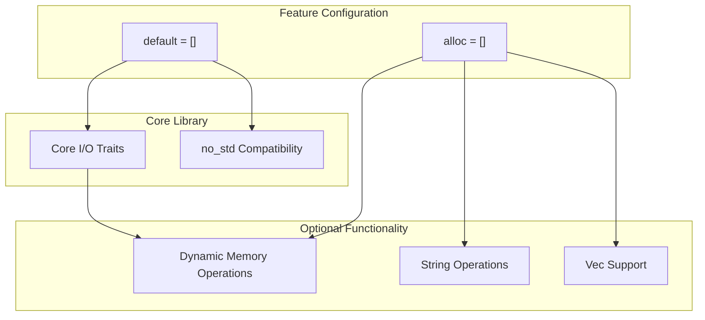
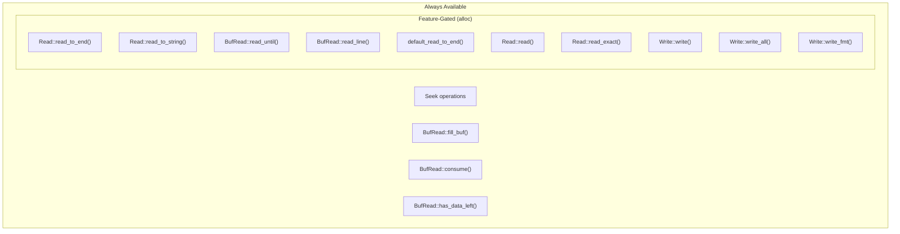
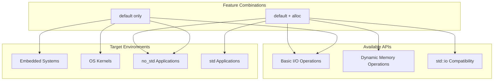

# Crate Configuration and Features

> **Relevant source files**
> * [Cargo.toml](https://github.com/arceos-org/axio/blob/a675e6d5/Cargo.toml)
> * [src/lib.rs](https://github.com/arceos-org/axio/blob/a675e6d5/src/lib.rs)

This document explains the configuration structure of the `axio` crate, including its feature gates, dependencies, and compilation targets. It covers how the crate's modular design enables different functionality levels depending on the target environment's capabilities.

For information about the actual I/O traits and their implementations, see [Core I/O Traits](/arceos-org/axio/2-core-io-traits) and [Implementations](/arceos-org/axio/4-implementations). For details about the build system and CI configuration, see [Build System and CI](/arceos-org/axio/6.1-build-system-and-ci).

## Crate Metadata and Configuration

The `axio` crate is configured as a `no_std`-first library designed for resource-constrained environments. The core metadata defines its purpose and compatibility:

|Property|Value|
| --- | --- |
|Name|axio|
|Version|0.1.1|
|Edition|2021|
|Description|std::io-like I/O traits forno_stdenvironment|
|Categories|no-std|
|Keywords|arceos,io,no-std|

The crate uses a dual-licensing model supporting GPL-3.0-or-later, Apache-2.0, and MulanPSL-2.0 licenses, making it suitable for both open source and commercial projects.

**Sources:** [Cargo.toml(L1 - L13)&emsp;](https://github.com/arceos-org/axio/blob/a675e6d5/Cargo.toml#L1-L13)

## Feature System Overview

The `axio` crate implements a minimal feature system with two defined features:



*Feature Gate Dependencies and Enabled Functionality*

The feature system follows a progressive enhancement model:

* **`default = []`**: Provides core I/O traits without any optional features
* **`alloc = []`**: Enables dynamic memory operations that require heap allocation

**Sources:** [Cargo.toml(L14 - L16)&emsp;](https://github.com/arceos-org/axio/blob/a675e6d5/Cargo.toml#L14-L16)

## Dependencies

The crate maintains a minimal dependency footprint to support its `no_std` target:

```

```

*Dependency Graph with Feature Gates*

### Core Dependencies

* **`axerrno`**: Provides unified error handling across the ArceOS ecosystem
* **`alloc`**: Standard library allocation primitives (feature-gated)

The `axerrno` dependency is always present and provides the `Error` type used throughout the I/O trait definitions. The `alloc` dependency is conditionally included only when the `alloc` feature is enabled.

**Sources:** [Cargo.toml(L18 - L19)&emsp;](https://github.com/arceos-org/axio/blob/a675e6d5/Cargo.toml#L18-L19) [src/lib.rs(L7 - L8)&emsp;](https://github.com/arceos-org/axio/blob/a675e6d5/src/lib.rs#L7-L8) [src/lib.rs(L21 - L22)&emsp;](https://github.com/arceos-org/axio/blob/a675e6d5/src/lib.rs#L21-L22)

## Feature-Specific Functionality

The `alloc` feature gate controls access to operations requiring dynamic memory allocation:

### Core Functionality (Always Available)



*Trait Methods by Feature Availability*

### Alloc-Gated Operations

When the `alloc` feature is enabled, several additional methods become available:

|Trait Method|Function|Requirements|
| --- | --- | --- |
|Read::read_to_end()|Reads all bytes to aVec<u8>|Dynamic allocation|
|Read::read_to_string()|Reads UTF-8 data to aString|Dynamic allocation + UTF-8 validation|
|BufRead::read_until()|Reads until delimiter toVec<u8>|Dynamic allocation|
|BufRead::read_line()|Reads line toString|Dynamic allocation + UTF-8 validation|

The implementation uses conditional compilation to gate these features:

```rust
#[cfg(feature = "alloc")]
fn read_to_end(&mut self, buf: &mut Vec<u8>) -> Result<usize>
```

**Sources:** [src/lib.rs(L159 - L162)&emsp;](https://github.com/arceos-org/axio/blob/a675e6d5/src/lib.rs#L159-L162) [src/lib.rs(L165 - L168)&emsp;](https://github.com/arceos-org/axio/blob/a675e6d5/src/lib.rs#L165-L168) [src/lib.rs(L320 - L347)&emsp;](https://github.com/arceos-org/axio/blob/a675e6d5/src/lib.rs#L320-L347) [src/lib.rs(L351 - L354)&emsp;](https://github.com/arceos-org/axio/blob/a675e6d5/src/lib.rs#L351-L354)

## Compilation Targets

The crate supports multiple compilation scenarios based on feature selection:



*Compilation Targets and Feature Combinations*

### No Features (Default)

Provides core I/O traits suitable for:

* Embedded systems without heap allocation
* Kernel-space code
* Applications with strict memory constraints

### WithallocFeature

Enables enhanced functionality for:

* Applications with heap allocation available
* Code requiring `std::io` compatibility
* Systems needing dynamic buffer operations

The crate uses `#![cfg_attr(not(doc), no_std)]` to maintain `no_std` compatibility while allowing documentation generation with full standard library support.

**Sources:** [src/lib.rs(L3)&emsp;](https://github.com/arceos-org/axio/blob/a675e6d5/src/lib.rs#L3-L3) [src/lib.rs(L7 - L8)&emsp;](https://github.com/arceos-org/axio/blob/a675e6d5/src/lib.rs#L7-L8)

## Feature Implementation Details

The feature system implementation uses several Rust conditional compilation patterns:

### External Crate Imports

```
#[cfg(feature = "alloc")]
extern crate alloc;
```

This pattern conditionally imports the `alloc` crate only when needed, avoiding link-time dependencies in constrained environments.

### Type Imports

```css
#[cfg(feature = "alloc")]
use alloc::{string::String, vec::Vec};
```

Dynamic types are imported only when the corresponding feature is enabled, preventing compilation errors in `no_std` environments.

### Function Gating

Complex functions like `default_read_to_end` demonstrate sophisticated feature gating with full implementation details available only when `alloc` is enabled. This function includes optimizations for buffer management, probe reading, and dynamic capacity growth.

**Sources:** [src/lib.rs(L31 - L150)&emsp;](https://github.com/arceos-org/axio/blob/a675e6d5/src/lib.rs#L31-L150) [src/lib.rs(L357 - L370)&emsp;](https://github.com/arceos-org/axio/blob/a675e6d5/src/lib.rs#L357-L370)