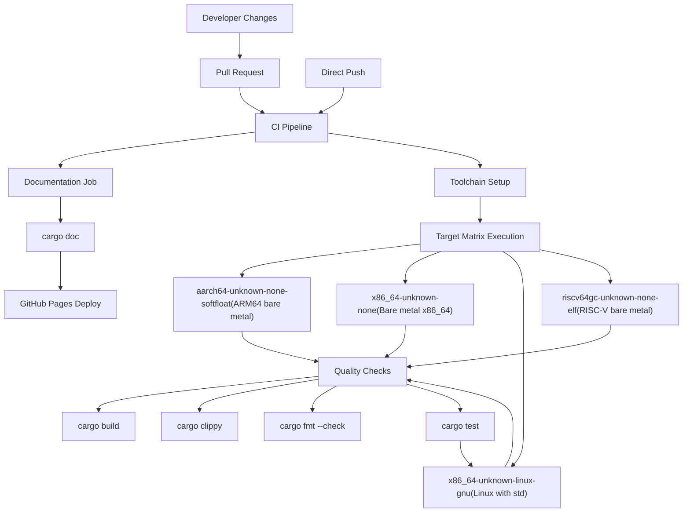
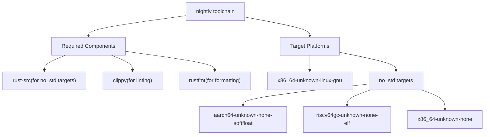
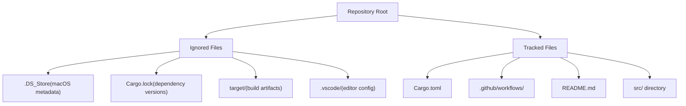
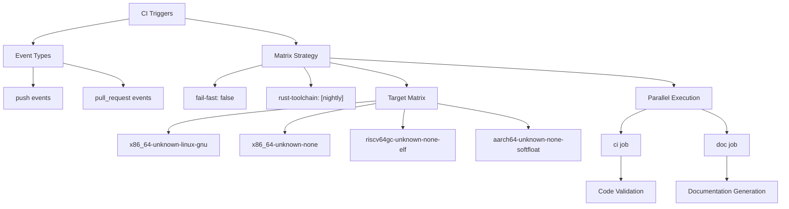

# Development and Maintenance

> **Relevant source files**
> * [.github/workflows/ci.yml](https://github.com/arceos-org/axio/blob/a675e6d5/.github/workflows/ci.yml)
> * [.gitignore](https://github.com/arceos-org/axio/blob/a675e6d5/.gitignore)

This document provides guidance for contributors and maintainers of the `axio` crate, covering development workflows, build processes, and quality assurance practices. It outlines the automated systems that ensure code quality and compatibility across multiple target environments.

For detailed information about the CI pipeline and multi-target builds, see [Build System and CI](/arceos-org/axio/6.1-build-system-and-ci). For development environment setup and configuration files, see [Project Configuration](/arceos-org/axio/6.2-project-configuration).

## Development Workflow Overview

The `axio` crate follows a rigorous development process designed to maintain compatibility across diverse `no_std` environments. The development workflow emphasizes automated quality checks, multi-target validation, and comprehensive documentation.

### Multi-Target Development Strategy

The crate targets multiple architectures and environments simultaneously, requiring careful consideration of platform-specific constraints:

Sources: [.github/workflows/ci.yml(L1 - L56)&emsp;](https://github.com/arceos-org/axio/blob/a675e6d5/.github/workflows/ci.yml#L1-L56)

### Quality Assurance Pipeline

The development process enforces multiple layers of quality assurance through automated checks:

|Check Type|Tool|Purpose|Scope|
| --- | --- | --- | --- |
|Code Formatting|cargo fmt --check|Ensures consistent code style|All targets|
|Linting|cargo clippy --all-features|Catches common mistakes and improvements|All targets|
|Compilation|cargo build --all-features|Verifies code compiles successfully|All targets|
|Unit Testing|cargo test|Validates functionality|Linux target only|
|Documentation|cargo doc --no-deps --all-features|Ensures documentation builds correctly|All features|

The CI configuration uses specific flags to enforce documentation quality through `RUSTDOCFLAGS: -D rustdoc::broken_intra_doc_links -D missing-docs` [.github/workflows/ci.yml(L40)&emsp;](https://github.com/arceos-org/axio/blob/a675e6d5/.github/workflows/ci.yml#L40-L40) ensuring all public APIs are properly documented.

## Toolchain Requirements

The project requires the nightly Rust toolchain with specific components and targets:

Sources: [.github/workflows/ci.yml(L15 - L19)&emsp;](https://github.com/arceos-org/axio/blob/a675e6d5/.github/workflows/ci.yml#L15-L19)

## Documentation Generation and Deployment

The crate maintains automatically generated documentation deployed to GitHub Pages. The documentation build process includes:

1. **Strict Documentation Standards**: The build fails on missing documentation or broken internal links
2. **Feature-Complete Documentation**: Built with `--all-features` to include all available functionality
3. **Automatic Deployment**: Documentation is automatically deployed from the default branch
4. **Custom Index**: Generates a redirect index page pointing to the main crate documentation

The documentation deployment uses a single-commit strategy to the `gh-pages` branch, ensuring a clean deployment history [.github/workflows/ci.yml(L53 - L55)&emsp;](https://github.com/arceos-org/axio/blob/a675e6d5/.github/workflows/ci.yml#L53-L55)

## Development Environment Setup

### Repository Structure

The development environment excludes certain files and directories from version control:

Sources: [.gitignore(L1 - L5)&emsp;](https://github.com/arceos-org/axio/blob/a675e6d5/.gitignore#L1-L5)

### Build Artifact Management

The `target/` directory is excluded from version control as it contains build artifacts that are regenerated during compilation. The `Cargo.lock` file is also ignored, following Rust library conventions where lock files are typically not committed for libraries to allow downstream consumers flexibility in dependency resolution.

## Continuous Integration Architecture

The CI system uses a matrix strategy to validate the crate across multiple target environments simultaneously:

Sources: [.github/workflows/ci.yml(L5 - L12)&emsp;](https://github.com/arceos-org/axio/blob/a675e6d5/.github/workflows/ci.yml#L5-L12) [.github/workflows/ci.yml(L32 - L36)&emsp;](https://github.com/arceos-org/axio/blob/a675e6d5/.github/workflows/ci.yml#L32-L36)

The `fail-fast: false` configuration ensures that failures in one target don't prevent testing of other targets, providing comprehensive feedback about platform-specific issues [.github/workflows/ci.yml(L9)&emsp;](https://github.com/arceos-org/axio/blob/a675e6d5/.github/workflows/ci.yml#L9-L9)

## Contributing Guidelines

### Code Style and Standards

All contributions must pass the automated quality checks:

* **Formatting**: Code must be formatted using `cargo fmt` with default settings
* **Linting**: All `clippy` warnings must be addressed, with the exception of `clippy::new_without_default` which is explicitly allowed [.github/workflows/ci.yml(L25)&emsp;](https://github.com/arceos-org/axio/blob/a675e6d5/.github/workflows/ci.yml#L25-L25)
* **Documentation**: All public APIs must be documented to pass the strict documentation checks
* **Testing**: New functionality should include appropriate unit tests

### Testing Strategy

The testing approach recognizes the constraints of different target environments:

* **Unit Tests**: Run only on `x86_64-unknown-linux-gnu` target due to standard library requirements [.github/workflows/ci.yml(L29 - L30)&emsp;](https://github.com/arceos-org/axio/blob/a675e6d5/.github/workflows/ci.yml#L29-L30)
* **Compilation Tests**: All targets must compile successfully to ensure `no_std` compatibility
* **Feature Testing**: All tests run with `--all-features` to validate optional functionality

This testing strategy ensures that while functionality is validated thoroughly on one platform, compilation compatibility is verified across all supported targets.

Sources: [.github/workflows/ci.yml(L24 - L30)&emsp;](https://github.com/arceos-org/axio/blob/a675e6d5/.github/workflows/ci.yml#L24-L30)