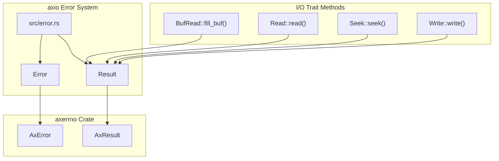
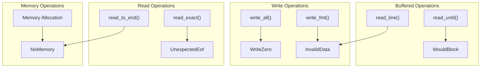
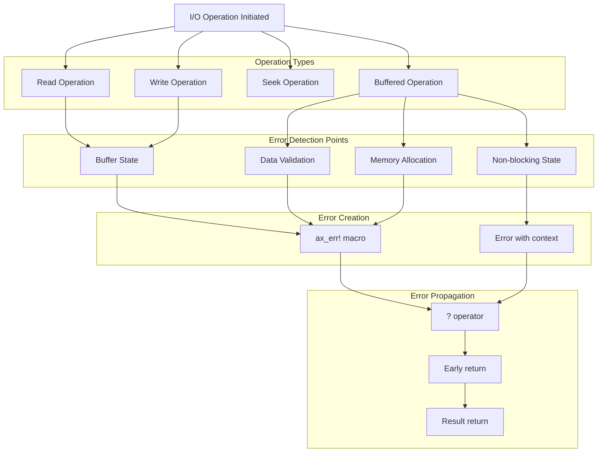
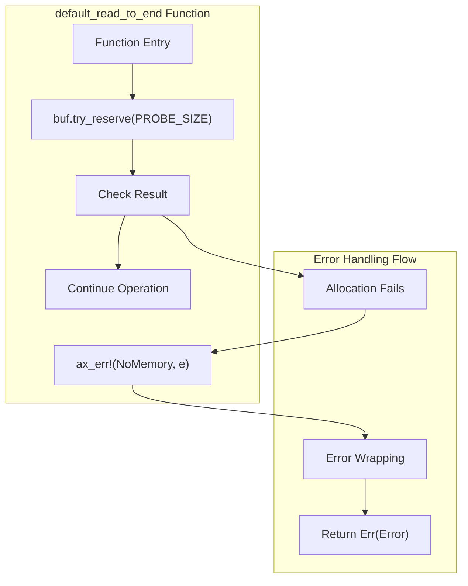
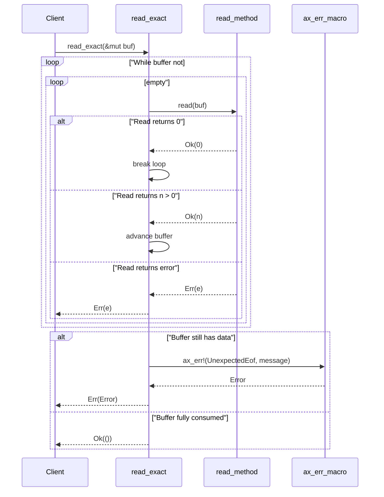
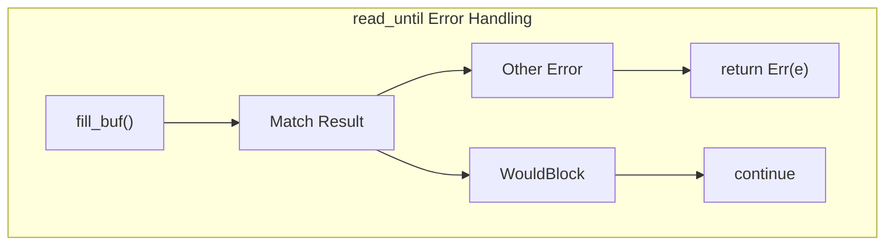
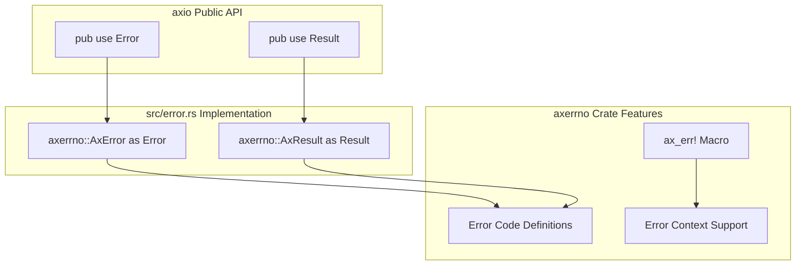

# Error Handling

> **Relevant source files**
> * [src/error.rs](https://github.com/arceos-org/axio/blob/a675e6d5/src/error.rs)
> * [src/lib.rs](https://github.com/arceos-org/axio/blob/a675e6d5/src/lib.rs)

This document covers error handling mechanisms within the `axio` crate, explaining how errors are defined, propagated, and handled across I/O operations. The error system provides consistent error reporting for `no_std` environments while maintaining compatibility with standard I/O error patterns.

For information about the core I/O traits that use these error types, see [Core I/O Traits](/arceos-org/axio/2-core-io-traits). For details about specific implementations that handle errors, see [Implementations](/arceos-org/axio/4-implementations).

## Error Type System

The `axio` crate implements a minimalist error facade over the `axerrno` crate, providing consistent error handling across all I/O operations. The error system consists of two primary types that are re-exported from `axerrno`.

### Core Error Types

|Type|Source|Purpose|
| --- | --- | --- |
|Error|axerrno::AxError|Represents all possible I/O error conditions|
|Result<T>|axerrno::AxResult<T>|Standard result type for I/O operations|

Sources: [src/error.rs(L1 - L3)&emsp;](https://github.com/arceos-org/axio/blob/a675e6d5/src/error.rs#L1-L3) [src/lib.rs(L19)&emsp;](https://github.com/arceos-org/axio/blob/a675e6d5/src/lib.rs#L19-L19)

### Error Categories and Usage Patterns

The `axio` crate utilizes specific error variants through the `ax_err!` macro to provide meaningful error information for different failure scenarios.

Sources: [src/lib.rs(L89)&emsp;](https://github.com/arceos-org/axio/blob/a675e6d5/src/lib.rs#L89-L89) [src/lib.rs(L183)&emsp;](https://github.com/arceos-org/axio/blob/a675e6d5/src/lib.rs#L183-L183) [src/lib.rs(L203)&emsp;](https://github.com/arceos-org/axio/blob/a675e6d5/src/lib.rs#L203-L203) [src/lib.rs(L244)&emsp;](https://github.com/arceos-org/axio/blob/a675e6d5/src/lib.rs#L244-L244) [src/lib.rs(L328)&emsp;](https://github.com/arceos-org/axio/blob/a675e6d5/src/lib.rs#L328-L328) [src/lib.rs(L366)&emsp;](https://github.com/arceos-org/axio/blob/a675e6d5/src/lib.rs#L366-L366)

## Error Creation and Propagation

### Theax_err!Macro Pattern

The `axio` crate consistently uses the `ax_err!` macro from `axerrno` to create structured errors with context information. This macro allows for both simple error creation and error wrapping.

|Error Type|Usage Context|Location|
| --- | --- | --- |
|NoMemory|Vector allocation failure|src/lib.rs89|
|UnexpectedEof|Incomplete buffer fill|src/lib.rs183|
|WriteZero|Failed complete write|src/lib.rs203|
|InvalidData|Format/UTF-8 errors|src/lib.rs244src/lib.rs366|

### Error Flow in I/O Operations

Sources: [src/lib.rs(L24)&emsp;](https://github.com/arceos-org/axio/blob/a675e6d5/src/lib.rs#L24-L24) [src/lib.rs(L89)&emsp;](https://github.com/arceos-org/axio/blob/a675e6d5/src/lib.rs#L89-L89) [src/lib.rs(L183)&emsp;](https://github.com/arceos-org/axio/blob/a675e6d5/src/lib.rs#L183-L183) [src/lib.rs(L203)&emsp;](https://github.com/arceos-org/axio/blob/a675e6d5/src/lib.rs#L203-L203) [src/lib.rs(L244)&emsp;](https://github.com/arceos-org/axio/blob/a675e6d5/src/lib.rs#L244-L244) [src/lib.rs(L328)&emsp;](https://github.com/arceos-org/axio/blob/a675e6d5/src/lib.rs#L328-L328) [src/lib.rs(L366)&emsp;](https://github.com/arceos-org/axio/blob/a675e6d5/src/lib.rs#L366-L366)

## Specific Error Handling Implementations

### Memory Management Errors

The `default_read_to_end` function demonstrates sophisticated error handling for memory allocation failures in `no_std` environments.

Sources: [src/lib.rs(L88 - L90)&emsp;](https://github.com/arceos-org/axio/blob/a675e6d5/src/lib.rs#L88-L90)

### Buffer State Validation

The `read_exact` method implements comprehensive error handling for incomplete read operations.

Sources: [src/lib.rs(L171 - L187)&emsp;](https://github.com/arceos-org/axio/blob/a675e6d5/src/lib.rs#L171-L187)

### Non-blocking I/O Error Handling

The `read_until` method demonstrates special handling for `WouldBlock` errors in non-blocking scenarios.

|Error Type|Handling Strategy|Code Location|
| --- | --- | --- |
|WouldBlock|Continue loop, retry operation|src/lib.rs328|
|Other errors|Propagate immediately|src/lib.rs329|

Sources: [src/lib.rs(L325 - L329)&emsp;](https://github.com/arceos-org/axio/blob/a675e6d5/src/lib.rs#L325-L329)

## Integration with axerrno

The `axio` error system serves as a thin facade over the `axerrno` crate, providing domain-specific error handling while maintaining the underlying error infrastructure.

### Re-export Pattern

The error module uses a simple re-export pattern to maintain API consistency while delegating actual error functionality to `axerrno`.

Sources: [src/error.rs(L1 - L2)&emsp;](https://github.com/arceos-org/axio/blob/a675e6d5/src/error.rs#L1-L2) [src/lib.rs(L24)&emsp;](https://github.com/arceos-org/axio/blob/a675e6d5/src/lib.rs#L24-L24)

## Error Handling Best Practices

The `axio` codebase demonstrates several consistent patterns for error handling in `no_std` I/O operations:

1. **Immediate Error Propagation**: Use the `?` operator for most error conditions
2. **Contextual Error Creation**: Use `ax_err!` macro with descriptive messages
3. **Special Case Handling**: Handle `WouldBlock` errors differently from fatal errors
4. **Memory Safety**: Wrap allocation errors with appropriate context
5. **Data Validation**: Validate UTF-8 and format correctness with `InvalidData` errors

These patterns ensure consistent error behavior across all I/O traits while maintaining the lightweight design required for `no_std` environments.

Sources: [src/lib.rs(L24)&emsp;](https://github.com/arceos-org/axio/blob/a675e6d5/src/lib.rs#L24-L24) [src/lib.rs(L89)&emsp;](https://github.com/arceos-org/axio/blob/a675e6d5/src/lib.rs#L89-L89) [src/lib.rs(L183)&emsp;](https://github.com/arceos-org/axio/blob/a675e6d5/src/lib.rs#L183-L183) [src/lib.rs(L203)&emsp;](https://github.com/arceos-org/axio/blob/a675e6d5/src/lib.rs#L203-L203) [src/lib.rs(L244)&emsp;](https://github.com/arceos-org/axio/blob/a675e6d5/src/lib.rs#L244-L244) [src/lib.rs(L328)&emsp;](https://github.com/arceos-org/axio/blob/a675e6d5/src/lib.rs#L328-L328) [src/lib.rs(L366)&emsp;](https://github.com/arceos-org/axio/blob/a675e6d5/src/lib.rs#L366-L366) [src/error.rs(L1 - L3)&emsp;](https://github.com/arceos-org/axio/blob/a675e6d5/src/error.rs#L1-L3)