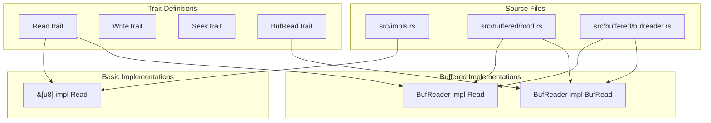
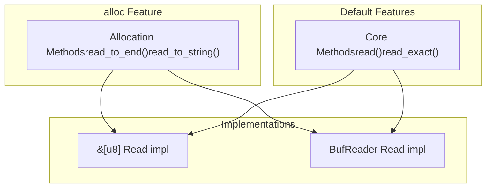
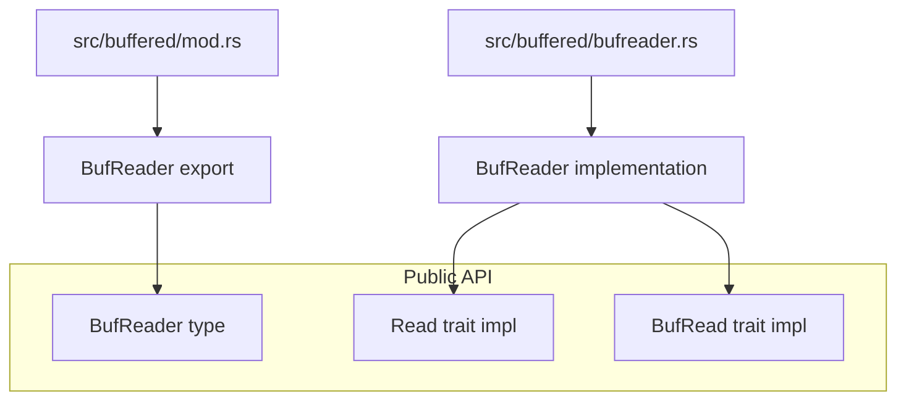

# Implementations

> **Relevant source files**
> * [src/buffered/mod.rs](https://github.com/arceos-org/axio/blob/a675e6d5/src/buffered/mod.rs)
> * [src/impls.rs](https://github.com/arceos-org/axio/blob/a675e6d5/src/impls.rs)

This document provides an overview of the concrete implementations of I/O traits provided by the axio crate. These implementations offer ready-to-use functionality for common I/O operations in no_std environments. For detailed information about the core I/O traits themselves, see [Core I/O Traits](/arceos-org/axio/2-core-io-traits). For in-depth coverage of specific implementation categories, see [Buffered I/O](/arceos-org/axio/4.1-buffered-io) and [Basic Type Implementations](/arceos-org/axio/4.2-basic-type-implementations).

The axio crate provides two main categories of implementations: basic type implementations for fundamental Rust types, and buffered I/O implementations that add performance optimizations. These implementations are designed to work seamlessly in no_std environments while maintaining compatibility with std::io patterns.

## Implementation Categories

The axio crate organizes its implementations into distinct categories based on functionality and feature requirements:

|Category|Types|Traits Implemented|Feature Requirements|
| --- | --- | --- | --- |
|Basic Types|&[u8]|Read|None|
|Buffered I/O|BufReader<R>|Read,BufRead|None for core,allocfor enhanced methods|

### Implementation Architecture

Sources: [src/impls.rs(L1 - L54)&emsp;](https://github.com/arceos-org/axio/blob/a675e6d5/src/impls.rs#L1-L54) [src/buffered/mod.rs(L1 - L4)&emsp;](https://github.com/arceos-org/axio/blob/a675e6d5/src/buffered/mod.rs#L1-L4)

## Feature-Gated Implementation Matrix

Different implementations provide varying levels of functionality depending on enabled cargo features:

Sources: [src/impls.rs(L47 - L53)&emsp;](https://github.com/arceos-org/axio/blob/a675e6d5/src/impls.rs#L47-L53)

## Implementation Details Overview

### Basic Type Implementations

The `&[u8]` implementation in `src/impls.rs` provides a fundamental building block for reading from byte slices. This implementation includes performance optimizations and careful memory handling:

* **Single-byte optimization**: Special handling for single-byte reads to avoid `memcpy` overhead
* **Exact reading**: `read_exact()` method with proper error handling for insufficient data
* **Feature-gated extensions**: `read_to_end()` method available only with `alloc` feature

The implementation uses `axerrno::ax_err!` macro for consistent error reporting and advances the slice pointer after each read operation.

### Buffered I/O Module Structure

The buffered I/O implementations are organized through a module hierarchy:

Sources: [src/buffered/mod.rs(L1 - L4)&emsp;](https://github.com/arceos-org/axio/blob/a675e6d5/src/buffered/mod.rs#L1-L4)

### Implementation Characteristics

All implementations in axio share common design principles:

* **no_std compatibility**: No reliance on standard library components
* **Zero-copy where possible**: Efficient memory usage patterns
* **Consistent error handling**: Integration with `axerrno` error system
* **Feature-aware compilation**: Conditional compilation based on cargo features

The implementations maintain API compatibility with std::io counterparts while providing the flexibility needed for resource-constrained environments.

Sources: [src/impls.rs(L1 - L54)&emsp;](https://github.com/arceos-org/axio/blob/a675e6d5/src/impls.rs#L1-L54) [src/buffered/mod.rs(L1 - L4)&emsp;](https://github.com/arceos-org/axio/blob/a675e6d5/src/buffered/mod.rs#L1-L4)