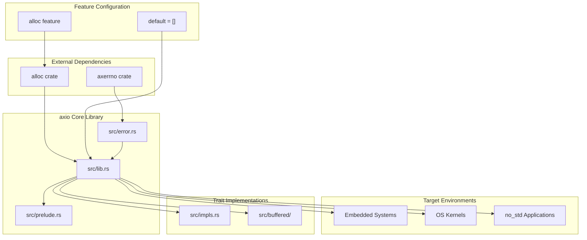
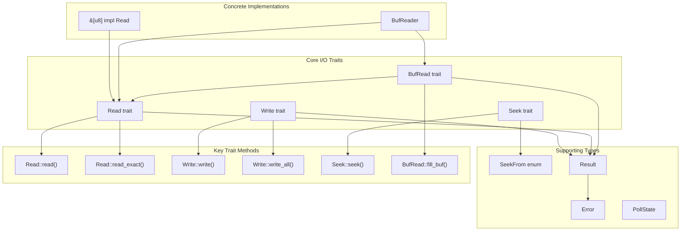

# Overview

> **Relevant source files**
> * [Cargo.toml](https://github.com/arceos-org/axio/blob/a675e6d5/Cargo.toml)
> * [README.md](https://github.com/arceos-org/axio/blob/a675e6d5/README.md)

## Purpose and Scope

This document provides an overview of the `axio` crate, a library that implements `std::io`-like I/O traits for `no_std` environments. It covers the crate's architecture, core components, and design principles. For detailed information about specific I/O traits, see [Core I/O Traits](/arceos-org/axio/2-core-io-traits). For configuration options and feature gates, see [Crate Configuration and Features](/arceos-org/axio/3-crate-configuration-and-features). For concrete implementations, see [Implementations](/arceos-org/axio/4-implementations).

## What is axio?

The `axio` crate provides a collection of I/O traits and implementations designed specifically for `no_std` environments such as embedded systems, OS kernels, and resource-constrained applications. It serves as a drop-in replacement for Rust's `std::io` module when the standard library is not available.

The crate name reflects its purpose: "ax" (from ArceOS ecosystem) + "io" (input/output operations). It maintains API compatibility with `std::io` while being usable in environments without heap allocation or operating system support.

**Key characteristics:**

* `no_std` compatible by default
* Optional `alloc` feature for enhanced functionality
* Minimal dependency footprint
* API compatibility with `std::io`
* Designed for embedded and kernel development

Sources: [Cargo.toml(L1 - L20)&emsp;](https://github.com/arceos-org/axio/blob/a675e6d5/Cargo.toml#L1-L20) [README.md(L1 - L10)&emsp;](https://github.com/arceos-org/axio/blob/a675e6d5/README.md#L1-L10)

## System Architecture

The following diagram shows the high-level architecture of the `axio` crate and its relationship to external dependencies and target environments:

**System Context and Dependencies**

Sources: [Cargo.toml(L14 - L20)&emsp;](https://github.com/arceos-org/axio/blob/a675e6d5/Cargo.toml#L14-L20)

## Core Trait Ecosystem

The `axio` crate implements four fundamental I/O traits that mirror those found in `std::io`. This diagram maps the natural language concepts to specific code entities:

**I/O Trait Hierarchy and Code Entities**

Sources: [Cargo.toml(L6)&emsp;](https://github.com/arceos-org/axio/blob/a675e6d5/Cargo.toml#L6-L6)

## Target Environments and Use Cases

The `axio` crate is specifically designed for environments where `std::io` is not available:

|Environment|Use Case|Key Benefits|
| --- | --- | --- |
|Embedded Systems|Microcontroller I/O operations|Minimal memory footprint, no heap required|
|OS Kernels|Kernel-level I/O abstractions|No standard library dependency|
|no_std Applications|Resource-constrained applications|Predictable memory usage|
|ArceOS Ecosystem|Operating system components|Seamless integration with ArceOS|

The crate maintains compatibility with `std::io` APIs, allowing code to be portable between `std` and `no_std` environments with minimal changes.

Sources: [Cargo.toml(L11 - L12)&emsp;](https://github.com/arceos-org/axio/blob/a675e6d5/Cargo.toml#L11-L12)

## Feature Configuration

The `axio` crate uses a feature-driven compilation model to provide different levels of functionality:

**Default Configuration**

* Feature set: `default = []` - no features enabled by default
* Provides core I/O traits without heap allocation
* Minimal dependency footprint with only `axerrno`

**Enhanced Configuration**

* Feature set: `alloc` - enables dynamic memory operations
* Adds methods that require heap allocation (e.g., `read_to_string`, `read_to_end`)
* Maintains `no_std` compatibility while providing enhanced functionality

This design allows the crate to serve both minimal embedded environments and more capable systems that have dynamic memory allocation available.

Sources: [Cargo.toml(L14 - L16)&emsp;](https://github.com/arceos-org/axio/blob/a675e6d5/Cargo.toml#L14-L16)

## Dependencies and Integration

The `axio` crate maintains a lean dependency graph:

**Required Dependencies:**

* `axerrno = "0.1"` - Provides error types and codes compatible with the ArceOS ecosystem

**Optional Dependencies:**

* `alloc` crate - Enabled via the `alloc` feature for dynamic memory operations

The crate integrates with the broader ArceOS ecosystem through shared error handling conventions and API design patterns. Error handling is centralized through the `axerrno` crate, ensuring consistency across ArceOS components.

Sources: [Cargo.toml(L18 - L19)&emsp;](https://github.com/arceos-org/axio/blob/a675e6d5/Cargo.toml#L18-L19) [Cargo.toml(L8 - L9)&emsp;](https://github.com/arceos-org/axio/blob/a675e6d5/Cargo.toml#L8-L9)

## Related Documentation

For detailed information about specific aspects of the `axio` crate:

* **Trait specifications**: See [Core I/O Traits](/arceos-org/axio/2-core-io-traits) for detailed trait method documentation
* **Configuration options**: See [Crate Configuration and Features](/arceos-org/axio/3-crate-configuration-and-features) for build and feature information
* **Concrete implementations**: See [Implementations](/arceos-org/axio/4-implementations) for usage examples and implementation details
* **Error handling**: See [Error Handling](/arceos-org/axio/5.1-error-handling) for error types and error handling patterns
* **Development setup**: See [Development and Maintenance](/arceos-org/axio/6-development-and-maintenance) for contributor information