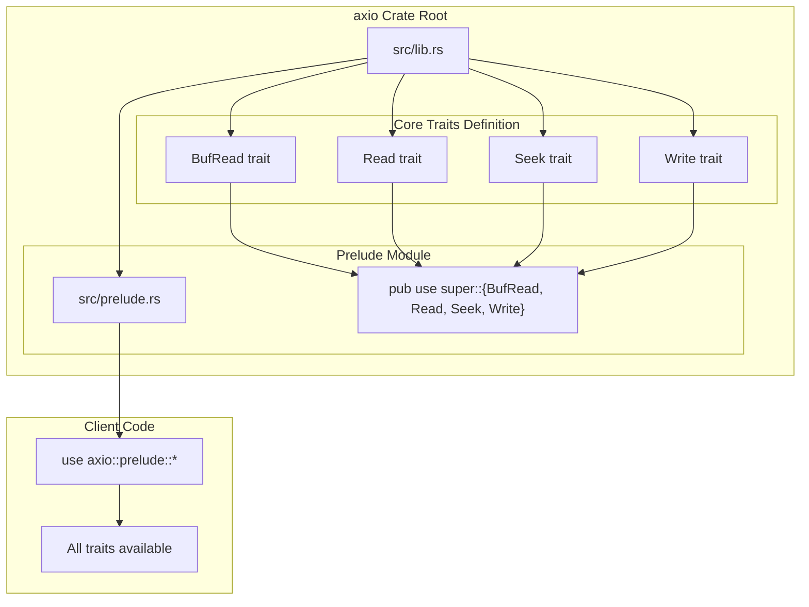
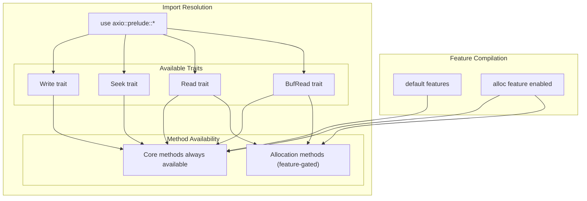
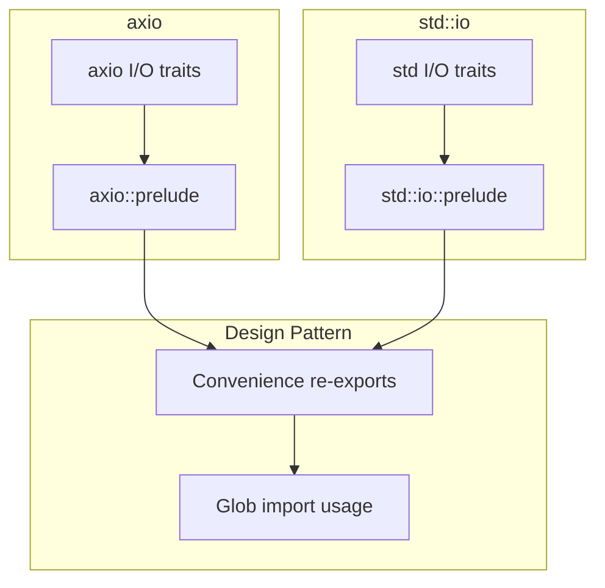

# Prelude Module

> **Relevant source files**
> * [src/lib.rs](https://github.com/arceos-org/axio/blob/a675e6d5/src/lib.rs)
> * [src/prelude.rs](https://github.com/arceos-org/axio/blob/a675e6d5/src/prelude.rs)

The Prelude Module provides convenient glob imports for the core I/O traits in the axio crate. This module serves as a single import point for the four fundamental I/O traits (`Read`, `Write`, `Seek`, and `BufRead`), following the same pattern as Rust's standard library `std::io::prelude` module.

For information about the individual I/O traits themselves, see [Core I/O Traits](/arceos-org/axio/2-core-io-traits). For details about error handling that works with these traits, see [Error Handling](/arceos-org/axio/5.1-error-handling).

## Purpose and Design

The prelude module eliminates the need for multiple individual trait imports by providing a single glob import that brings all essential I/O traits into scope. This design pattern reduces boilerplate code in modules that perform extensive I/O operations.

### Module Structure



Sources: [src/lib.rs(L16)&emsp;](https://github.com/arceos-org/axio/blob/a675e6d5/src/lib.rs#L16-L16) [src/prelude.rs(L11)&emsp;](https://github.com/arceos-org/axio/blob/a675e6d5/src/prelude.rs#L11-L11)

### Trait Re-export Implementation

The prelude module uses a simple re-export mechanism to make the core traits available through a single import path. The implementation consists of a single `pub use` statement that imports all four traits from the parent module:

|Trait|Purpose|Key Methods|
| --- | --- | --- |
|Read|Reading bytes from a source|read(),read_exact(),read_to_end()|
|Write|Writing bytes to a destination|write(),flush(),write_all()|
|Seek|Positioning within a stream|seek(),rewind(),stream_position()|
|BufRead|Buffered reading operations|fill_buf(),consume(),read_until()|

Sources: [src/prelude.rs(L11)&emsp;](https://github.com/arceos-org/axio/blob/a675e6d5/src/prelude.rs#L11-L11) [src/lib.rs(L152 - L355)&emsp;](https://github.com/arceos-org/axio/blob/a675e6d5/src/lib.rs#L152-L355)

## Usage Patterns

### Standard Import Pattern

The prelude follows the conventional Rust pattern for convenience imports:

```
use axio::prelude::*;
```

This single import brings all four core I/O traits into scope, enabling their methods to be called on any type that implements them.

### Integration with no_std Environment

The prelude module maintains compatibility with `no_std` environments while providing conditional access to allocation-dependent features:



Sources: [src/prelude.rs(L1 - L12)&emsp;](https://github.com/arceos-org/axio/blob/a675e6d5/src/prelude.rs#L1-L12) [src/lib.rs(L7 - L8)&emsp;](https://github.com/arceos-org/axio/blob/a675e6d5/src/lib.rs#L7-L8) [src/lib.rs(L21 - L22)&emsp;](https://github.com/arceos-org/axio/blob/a675e6d5/src/lib.rs#L21-L22)

## Implementation Details

### Module Declaration

The prelude module is declared as a public module in the crate root, making it accessible to external users:

[src/lib.rs(L16)&emsp;](https://github.com/arceos-org/axio/blob/a675e6d5/src/lib.rs#L16-L16) - `pub mod prelude;`

### Re-export Mechanism

The module uses Rust's `pub use` syntax to re-export traits from the parent module scope:

[src/prelude.rs(L11)&emsp;](https://github.com/arceos-org/axio/blob/a675e6d5/src/prelude.rs#L11-L11) - `pub use super::{BufRead, Read, Seek, Write};`

This creates public aliases for the traits defined in the parent module, allowing them to be imported through the prelude path.

### Documentation Integration

The prelude module includes comprehensive documentation that explains its purpose and provides usage examples, following the same documentation style as `std::io::prelude`:

[src/prelude.rs(L1 - L9)&emsp;](https://github.com/arceos-org/axio/blob/a675e6d5/src/prelude.rs#L1-L9) - Contains module-level documentation with purpose explanation and usage example.

## Relationship to Standard Library

The axio prelude module mirrors the design and purpose of Rust's standard library `std::io::prelude` module, providing a familiar interface for developers transitioning between `std` and `no_std` environments:



Sources: [src/prelude.rs(L8)&emsp;](https://github.com/arceos-org/axio/blob/a675e6d5/src/prelude.rs#L8-L8) [src/prelude.rs(L11)&emsp;](https://github.com/arceos-org/axio/blob/a675e6d5/src/prelude.rs#L11-L11)

This design maintains API compatibility and familiar usage patterns while providing the `no_std` compatibility that axio offers.