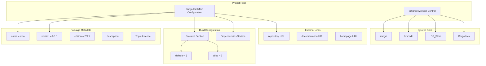
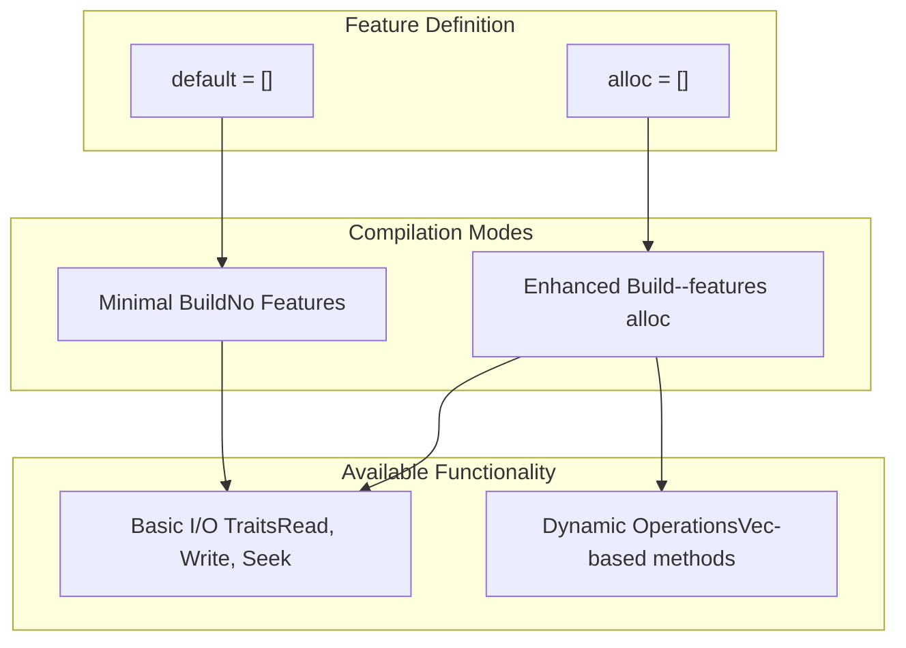
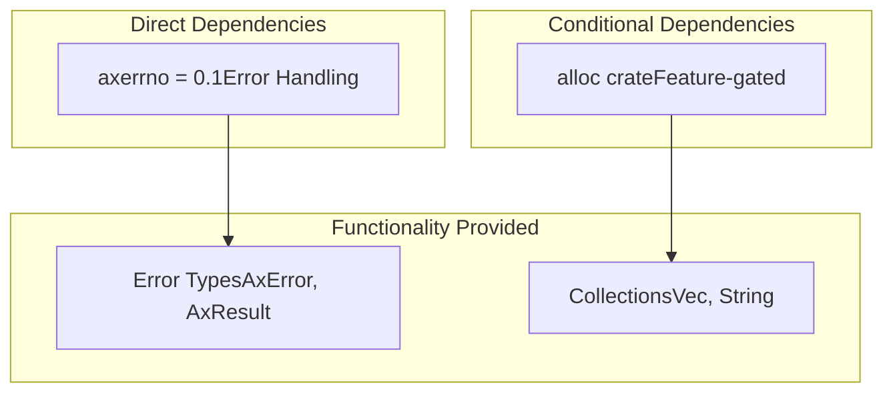
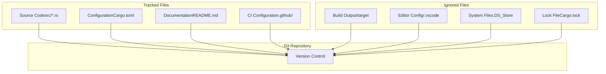

# Project Configuration

> **Relevant source files**
> * [.gitignore](https://github.com/arceos-org/axio/blob/a675e6d5/.gitignore)
> * [Cargo.toml](https://github.com/arceos-org/axio/blob/a675e6d5/Cargo.toml)

This document covers the development environment setup and project configuration files for the axio crate. It explains the structure and purpose of configuration files that control compilation, dependency management, and version control behavior.

For information about the build system and continuous integration, see [Build System and CI](/arceos-org/axio/6.1-build-system-and-ci). For details about feature gates and their impact on compilation, see [Crate Configuration and Features](/arceos-org/axio/3-crate-configuration-and-features).

## Configuration File Structure

The axio project uses standard Rust project configuration with minimal additional setup requirements. The configuration is designed to support both standalone development and integration into larger systems like ArceOS.

### Project Configuration Overview

**Sources:** [Cargo.toml(L1 - L20)&emsp;](https://github.com/arceos-org/axio/blob/a675e6d5/Cargo.toml#L1-L20) [.gitignore(L1 - L5)&emsp;](https://github.com/arceos-org/axio/blob/a675e6d5/.gitignore#L1-L5)

## Cargo.toml Configuration

The main project configuration is contained in `Cargo.toml`, which defines package metadata, dependencies, and feature flags.

### Package Metadata

The package section defines essential project information and publishing configuration:

|Field|Value|Purpose|
| --- | --- | --- |
|name|"axio"|Crate name for cargo registry|
|version|"0.1.1"|Semantic version number|
|edition|"2021"|Rust edition for language features|
|authors|["Yuekai Jia <equation618@gmail.com>"]|Primary maintainer|
|description|"std::io-like I/O traits forno_stdenvironment"|Brief functionality summary|
|license|"GPL-3.0-or-later OR Apache-2.0 OR MulanPSL-2.0"|Triple licensing scheme|

**Sources:** [Cargo.toml(L1 - L12)&emsp;](https://github.com/arceos-org/axio/blob/a675e6d5/Cargo.toml#L1-L12)

### Repository and Documentation Links

The project maintains links to external resources:

* **Repository**: `https://github.com/arceos-org/axio` - Source code location
* **Homepage**: `https://github.com/arceos-org/arceos` - Parent project
* **Documentation**: `https://docs.rs/axio` - Published API documentation

These links connect the crate to the broader ArceOS ecosystem while maintaining independent documentation.

**Sources:** [Cargo.toml(L8 - L10)&emsp;](https://github.com/arceos-org/axio/blob/a675e6d5/Cargo.toml#L8-L10)

### Feature Configuration

**Sources:** [Cargo.toml(L14 - L16)&emsp;](https://github.com/arceos-org/axio/blob/a675e6d5/Cargo.toml#L14-L16)

The feature configuration uses an intentionally minimal approach:

* **`default = []`**: No features enabled by default, ensuring maximum compatibility
* **`alloc = []`**: Empty feature flag that enables `alloc` crate integration through conditional compilation

This design allows the crate to function in the most constrained environments while providing enhanced functionality when allocation is available.

### Dependencies

The dependency configuration maintains minimal external requirements:

**Sources:** [Cargo.toml(L18 - L19)&emsp;](https://github.com/arceos-org/axio/blob/a675e6d5/Cargo.toml#L18-L19)

The single required dependency `axerrno = "0.1"` provides standardized error types compatible with the ArceOS ecosystem. The `alloc` crate dependency is implicit and controlled through feature gates rather than explicit declaration.

## Git Configuration

The `.gitignore` file excludes development artifacts and environment-specific files from version control.

### Ignored File Categories

|Pattern|Type|Reason|
| --- | --- | --- |
|/target|Build artifacts|Generated by cargo build|
|/.vscode|Editor configuration|VS Code specific settings|
|.DS_Store|System files|macOS filesystem metadata|
|Cargo.lock|Dependency lock|Not committed for libraries|

**Sources:** [.gitignore(L1 - L4)&emsp;](https://github.com/arceos-org/axio/blob/a675e6d5/.gitignore#L1-L4)

### Version Control Strategy

**Sources:** [.gitignore(L1 - L4)&emsp;](https://github.com/arceos-org/axio/blob/a675e6d5/.gitignore#L1-L4)

The exclusion of `Cargo.lock` follows Rust library conventions, allowing downstream consumers to resolve their own dependency versions. Build artifacts in `/target` are excluded to avoid repository bloat, while editor-specific configurations are ignored to support diverse development environments.

## Development Environment Setup

The minimal configuration requirements enable straightforward development setup:

1. **Rust Toolchain**: Edition 2021 or later required
2. **Feature Testing**: Use `cargo build --features alloc` to test enhanced functionality
3. **Editor Support**: Any Rust-compatible editor; VS Code configurations are gitignored
4. **Target Testing**: Use `cargo build --target <target>` for cross-compilation verification

The configuration supports both local development and integration into larger build systems without requiring environment-specific modifications.

**Sources:** [Cargo.toml(L1 - L20)&emsp;](https://github.com/arceos-org/axio/blob/a675e6d5/Cargo.toml#L1-L20) [.gitignore(L1 - L5)&emsp;](https://github.com/arceos-org/axio/blob/a675e6d5/.gitignore#L1-L5)