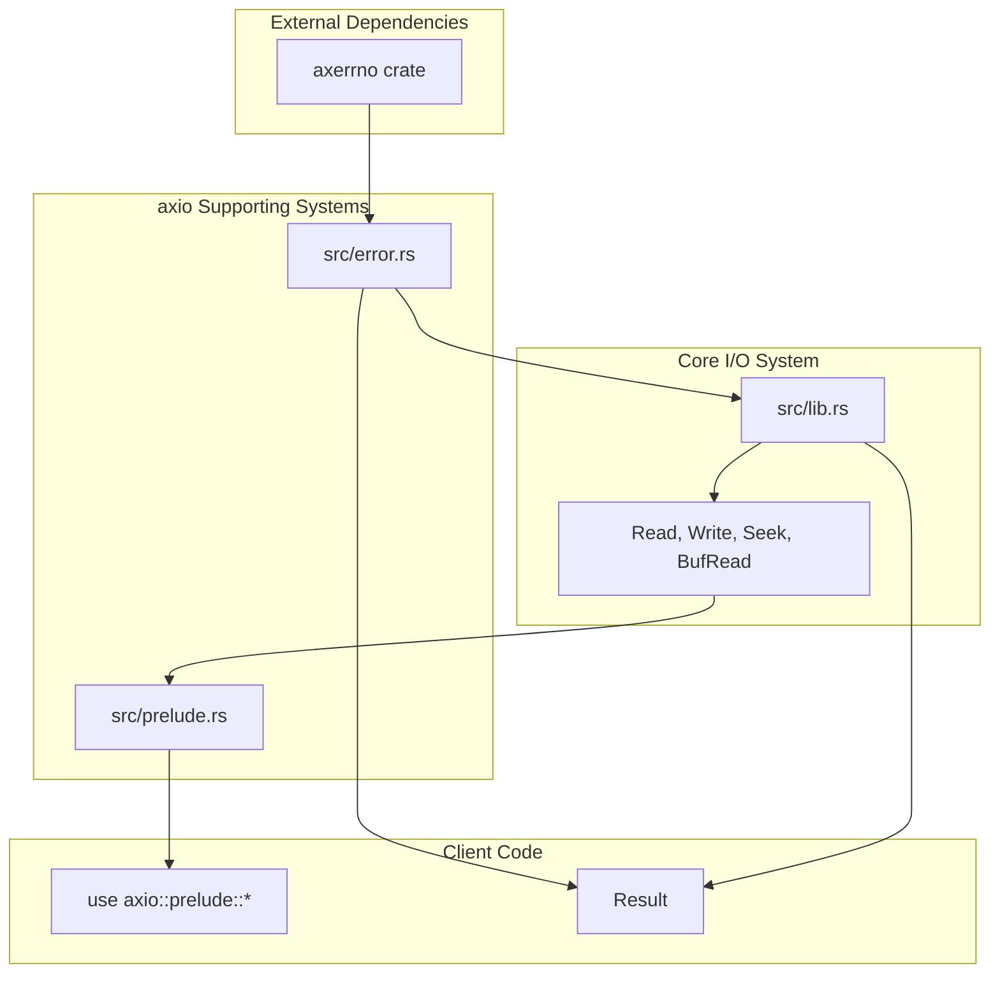
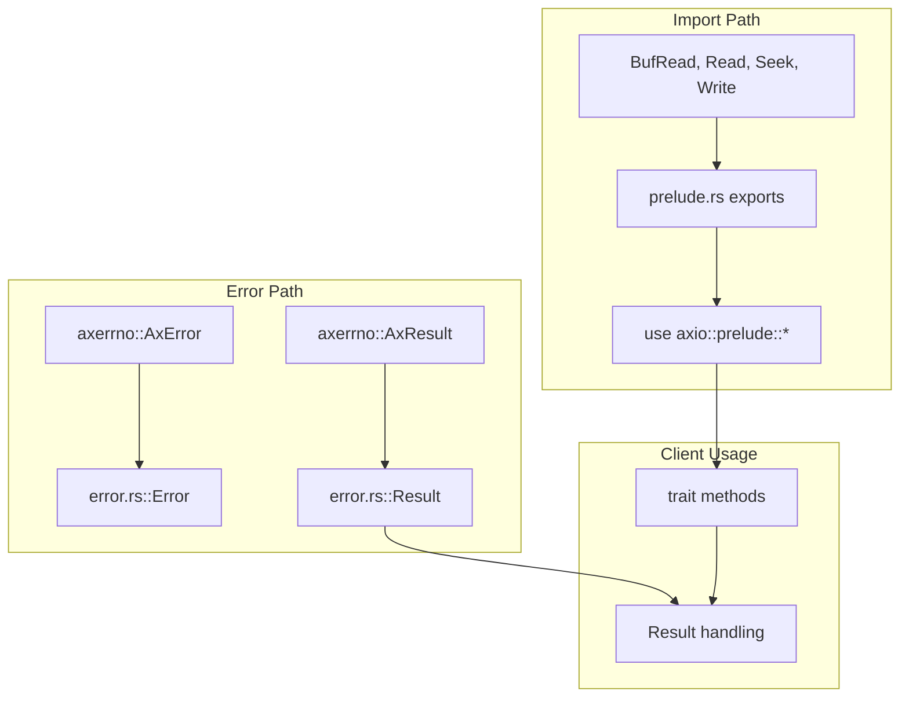

# Supporting Systems

> **Relevant source files**
> * [src/error.rs](https://github.com/arceos-org/axio/blob/a675e6d5/src/error.rs)
> * [src/prelude.rs](https://github.com/arceos-org/axio/blob/a675e6d5/src/prelude.rs)

This document provides an overview of the supporting modules that enable the core I/O functionality in the axio crate. These systems provide essential infrastructure for error handling, convenience imports, and integration with external dependencies. The supporting systems are designed to be minimal and focused, maintaining the crate's `no_std` compatibility while providing necessary functionality.

For detailed information about error handling mechanisms, see [Error Handling](/arceos-org/axio/5.1-error-handling). For information about convenience imports and trait re-exports, see [Prelude Module](/arceos-org/axio/5.2-prelude-module).

## Supporting Module Architecture

The axio crate relies on two primary supporting modules that work together to enable the core I/O trait functionality. These modules provide a clean separation between error handling concerns and user-facing API convenience.

### Supporting Systems Overview

Sources: [src/error.rs(L1 - L3)&emsp;](https://github.com/arceos-org/axio/blob/a675e6d5/src/error.rs#L1-L3) [src/prelude.rs(L1 - L12)&emsp;](https://github.com/arceos-org/axio/blob/a675e6d5/src/prelude.rs#L1-L12)

### Module Interaction Flow

The supporting systems create a clear data flow that separates concerns while maintaining a cohesive API surface.

Sources: [src/error.rs(L1 - L2)&emsp;](https://github.com/arceos-org/axio/blob/a675e6d5/src/error.rs#L1-L2) [src/prelude.rs(L11)&emsp;](https://github.com/arceos-org/axio/blob/a675e6d5/src/prelude.rs#L11-L11)

## Error System Integration

The `src/error.rs` module serves as a facade layer that re-exports error types from the `axerrno` crate. This design provides a stable API surface while delegating the actual error handling implementation to the specialized `axerrno` crate.

|Component|Type|Purpose|
| --- | --- | --- |
|Error|Type alias|Re-exportsaxerrno::AxErroras the primary error type|
|Result|Type alias|Re-exportsaxerrno::AxResultas the standard result type|

The error system provides consistent error handling across all I/O operations without requiring clients to directly depend on the `axerrno` crate.

Sources: [src/error.rs(L1 - L2)&emsp;](https://github.com/arceos-org/axio/blob/a675e6d5/src/error.rs#L1-L2)

## Prelude System Organization

The `src/prelude.rs` module provides a convenience layer that re-exports the four core I/O traits. This follows the established Rust pattern of providing a prelude module for commonly used imports.

The prelude exports include:

* `BufRead` - Buffered reading operations
* `Read` - Basic reading operations
* `Seek` - Stream positioning operations
* `Write` - Basic writing operations

This design allows clients to import all core functionality with a single glob import: `use axio::prelude::*`.

Sources: [src/prelude.rs(L11)&emsp;](https://github.com/arceos-org/axio/blob/a675e6d5/src/prelude.rs#L11-L11)

## System Dependencies

The supporting systems maintain minimal external dependencies to preserve the crate's `no_std` compatibility:

|System|External Dependencies|Purpose|
| --- | --- | --- |
|Error handling|axerrnocrate|Provides error types and result handling|
|Prelude|None|Re-exports internal traits|

Both supporting systems are designed to be thin facade layers that add minimal overhead while providing essential functionality for the core I/O trait system.

Sources: [src/error.rs(L1 - L2)&emsp;](https://github.com/arceos-org/axio/blob/a675e6d5/src/error.rs#L1-L2) [src/prelude.rs(L1 - L12)&emsp;](https://github.com/arceos-org/axio/blob/a675e6d5/src/prelude.rs#L1-L12)