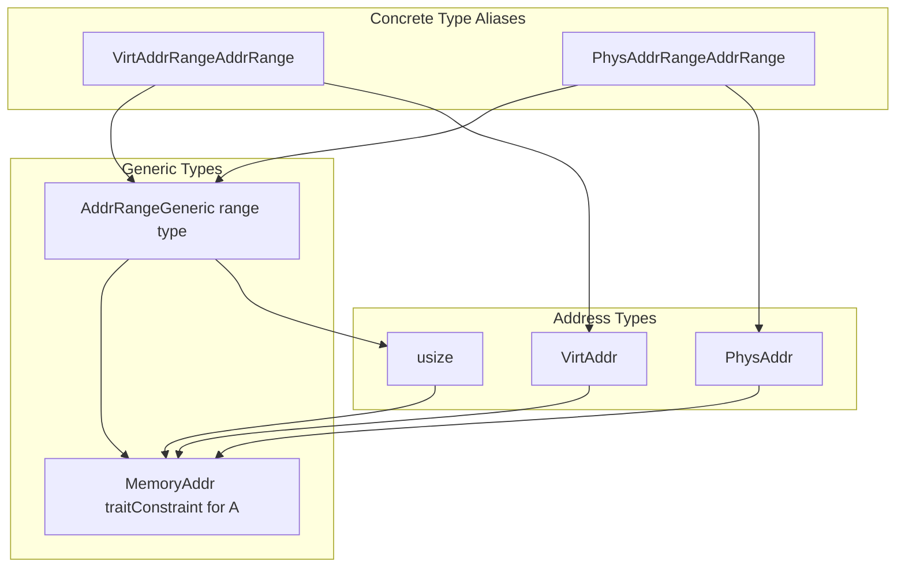
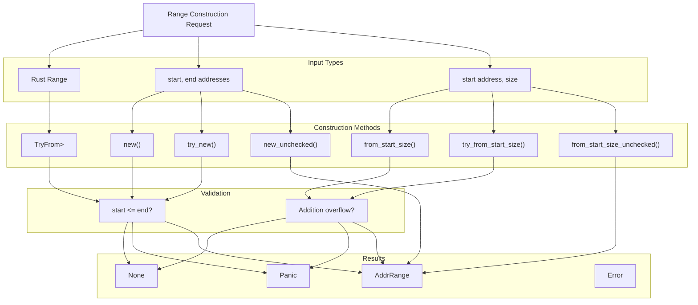
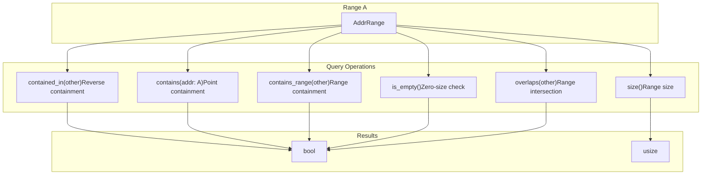
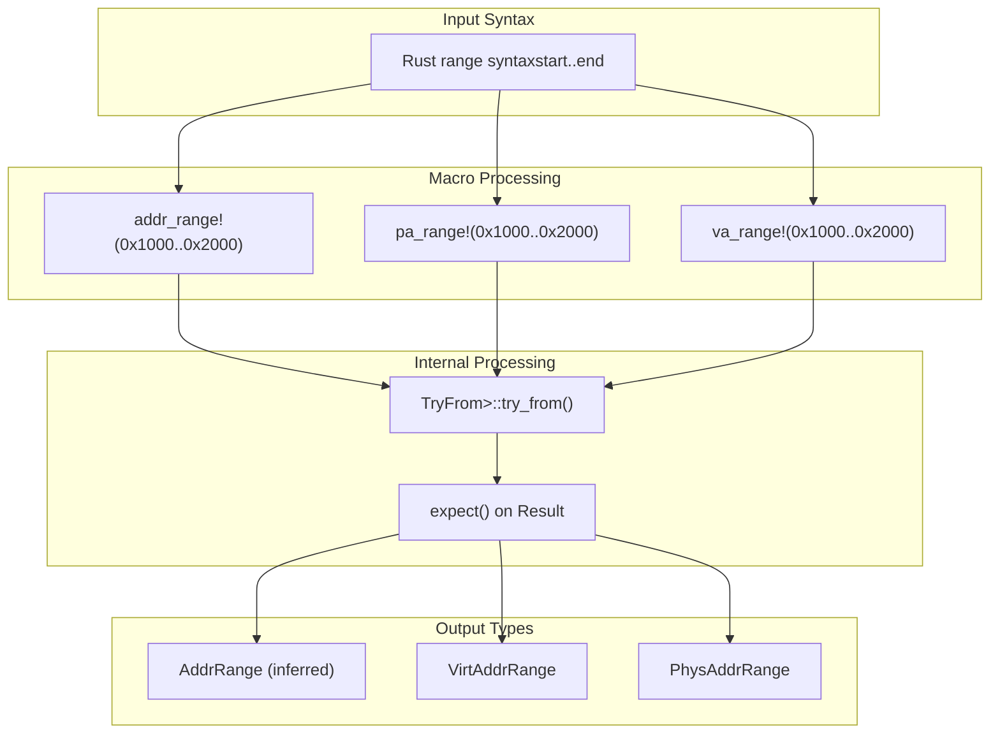

# Address Ranges

> **Relevant source files**
> * [memory_addr/src/range.rs](https://github.com/arceos-org/axmm_crates/blob/87b8ebcd/memory_addr/src/range.rs)

This document covers the address range functionality provided by the `memory_addr` crate, specifically the `AddrRange` generic type and its associated operations. Address ranges represent contiguous spans of memory addresses with type safety and comprehensive range manipulation operations.

For information about individual address types and arithmetic operations, see [Address Types and Operations](/arceos-org/axmm_crates/2.1-address-types-and-operations). For page iteration over ranges, see [Page Iteration](/arceos-org/axmm_crates/2.3-page-iteration).

## Address Range Structure

The core of the address range system is the `AddrRange<A>` generic struct, where `A` implements the `MemoryAddr` trait. This provides type-safe representation of memory address ranges with inclusive start bounds and exclusive end bounds.

### AddrRange Type Hierarchy



Sources: [memory_addr/src/range.rs(L1 - L28)&emsp;](https://github.com/arceos-org/axmm_crates/blob/87b8ebcd/memory_addr/src/range.rs#L1-L28) [memory_addr/src/range.rs(L365 - L368)&emsp;](https://github.com/arceos-org/axmm_crates/blob/87b8ebcd/memory_addr/src/range.rs#L365-L368)

The `AddrRange<A>` struct contains two public fields:

* `start: A` - The lower bound of the range (inclusive)
* `end: A` - The upper bound of the range (exclusive)

Type aliases provide convenient names for common address range types:

* `VirtAddrRange` = `AddrRange<VirtAddr>`
* `PhysAddrRange` = `AddrRange<PhysAddr>`

## Range Construction Methods

Address ranges can be constructed through several methods, each with different safety and error-handling characteristics.

### Construction Method Categories

|Method|Safety|Overflow Handling|Use Case|
| --- | --- | --- | --- |
|new()|Panics on invalid range|Checked|Safe construction with panic|
|try_new()|ReturnsOption|Checked|Fallible construction|
|new_unchecked()|Unsafe|Unchecked|Performance-critical paths|
|from_start_size()|Panics on overflow|Checked|Size-based construction|
|try_from_start_size()|ReturnsOption|Checked|Fallible size-based construction|
|from_start_size_unchecked()|Unsafe|Unchecked|Performance-critical size-based|

Sources: [memory_addr/src/range.rs(L34 - L193)&emsp;](https://github.com/arceos-org/axmm_crates/blob/87b8ebcd/memory_addr/src/range.rs#L34-L193)

### Range Construction Flow



Sources: [memory_addr/src/range.rs(L57 - L193)&emsp;](https://github.com/arceos-org/axmm_crates/blob/87b8ebcd/memory_addr/src/range.rs#L57-L193) [memory_addr/src/range.rs(L307 - L317)&emsp;](https://github.com/arceos-org/axmm_crates/blob/87b8ebcd/memory_addr/src/range.rs#L307-L317)

## Range Operations and Relationships

Address ranges support comprehensive operations for checking containment, overlap, and spatial relationships between ranges.

### Range Relationship Operations



Sources: [memory_addr/src/range.rs(L228 - L302)&emsp;](https://github.com/arceos-org/axmm_crates/blob/87b8ebcd/memory_addr/src/range.rs#L228-L302)

### Key Range Operations

The following operations are available on all `AddrRange<A>` instances:

* **Point Containment**: `contains(addr)` checks if a single address falls within the range
* **Range Containment**: `contains_range(other)` checks if another range is entirely within this range
* **Containment Check**: `contained_in(other)` checks if this range is entirely within another range
* **Overlap Detection**: `overlaps(other)` checks if two ranges have any intersection
* **Empty Range Check**: `is_empty()` returns true if start equals end
* **Size Calculation**: `size()` returns the number of bytes in the range

## Convenience Macros

The crate provides three macros for convenient address range creation with compile-time type inference and runtime validation.

### Macro Overview

|Macro|Target Type|Purpose|
| --- | --- | --- |
|addr_range!|AddrRange<A>(inferred)|Generic range creation|
|va_range!|VirtAddrRange|Virtual address range creation|
|pa_range!|PhysAddrRange|Physical address range creation|

Sources: [memory_addr/src/range.rs(L391 - L448)&emsp;](https://github.com/arceos-org/axmm_crates/blob/87b8ebcd/memory_addr/src/range.rs#L391-L448)

### Macro Usage Pattern



Sources: [memory_addr/src/range.rs(L391 - L448)&emsp;](https://github.com/arceos-org/axmm_crates/blob/87b8ebcd/memory_addr/src/range.rs#L391-L448)

## Usage Examples and Patterns

The test suite demonstrates common usage patterns for address ranges, showing both basic operations and complex relationship checking.

### Basic Range Operations

```javascript
// Creating ranges with different methods
let range = VirtAddrRange::new(0x1000.into(), 0x2000.into());
let size_range = VirtAddrRange::from_start_size(0x1000.into(), 0x1000);

// Using macros for convenience
let macro_range = va_range!(0x1000..0x2000);

// Checking basic properties
assert_eq!(range.size(), 0x1000);
assert!(!range.is_empty());
assert!(range.contains(0x1500.into()));
```

Sources: [memory_addr/src/range.rs(L464 - L511)&emsp;](https://github.com/arceos-org/axmm_crates/blob/87b8ebcd/memory_addr/src/range.rs#L464-L511)

### Range Relationship Testing

The codebase extensively tests range relationships using various scenarios:

```
// Containment checking
assert!(range.contains_range(va_range!(0x1001..0x1fff)));
assert!(!range.contains_range(va_range!(0xfff..0x2001)));

// Overlap detection
assert!(range.overlaps(va_range!(0x1800..0x2001)));
assert!(!range.overlaps(va_range!(0x2000..0x2800)));

// Spatial relationships
assert!(range.contained_in(va_range!(0xfff..0x2001)));
```

Sources: [memory_addr/src/range.rs(L483 - L505)&emsp;](https://github.com/arceos-org/axmm_crates/blob/87b8ebcd/memory_addr/src/range.rs#L483-L505)

### Error Handling Patterns

The range system provides both panicking and fallible construction methods:

```javascript
// Panicking construction (for known-valid ranges)
let valid_range = VirtAddrRange::new(start, end);

// Fallible construction (for potentially invalid input)
if let Some(range) = VirtAddrRange::try_new(start, end) {
    // Use the valid range
}

// Size-based construction with overflow handling
let safe_range = VirtAddrRange::try_from_start_size(start, size)?;
```

Sources: [memory_addr/src/range.rs(L58 - L167)&emsp;](https://github.com/arceos-org/axmm_crates/blob/87b8ebcd/memory_addr/src/range.rs#L58-L167)