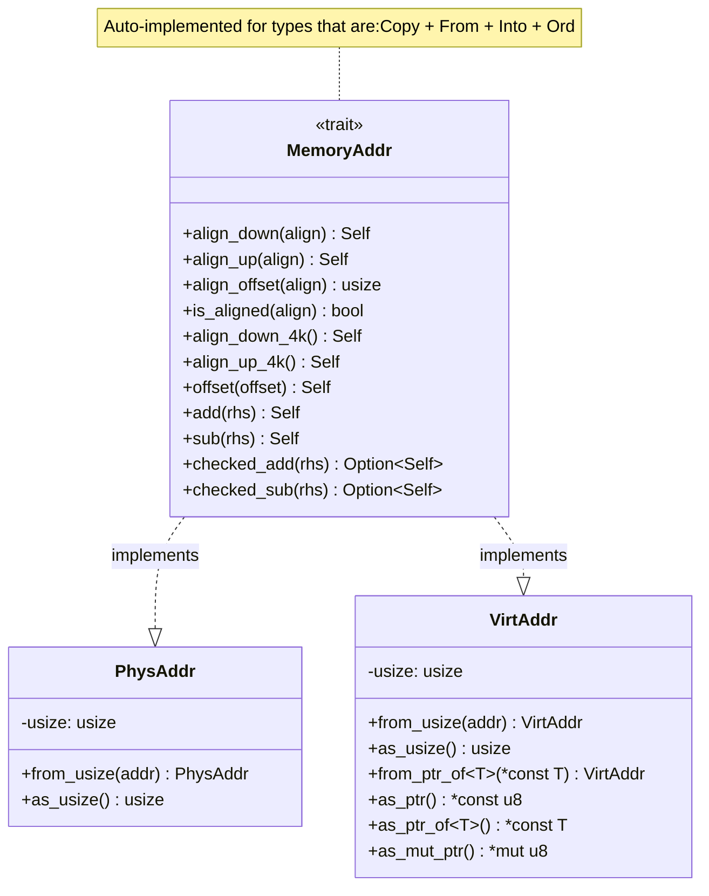
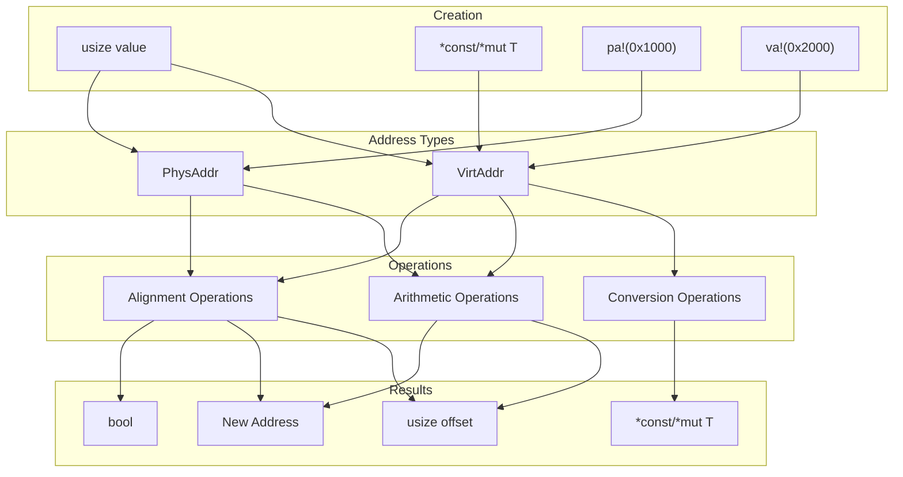
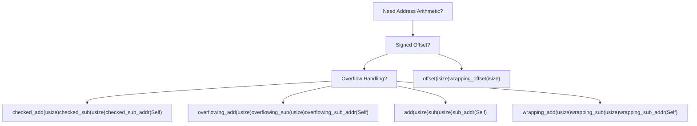
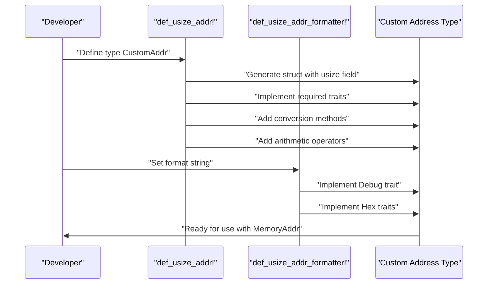
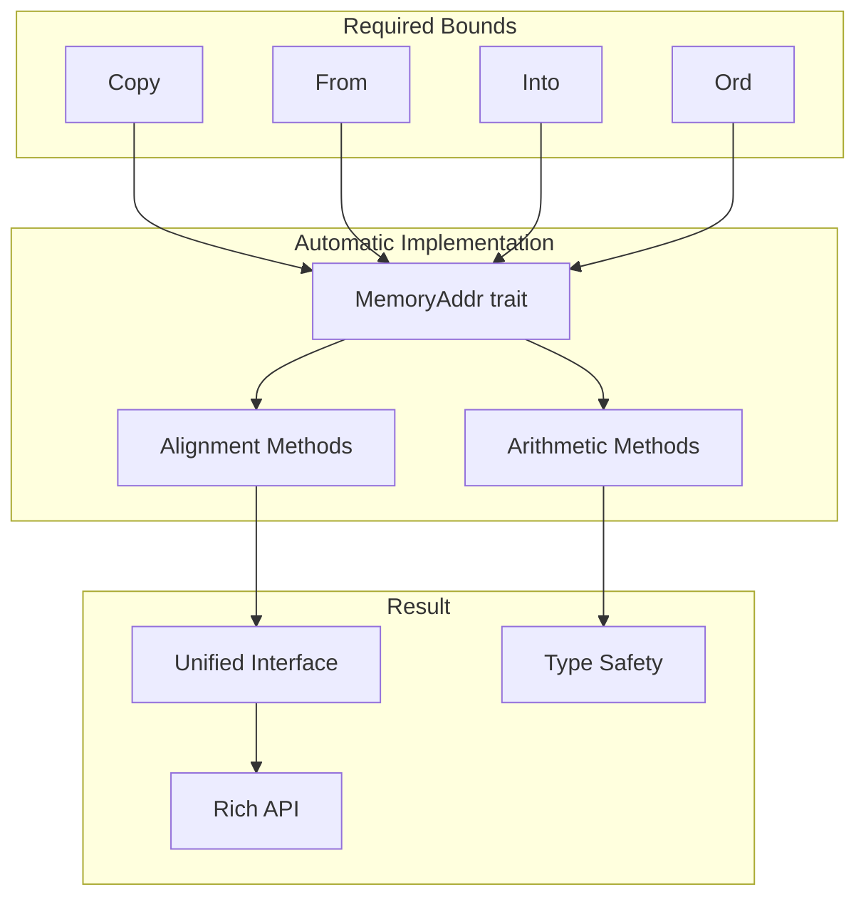

# Address Types and Operations

> **Relevant source files**
> * [memory_addr/src/addr.rs](https://github.com/arceos-org/axmm_crates/blob/87b8ebcd/memory_addr/src/addr.rs)

This document covers the foundational address handling types and operations provided by the `memory_addr` crate. These types provide type-safe abstractions for physical and virtual memory addresses, along with comprehensive alignment and arithmetic operations. For information about address ranges and iteration, see [Address Ranges](/arceos-org/axmm_crates/2.2-address-ranges) and [Page Iteration](/arceos-org/axmm_crates/2.3-page-iteration).

## Core Architecture

The address system is built around the `MemoryAddr` trait, which provides a common interface for all memory address types. The crate includes two concrete address types (`PhysAddr` and `VirtAddr`) and utilities for creating custom address types.

### Address Type Hierarchy



Sources: [memory_addr/src/addr.rs(L12 - L263)&emsp;](https://github.com/arceos-org/axmm_crates/blob/87b8ebcd/memory_addr/src/addr.rs#L12-L263) [memory_addr/src/addr.rs(L450 - L461)&emsp;](https://github.com/arceos-org/axmm_crates/blob/87b8ebcd/memory_addr/src/addr.rs#L450-L461)

## Address Types

### PhysAddr

`PhysAddr` represents a physical memory address. It is a transparent wrapper around `usize` that provides type safety to prevent mixing physical and virtual addresses.

|Method|Description|Return Type|
| --- | --- | --- |
|from_usize(addr)|Creates from raw address value|PhysAddr|
|as_usize()|Converts to raw address value|usize|
|pa!(addr)|Convenience macro for creation|PhysAddr|

### VirtAddr

`VirtAddr` represents a virtual memory address with additional pointer conversion capabilities beyond the base `MemoryAddr` trait.

|Method|Description|Return Type|
| --- | --- | --- |
|from_ptr_of<T>(ptr)|Creates from typed pointer|VirtAddr|
|from_mut_ptr_of<T>(ptr)|Creates from mutable pointer|VirtAddr|
|as_ptr()|Converts to byte pointer|*const u8|
|as_ptr_of<T>()|Converts to typed pointer|*const T|
|as_mut_ptr()|Converts to mutable byte pointer|*mut u8|
|as_mut_ptr_of<T>()|Converts to mutable typed pointer|*mut T|
|va!(addr)|Convenience macro for creation|VirtAddr|

Sources: [memory_addr/src/addr.rs(L450 - L461)&emsp;](https://github.com/arceos-org/axmm_crates/blob/87b8ebcd/memory_addr/src/addr.rs#L450-L461) [memory_addr/src/addr.rs(L463 - L500)&emsp;](https://github.com/arceos-org/axmm_crates/blob/87b8ebcd/memory_addr/src/addr.rs#L463-L500) [memory_addr/src/addr.rs(L502 - L516)&emsp;](https://github.com/arceos-org/axmm_crates/blob/87b8ebcd/memory_addr/src/addr.rs#L502-L516)

### Address Type Operations Flow



Sources: [memory_addr/src/addr.rs(L450 - L500)&emsp;](https://github.com/arceos-org/axmm_crates/blob/87b8ebcd/memory_addr/src/addr.rs#L450-L500) [memory_addr/src/addr.rs(L502 - L516)&emsp;](https://github.com/arceos-org/axmm_crates/blob/87b8ebcd/memory_addr/src/addr.rs#L502-L516)

## Alignment Operations

The `MemoryAddr` trait provides comprehensive alignment functionality for working with page boundaries and custom alignments.

### Core Alignment Methods

|Method|Description|Example Usage|
| --- | --- | --- |
|align_down(align)|Rounds down to alignment boundary|addr.align_down(0x1000)|
|align_up(align)|Rounds up to alignment boundary|addr.align_up(0x1000)|
|align_offset(align)|Returns offset within alignment|addr.align_offset(0x1000)|
|is_aligned(align)|Checks if address is aligned|addr.is_aligned(0x1000)|

### 4K Page Alignment Shortcuts

|Method|Description|Equivalent To|
| --- | --- | --- |
|align_down_4k()|Aligns down to 4K boundary|align_down(4096)|
|align_up_4k()|Aligns up to 4K boundary|align_up(4096)|
|align_offset_4k()|Offset within 4K page|align_offset(4096)|
|is_aligned_4k()|Checks 4K alignment|is_aligned(4096)|

### Alignment Operation Examples

```mermaid
flowchart TD
subgraph align_up_4k()["align_up_4k()"]
    result4["0x3000"]
    result5["0x3000"]
    result6["0x4000"]
end
subgraph align_down_4k()["align_down_4k()"]
    result1["0x2000"]
    result2["0x3000"]
    result3["0x3000"]
end
subgraph subGraph0["Input Addresses"]
    addr1["0x2fff"]
    addr2["0x3000"]
    addr3["0x3001"]
end

addr1 --> result1
addr1 --> result4
addr2 --> result2
addr2 --> result5
addr3 --> result3
addr3 --> result6
```

Sources: [memory_addr/src/addr.rs(L27 - L94)&emsp;](https://github.com/arceos-org/axmm_crates/blob/87b8ebcd/memory_addr/src/addr.rs#L27-L94)

## Arithmetic Operations

The trait provides extensive arithmetic operations with multiple overflow handling strategies.

### Basic Arithmetic

|Method|Description|Overflow Behavior|
| --- | --- | --- |
|offset(isize)|Signed offset addition|Panics|
|add(usize)|Unsigned addition|Panics|
|sub(usize)|Unsigned subtraction|Panics|
|sub_addr(Self)|Address difference|Panics|

### Wrapping Arithmetic

|Method|Description|Overflow Behavior|
| --- | --- | --- |
|wrapping_offset(isize)|Signed offset addition|Wraps around|
|wrapping_add(usize)|Unsigned addition|Wraps around|
|wrapping_sub(usize)|Unsigned subtraction|Wraps around|
|wrapping_sub_addr(Self)|Address difference|Wraps around|

### Checked Arithmetic

|Method|Description|Return Type|
| --- | --- | --- |
|checked_add(usize)|Safe addition|Option<Self>|
|checked_sub(usize)|Safe subtraction|Option<Self>|
|checked_sub_addr(Self)|Safe address difference|Option<usize>|

### Overflowing Arithmetic

|Method|Description|Return Type|
| --- | --- | --- |
|overflowing_add(usize)|Addition with overflow flag|(Self, bool)|
|overflowing_sub(usize)|Subtraction with overflow flag|(Self, bool)|
|overflowing_sub_addr(Self)|Address difference with overflow flag|(usize, bool)|

### Arithmetic Operations Decision Tree



Sources: [memory_addr/src/addr.rs(L99 - L258)&emsp;](https://github.com/arceos-org/axmm_crates/blob/87b8ebcd/memory_addr/src/addr.rs#L99-L258)

## Address Type Creation

The crate provides macros for creating custom address types with the same capabilities as `PhysAddr` and `VirtAddr`.

### def_usize_addr! Macro

The `def_usize_addr!` macro generates new address types with automatic implementations:

* Basic traits: `Copy`, `Clone`, `Default`, `Ord`, `PartialOrd`, `Eq`, `PartialEq`
* Conversion traits: `From<usize>`, `Into<usize>`
* Arithmetic operators: `Add<usize>`, `Sub<usize>`, `Sub<Self>`
* Utility methods: `from_usize()`, `as_usize()`

### def_usize_addr_formatter! Macro

The `def_usize_addr_formatter!` macro generates formatting implementations:

* `Debug` trait with custom format string
* `LowerHex` and `UpperHex` traits

### Custom Address Type Creation Flow



Sources: [memory_addr/src/addr.rs(L302 - L448)&emsp;](https://github.com/arceos-org/axmm_crates/blob/87b8ebcd/memory_addr/src/addr.rs#L302-L448)

## MemoryAddr Trait Implementation

The `MemoryAddr` trait is automatically implemented for any type meeting the required bounds, providing a blanket implementation that enables consistent behavior across all address types.

### Automatic Implementation Requirements



Sources: [memory_addr/src/addr.rs(L261 - L263)&emsp;](https://github.com/arceos-org/axmm_crates/blob/87b8ebcd/memory_addr/src/addr.rs#L261-L263)