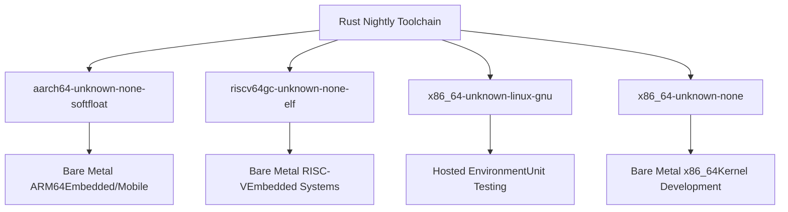
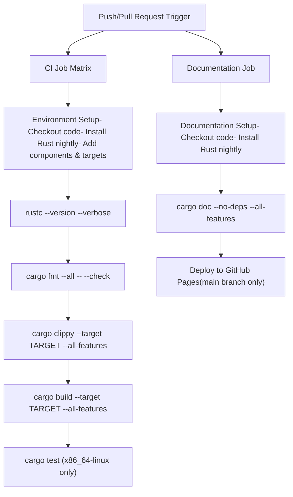
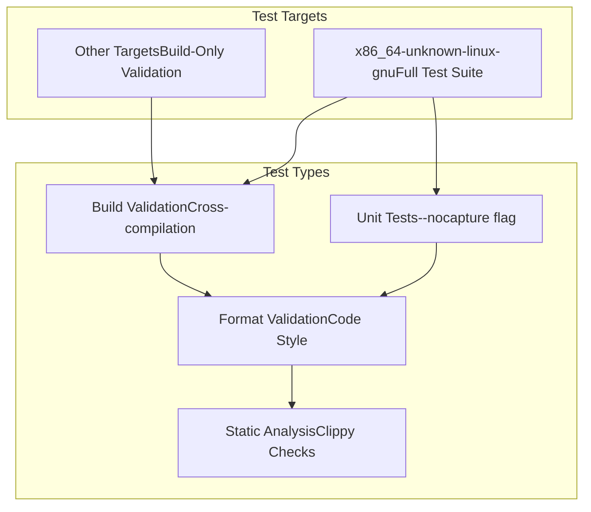
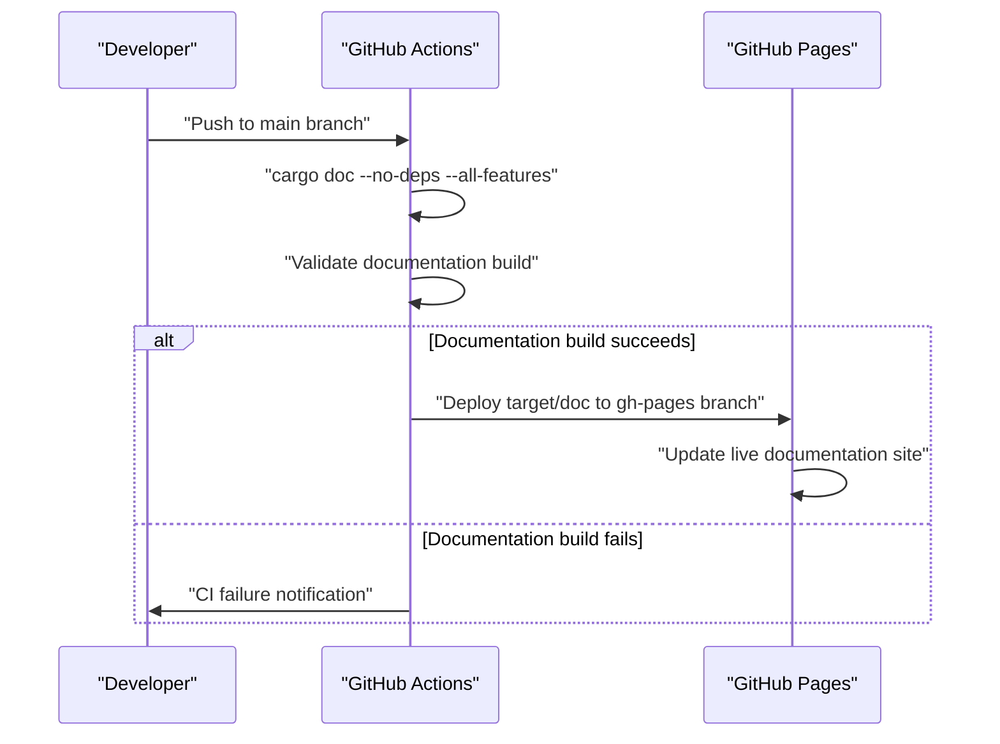
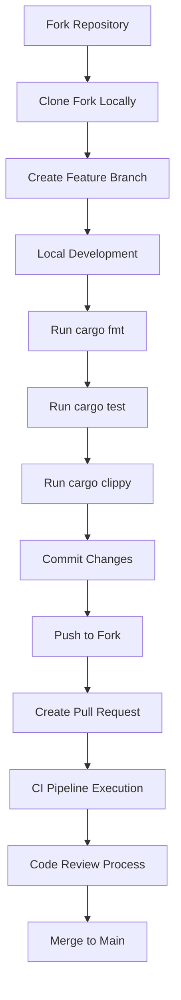

# Development Guide

> **Relevant source files**
> * [.github/workflows/ci.yml](https://github.com/arceos-org/axmm_crates/blob/87b8ebcd/.github/workflows/ci.yml)
> * [.gitignore](https://github.com/arceos-org/axmm_crates/blob/87b8ebcd/.gitignore)
> * [rustfmt.toml](https://github.com/arceos-org/axmm_crates/blob/87b8ebcd/rustfmt.toml)

This document provides comprehensive information for developers contributing to the axmm_crates repository. It covers development environment setup, CI/CD pipeline configuration, code quality standards, testing procedures, and contribution workflow. For information about the system architecture and crate functionality, see [Overview](/arceos-org/axmm_crates/1-overview) and the individual crate documentation pages [memory_addr Crate](/arceos-org/axmm_crates/2-memory_addr-crate) and [memory_set Crate](/arceos-org/axmm_crates/3-memory_set-crate).

## Development Environment Setup

The axmm_crates project requires specific toolchain configuration to support multiple target architectures and maintain compatibility with `no-std` environments.

### Required Rust Toolchain

The project exclusively uses Rust nightly toolchain with the following required components:

|Component|Purpose|
| --- | --- |
|rust-src|Source code for cross-compilation to bare-metal targets|
|clippy|Linting and static analysis|
|rustfmt|Code formatting enforcement|

### Supported Target Architectures



Sources: [.github/workflows/ci.yml(L11 - L12)&emsp;](https://github.com/arceos-org/axmm_crates/blob/87b8ebcd/.github/workflows/ci.yml#L11-L12) [.github/workflows/ci.yml(L16 - L19)&emsp;](https://github.com/arceos-org/axmm_crates/blob/87b8ebcd/.github/workflows/ci.yml#L16-L19)

## CI/CD Pipeline Architecture

The continuous integration system is implemented using GitHub Actions and follows a comprehensive validation strategy.

### CI Workflow Structure



Sources: [.github/workflows/ci.yml(L5 - L31)&emsp;](https://github.com/arceos-org/axmm_crates/blob/87b8ebcd/.github/workflows/ci.yml#L5-L31) [.github/workflows/ci.yml(L32 - L55)&emsp;](https://github.com/arceos-org/axmm_crates/blob/87b8ebcd/.github/workflows/ci.yml#L32-L55)

### Quality Gates and Validation

|Stage|Command|Target Scope|Failure Behavior|
| --- | --- | --- | --- |
|Format Check|cargo fmt --all -- --check|All code|Fail fast|
|Linting|cargo clippy --target TARGET --all-features|Per target|Allow new_without_default warnings|
|Build Validation|cargo build --target TARGET --all-features|Per target|Fail on error|
|Unit Testing|cargo test --target x86_64-unknown-linux-gnu|Hosted only|Output captured|

Sources: [.github/workflows/ci.yml(L22 - L30)&emsp;](https://github.com/arceos-org/axmm_crates/blob/87b8ebcd/.github/workflows/ci.yml#L22-L30)

## Code Quality Standards

### Formatting Configuration

The project enforces consistent code formatting through `rustfmt` with specific configuration:

```
wrap_comments = true
```

This setting ensures that long comments are automatically wrapped to maintain readability.

Sources: [rustfmt.toml(L1 - L2)&emsp;](https://github.com/arceos-org/axmm_crates/blob/87b8ebcd/rustfmt.toml#L1-L2)

### Linting Rules

The CI pipeline runs `clippy` with specific allowances configured:

* **Suppressed Warning**: `clippy::new_without_default` - Allows `new()` methods without implementing `Default` trait
* **Target-Specific Analysis**: Linting runs against all supported target architectures to catch platform-specific issues

Sources: [.github/workflows/ci.yml(L25)&emsp;](https://github.com/arceos-org/axmm_crates/blob/87b8ebcd/.github/workflows/ci.yml#L25-L25)

## Testing Strategy

### Test Execution Matrix



Sources: [.github/workflows/ci.yml(L28 - L30)&emsp;](https://github.com/arceos-org/axmm_crates/blob/87b8ebcd/.github/workflows/ci.yml#L28-L30)

### Test Environment Configuration

* **Output Capture**: Tests run with `--nocapture` flag to display all output during CI execution
* **Target Restriction**: Unit tests only execute on `x86_64-unknown-linux-gnu` due to hosted environment requirements
* **Cross-Compilation Validation**: All targets must successfully build to ensure broad compatibility

## Documentation Generation

### Automated Documentation Pipeline

The documentation system generates comprehensive API documentation with enhanced features:

#### Documentation Build Configuration

```
RUSTDOCFLAGS="-Zunstable-options --enable-index-page -D rustdoc::broken_intra_doc_links -D missing-docs"
cargo doc --no-deps --all-features
```

|Flag|Purpose|
| --- | --- |
|--enable-index-page|Creates unified documentation index|
|-D rustdoc::broken_intra_doc_links|Treats broken internal links as errors|
|-D missing-docs|Requires documentation for all public items|
|--no-deps|Excludes dependency documentation|
|--all-features|Documents all feature combinations|

Sources: [.github/workflows/ci.yml(L40)&emsp;](https://github.com/arceos-org/axmm_crates/blob/87b8ebcd/.github/workflows/ci.yml#L40-L40) [.github/workflows/ci.yml(L47)&emsp;](https://github.com/arceos-org/axmm_crates/blob/87b8ebcd/.github/workflows/ci.yml#L47-L47)

### Documentation Deployment



Sources: [.github/workflows/ci.yml(L48 - L54)&emsp;](https://github.com/arceos-org/axmm_crates/blob/87b8ebcd/.github/workflows/ci.yml#L48-L54)

## Development Workflow

### Repository Structure

The project follows standard Rust workspace conventions with specific exclusions:

```markdown
axmm_crates/
├── target/          # Build artifacts (ignored)
├── .vscode/         # Editor configuration (ignored)
├── Cargo.lock       # Dependency lock file (ignored)
├── memory_addr/     # Foundation address crate
├── memory_set/      # Memory mapping management crate
└── .github/workflows/ # CI/CD configuration
```

Sources: [.gitignore(L1 - L5)&emsp;](https://github.com/arceos-org/axmm_crates/blob/87b8ebcd/.gitignore#L1-L5)

### Contribution Process



### Local Development Commands

|Task|Command|Purpose|
| --- | --- | --- |
|Format Code|cargo fmt --all|Apply consistent formatting|
|Run Tests|cargo test -- --nocapture|Execute test suite with output|
|Lint Code|cargo clippy --all-features|Static analysis and suggestions|
|Build All Targets|cargo build --target <TARGET> --all-features|Validate cross-compilation|
|Generate Docs|cargo doc --no-deps --all-features|Build documentation locally|

Sources: [.github/workflows/ci.yml(L22 - L30)&emsp;](https://github.com/arceos-org/axmm_crates/blob/87b8ebcd/.github/workflows/ci.yml#L22-L30) [.github/workflows/ci.yml(L47)&emsp;](https://github.com/arceos-org/axmm_crates/blob/87b8ebcd/.github/workflows/ci.yml#L47-L47)