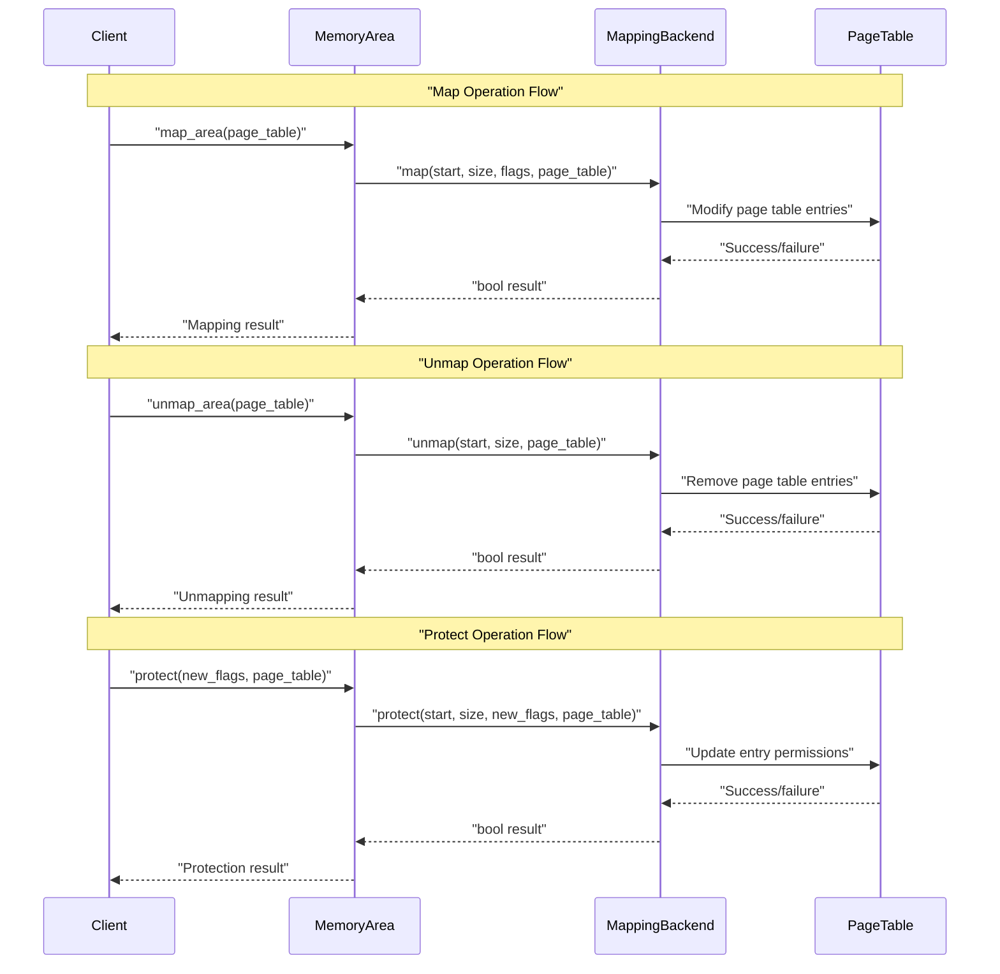
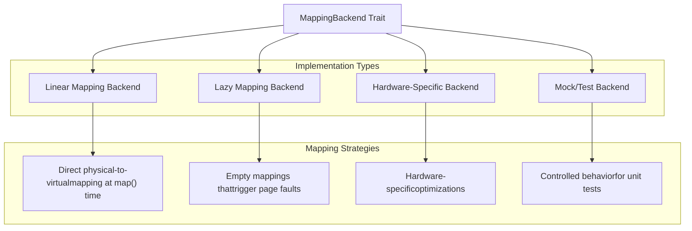

# MappingBackend

> **Relevant source files**
> * [memory_set/src/backend.rs](https://github.com/arceos-org/axmm_crates/blob/87b8ebcd/memory_set/src/backend.rs)

The `MappingBackend` trait provides an abstraction layer for different memory mapping implementations within the memory_set crate. This trait defines the underlying operations that occur when manipulating memory mappings within specific memory areas, allowing the system to support different mapping strategies such as linear mappings, lazy mappings, and custom hardware-specific implementations.

For information about how MappingBackend integrates with memory area management, see [MemoryArea](/arceos-org/axmm_crates/3.2-memoryarea). For details on how backends are used within the broader memory set system, see [MemorySet Core](/arceos-org/axmm_crates/3.1-memoryset-core).

## Trait Definition and Architecture

The `MappingBackend` trait serves as the foundation for all memory mapping operations in the memory_set system. It defines a generic interface that can be implemented by different backend strategies while maintaining type safety through associated types.

### Associated Types Architecture

```

```

The trait defines three associated types that provide flexibility while maintaining type safety:

|Associated Type|Constraint|Purpose|
| --- | --- | --- |
|Addr|MemoryAddr|Address type used for all memory operations|
|Flags|Copy|Permission and attribute flags for memory regions|
|PageTable|None|Page table implementation specific to the backend|

Sources: [memory_set/src/backend.rs(L10 - L16)&emsp;](https://github.com/arceos-org/axmm_crates/blob/87b8ebcd/memory_set/src/backend.rs#L10-L16)

## Core Operations

The `MappingBackend` trait defines three fundamental operations that all memory mapping implementations must provide:

### Memory Mapping Operations



### Method Specifications

#### Map Operation

The `map` method establishes new memory mappings within a region:

* **Parameters**: start address, size, access flags, mutable page table reference
* **Returns**: `bool` indicating success or failure
* **Purpose**: Create page table entries according to the backend's mapping strategy

#### Unmap Operation

The `unmap` method removes existing memory mappings:

* **Parameters**: start address, size, mutable page table reference
* **Returns**: `bool` indicating success or failure
* **Purpose**: Remove page table entries and invalidate translations

#### Protect Operation

The `protect` method modifies access permissions for existing mappings:

* **Parameters**: start address, size, new flags, mutable page table reference
* **Returns**: `bool` indicating success or failure
* **Purpose**: Update page table entry permissions without changing mappings

Sources: [memory_set/src/backend.rs(L18 - L38)&emsp;](https://github.com/arceos-org/axmm_crates/blob/87b8ebcd/memory_set/src/backend.rs#L18-L38)

## Backend Implementation Patterns

Different backend implementations support various memory management strategies within the same unified interface:

### Backend Strategy Types



### Linear vs Lazy Mapping Strategies

The trait documentation specifically mentions two primary mapping approaches:

**Linear Mappings**: The target physical address is known when added to the page table. These backends implement direct address translation setup during the `map` operation.

**Lazy Mappings**: Empty mappings are added to the page table to trigger page faults. These backends defer actual memory allocation until first access, implementing demand paging strategies.

Sources: [memory_set/src/backend.rs(L6 - L9)&emsp;](https://github.com/arceos-org/axmm_crates/blob/87b8ebcd/memory_set/src/backend.rs#L6-L9)

## Integration with Memory Management System

The `MappingBackend` trait integrates closely with other components in the memory_set system:

### System Integration Architecture

```

```

### Backend Selection and Usage

Different memory areas can use different backends based on their specific requirements:

* **Device memory areas** might use linear backends for direct hardware access
* **Application memory areas** might use lazy backends for demand paging
* **Kernel memory areas** might use hardware-optimized backends

The `Clone` requirement on the trait ensures that backends can be easily shared and copied when creating new memory areas or splitting existing ones.

Sources: [memory_set/src/backend.rs(L1 - L38)&emsp;](https://github.com/arceos-org/axmm_crates/blob/87b8ebcd/memory_set/src/backend.rs#L1-L38)

## Type Safety and Constraints

The trait design emphasizes type safety through associated type constraints:

### Type Constraint System

```

```

The associated type constraints ensure that:

* **Address operations** are type-safe and support all required memory address manipulations
* **Flag operations** are efficient through the `Copy` trait requirement
* **Backend sharing** is possible through the `Clone` requirement

Sources: [memory_set/src/backend.rs(L10 - L16)&emsp;](https://github.com/arceos-org/axmm_crates/blob/87b8ebcd/memory_set/src/backend.rs#L10-L16)