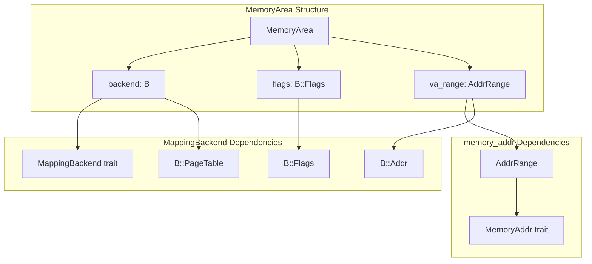
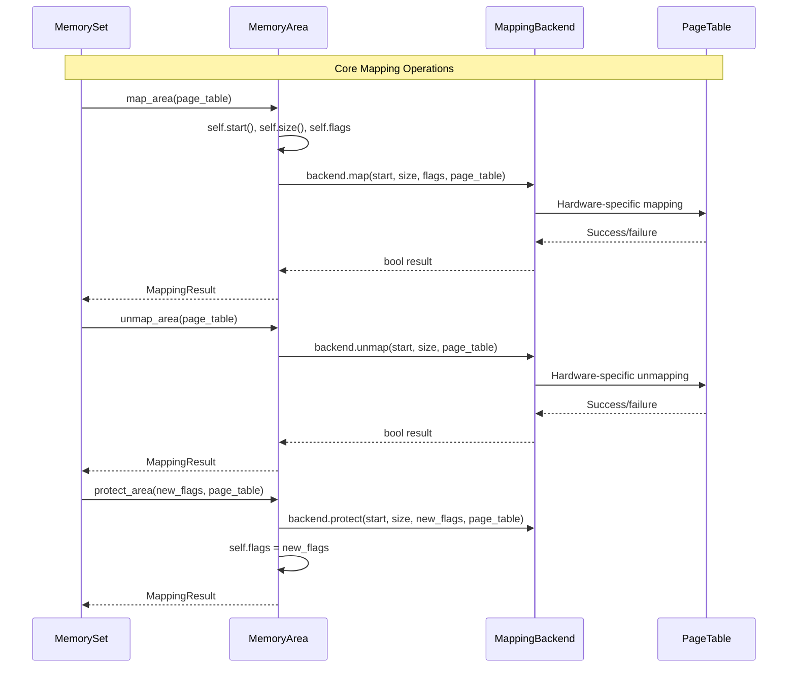
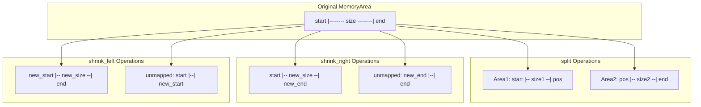
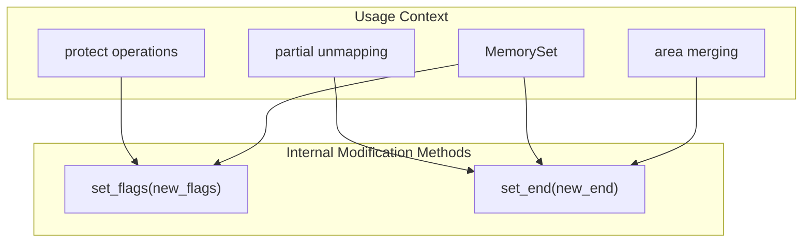

# MemoryArea

> **Relevant source files**
> * [memory_set/src/area.rs](https://github.com/arceos-org/axmm_crates/blob/87b8ebcd/memory_set/src/area.rs)

This document covers the `MemoryArea` struct, which represents individual memory regions within the memory_set crate. MemoryArea encapsulates a continuous range of virtual memory addresses along with their associated flags and mapping backend. For information about managing collections of memory areas, see [MemorySet Core](/arceos-org/axmm_crates/3.1-memoryset-core). For details about the abstraction layer for memory mapping implementations, see [MappingBackend](/arceos-org/axmm_crates/3.3-mappingbackend).

## Core Structure and Purpose

The `MemoryArea<B: MappingBackend>` struct represents a single contiguous virtual memory region with uniform properties. It serves as the fundamental building block for memory management operations, combining address ranges from the memory_addr crate with backend-specific mapping functionality.

### MemoryArea Components Diagram

Sources: [memory_set/src/area.rs(L12 - L16)&emsp;](https://github.com/arceos-org/axmm_crates/blob/87b8ebcd/memory_set/src/area.rs#L12-L16)

## Construction and Access Methods

MemoryArea provides a straightforward constructor and comprehensive access methods for its properties.

### Constructor and Basic Properties

|Method|Return Type|Purpose|
| --- | --- | --- |
|new(start, size, flags, backend)|Self|Creates new memory area from start address and size|
|va_range()|AddrRange<B::Addr>|Returns the virtual address range|
|flags()|B::Flags|Returns memory flags (permissions, etc.)|
|start()|B::Addr|Returns start address|
|end()|B::Addr|Returns end address|
|size()|usize|Returns size in bytes|
|backend()|&B|Returns reference to mapping backend|

The constructor uses `AddrRange::from_start_size()` to create the virtual address range and will panic if `start + size` overflows.

Sources: [memory_set/src/area.rs(L18 - L61)&emsp;](https://github.com/arceos-org/axmm_crates/blob/87b8ebcd/memory_set/src/area.rs#L18-L61)

## Memory Mapping Operations

MemoryArea provides three core mapping operations that interface with the page table through the MappingBackend.

### Mapping Operations Flow

### Core Mapping Methods

* `map_area(page_table)` - Maps the entire memory area using the backend's map function
* `unmap_area(page_table)` - Unmaps the entire memory area
* `protect_area(new_flags, page_table)` - Changes memory protection flags

All methods return `MappingResult`, which is `Result<(), MappingError>`. Operations that fail return `MappingError::BadState`.

Sources: [memory_set/src/area.rs(L74 - L99)&emsp;](https://github.com/arceos-org/axmm_crates/blob/87b8ebcd/memory_set/src/area.rs#L74-L99)

## Area Manipulation Operations

MemoryArea supports sophisticated manipulation operations for dynamic memory management scenarios, including shrinking from either end and splitting into multiple areas.

### Area Manipulation Capabilities

### Manipulation Method Details

|Method|Parameters|Behavior|Constraints|
| --- | --- | --- | --- |
|shrink_left(new_size, page_table)|new_size, page_table|Increases start address, unmaps left portion|new_size > 0 && < current_size|
|shrink_right(new_size, page_table)|new_size, page_table|Decreases end address, unmaps right portion|new_size > 0 && < current_size|
|split(pos)|pos (split position)|Creates two areas, returns right portion|start < pos < end|

#### shrink_left Implementation Details

* Calculates `unmap_size = old_size - new_size`
* Unmaps from current start for `unmap_size` bytes
* Updates `va_range.start` using `wrapping_add` for overflow safety
* Returns `MappingError::BadState` if unmapping fails

#### split Implementation Details

* Validates that `pos` is within the area boundaries (exclusive)
* Creates new MemoryArea for the right portion using `backend.clone()`
* Updates original area's end to `pos`
* Returns `None` if split position is invalid or would create empty areas

Sources: [memory_set/src/area.rs(L101 - L178)&emsp;](https://github.com/arceos-org/axmm_crates/blob/87b8ebcd/memory_set/src/area.rs#L101-L178)

## Internal Modification Methods

MemoryArea provides several private methods used by MemorySet for internal state management.

### Internal State Management

* `set_flags(new_flags)` - Updates the flags field directly
* `set_end(new_end)` - Modifies the end address of the virtual address range

These methods are marked `pub(crate)` and are used internally by MemorySet for complex operations like area merging and partial unmapping.

Sources: [memory_set/src/area.rs(L63 - L73)&emsp;](https://github.com/arceos-org/axmm_crates/blob/87b8ebcd/memory_set/src/area.rs#L63-L73)

## Integration with Type System

MemoryArea implements `Debug` when the backend's address and flags types support debugging, providing formatted output for development and debugging purposes.

The struct uses extensive generic constraints through the `MappingBackend` trait, ensuring type safety across different address types and flag representations while maintaining backend independence.

Sources: [memory_set/src/area.rs(L180 - L191)&emsp;](https://github.com/arceos-org/axmm_crates/blob/87b8ebcd/memory_set/src/area.rs#L180-L191)