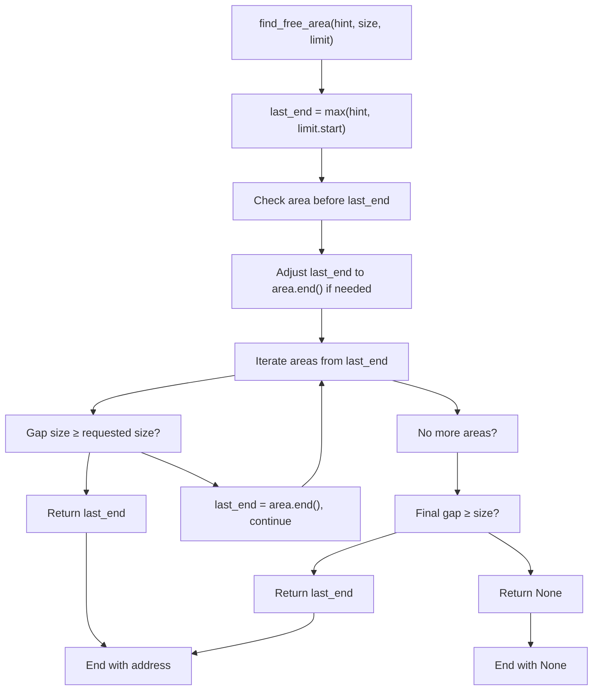

# MemorySet Core

> **Relevant source files**
> * [memory_set/src/set.rs](https://github.com/arceos-org/axmm_crates/blob/87b8ebcd/memory_set/src/set.rs)

This document covers the `MemorySet` struct, which serves as the central container for managing collections of memory areas in the memory_set crate. The `MemorySet` provides high-level memory mapping operations similar to Unix mmap/munmap, including sophisticated area management with automatic splitting, merging, and overlap detection.

For details about individual memory areas, see [MemoryArea](/arceos-org/axmm_crates/3.2-memoryarea). For information about the backend abstraction layer, see [MappingBackend](/arceos-org/axmm_crates/3.3-mappingbackend). For practical usage examples, see [Usage Examples and Testing](/arceos-org/axmm_crates/3.4-usage-examples-and-testing).

## Core Data Structure

The `MemorySet<B: MappingBackend>` struct maintains an ordered collection of non-overlapping memory areas using a `BTreeMap` for efficient range-based operations.

### Internal Organization

```mermaid
classDiagram
class MemorySet {
    -BTreeMap~B_Addr_MemoryArea~ areas
    +new() MemorySet
    +len() usize
    +is_empty() bool
    +iter() Iterator
    +overlaps(range) bool
    +find(addr) Option_MemoryArea_
    +find_free_area(hint, size, limit) Option_B_Addr_
    +map(area, page_table, unmap_overlap) MappingResult
    +unmap(start, size, page_table) MappingResult
    +protect(start, size, update_flags, page_table) MappingResult
    +clear(page_table) MappingResult
}

class BTreeMap~B::Addr, MemoryArea~B~~ {
    
    +range(range) Iterator
    +insert(key, value) Option_MemoryArea_
    +remove(key) Option_MemoryArea_
    +retain(predicate) void
}

class MemoryArea {
    
    +start() B_Addr
    +end() B_Addr
    +size() usize
    +va_range() AddrRange
    +map_area(page_table) MappingResult
    +unmap_area(page_table) MappingResult
    +split(at) Option_MemoryArea_
    +shrink_left(new_size, page_table) MappingResult
    +shrink_right(new_size, page_table) MappingResult
}

MemorySet  *--  BTreeMap : contains
BTreeMap  -->  MemoryArea : stores
```

The `BTreeMap` key is the start address of each memory area, enabling efficient range queries and maintaining areas in sorted order. This design allows O(log n) lookup operations and efficient iteration over address ranges.

**Sources:** [memory_set/src/set.rs(L1 - L36)&emsp;](https://github.com/arceos-org/axmm_crates/blob/87b8ebcd/memory_set/src/set.rs#L1-L36)

## Memory Mapping Operations

### Map Operation

The `map` method adds new memory areas to the set, with sophisticated overlap handling:


The overlap detection uses the `BTreeMap`'s range capabilities to efficiently check both preceding and following areas without scanning the entire collection.

**Sources:** [memory_set/src/set.rs(L93 - L122)&emsp;](https://github.com/arceos-org/axmm_crates/blob/87b8ebcd/memory_set/src/set.rs#L93-L122) [memory_set/src/set.rs(L38 - L51)&emsp;](https://github.com/arceos-org/axmm_crates/blob/87b8ebcd/memory_set/src/set.rs#L38-L51)

### Unmap Operation

The `unmap` operation is the most complex, handling area removal, shrinking, and splitting:


The unmap operation maintains three key invariants:

1. All areas remain non-overlapping
2. Area boundaries align with page boundaries
3. The BTreeMap remains sorted by start address

**Sources:** [memory_set/src/set.rs(L124 - L184)&emsp;](https://github.com/arceos-org/axmm_crates/blob/87b8ebcd/memory_set/src/set.rs#L124-L184)

## Search and Query Operations

### Address Lookup

The `find` method locates the memory area containing a specific address:


This leverages the BTreeMap's ordered structure to find the candidate area in O(log n) time, then performs a simple range check.

**Sources:** [memory_set/src/set.rs(L53 - L57)&emsp;](https://github.com/arceos-org/axmm_crates/blob/87b8ebcd/memory_set/src/set.rs#L53-L57)

### Free Space Detection

The `find_free_area` method implements a gap-finding algorithm:



The algorithm performs a single linear scan through areas in address order, making it efficient for typical usage patterns.

**Sources:** [memory_set/src/set.rs(L59 - L91)&emsp;](https://github.com/arceos-org/axmm_crates/blob/87b8ebcd/memory_set/src/set.rs#L59-L91)

## Permission Management

### Protect Operation

The `protect` method changes memory permissions within a specified range, involving complex area manipulation:


The protect operation must handle five distinct cases based on how the protection range aligns with existing area boundaries, potentially creating new areas through splitting operations.

**Sources:** [memory_set/src/set.rs(L195 - L264)&emsp;](https://github.com/arceos-org/axmm_crates/blob/87b8ebcd/memory_set/src/set.rs#L195-L264)

## Area Management Properties

The `MemorySet` maintains several critical invariants:

|Property|Implementation|Verification|
| --- | --- | --- |
|Non-overlapping Areas|Overlap detection inmap(), careful splitting inunmap()/protect()|overlaps()method, assertions in insertion|
|Sorted Order|BTreeMap automatically maintains order by start address|BTreeMap invariants|
|Consistent Mappings|All operations call correspondingMemoryAreamethods|Backend abstraction layer|
|Boundary Alignment|Size validation and address arithmetic|AddrRangetype safety|

The design ensures that operations can be composed safely - for example, mapping over an existing area with `unmap_overlap=true` will cleanly remove conflicts before establishing the new mapping.

**Sources:** [memory_set/src/set.rs(L101 - L121)&emsp;](https://github.com/arceos-org/axmm_crates/blob/87b8ebcd/memory_set/src/set.rs#L101-L121) [memory_set/src/set.rs(L145 - L152)&emsp;](https://github.com/arceos-org/axmm_crates/blob/87b8ebcd/memory_set/src/set.rs#L145-L152)