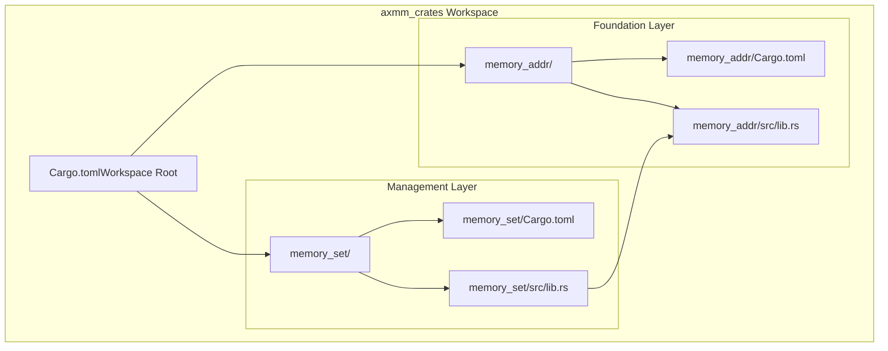
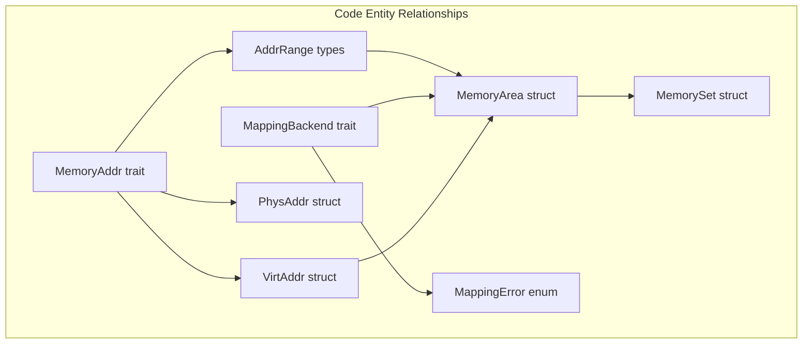
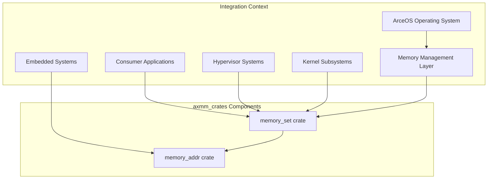

# Overview

> **Relevant source files**
> * [Cargo.toml](https://github.com/arceos-org/axmm_crates/blob/87b8ebcd/Cargo.toml)
> * [README.md](https://github.com/arceos-org/axmm_crates/blob/87b8ebcd/README.md)

## Purpose and Scope

The `axmm_crates` repository provides foundational memory management primitives designed for operating system kernels, hypervisors, and embedded systems. This workspace contains two complementary crates that implement type-safe address handling and high-level memory mapping operations for `no-std` environments.

This document covers the overall architecture and purpose of the `axmm_crates` workspace. For detailed information about the layered design principles, see [System Architecture](/arceos-org/axmm_crates/1.1-system-architecture). For implementation details of the individual crates, see [memory_addr Crate](/arceos-org/axmm_crates/2-memory_addr-crate) and [memory_set Crate](/arceos-org/axmm_crates/3-memory_set-crate).

## Repository Structure

The `axmm_crates` workspace is organized as a Rust workspace containing two primary crates that work together to provide comprehensive memory management capabilities:

|Crate|Purpose|Key Components|
| --- | --- | --- |
|memory_addr|Address type foundations|PhysAddr,VirtAddr,MemoryAddrtrait, alignment utilities|
|memory_set|Memory mapping management|MemorySet,MemoryArea,MappingBackendtrait|

**Sources:** [Cargo.toml(L1 - L20)&emsp;](https://github.com/arceos-org/axmm_crates/blob/87b8ebcd/Cargo.toml#L1-L20) [README.md(L1 - L8)&emsp;](https://github.com/arceos-org/axmm_crates/blob/87b8ebcd/README.md#L1-L8)

## Core Crates Overview

### memory_addr: Address Type Foundations

The `memory_addr` crate provides type-safe abstractions for physical and virtual memory addresses. It implements the `MemoryAddr` trait that serves as the foundation for all address operations throughout the system.

**Key Features:**

* Type-safe `PhysAddr` and `VirtAddr` wrappers preventing address type confusion
* Alignment operations for page boundaries and custom alignments
* Address range types with containment and overlap detection
* Page iteration utilities for memory traversal

### memory_set: Memory Mapping Management

The `memory_set` crate builds upon `memory_addr` to provide high-level memory mapping operations similar to `mmap()` functionality. It manages collections of memory areas and provides abstraction over different mapping backends.

**Key Features:**

* `MemorySet` collections for managing multiple memory areas
* `MemoryArea` structures representing individual mapped regions
* `MappingBackend` trait for hardware abstraction
* Area splitting, merging, and overlap resolution

**Sources:** [README.md(L5 - L6)&emsp;](https://github.com/arceos-org/axmm_crates/blob/87b8ebcd/README.md#L5-L6)

## Target Environment and Use Cases

The `axmm_crates` workspace is specifically designed for systems programming contexts where memory management is critical:

### Primary Target: ArceOS Integration

This workspace serves as a foundational component for the ArceOS operating system project, providing reusable memory management primitives that can be integrated into kernel subsystems.

### Supported Environments

|Environment|Compatibility|Notes|
| --- | --- | --- |
|no-std|Full support|Core design requirement|
|Rust 1.70.0+|Required|Minimum supported version|
|OS Kernels|Primary use case|Direct hardware memory management|
|Hypervisors|Supported|Guest memory management|
|Embedded Systems|Supported|Resource-constrained environments|

### License and Availability

The workspace is released under a triple license scheme allowing flexibility for different use cases:

* GPL-3.0-or-later for open source projects
* Apache-2.0 for permissive licensing needs
* MulanPSL-2.0 for compliance with Chinese software standards

**Sources:** [Cargo.toml(L9 - L19)&emsp;](https://github.com/arceos-org/axmm_crates/blob/87b8ebcd/Cargo.toml#L9-L19) [README.md(L1 - L3)&emsp;](https://github.com/arceos-org/axmm_crates/blob/87b8ebcd/README.md#L1-L3)

The modular design allows consumers to use only the components they need - systems requiring only basic address handling can depend solely on `memory_addr`, while those needing full memory mapping capabilities can use both crates together.