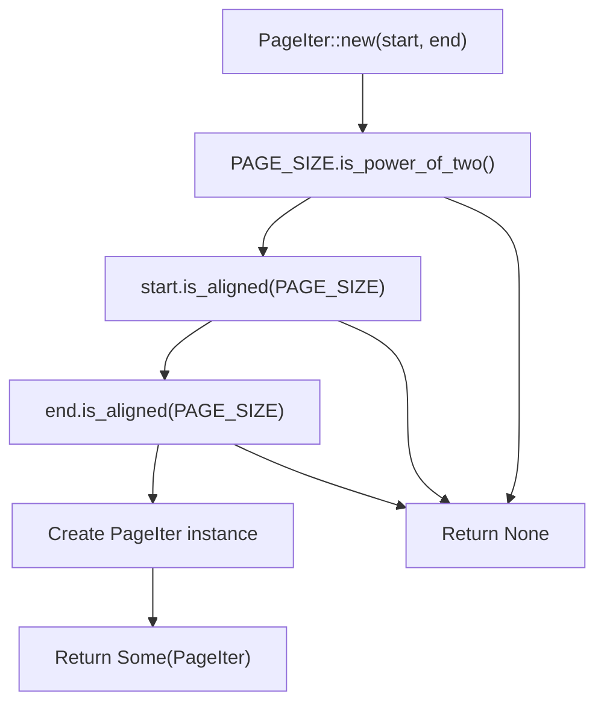
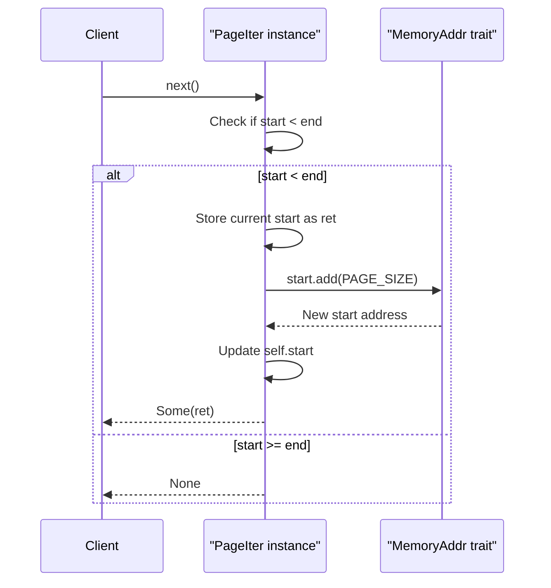
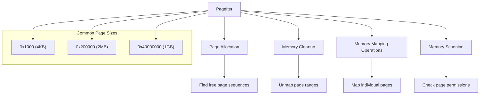

# Page Iteration

> **Relevant source files**
> * [memory_addr/src/iter.rs](https://github.com/arceos-org/axmm_crates/blob/87b8ebcd/memory_addr/src/iter.rs)

This document covers the page iteration functionality provided by the `memory_addr` crate, specifically the `PageIter` struct and its associated methods. Page iteration allows traversing memory addresses in fixed-size page increments, which is essential for memory management operations like mapping, unmapping, and allocating memory in page-aligned chunks.

For information about address types and basic operations, see [Address Types and Operations](/arceos-org/axmm_crates/2.1-address-types-and-operations). For address range operations, see [Address Ranges](/arceos-org/axmm_crates/2.2-address-ranges).

## Overview

The `PageIter` struct provides a safe, type-safe iterator for traversing memory addresses in page-sized steps. It enforces alignment requirements and validates page sizes at construction time, ensuring that iteration only occurs over properly aligned memory regions.

**PageIter Structure Design**

```

```

Sources: [memory_addr/src/iter.rs(L22 - L28)&emsp;](https://github.com/arceos-org/axmm_crates/blob/87b8ebcd/memory_addr/src/iter.rs#L22-L28) [memory_addr/src/iter.rs(L50 - L65)&emsp;](https://github.com/arceos-org/axmm_crates/blob/87b8ebcd/memory_addr/src/iter.rs#L50-L65)

## PageIter Structure and Parameters

The `PageIter` struct is defined with two generic parameters that control its behavior:

|Parameter|Type|Purpose|
| --- | --- | --- |
|PAGE_SIZE|const usize|Compile-time constant specifying page size in bytes|
|A|Type bound byMemoryAddr|Address type (e.g.,PhysAddr,VirtAddr,usize)|

The struct contains two fields:

* `start`: Current position in the iteration
* `end`: End boundary (exclusive) for the iteration

The `PAGE_SIZE` parameter must be a power of 2, and both `start` and `end` addresses must be aligned to `PAGE_SIZE` boundaries.

Sources: [memory_addr/src/iter.rs(L22 - L28)&emsp;](https://github.com/arceos-org/axmm_crates/blob/87b8ebcd/memory_addr/src/iter.rs#L22-L28)

## Creating PageIter Instances

**PageIter Construction Flow**



Sources: [memory_addr/src/iter.rs(L34 - L47)&emsp;](https://github.com/arceos-org/axmm_crates/blob/87b8ebcd/memory_addr/src/iter.rs#L34-L47)

The `new` method performs several validation checks:

1. **Page Size Validation**: Ensures `PAGE_SIZE` is a power of 2
2. **Start Address Alignment**: Verifies `start` is aligned to `PAGE_SIZE`
3. **End Address Alignment**: Verifies `end` is aligned to `PAGE_SIZE`

If any validation fails, the method returns `None`. Otherwise, it returns `Some(PageIter)` with the validated parameters.

## Iterator Implementation

The `PageIter` implements the `Iterator` trait, yielding addresses of type `A` on each iteration:

**Iterator Mechanics**



Sources: [memory_addr/src/iter.rs(L50 - L65)&emsp;](https://github.com/arceos-org/axmm_crates/blob/87b8ebcd/memory_addr/src/iter.rs#L50-L65)

The iteration process:

1. **Boundary Check**: Compare current `start` with `end`
2. **Value Return**: If within bounds, return current `start` value
3. **Advance**: Increment `start` by `PAGE_SIZE` using the `add` method
4. **Termination**: Return `None` when `start` reaches or exceeds `end`

## Usage Patterns

### Basic Page Iteration

The most common usage pattern involves iterating over a memory range with 4KB pages:

```javascript
// Example from documentation
let mut iter = PageIter::<0x1000, usize>::new(0x1000, 0x3000).unwrap();
assert_eq!(iter.next(), Some(0x1000));
assert_eq!(iter.next(), Some(0x2000));
assert_eq!(iter.next(), None);
```

### Error Handling

PageIter construction can fail if alignment requirements are not met:

```
// This will return None due to misaligned end address
assert!(PageIter::<0x1000, usize>::new(0x1000, 0x3001).is_none());
```

**Common PageIter Usage Scenarios**



Sources: [memory_addr/src/iter.rs(L10 - L21)&emsp;](https://github.com/arceos-org/axmm_crates/blob/87b8ebcd/memory_addr/src/iter.rs#L10-L21)

### Integration with Address Types

PageIter works with any type implementing `MemoryAddr`, enabling type-safe iteration over different address spaces:

* **Physical addresses**: `PageIter<0x1000, PhysAddr>`
* **Virtual addresses**: `PageIter<0x1000, VirtAddr>`
* **Raw addresses**: `PageIter<0x1000, usize>`

The iterator leverages the `MemoryAddr` trait's `is_aligned` and `add` methods to ensure correct alignment validation and address arithmetic.

Sources: [memory_addr/src/iter.rs(L1)&emsp;](https://github.com/arceos-org/axmm_crates/blob/87b8ebcd/memory_addr/src/iter.rs#L1-L1) [memory_addr/src/iter.rs(L24)&emsp;](https://github.com/arceos-org/axmm_crates/blob/87b8ebcd/memory_addr/src/iter.rs#L24-L24) [memory_addr/src/iter.rs(L32)&emsp;](https://github.com/arceos-org/axmm_crates/blob/87b8ebcd/memory_addr/src/iter.rs#L32-L32)