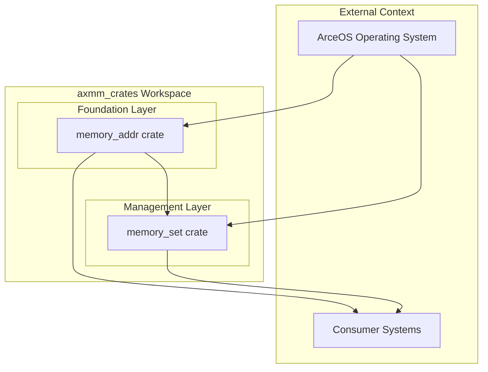
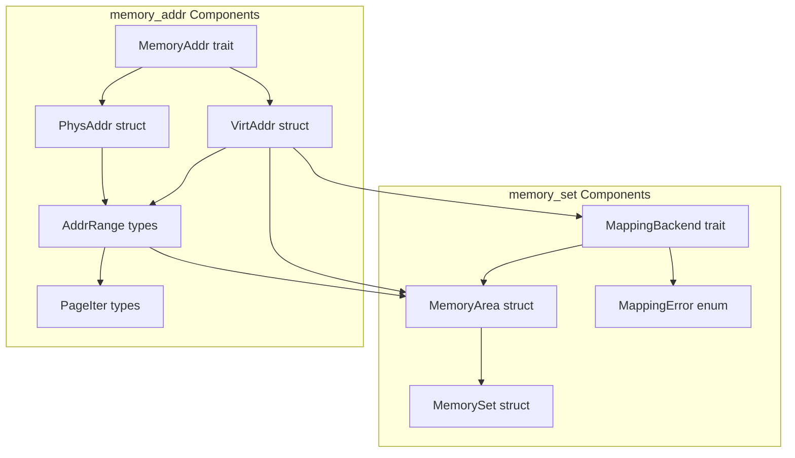
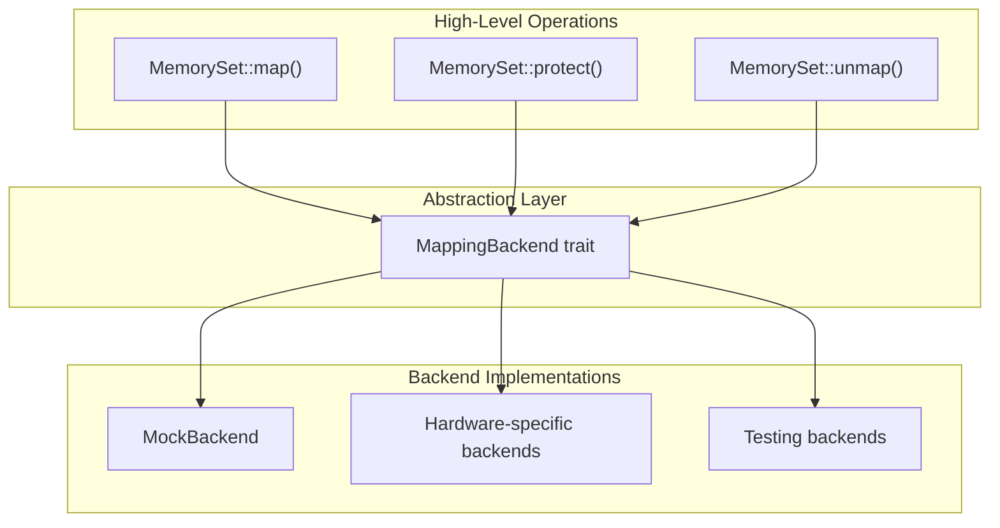
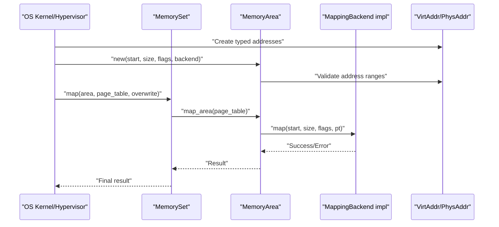

# System Architecture

> **Relevant source files**
> * [Cargo.toml](https://github.com/arceos-org/axmm_crates/blob/87b8ebcd/Cargo.toml)
> * [README.md](https://github.com/arceos-org/axmm_crates/blob/87b8ebcd/README.md)
> * [memory_addr/README.md](https://github.com/arceos-org/axmm_crates/blob/87b8ebcd/memory_addr/README.md)
> * [memory_set/README.md](https://github.com/arceos-org/axmm_crates/blob/87b8ebcd/memory_set/README.md)

## Purpose and Scope

This document explains the layered architecture design of the axmm_crates workspace, which provides foundational memory management capabilities for operating system development. The architecture consists of two primary crates: `memory_addr` serving as the foundational address handling layer, and `memory_set` providing higher-level memory mapping management built upon those foundations.

For detailed documentation of individual components, see [memory_addr Crate](/arceos-org/axmm_crates/2-memory_addr-crate) and [memory_set Crate](/arceos-org/axmm_crates/3-memory_set-crate). For practical implementation guidance, see [Development Guide](/arceos-org/axmm_crates/4-development-guide).

## Workspace Structure and Dependencies

The axmm_crates workspace implements a clean two-layer architecture where each layer provides specific abstractions for memory management operations.

### Workspace Architecture

Sources: [Cargo.toml(L1 - L20)&emsp;](https://github.com/arceos-org/axmm_crates/blob/87b8ebcd/Cargo.toml#L1-L20) [README.md(L1 - L8)&emsp;](https://github.com/arceos-org/axmm_crates/blob/87b8ebcd/README.md#L1-L8)

### Core Component Dependencies

Sources: [memory_addr/README.md(L12 - L29)&emsp;](https://github.com/arceos-org/axmm_crates/blob/87b8ebcd/memory_addr/README.md#L12-L29) [memory_set/README.md(L17 - L18)&emsp;](https://github.com/arceos-org/axmm_crates/blob/87b8ebcd/memory_set/README.md#L17-L18) [memory_set/README.md(L49 - L89)&emsp;](https://github.com/arceos-org/axmm_crates/blob/87b8ebcd/memory_set/README.md#L49-L89)

## Design Principles

### Type Safety and Address Separation

The architecture enforces strict type safety by separating physical and virtual addresses through distinct types. The `MemoryAddr` trait provides common operations while `PhysAddr` and `VirtAddr` prevent mixing address types inappropriately.

|Principle|Implementation|Benefit|
| --- | --- | --- |
|Type Safety|SeparatePhysAddrandVirtAddrtypes|Prevents address type confusion|
|Trait Abstraction|MemoryAddrtrait for common operations|Consistent interface across address types|
|Range Operations|AddrRangetypes for memory regions|Safe range manipulation and validation|

### Backend Abstraction Layer

The `MappingBackend` trait provides hardware-agnostic memory mapping operations, enabling the same high-level logic to work across different memory management units and page table implementations.

Sources: [memory_set/README.md(L49 - L89)&emsp;](https://github.com/arceos-org/axmm_crates/blob/87b8ebcd/memory_set/README.md#L49-L89)

### No-std Compatibility

The entire architecture is designed for `no-std` environments, making it suitable for kernel development and embedded systems where standard library features are unavailable.

## Integration Patterns

### ArceOS Integration

The crates are specifically designed as foundational components for the ArceOS operating system project, providing reusable memory management primitives that can be composed into larger memory management systems.

### Consumer Usage Patterns

Sources: [memory_set/README.md(L34 - L46)&emsp;](https://github.com/arceos-org/axmm_crates/blob/87b8ebcd/memory_set/README.md#L34-L46)

### Key Architecture Benefits

|Benefit|Implementation Detail|Code Location|
| --- | --- | --- |
|Modularity|Separate crates for different abstraction levels|Cargo.toml4-7|
|Reusability|Trait-based interfaces enable multiple implementations|memory_set/README.md49-89|
|Safety|Type-safe address handling prevents common errors|memory_addr/README.md14-21|
|Testability|Mock backends enable comprehensive testing|memory_set/README.md22-30|
|Hardware Independence|Backend abstraction supports different MMU architectures|memory_set/README.md49-89|

The layered architecture ensures that low-level address manipulation primitives remain independent and reusable, while higher-level memory mapping operations build upon these foundations to provide comprehensive memory management capabilities.

Sources: [Cargo.toml(L1 - L20)&emsp;](https://github.com/arceos-org/axmm_crates/blob/87b8ebcd/Cargo.toml#L1-L20) [README.md(L1 - L8)&emsp;](https://github.com/arceos-org/axmm_crates/blob/87b8ebcd/README.md#L1-L8) [memory_addr/README.md(L1 - L30)&emsp;](https://github.com/arceos-org/axmm_crates/blob/87b8ebcd/memory_addr/README.md#L1-L30) [memory_set/README.md(L1 - L91)&emsp;](https://github.com/arceos-org/axmm_crates/blob/87b8ebcd/memory_set/README.md#L1-L91)