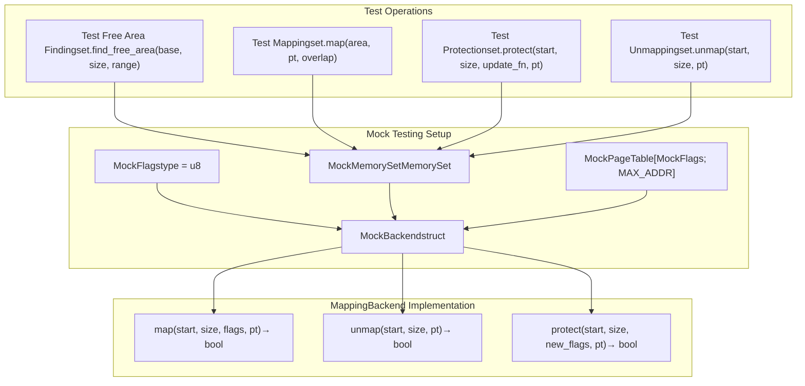
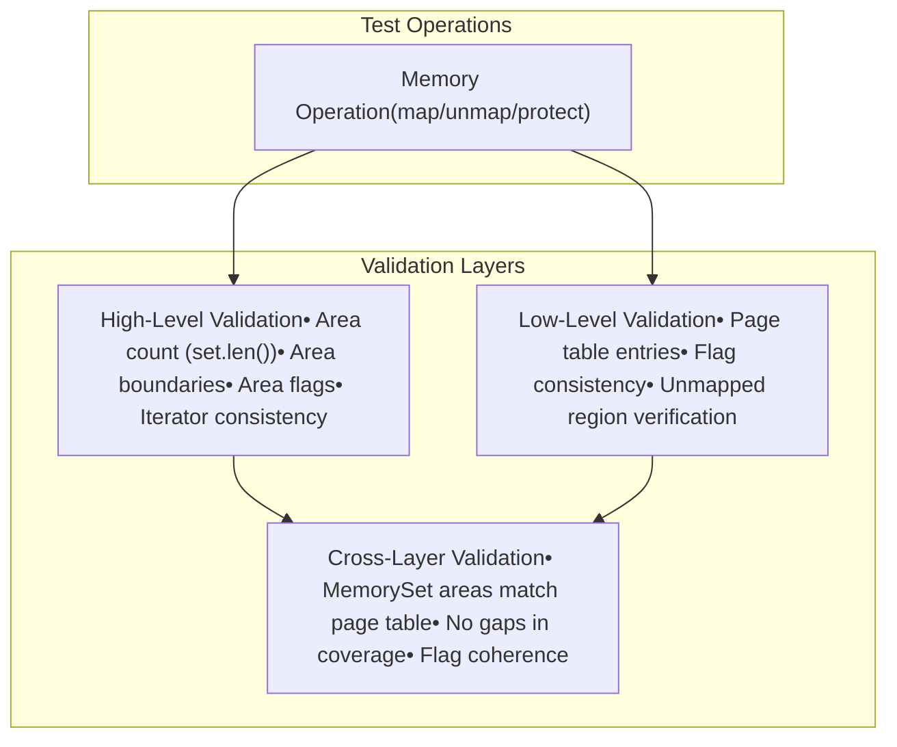

# Usage Examples and Testing

> **Relevant source files**
> * [memory_set/README.md](https://github.com/arceos-org/axmm_crates/blob/87b8ebcd/memory_set/README.md)
> * [memory_set/src/tests.rs](https://github.com/arceos-org/axmm_crates/blob/87b8ebcd/memory_set/src/tests.rs)

This page demonstrates practical usage patterns for the `memory_set` crate components through comprehensive examples and testing scenarios. It covers both basic operations and advanced memory management patterns that showcase the full capabilities of the system.

For information about the core MemorySet data structures, see [MemorySet Core](/arceos-org/axmm_crates/3.1-memoryset-core). For details about the MappingBackend trait implementation requirements, see [MappingBackend](/arceos-org/axmm_crates/3.3-mappingbackend).

## Mock Testing Infrastructure

The `memory_set` crate uses a comprehensive mock backend system for testing that serves as an excellent example of how to implement the `MappingBackend` trait for real-world usage.

### MockBackend Implementation

The testing infrastructure centers around a `MockBackend` that simulates memory mapping operations using a simple array-based page table:



Sources: [memory_set/src/tests.rs(L10 - L55)&emsp;](https://github.com/arceos-org/axmm_crates/blob/87b8ebcd/memory_set/src/tests.rs#L10-L55) [memory_set/README.md(L22 - L89)&emsp;](https://github.com/arceos-org/axmm_crates/blob/87b8ebcd/memory_set/README.md#L22-L89)

### Key Testing Constants and Types

|Component|Definition|Purpose|
| --- | --- | --- |
|MAX_ADDR|0x10000|Maximum address space for testing|
|MockFlags|u8|Simple flags representation|
|MockPageTable|[MockFlags; MAX_ADDR]|Array-based page table simulation|
|MockBackend|struct|Implementation ofMappingBackendtrait|

The mock backend implements three core operations that demonstrate the expected behavior patterns for real memory management systems.

Sources: [memory_set/src/tests.rs(L5 - L13)&emsp;](https://github.com/arceos-org/axmm_crates/blob/87b8ebcd/memory_set/src/tests.rs#L5-L13)

## Basic Usage Patterns

### Simple Map and Unmap Operations

The most fundamental usage pattern involves creating a `MemorySet`, mapping memory areas, and performing basic operations:

```

```

Sources: [memory_set/src/tests.rs(L110 - L116)&emsp;](https://github.com/arceos-org/axmm_crates/blob/87b8ebcd/memory_set/src/tests.rs#L110-L116) [memory_set/src/tests.rs(L330 - L364)&emsp;](https://github.com/arceos-org/axmm_crates/blob/87b8ebcd/memory_set/src/tests.rs#L330-L364)

## Advanced Testing Scenarios

### Area Splitting During Unmap Operations

One of the most complex scenarios tested is how the system handles unmapping portions of existing areas, which can result in area splitting:

```

```

The test demonstrates that protection changes that don't actually modify flags (like the third protect operation) are optimized to avoid unnecessary area splitting.

Sources: [memory_set/src/tests.rs(L232 - L328)&emsp;](https://github.com/arceos-org/axmm_crates/blob/87b8ebcd/memory_set/src/tests.rs#L232-L328)

### Free Area Discovery

The system includes sophisticated logic for finding available memory regions that can accommodate new allocations:

|Test Scenario|Base Address|Size|Expected Result|Reasoning|
| --- | --- | --- | --- | --- |
|Exact fit|0x0|0x1000|0x1000|First available gap|
|Partial fit|0x800|0x800|0x1000|Rounds up to available space|
|Within gap|0x1800|0x800|0x1800|Fits in existing gap|
|Requires larger gap|0x1800|0x1000|0x3000|Moves to next suitable gap|
|At boundary|0xf000|0x1000|0xf000|Fits at end of address space|
|Impossible|0xf001|0x1000|None|No space available|

This testing validates the free area detection logic that would be crucial for implementing memory allocators on top of the system.

Sources: [memory_set/src/tests.rs(L330 - L364)&emsp;](https://github.com/arceos-org/axmm_crates/blob/87b8ebcd/memory_set/src/tests.rs#L330-L364)

## Test Infrastructure Utilities

### Assertion Macros

The test suite defines custom assertion macros that simplify error checking:

* `assert_ok!(expr)` - Verifies operation succeeds
* `assert_err!(expr)` - Verifies operation fails
* `assert_err!(expr, ErrorType)` - Verifies specific error type

### Memory Set Inspection

The `dump_memory_set` function provides detailed debugging output showing the current state of all memory areas, which is invaluable during development and testing.

Sources: [memory_set/src/tests.rs(L57 - L81)&emsp;](https://github.com/arceos-org/axmm_crates/blob/87b8ebcd/memory_set/src/tests.rs#L57-L81)

## Integration Testing Patterns

### Comprehensive State Validation

The tests systematically verify both the high-level MemorySet state and the low-level MockPageTable state after each operation:



This multi-layered validation approach ensures that the abstract memory area management remains consistent with the underlying page table state.

Sources: [memory_set/src/tests.rs(L106 - L108)&emsp;](https://github.com/arceos-org/axmm_crates/blob/87b8ebcd/memory_set/src/tests.rs#L106-L108) [memory_set/src/tests.rs(L140 - L142)&emsp;](https://github.com/arceos-org/axmm_crates/blob/87b8ebcd/memory_set/src/tests.rs#L140-L142) [memory_set/src/tests.rs(L186 - L221)&emsp;](https://github.com/arceos-org/axmm_crates/blob/87b8ebcd/memory_set/src/tests.rs#L186-L221)