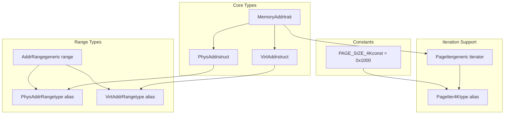
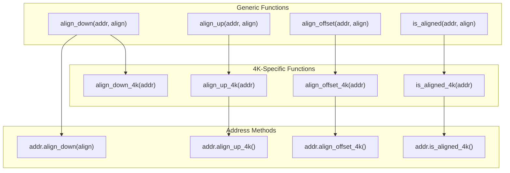
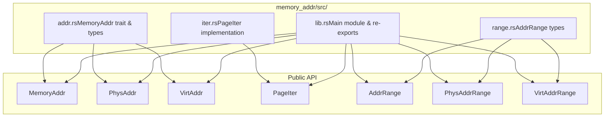

# memory_addr Crate

> **Relevant source files**
> * [memory_addr/Cargo.toml](https://github.com/arceos-org/axmm_crates/blob/87b8ebcd/memory_addr/Cargo.toml)
> * [memory_addr/README.md](https://github.com/arceos-org/axmm_crates/blob/87b8ebcd/memory_addr/README.md)
> * [memory_addr/src/lib.rs](https://github.com/arceos-org/axmm_crates/blob/87b8ebcd/memory_addr/src/lib.rs)

## Purpose and Scope

The `memory_addr` crate provides foundational abstractions for physical and virtual memory addresses in the ArceOS ecosystem. It serves as the lowest-level component in the memory management stack, offering type-safe address representations, alignment utilities, and iteration capabilities over memory regions.

This crate focuses specifically on address manipulation primitives and does not handle memory mapping or higher-level memory management operations. For memory mapping functionality and management of memory regions, see [memory_set Crate](/arceos-org/axmm_crates/3-memory_set-crate).

The crate is designed for `no-std` environments and provides essential building blocks for operating system kernels, hypervisors, and embedded systems that need precise control over memory addresses.

Sources: [memory_addr/Cargo.toml(L1 - L17)&emsp;](https://github.com/arceos-org/axmm_crates/blob/87b8ebcd/memory_addr/Cargo.toml#L1-L17) [memory_addr/README.md(L1 - L30)&emsp;](https://github.com/arceos-org/axmm_crates/blob/87b8ebcd/memory_addr/README.md#L1-L30) [memory_addr/src/lib.rs(L1 - L11)&emsp;](https://github.com/arceos-org/axmm_crates/blob/87b8ebcd/memory_addr/src/lib.rs#L1-L11)

## Core Address Type System

The crate implements a type-safe address system built around a common trait with specialized implementations for different address spaces.



Sources: [memory_addr/src/lib.rs(L8 - L16)&emsp;](https://github.com/arceos-org/axmm_crates/blob/87b8ebcd/memory_addr/src/lib.rs#L8-L16)

## Address Operations and Utilities

The crate provides a comprehensive set of alignment and arithmetic operations that work consistently across all address types.



Sources: [memory_addr/src/lib.rs(L18 - L76)&emsp;](https://github.com/arceos-org/axmm_crates/blob/87b8ebcd/memory_addr/src/lib.rs#L18-L76)

## Function Categories and Implementation

The crate organizes its functionality into several key categories that build upon each other to provide a complete address manipulation toolkit.

|Category|Functions|Purpose|
| --- | --- | --- |
|Generic Alignment|align_down,align_up,align_offset,is_aligned|Power-of-two alignment operations for any alignment value|
|4K Page Helpers|align_down_4k,align_up_4k,align_offset_4k,is_aligned_4k|Specialized functions for common 4K page operations|
|Type Wrappers|PhysAddr,VirtAddr|Type-safe address representations with built-in methods|
|Range Operations|AddrRange,PhysAddrRange,VirtAddrRange|Address range abstractions for memory region management|
|Iteration Support|PageIter,PageIter4K|Iterator types for traversing memory in page-sized chunks|

Sources: [memory_addr/src/lib.rs(L18 - L76)&emsp;](https://github.com/arceos-org/axmm_crates/blob/87b8ebcd/memory_addr/src/lib.rs#L18-L76)

## Core Constants and Type Aliases

The crate defines essential constants and type aliases that standardize common memory management patterns:

```typescript
// From memory_addr/src/lib.rs:12-16
pub const PAGE_SIZE_4K: usize = 0x1000;
pub type PageIter4K<A> = PageIter<PAGE_SIZE_4K, A>;
```

The `PAGE_SIZE_4K` constant (4096 bytes) is fundamental to the system's page-oriented design, while `PageIter4K` provides a convenient type alias for the most common page iteration scenario.

Sources: [memory_addr/src/lib.rs(L12 - L16)&emsp;](https://github.com/arceos-org/axmm_crates/blob/87b8ebcd/memory_addr/src/lib.rs#L12-L16)

## Module Structure and Exports

The crate follows a clean modular design with focused responsibilities:



Sources: [memory_addr/src/lib.rs(L4 - L10)&emsp;](https://github.com/arceos-org/axmm_crates/blob/87b8ebcd/memory_addr/src/lib.rs#L4-L10)

## Alignment Implementation Details

The alignment functions implement efficient bit manipulation operations that require power-of-two alignments:

* **`align_down(addr, align)`**: Uses `addr & !(align - 1)` to mask off lower bits
* **`align_up(addr, align)`**: Uses `(addr + align - 1) & !(align - 1)` to round up
* **`align_offset(addr, align)`**: Uses `addr & (align - 1)` to get remainder
* **`is_aligned(addr, align)`**: Checks if `align_offset(addr, align) == 0`

These operations are marked `const fn`, enabling compile-time computation when used with constant values.

Sources: [memory_addr/src/lib.rs(L24 - L51)&emsp;](https://github.com/arceos-org/axmm_crates/blob/87b8ebcd/memory_addr/src/lib.rs#L24-L51)

## Integration with ArceOS Ecosystem

The `memory_addr` crate serves as the foundation layer in the ArceOS memory management stack. It provides the type-safe primitives that higher-level components build upon, particularly the `memory_set` crate which uses these address types for memory region management.

The crate's `no_std` compatibility and const function implementations make it suitable for both kernel and embedded environments where compile-time optimization and resource constraints are critical.

Sources: [memory_addr/Cargo.toml(L5)&emsp;](https://github.com/arceos-org/axmm_crates/blob/87b8ebcd/memory_addr/Cargo.toml#L5-L5) [memory_addr/src/lib.rs(L1)&emsp;](https://github.com/arceos-org/axmm_crates/blob/87b8ebcd/memory_addr/src/lib.rs#L1-L1)