# memory_set Crate

> **Relevant source files**
> * [memory_set/Cargo.toml](https://github.com/arceos-org/axmm_crates/blob/87b8ebcd/memory_set/Cargo.toml)
> * [memory_set/README.md](https://github.com/arceos-org/axmm_crates/blob/87b8ebcd/memory_set/README.md)
> * [memory_set/src/lib.rs](https://github.com/arceos-org/axmm_crates/blob/87b8ebcd/memory_set/src/lib.rs)

## Purpose and Scope

The `memory_set` crate provides data structures and operations for managing memory mappings in operating system kernels and hypervisors. It implements a high-level abstraction layer for memory area management that supports operations similar to Unix `mmap`, `munmap`, and `mprotect` system calls. This crate builds upon the foundational address types from the `memory_addr` crate to provide a complete memory mapping management solution.

For information about the underlying address types and operations, see [memory_addr Crate](/arceos-org/axmm_crates/2-memory_addr-crate). For detailed documentation of specific components within this crate, see [MemorySet Core](/arceos-org/axmm_crates/3.1-memoryset-core), [MemoryArea](/arceos-org/axmm_crates/3.2-memoryarea), and [MappingBackend](/arceos-org/axmm_crates/3.3-mappingbackend).

## Core Components Overview

The `memory_set` crate provides three primary components that work together to manage memory mappings:

### Core Types Architecture


Sources: [memory_set/src/lib.rs(L13 - L15)&emsp;](https://github.com/arceos-org/axmm_crates/blob/87b8ebcd/memory_set/src/lib.rs#L13-L15) [memory_set/src/lib.rs(L17 - L29)&emsp;](https://github.com/arceos-org/axmm_crates/blob/87b8ebcd/memory_set/src/lib.rs#L17-L29)

### Component Responsibilities

|Component|Purpose|Key Methods|
| --- | --- | --- |
|MemorySet<B>|Collection manager for memory areas|map(),unmap(),protect(),find_free_area()|
|MemoryArea<B>|Individual memory region representation|new(),va_range(),size(),flags()|
|MappingBackend|Hardware abstraction trait|map(),unmap(),protect()|
|MappingError|Error type for mapping operations|InvalidParam,AlreadyExists,BadState|

Sources: [memory_set/src/lib.rs(L13 - L15)&emsp;](https://github.com/arceos-org/axmm_crates/blob/87b8ebcd/memory_set/src/lib.rs#L13-L15) [memory_set/src/lib.rs(L17 - L26)&emsp;](https://github.com/arceos-org/axmm_crates/blob/87b8ebcd/memory_set/src/lib.rs#L17-L26)

## Memory Mapping Workflow

The following diagram illustrates how the components interact during typical memory mapping operations:

### Memory Mapping Operation Flow

```

```

Sources: [memory_set/README.md(L34 - L46)&emsp;](https://github.com/arceos-org/axmm_crates/blob/87b8ebcd/memory_set/README.md#L34-L46) [memory_set/README.md(L49 - L89)&emsp;](https://github.com/arceos-org/axmm_crates/blob/87b8ebcd/memory_set/README.md#L49-L89)

## Error Handling and Types

The crate defines a comprehensive error handling system for memory mapping operations:

### Error Types


Sources: [memory_set/src/lib.rs(L17 - L29)&emsp;](https://github.com/arceos-org/axmm_crates/blob/87b8ebcd/memory_set/src/lib.rs#L17-L29)

### Error Handling Usage

The error types provide specific information about mapping operation failures:

* **`InvalidParam`**: Used when input parameters like addresses, sizes, or flags are invalid
* **`AlreadyExists`**: Returned when attempting to map a range that overlaps with existing mappings
* **`BadState`**: Indicates the underlying page table or backend is in an inconsistent state

The `MappingResult<T>` type alias simplifies function signatures throughout the crate by defaulting the success type to unit `()` for operations that don't return values.

Sources: [memory_set/src/lib.rs(L20 - L26)&emsp;](https://github.com/arceos-org/axmm_crates/blob/87b8ebcd/memory_set/src/lib.rs#L20-L26) [memory_set/src/lib.rs(L28 - L29)&emsp;](https://github.com/arceos-org/axmm_crates/blob/87b8ebcd/memory_set/src/lib.rs#L28-L29)

## Integration with memory_addr

The `memory_set` crate builds directly on the `memory_addr` crate's foundational types:

### Address Type Integration

```mermaid
flowchart TD
subgraph subGraph2["MappingBackend Generic"]
    MB_ADDR["MappingBackend::Addr"]
    MB_MAP["map(start: Self::Addr, ...)"]
    MB_UNMAP["unmap(start: Self::Addr, ...)"]
end
subgraph subGraph1["memory_set Usage"]
    MA_START["MemoryArea::start: VirtAddr"]
    MA_RANGE["MemoryArea::va_range() → VirtAddrRange"]
    MS_FIND["MemorySet::find_free_area(base: VirtAddr)"]
    MS_UNMAP["MemorySet::unmap(start: VirtAddr, size: usize)"]
end
subgraph subGraph0["memory_addr Types"]
    VA["VirtAddr"]
    PA["PhysAddr"]
    AR["AddrRange<A>"]
    VAR["VirtAddrRange"]
end

MB_ADDR --> MB_MAP
MB_ADDR --> MB_UNMAP
VA --> MA_START
VA --> MB_ADDR
VA --> MS_FIND
VA --> MS_UNMAP
VAR --> MA_RANGE
```



Sources: [memory_set/Cargo.toml(L16 - L17)&emsp;](https://github.com/arceos-org/axmm_crates/blob/87b8ebcd/memory_set/Cargo.toml#L16-L17) [memory_set/README.md(L17)&emsp;](https://github.com/arceos-org/axmm_crates/blob/87b8ebcd/memory_set/README.md#L17-L17) [memory_set/README.md(L50)&emsp;](https://github.com/arceos-org/axmm_crates/blob/87b8ebcd/memory_set/README.md#L50-L50)

The `memory_set` crate leverages the type safety and address manipulation capabilities provided by `memory_addr` to ensure that memory mapping operations are performed on properly validated and typed addresses. This integration prevents common errors like mixing physical and virtual addresses or operating on misaligned memory ranges.