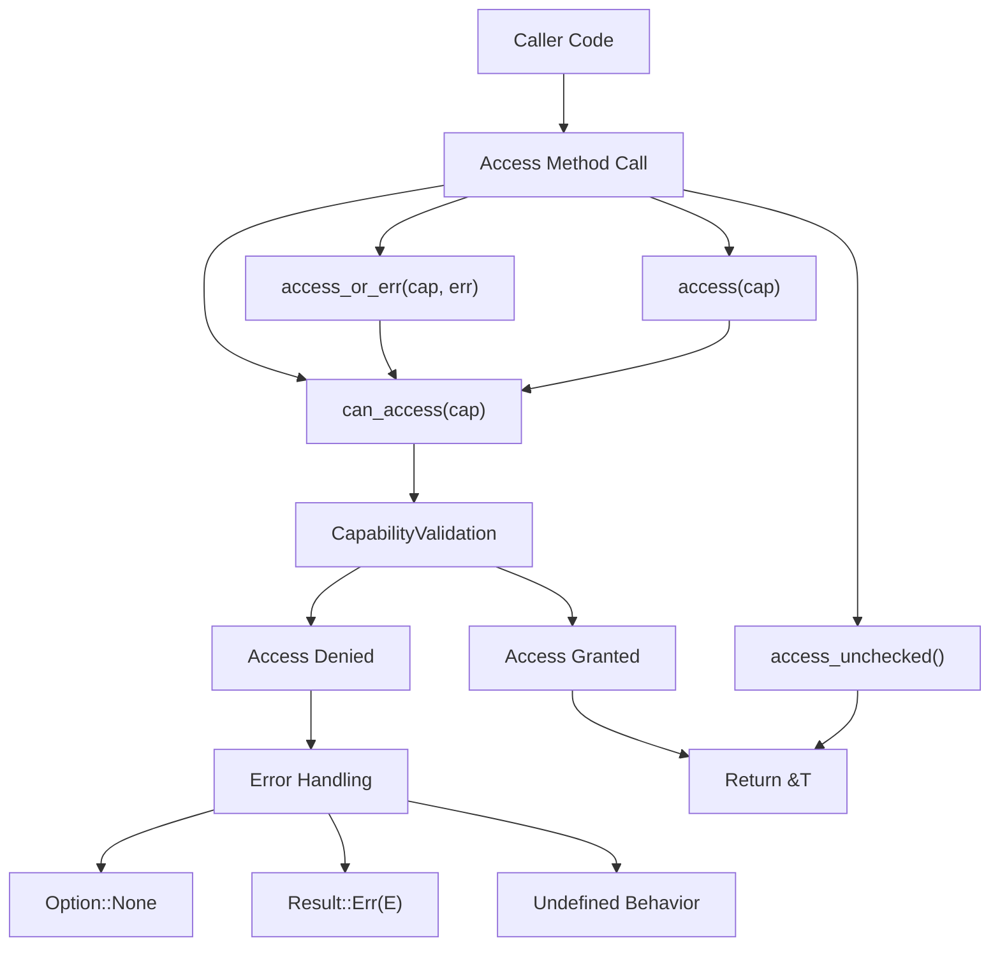
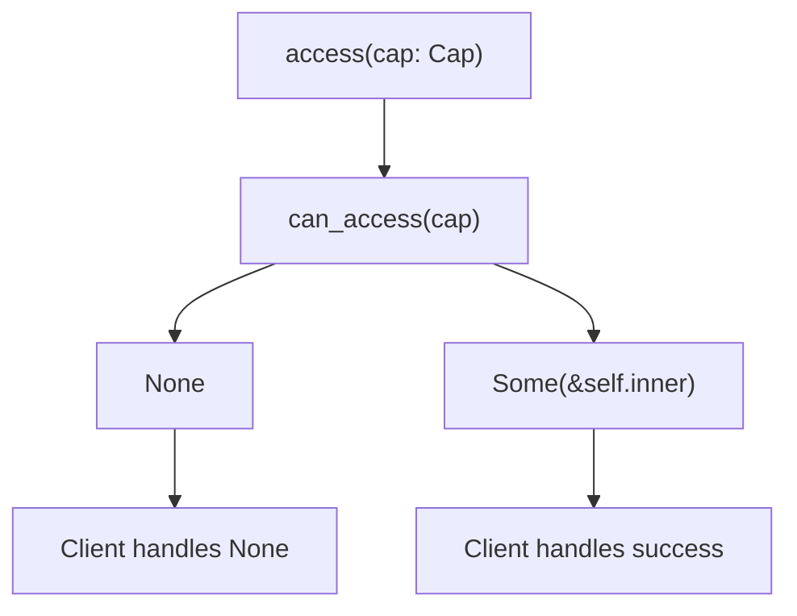
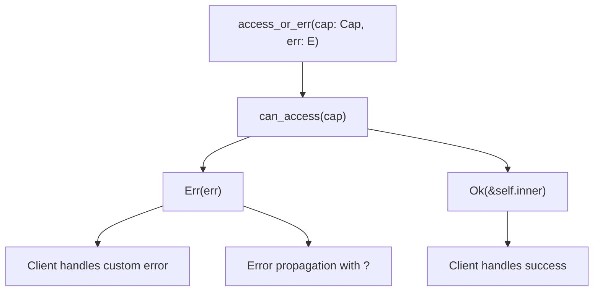
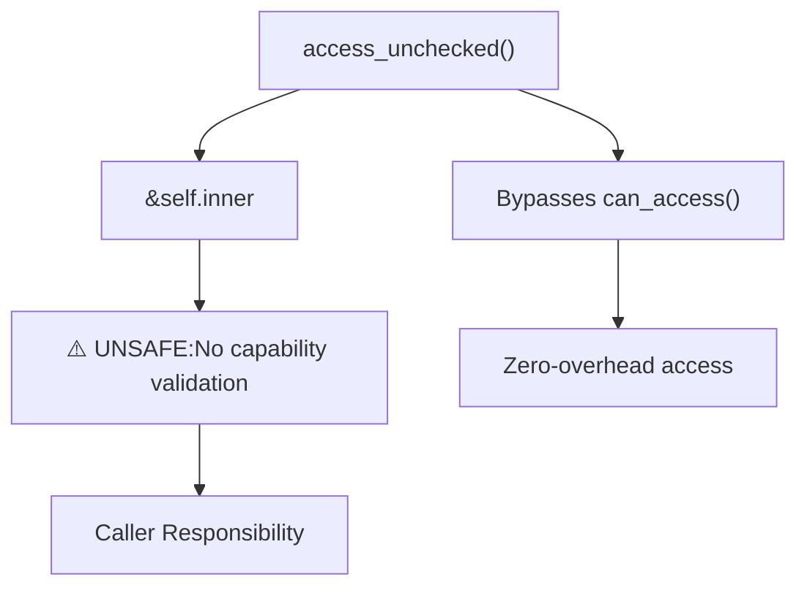
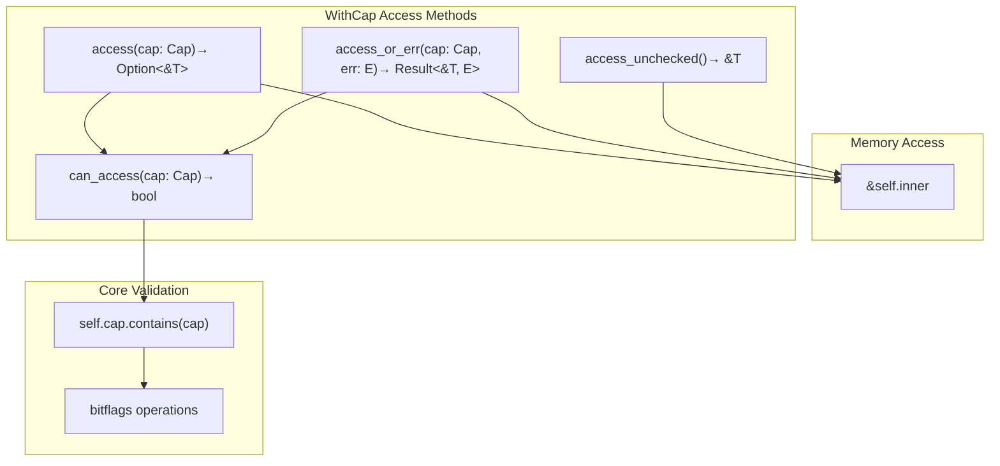

# Access Control Methods

> **Relevant source files**
> * [src/lib.rs](https://github.com/arceos-org/cap_access/blob/ad71552e/src/lib.rs)

## Purpose and Scope

This document covers the access control methods provided by the `WithCap<T>` wrapper for accessing protected objects. It explains the different access patterns available, their safety guarantees, and appropriate usage scenarios. For information about the capability system and permission flags, see [Capability System](/arceos-org/cap_access/2.1-capability-system). For details about the `WithCap<T>` wrapper structure itself, see [Object Protection with WithCap](/arceos-org/cap_access/2.2-object-protection-with-withcap).

The access control methods implement a capability-based security model where objects can only be accessed when the caller presents the required capabilities. The system provides multiple access patterns to accommodate different error handling strategies and performance requirements.

## Access Control Flow

The access control system follows a consistent pattern where capability validation determines whether access is granted to the protected object.



Sources: [src/lib.rs(L46 - L99)&emsp;](https://github.com/arceos-org/cap_access/blob/ad71552e/src/lib.rs#L46-L99)

## Capability Validation

All safe access methods rely on the `can_access` method for capability validation. This method performs a bitwise containment check to determine if the required capabilities are present.

### can_accessMethod

The `can_access` method provides the fundamental capability checking logic used by all safe access patterns.

|Method Signature|Return Type|Purpose|
| --- | --- | --- |
|can_access(&self, cap: Cap)|bool|Check if capabilities allow access|

**Implementation Details:**

* Uses `self.cap.contains(cap)` for bitwise capability checking
* Declared as `const fn` for compile-time evaluation
* Returns `true` if all requested capability bits are present
* Returns `false` if any requested capability bits are missing

Sources: [src/lib.rs(L46 - L48)&emsp;](https://github.com/arceos-org/cap_access/blob/ad71552e/src/lib.rs#L46-L48)

## Safe Access Methods

The library provides two safe access methods that perform capability validation before granting access to the protected object.

### Option-Based Access

The `access` method provides safe access with `Option<&T>` return semantics for cases where capability failure should be handled gracefully.



**Method Characteristics:**

* **Signature:** `access(&self, cap: Cap) -> Option<&T>`
* **Safety:** Memory safe with compile-time guarantees
* **Performance:** Minimal overhead with `const fn` optimization
* **Error Handling:** Returns `None` on capability mismatch

**Usage Pattern:**

```javascript
if let Some(data) = protected_obj.access(Cap::READ) {
    // Use data safely
} else {
    // Handle access denial
}
```

Sources: [src/lib.rs(L72 - L78)&emsp;](https://github.com/arceos-org/cap_access/blob/ad71552e/src/lib.rs#L72-L78)

### Result-Based Access

The `access_or_err` method provides safe access with `Result<&T, E>` return semantics, allowing custom error types and error propagation patterns.



**Method Characteristics:**

* **Signature:** `access_or_err<E>(&self, cap: Cap, err: E) -> Result<&T, E>`
* **Safety:** Memory safe with compile-time guarantees
* **Error Handling:** Returns custom error type on capability mismatch
* **Integration:** Compatible with `?` operator for error propagation

**Usage Pattern:**

```javascript
let data = protected_obj.access_or_err(Cap::WRITE, "Write access denied")?;
// Use data safely, or propagate error
```

Sources: [src/lib.rs(L93 - L99)&emsp;](https://github.com/arceos-org/cap_access/blob/ad71552e/src/lib.rs#L93-L99)

## Unsafe Access Methods

The library provides an unsafe access method for performance-critical scenarios where capability checking overhead must be eliminated.

### Unchecked Access

The `access_unchecked` method bypasses all capability validation and directly returns a reference to the protected object.



**Method Characteristics:**

* **Signature:** `unsafe fn access_unchecked(&self) -> &T`
* **Safety:** **UNSAFE** - No capability validation performed
* **Performance:** Zero overhead - direct memory access
* **Responsibility:** Caller must ensure capability compliance

**Safety Requirements:**
The caller must guarantee that they have the appropriate capabilities for the intended use of the object. Violating this contract may lead to:

* Security vulnerabilities
* Privilege escalation
* Undefined behavior in security-critical contexts

Sources: [src/lib.rs(L55 - L57)&emsp;](https://github.com/arceos-org/cap_access/blob/ad71552e/src/lib.rs#L55-L57)

## Access Method Comparison

|Method|Safety|Return Type|Overhead|Use Case|
| --- | --- | --- | --- | --- |
|access|Safe|Option<&T>|Minimal|General purpose with option handling|
|access_or_err|Safe|Result<&T, E>|Minimal|Error propagation and custom errors|
|access_unchecked|Unsafe|&T|Zero|Performance-critical trusted code|

## Implementation Architecture

The access control methods are implemented as part of the `WithCap<T>` struct and follow a layered architecture:



**Architecture Characteristics:**

* **Layered Design:** Safe methods build upon capability validation
* **Shared Validation:** All safe methods use `can_access` for consistency
* **Zero-Cost Abstractions:** `const fn` declarations enable compile-time optimization
* **Type Safety:** Generic design works with any wrapped type `T`

Sources: [src/lib.rs(L23 - L100)&emsp;](https://github.com/arceos-org/cap_access/blob/ad71552e/src/lib.rs#L23-L100)