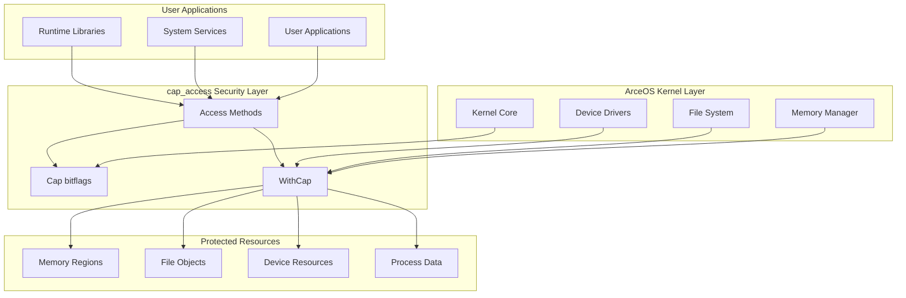
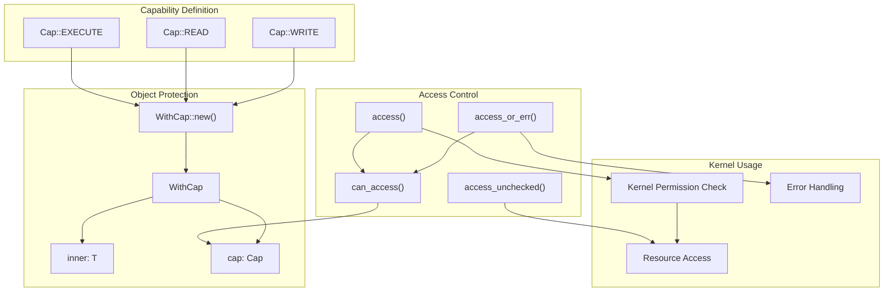
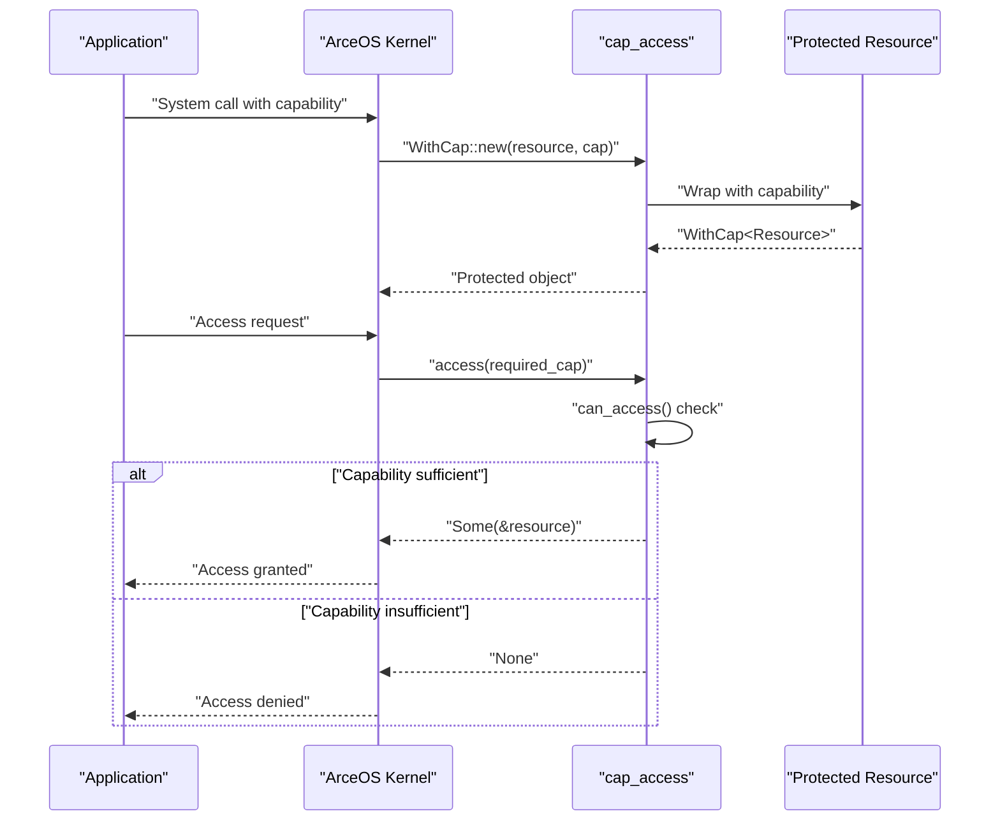

# ArceOS Integration

> **Relevant source files**
> * [Cargo.toml](https://github.com/arceos-org/cap_access/blob/ad71552e/Cargo.toml)
> * [src/lib.rs](https://github.com/arceos-org/cap_access/blob/ad71552e/src/lib.rs)

## Purpose and Scope

This document explains how the `cap_access` library integrates into the ArceOS operating system ecosystem, serving as a foundational security primitive for capability-based access control. It covers the library's role in kernel security, no_std compatibility requirements, and integration patterns across ArceOS components.

For detailed information about the core capability system and access control methods, see [Core Architecture](/arceos-org/cap_access/2-core-architecture). For practical usage examples, see [Usage Guide](/arceos-org/cap_access/3-usage-guide).

## ArceOS Ecosystem Integration

The `cap_access` library serves as a core security infrastructure component within the ArceOS operating system, providing capability-based access control primitives that are used throughout the kernel and user-space applications.

### Integration Architecture



**Sources:** [Cargo.toml(L8 - L12)&emsp;](https://github.com/arceos-org/cap_access/blob/ad71552e/Cargo.toml#L8-L12) [src/lib.rs(L17 - L21)&emsp;](https://github.com/arceos-org/cap_access/blob/ad71552e/src/lib.rs#L17-L21)

### Package Configuration for ArceOS

The library is specifically configured for integration with ArceOS through its package metadata:

|Configuration|Value|Purpose|
| --- | --- | --- |
|Homepage|https://github.com/arceos-org/arceos|Links to ArceOS project|
|Keywords|["arceos", "capabilities", "permission", "access-control"]|ArceOS-specific tagging|
|Categories|["os", "no-std"]|Operating system and embedded focus|

**Sources:** [Cargo.toml(L8 - L12)&emsp;](https://github.com/arceos-org/cap_access/blob/ad71552e/Cargo.toml#L8-L12)

## Kernel Security Layer

The `cap_access` library provides unforgeable security tokens through its capability-based access control system, enabling fine-grained permission management within ArceOS kernel components.

### Security Primitive Integration



**Sources:** [src/lib.rs(L4 - L15)&emsp;](https://github.com/arceos-org/cap_access/blob/ad71552e/src/lib.rs#L4-L15) [src/lib.rs(L46 - L48)&emsp;](https://github.com/arceos-org/cap_access/blob/ad71552e/src/lib.rs#L46-L48) [src/lib.rs(L72 - L78)&emsp;](https://github.com/arceos-org/cap_access/blob/ad71552e/src/lib.rs#L72-L78)

### Security Guarantees

The capability system provides several security guarantees essential for kernel operation:

* **Unforgeable Tokens**: `Cap` bitflags cannot be arbitrarily created, only through controlled initialization
* **Compile-time Safety**: The type system prevents capability escalation through `WithCap<T>` wrapper
* **Runtime Validation**: Methods like `can_access()` and `access()` provide runtime permission checking
* **Controlled Unsafe Access**: `access_unchecked()` provides escape hatch for performance-critical kernel code

**Sources:** [src/lib.rs(L46 - L48)&emsp;](https://github.com/arceos-org/cap_access/blob/ad71552e/src/lib.rs#L46-L48) [src/lib.rs(L72 - L78)&emsp;](https://github.com/arceos-org/cap_access/blob/ad71552e/src/lib.rs#L72-L78) [src/lib.rs(L55 - L57)&emsp;](https://github.com/arceos-org/cap_access/blob/ad71552e/src/lib.rs#L55-L57)

## no_std Compatibility

The `cap_access` library is designed for no_std environments, making it suitable for embedded systems and kernel contexts where the standard library is not available.

### no_std Configuration

The library uses conditional compilation to support both std and no_std environments:

```
#![cfg_attr(not(test), no_std)]
```

This configuration enables:

* **Kernel Integration**: Direct usage within ArceOS kernel without standard library dependencies
* **Embedded Support**: Deployment on resource-constrained embedded systems
* **Bare Metal**: Operation on bare metal platforms without operating system support

**Sources:** [src/lib.rs(L1)&emsp;](https://github.com/arceos-org/cap_access/blob/ad71552e/src/lib.rs#L1-L1)

### Dependencies

The library maintains minimal dependencies to support no_std compatibility:

|Dependency|Version|Purpose|no_std Compatible|
| --- | --- | --- | --- |
|bitflags|2.6|Efficient bitflag operations forCap|Yes|

**Sources:** [Cargo.toml(L14 - L15)&emsp;](https://github.com/arceos-org/cap_access/blob/ad71552e/Cargo.toml#L14-L15)

## Multi-Platform Support

ArceOS targets multiple hardware architectures, and `cap_access` provides consistent capability-based access control across all supported platforms.

### Supported Architectures

Based on the CI configuration and ArceOS requirements, `cap_access` supports:

* **x86_64**: Standard desktop and server platforms (`x86_64-unknown-linux-gnu`, `x86_64-unknown-none`)
* **RISC-V**: Embedded and specialized systems (`riscv64gc-unknown-none-elf`)
* **ARM64**: Mobile and embedded platforms (`aarch64-unknown-none-softfloat`)

### Platform-Agnostic Design

The capability system is designed to be platform-agnostic through:

* **Pure Rust Implementation**: No platform-specific assembly or system calls
* **Bitflag Operations**: Efficient bitwise operations supported on all target architectures
* **Const Functions**: Compile-time evaluation where possible for performance

**Sources:** [src/lib.rs(L30 - L32)&emsp;](https://github.com/arceos-org/cap_access/blob/ad71552e/src/lib.rs#L30-L32) [src/lib.rs(L46 - L48)&emsp;](https://github.com/arceos-org/cap_access/blob/ad71552e/src/lib.rs#L46-L48) [src/lib.rs(L72 - L78)&emsp;](https://github.com/arceos-org/cap_access/blob/ad71552e/src/lib.rs#L72-L78)

## Integration Patterns

### Typical ArceOS Usage Patterns

Within ArceOS, `cap_access` follows several common integration patterns:

1. **Kernel Resource Protection**: Wrapping kernel data structures with `WithCap<T>` to control access
2. **System Call Interface**: Using capability checking in system call implementations
3. **Driver Security**: Protecting device driver resources with capability-based access
4. **Memory Management**: Controlling access to memory regions through capability tokens

### Example Integration Flow



**Sources:** [src/lib.rs(L24 - L27)&emsp;](https://github.com/arceos-org/cap_access/blob/ad71552e/src/lib.rs#L24-L27) [src/lib.rs(L72 - L78)&emsp;](https://github.com/arceos-org/cap_access/blob/ad71552e/src/lib.rs#L72-L78) [src/lib.rs(L46 - L48)&emsp;](https://github.com/arceos-org/cap_access/blob/ad71552e/src/lib.rs#L46-L48)

This integration pattern ensures that ArceOS maintains strong security guarantees while providing the performance characteristics required for operating system operations across diverse hardware platforms.